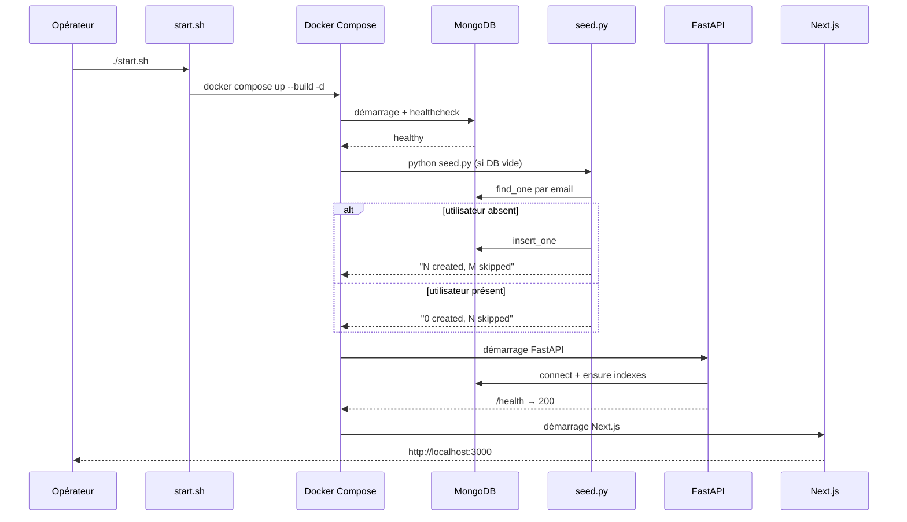
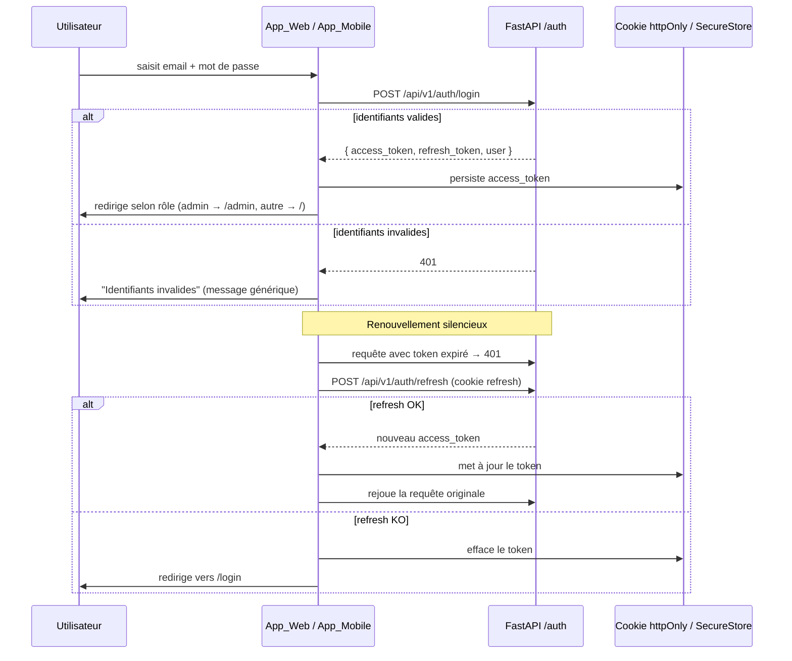
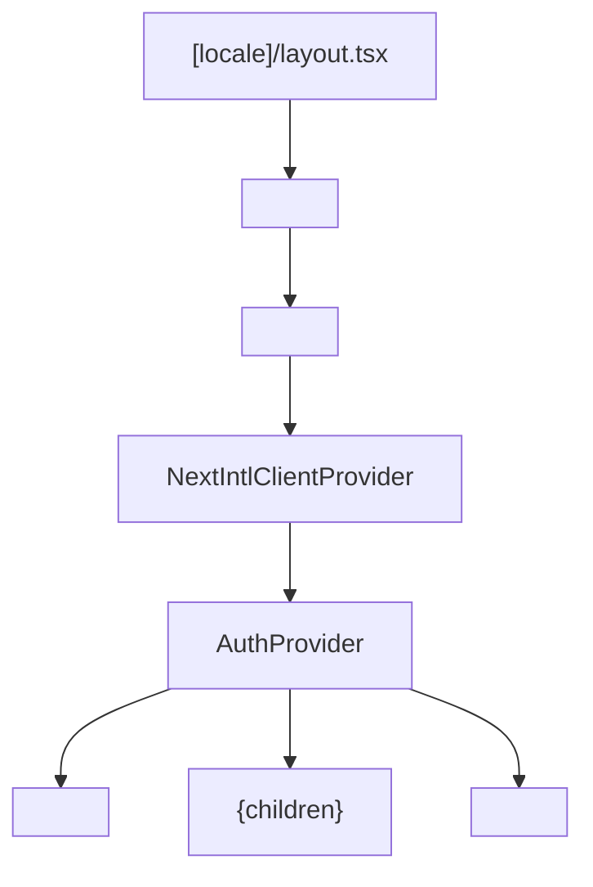

# Document de Conception — app-consistency

## Vue d'ensemble

Cette conception couvre les améliorations de cohérence de l'application **Diagno-Pilot**, un outil d'aide au diagnostic médical disponible sur deux plateformes :

- **App_Web** : Next.js 15 avec routage i18n (`apps/web`)
- **App_Mobile** : React Native / Expo avec expo-router (`apps/mobile`)

Les dix exigences adressées touchent : les bonnes pratiques UX, le sélecteur de langue (français par défaut), la navigation persistante, la cohérence de l'authentification, les images représentatives de l'Afrique de l'Ouest, le copyright dans le pied de page, la qualité de la suite de tests, les scripts de démarrage/arrêt, la configuration Docker Compose, et le seed automatique de la base de données.

---

## Architecture

### Vue d'ensemble du système

```mermaid
graph TB
    subgraph Client Web
        W_Browser[Navigateur]
        W_Next[Next.js App<br/>apps/web]
        W_i18n[next-intl<br/>routing.ts]
        W_Auth[AuthContext<br/>httpOnly cookie]
        W_Nav[NavBar]
        W_Footer[Footer]
        W_Lang[LanguageSwitcher]
    end

    subgraph Client Mobile
        M_Expo[Expo / React Native<br/>apps/mobile]
        M_Auth[AuthContext<br/>SecureStore]
        M_Tabs[Tab Navigator]
        M_Lang[Sélecteur langue<br/>écran Profil]
    end

    subgraph Backend
        API[FastAPI<br/>backend/main.py]
        Auth_Router[/api/v1/auth]
        DB[(MongoDB)]
        Seed[scripts/seed.py]
    end

    subgraph Infrastructure
        DC[docker-compose.yml]
        Start[start.sh / start.bat]
        Stop[stop.sh / stop.bat]
        LS[LocalStack S3]
    end

    W_Browser --> W_Next
    W_Next --> W_i18n
    W_Next --> W_Auth
    W_Next --> W_Nav
    W_Next --> W_Footer
    W_Nav --> W_Lang
    W_Auth --> API
    M_Expo --> M_Auth
    M_Auth --> API
    M_Expo --> M_Tabs
    M_Expo --> M_Lang
    API --> Auth_Router
    API --> DB
    Seed --> DB
    DC --> API
    DC --> DB
    DC --> LS
    DC --> Seed
    Start --> DC
    Stop --> DC
```

### Flux d'initialisation au démarrage



### Flux d'authentification



---

## Composants et Interfaces

### App_Web — Composants clés

#### `NavBar` (`apps/web/src/components/NavBar.tsx`)

Composant existant. Modifications requises :
- Vérifier que `<nav aria-label="Main navigation">` est présent (HTML sémantique — Exigence 1.6)
- Le menu hamburger est déjà implémenté pour `< 768px` (Exigence 3.5)
- Masquage conditionnel si `!user && !isLoading` (Exigence 3.6)

Interface :
```typescript
interface NavBarProps {
  locale: string;
}
```

#### `Footer` (`apps/web/src/components/Footer.tsx`) — À créer

Nouveau composant affichant le copyright.

```typescript
// Aucune prop requise
export default function Footer(): JSX.Element
```

Rendu attendu :
```html
<footer>
  <p>© 2026 protic-togo</p>
</footer>
```

#### `LanguageSwitcher` (`apps/web/src/components/LanguageSwitcher.tsx`)

Composant existant. Aucune modification structurelle requise. Déjà intégré dans `NavBar`.

#### `AuthContext` (`apps/web/src/contexts/AuthContext.tsx`)

Contexte existant. Couvre déjà :
- Persistance via cookie httpOnly (Exigence 4.6)
- Renouvellement silencieux du token (Exigence 4.4)
- Redirection selon le rôle (Exigences 4.8, 4.9)
- Déconnexion propre (Exigence 4.3)

#### `SkeletonLoader` / indicateurs de chargement

Composant `SkeletonLoader.tsx` existant. À utiliser systématiquement pour les opérations > 300 ms (Exigence 1.1).

### App_Web — Layout principal

Le layout `apps/web/src/app/[locale]/layout.tsx` doit être enrichi pour inclure `NavBar` et `Footer` :



### App_Mobile — Composants clés

#### `AuthContext` (`apps/mobile/src/contexts/AuthContext.tsx`)

Contexte existant. Couvre déjà :
- Persistance via `SecureStore` (Exigence 4.7)
- Restauration de session au démarrage (Exigence 4.7)

#### Sélecteur de langue mobile

À ajouter dans l'écran `apps/mobile/app/(tabs)/profile.tsx`. Interface :

```typescript
// Composant inline dans ProfileScreen
// Utilise AsyncStorage pour persister la locale choisie
// Déclenche un rechargement des traductions via le contexte i18n
```

#### Barre d'onglets (`apps/mobile/app/(tabs)/_layout.tsx`)

Existante. Masquage conditionnel géré par `apps/mobile/app/index.tsx` via redirection.

### Registre d'images (`apps/web/src/lib/images.ts`)

Structure actuelle à enrichir avec les champs `source` et `licence` :

```typescript
interface ImageEntry {
  src: string;
  alt: string;       // description en français
  source: string;    // URL de la source originale
  licence: string;   // ex. "Unsplash Licence libre"
}

export const IMAGES: Record<string, ImageEntry>
```

### Scripts d'infrastructure

| Fichier | Rôle | État |
|---------|------|------|
| `start.sh` | Lance `docker compose up --build -d` | Existant — à améliorer (gestion d'erreurs) |
| `stop.sh` | Lance `docker compose down` | Existant — à améliorer (gestion d'erreurs) |
| `start.bat` | Équivalent Windows | Existant |
| `stop.bat` | Équivalent Windows | Existant |
| `scripts/seed.py` | Initialise les utilisateurs par défaut | Existant — idempotent |
| `docker-compose.yml` | Orchestre tous les services | Existant — à compléter (healthchecks) |

---

## Modèles de données

### Entrée du Registre d'images

```typescript
interface ImageEntry {
  src: string;      // URL de l'image (Unsplash ou autre)
  alt: string;      // Texte alternatif en français
  source: string;   // URL de la page source
  licence: string;  // Libellé de la licence
}
```

### Utilisateur (MongoDB — collection `users`)

```python
{
  "_id": ObjectId,
  "email": str,           # unique
  "password_hash": str,   # bcrypt
  "full_name": str,
  "role": str,            # "admin" | "medecin"
}
```

### Préférence de langue (Web — cookie / localStorage)

```
Clé   : "NEXT_LOCALE"
Valeur: "fr" | "en"
Durée : 1 an
```

### Préférence de langue (Mobile — AsyncStorage)

```
Clé   : "diagno_locale"
Valeur: "fr" | "en"
```

### Configuration Docker Compose — services et healthchecks

```yaml
services:
  mongo:
    healthcheck:
      test: ["CMD", "mongosh", "--eval", "db.adminCommand('ping').ok"]
      interval: 5s
      timeout: 10s
      retries: 12
      start_period: 20s

  backend:
    healthcheck:
      test: ["CMD", "curl", "-f", "http://localhost:8000/health"]
      interval: 10s
      timeout: 5s
      retries: 5
      start_period: 15s

  frontend:
    healthcheck:
      test: ["CMD", "curl", "-f", "http://localhost:3000"]
      interval: 10s
      timeout: 5s
      retries: 5
      start_period: 20s
```

---

## Propriétés de Correction

*Une propriété est une caractéristique ou un comportement qui doit être vrai pour toutes les exécutions valides d'un système — essentiellement, un énoncé formel de ce que le système doit faire. Les propriétés servent de pont entre les spécifications lisibles par l'humain et les garanties de correction vérifiables par machine.*

### Propriété 1 : Indicateur de chargement présent pour les opérations longues

*Pour tout* composant effectuant une opération asynchrone simulée dépassant 300 ms, un indicateur de chargement (spinner ou skeleton) doit être présent dans le rendu pendant la durée de l'opération, sur App_Web comme sur App_Mobile.

**Valide : Exigences 1.1, 1.3**

---

### Propriété 2 : Messages d'erreur sans détails techniques

*Pour toute* erreur générée par une opération (réseau, validation, serveur), le message affiché à l'utilisateur ne doit contenir ni stack trace, ni nom de classe d'exception, ni détail d'implémentation interne.

**Valide : Exigences 1.2, 1.4**

---

### Propriété 3 : Validation inline pour les formulaires invalides

*Pour tout* formulaire soumis avec des données invalides (champs vides, format incorrect), un message de validation doit apparaître inline à côté du champ concerné, sur App_Web comme sur App_Mobile.

**Valide : Exigences 1.7, 1.8**

---

### Propriété 4 : Changement de langue met à jour l'interface

*Pour toute* locale supportée sélectionnée via le Sélecteur_Langue, l'intégralité des textes de l'interface doit être mise à jour dans la langue choisie sans rechargement complet de la page (web) ou de l'application (mobile).

**Valide : Exigences 2.3, 2.4**

---

### Propriété 5 : Persistance du choix de langue (round-trip)

*Pour toute* locale sélectionnée par l'utilisateur, la valeur doit être persistée dans le stockage (cookie/localStorage pour le web, AsyncStorage pour le mobile) et restaurée à la session suivante.

**Valide : Exigences 2.5, 2.6**

---

### Propriété 6 : Langue de repli vers le français

*Pour toute* locale non supportée par l'application (ni `fr` ni `en`), la locale effective utilisée doit être `fr`.

**Valide : Exigence 2.7**

---

### Propriété 7 : Navigation présente sur les pages authentifiées

*Pour toute* page ou écran accessible après authentification, le composant de navigation (NavBar sur web, barre d'onglets sur mobile) doit être présent dans le rendu.

**Valide : Exigences 3.1, 3.2**

---

### Propriété 8 : Élément actif mis en évidence

*Pour toute* page active, l'élément de navigation correspondant doit avoir un style visuel distinct (classe CSS active sur web, `tabBarActiveTintColor` sur mobile) par rapport aux autres éléments.

**Valide : Exigences 3.3, 3.4**

---

### Propriété 9 : Redirection vers login si non authentifié

*Pour tout* utilisateur non authentifié tentant d'accéder à une page protégée, la navigation doit être masquée et une redirection vers la page de connexion doit se produire.

**Valide : Exigences 3.6, 3.7**

---

### Propriété 10 : Connexion réussie redirige selon le rôle

*Pour tout* utilisateur avec des identifiants valides, la connexion doit établir une session et rediriger vers `/admin` si le rôle est `admin`, ou vers la page d'accueil pour tout autre rôle.

**Valide : Exigences 4.1, 4.8, 4.9**

---

### Propriété 11 : Message d'erreur générique pour identifiants invalides

*Pour tout* couple email/mot de passe invalide soumis, le message d'erreur affiché ne doit pas révéler si c'est l'email ou le mot de passe qui est incorrect.

**Valide : Exigence 4.2**

---

### Propriété 12 : Déconnexion efface la session (round-trip)

*Pour tout* utilisateur authentifié, après déconnexion, le token d'accès doit être effacé du stockage et l'utilisateur doit être redirigé vers la page de connexion.

**Valide : Exigence 4.3**

---

### Propriété 13 : Persistance de session après rechargement/redémarrage (round-trip)

*Pour tout* utilisateur authentifié, après rechargement de la page (web via cookie httpOnly) ou redémarrage de l'application (mobile via SecureStore), la session doit être restaurée sans nouvelle connexion.

**Valide : Exigences 4.6, 4.7**

---

### Propriété 14 : Déconnexion forcée si refresh échoue

*Pour tout* utilisateur dont le renouvellement de token échoue, le système doit effacer la session et rediriger vers la page de connexion.

**Valide : Exigence 4.5**

---

### Propriété 15 : Intégrité structurelle du Registre d'images

*Pour toute* entrée du Registre_Images, les champs `src`, `alt`, `source` et `licence` doivent être présents et non vides, et le texte `alt` doit être en français.

**Valide : Exigences 5.1, 5.4**

---

### Propriété 16 : Texte alternatif affiché si image non chargeable

*Pour toute* image dont la source est invalide ou inaccessible, le texte alternatif (`alt`) défini dans le Registre_Images doit être affiché à la place de l'image.

**Valide : Exigence 5.5**

---

### Propriété 17 : Copyright présent sur les pages authentifiées

*Pour toute* page accessible après authentification, le composant Footer doit être présent et contenir exactement le texte `© 2026 protic-togo`.

**Valide : Exigences 6.1, 6.2**

---

### Propriété 18 : Seed idempotent (idempotence)

*Pour toute* base de données contenant déjà les utilisateurs de seed, une nouvelle exécution du script `seed.py` ne doit créer aucun doublon et doit terminer sans erreur.

**Valide : Exigences 10.1, 10.4**

---

## Gestion des erreurs

### App_Web

| Situation | Comportement attendu |
|-----------|---------------------|
| Opération réseau échoue | Afficher un `Toast` d'erreur avec message générique |
| Formulaire invalide soumis | Afficher les erreurs inline via `react-hook-form` + `zod` |
| Image non chargeable | Afficher le texte `alt` du Registre_Images |
| Token expiré (401) | `fetchWithRefresh` tente un refresh silencieux, sinon redirige vers `/login` |
| Locale non supportée | Fallback vers `fr` dans `i18n/request.ts` |
| Page non trouvée | Next.js `notFound()` → page 404 |

### App_Mobile

| Situation | Comportement attendu |
|-----------|---------------------|
| Connexion échoue | `Alert.alert` avec message générique |
| Opération réseau échoue | Afficher un message d'erreur dans le composant concerné |
| Token invalide au démarrage | Effacer SecureStore, rediriger vers `/login` |
| Locale non supportée | Fallback vers `fr` |

### Backend (FastAPI)

| Situation | Comportement attendu |
|-----------|---------------------|
| Identifiants invalides | HTTP 401 avec message générique (pas de distinction email/mot de passe) |
| Erreur interne | HTTP 500 avec `{"detail": "Internal server error"}` (pas de stack trace) |
| Rate limit dépassé | HTTP 429 avec header `Retry-After` |

### Scripts d'infrastructure

| Situation | Comportement attendu |
|-----------|---------------------|
| `docker compose up` échoue | `start.sh` affiche le service en échec et retourne code 1 |
| `docker compose down` échoue | `stop.sh` affiche le service concerné et retourne code 1 |
| Seed échoue | Log d'erreur explicite, le service `seed` retourne code non nul |
| MongoDB non disponible | Le service `backend` attend le healthcheck de `mongo` avant de démarrer |

---

## Stratégie de tests

### Approche duale

Les tests sont organisés en deux catégories complémentaires :

1. **Tests unitaires / d'exemple** : vérifient des comportements spécifiques, des cas limites et des conditions d'erreur
2. **Tests de propriétés** : vérifient des propriétés universelles sur un large éventail d'entrées générées aléatoirement

Les deux sont nécessaires pour une couverture complète.

### Tests unitaires — App_Web (Vitest + Testing Library)

Fichiers à créer ou mettre à jour :

| Fichier de test | Ce qui est testé |
|----------------|-----------------|
| `src/components/__tests__/NavBar.test.tsx` | Présence sur pages authentifiées, élément actif, masquage si non-auth, menu hamburger |
| `src/components/__tests__/LanguageSwitcher.test.tsx` | Changement de langue, persistance, fallback fr |
| `src/components/__tests__/Footer.test.tsx` | Texte `© 2026 protic-togo`, présence sur pages auth |
| `src/lib/__tests__/images.test.ts` | Structure du registre (src, alt, source, licence non vides) |
| `src/contexts/AuthContext.test.tsx` | Login réussi, login échoué, logout, redirection par rôle, refresh token |

### Tests unitaires — App_Mobile (Jest + Testing Library React Native)

| Fichier de test | Ce qui est testé |
|----------------|-----------------|
| `src/contexts/__tests__/AuthContext.test.tsx` | Login, logout, persistance SecureStore |
| `app/(tabs)/__tests__/profile.test.tsx` | Présence du sélecteur de langue, changement de langue |
| `src/components/__tests__/MobileSymptomInput.test.tsx` | Validation inline |

### Tests de propriétés — App_Web (fast-check)

La bibliothèque `fast-check` est déjà présente dans `apps/web/package.json`.

Chaque test de propriété doit :
- Exécuter au minimum **100 itérations**
- Être annoté avec un commentaire de traçabilité au format :
  `// Feature: app-consistency, Property N: <texte de la propriété>`

Propriétés à implémenter :

| Propriété | Fichier de test | Bibliothèque |
|-----------|----------------|-------------|
| P2 — Messages sans détails techniques | `AuthContext.test.tsx` | fast-check |
| P3 — Validation inline | `NavBar.test.tsx` | fast-check |
| P4 — Changement de langue | `LanguageSwitcher.test.tsx` | fast-check |
| P5 — Persistance langue (round-trip) | `LanguageSwitcher.test.tsx` | fast-check |
| P6 — Fallback vers fr | `i18n/routing.test.ts` | fast-check |
| P7 — Navigation sur pages auth | `NavBar.test.tsx` | fast-check |
| P8 — Élément actif | `NavBar.test.tsx` | fast-check |
| P9 — Redirection si non-auth | `NavBar.test.tsx` | fast-check |
| P10 — Redirection selon rôle | `AuthContext.test.tsx` | fast-check |
| P11 — Message générique login | `AuthContext.test.tsx` | fast-check |
| P12 — Déconnexion efface session | `AuthContext.test.tsx` | fast-check |
| P13 — Persistance session (round-trip) | `AuthContext.test.tsx` | fast-check |
| P15 — Intégrité registre images | `images.test.ts` | fast-check |
| P17 — Copyright sur pages auth | `Footer.test.tsx` | fast-check |

### Tests de propriétés — Backend Python (Hypothesis)

La bibliothèque `hypothesis` est déjà utilisée dans le projet (`.hypothesis/` présent).

| Propriété | Fichier de test | Bibliothèque |
|-----------|----------------|-------------|
| P18 — Seed idempotent | `backend/tests/test_seed.py` | hypothesis |

### Exemple d'annotation de test de propriété

```typescript
// Feature: app-consistency, Property 6: Pour toute locale non supportée, la locale effective est 'fr'
it('fallback vers fr pour toute locale non supportée', () => {
  fc.assert(
    fc.property(
      fc.string().filter(s => s !== 'fr' && s !== 'en'),
      (unsupportedLocale) => {
        const result = resolveLocale(unsupportedLocale);
        expect(result).toBe('fr');
      }
    ),
    { numRuns: 100 }
  );
});
```

### Suppression des tests obsolètes

Avant d'ajouter de nouveaux tests, vérifier et supprimer tout test référençant :
- Des composants renommés ou supprimés
- Des routes qui n'existent plus
- Des comportements modifiés par cette fonctionnalité

Commandes de vérification :
```bash
# App_Web
cd apps/web && npm test -- --run 2>&1 | grep -E "FAIL|ERROR|warning"

# App_Mobile
cd apps/mobile && npx jest --passWithNoTests 2>&1 | grep -E "FAIL|ERROR|warning"

# Backend
cd backend && python -m pytest -v 2>&1 | grep -E "FAILED|ERROR|warning"
```
