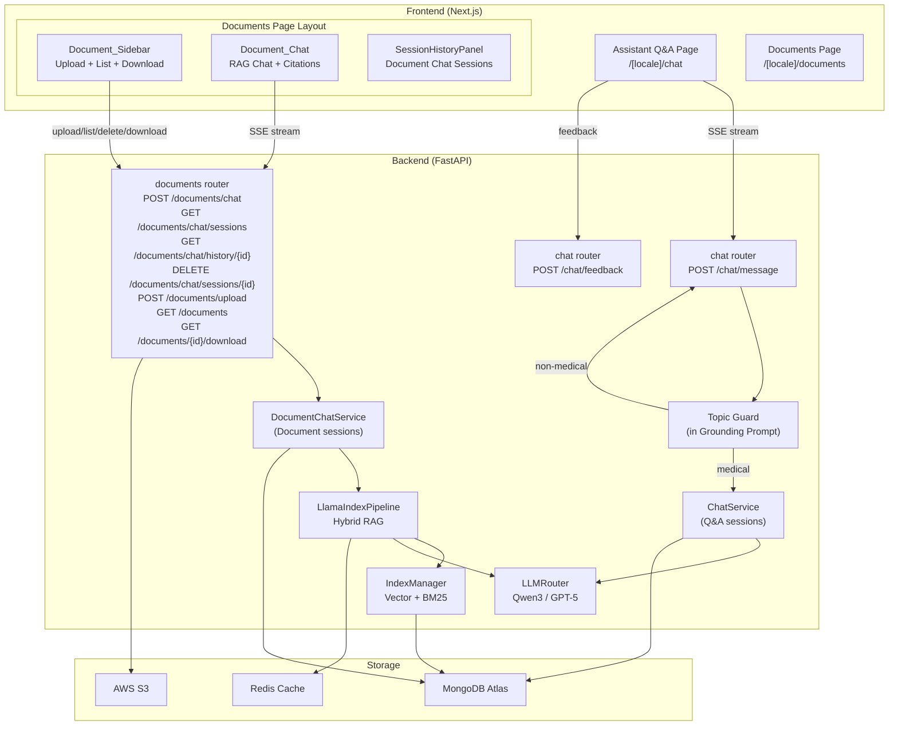
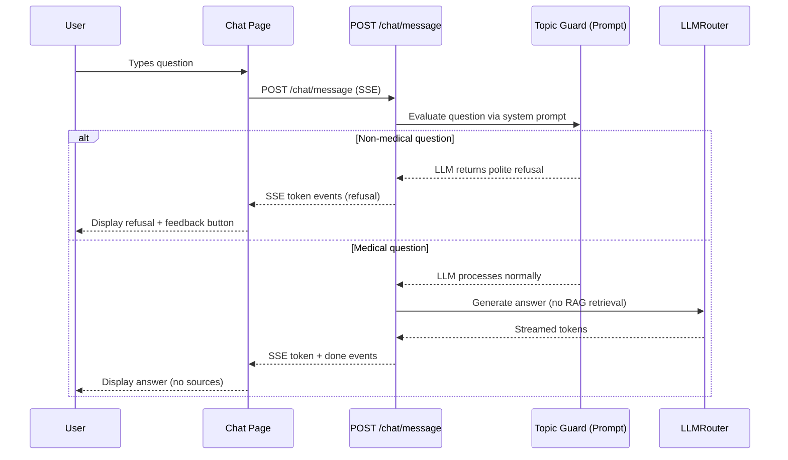
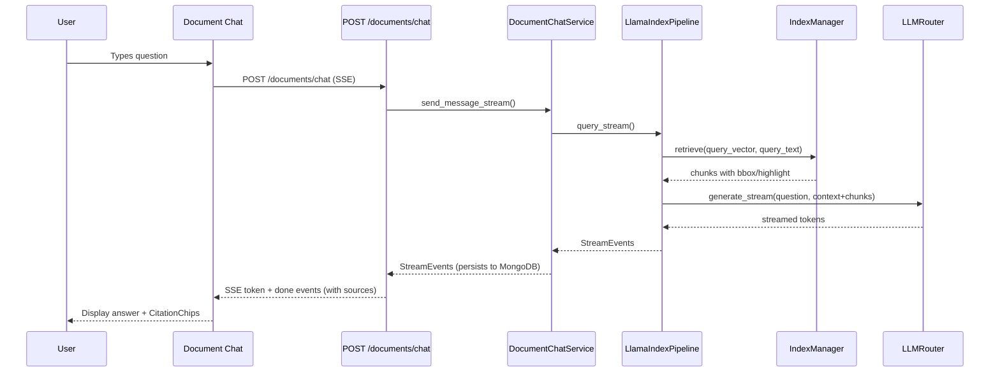

# Design Document: Assistant Q&A and Documents Redesign

## Overview

This design covers the redesign of two core pages in Diagno-Pilot: the **Assistant Q&A** chat page and the **Documents** page. The changes split the existing RAG-powered chat into two distinct experiences:

1. **Assistant Q&A** — A medical-only conversational assistant powered exclusively by the medical LLM (MedicalQwen3-Reasoning-14B / GPT-5 fallback), with a Topic Guard embedded in the system prompt that filters non-medical questions. No RAG retrieval, no source citations (sources are not generated).

2. **Document Chat** — A new RAG-powered chat on the Documents page that uses the existing LlamaIndex pipeline to answer questions grounded in uploaded medical documents, with inline citations and PDF highlight overlays.

The Documents page is restructured into a sidebar (upload form + document list + download) and a main panel (Document Chat with session history).

### Key Design Decisions

| Decision | Rationale |
|---|---|
| Topic Guard via system prompt instruction (not a separate classifier) | Simpler to implement and maintain; the LLM itself is the best judge of medical relevance. Avoids a separate model/service. Can be upgraded to a lightweight classifier later if false-positive rates are high. |
| Separate `document_chat_sessions` MongoDB collection | Keeps Document Chat sessions isolated from Q&A sessions, simplifying the migration (Req 10) and avoiding schema conflicts. |
| Reuse `ChatService` pattern for Document Chat | The existing `ChatService` already handles multi-turn persistence, session listing, and pagination. A new `DocumentChatService` follows the same pattern but wires to `LlamaIndexPipeline`. |
| Reuse existing `CitationChip`/`CitationPopup` components | These components already handle bbox highlights and presigned URL fetching. No changes needed — just wire them into the Document Chat message bubbles. |
| Download via presigned URL with `Content-Disposition: attachment` | Reuses the existing `/documents/{id}/view` endpoint pattern. A new `/documents/{id}/download` endpoint sets the `Content-Disposition: attachment` header. |

## Architecture



### Request Flow: Assistant Q&A (Simplified)



### Request Flow: Document Chat (RAG)



## Components and Interfaces

### Backend Components

#### 1. Topic Guard (System Prompt Enhancement)

The Topic Guard is implemented as an enhanced `GROUNDING_SYSTEM_PROMPT` in `chat_service.py`. The prompt instructs the LLM to:
- Only answer questions about Accepted_Medical_Topics
- Politely decline non-medical questions in the user's language
- Prefix refusal messages with a detectable marker `[TOPIC_GUARD_REFUSAL]` so the frontend can identify refusals and show the feedback button

```python
# backend/services/chat_service.py

ASSISTANT_QA_SYSTEM_PROMPT = (
    "You are a specialized medical assistant. "
    "You ONLY answer questions about: tropical diseases, infectious diseases, "
    "general clinical medicine, nutrition, mental health, and medical ethics. "
    "For any question outside these domains (sports, politics, cooking, entertainment, etc.), "
    "you MUST politely decline, explaining that you are specialized in tropical and clinical medicine. "
    "ALWAYS prefix your refusal response with the exact marker '[TOPIC_GUARD_REFUSAL]' "
    "followed by a line break, then the refusal message. "
    "Detect the language of the user's message and respond in that same language. "
    "If ambiguous, use the provided locale language."
)
```

**Design rationale:** Using the LLM's own understanding of medical topics is more robust than a keyword-based classifier. The `[TOPIC_GUARD_REFUSAL]` marker allows the frontend to detect refusals without parsing natural language. This approach avoids a separate classification step before the LLM call — the LLM itself acts as the guard within a single inference pass.

#### 2. Modified ChatService (Q&A — No RAG)

The existing `ChatService` is modified to call `LLMRouter` directly instead of going through `LlamaIndexPipeline`:

```python
# backend/services/chat_service.py

class ChatService:
    """Q&A chat — LLM-only, no RAG retrieval."""

    def __init__(self, db: AsyncIOMotorDatabase, llm_router: LLMRouter) -> None:
        self._db = db
        self._llm = llm_router

    async def send_message_stream(
        self,
        session_id: str,
        user_message: str,
        patient_context: PatientProfile | None = None,
        user_id: str | None = None,
    ) -> AsyncIterator[StreamEvent]:
        # Build context with ASSISTANT_QA_SYSTEM_PROMPT
        # Call self._llm.generate_stream() directly
        # Persist turns to MongoDB (sources=[] always, no RAG)
        ...
```

#### 3. DocumentChatService (New)

A new service following the same pattern as `ChatService` but wired to `LlamaIndexPipeline`:

```python
# backend/services/document_chat_service.py

class DocumentChatService:
    """Document Chat — RAG-powered via LlamaIndexPipeline."""

    COLLECTION = "document_chat_sessions"

    def __init__(self, db: AsyncIOMotorDatabase, rag_service: LlamaIndexPipeline) -> None:
        self._db = db
        self._rag = rag_service

    async def send_message_stream(
        self,
        session_id: str,
        user_message: str,
        user_id: str | None = None,
    ) -> AsyncIterator[StreamEvent]:
        # Load session history
        # Call self._rag.query_stream() with session_history
        # Persist turns with sources (including highlight/bbox)
        ...

    async def get_history(self, session_id: str, user_id: str | None = None) -> dict | None: ...
    async def list_sessions(self, user_id: str, skip: int = 0, limit: int = 20) -> list[dict]: ...
    async def delete_session(self, session_id: str, user_id: str | None = None) -> bool: ...
```

#### 4. Documents Router — New Endpoints

```python
# backend/routers/documents.py — new endpoints

@router.post("/chat")
@limiter.limit("60/minute")
async def stream_document_chat(
    request: Request,
    body: DocumentChatRequest,
    current_user: dict = Depends(require_role(["admin", "medecin", "infirmière"])),
    doc_chat_service: DocumentChatService = Depends(get_doc_chat_service),
) -> EventSourceResponse:
    """POST /api/v1/documents/chat — SSE streaming Document Chat."""
    ...

@router.get("/chat/sessions")
async def list_document_chat_sessions(
    request: Request,
    skip: int = Query(default=0, ge=0),
    limit: int = Query(default=20, ge=1, le=100),
    current_user: dict = Depends(require_role(["admin", "medecin", "infirmière"])),
    doc_chat_service: DocumentChatService = Depends(get_doc_chat_service),
) -> DocumentChatSessionListResponse:
    """GET /api/v1/documents/chat/sessions — List user's document chat sessions."""
    ...

@router.get("/chat/history/{session_id}")
async def get_document_chat_history(
    session_id: str,
    skip: int = Query(default=0, ge=0),
    limit: int = Query(default=50, ge=1, le=200),
    current_user: dict = Depends(require_role(["admin", "medecin", "infirmière"])),
    doc_chat_service: DocumentChatService = Depends(get_doc_chat_service),
) -> DocumentChatHistoryResponse:
    """GET /api/v1/documents/chat/history/{session_id} — Get session messages."""
    ...

@router.delete("/chat/sessions/{session_id}", status_code=204)
async def delete_document_chat_session(
    session_id: str,
    current_user: dict = Depends(require_role(["admin", "medecin", "infirmière"])),
    doc_chat_service: DocumentChatService = Depends(get_doc_chat_service),
) -> None:
    """DELETE /api/v1/documents/chat/sessions/{session_id} — Delete a session."""
    ...

@router.get("/{document_id}/download")
async def download_document(
    document_id: str,
    current_user: dict = Depends(require_role(["admin", "medecin", "infirmière"])),
    svc: DocumentService = Depends(_get_document_service),
) -> DocumentDownloadResponse:
    """GET /api/v1/documents/{id}/download — presigned URL with Content-Disposition: attachment."""
    ...
```

#### 5. Feedback Endpoint

```python
# backend/routers/chat.py — new endpoint

class TopicGuardFeedbackRequest(BaseModel):
    question: str
    response: str

@router.post("/feedback")
@limiter.limit("30/minute")
async def submit_topic_guard_feedback(
    body: TopicGuardFeedbackRequest,
    current_user: dict = Depends(get_current_user),
) -> dict:
    """POST /api/v1/chat/feedback — Record topic guard false refusal feedback."""
    await db["topic_guard_feedback"].insert_one({
        "question": body.question,
        "response": body.response,
        "user_id": str(current_user["_id"]),
        "timestamp": datetime.now(timezone.utc),
    })
    return {"detail": "Feedback recorded"}
```

#### 6. Database Migration & Index Setup

The migration covers three operations that must run in order:

1. **Delete existing Q&A sessions** — `chat_sessions.delete_many({})`
2. **Create `document_chat_sessions` collection indexes**:
   - `{ session_id: 1 }` unique
   - `{ user_id: 1, updated_at: -1 }` for session listing
3. **Create `topic_guard_feedback` collection index**:
   - `{ user_id: 1, timestamp: -1 }`

```python
# backend/scripts/migrate_redesign.py

async def migrate():
    """Full migration for assistant-qa-and-documents-redesign. Idempotent."""
    db = get_db()

    # Step 1: Delete existing Q&A chat sessions
    result = await db["chat_sessions"].delete_many({})
    logger.info("Deleted %d chat sessions", result.deleted_count)

    # Step 2: Create document_chat_sessions indexes
    doc_chat = db["document_chat_sessions"]
    await doc_chat.create_index("session_id", unique=True)
    await doc_chat.create_index([("user_id", 1), ("updated_at", -1)])
    logger.info("Created indexes for document_chat_sessions")

    # Step 3: Create topic_guard_feedback index
    feedback = db["topic_guard_feedback"]
    await feedback.create_index([("user_id", 1), ("timestamp", -1)])
    logger.info("Created indexes for topic_guard_feedback")
```

**Execution:**
```bash
python -m backend.scripts.migrate_redesign
```

**Rollback strategy:** If the migration needs to be reverted:
- Q&A sessions are permanently deleted (no rollback — this is by design per Req 10)
- New collections (`document_chat_sessions`, `topic_guard_feedback`) can be dropped: `db.document_chat_sessions.drop()` / `db.topic_guard_feedback.drop()`
- No schema changes to existing collections (`medical_documents`, `document_chunks`)

### Frontend Components

#### 1. Modified Chat Page (`/[locale]/chat/page.tsx`)

Changes:
- Remove `SourcesPanel` rendering from `MessageBubble`
- Remove `CitationChip` imports and rendering
- Ignore `sources` array from `done` SSE events
- Detect `[TOPIC_GUARD_REFUSAL]` marker in assistant messages
- Show "This is a medical question" feedback button on refusal messages
- Remove patient context panel (optional — keep if still useful for Q&A)

#### 2. New Documents Page Layout (`/[locale]/documents/page.tsx`)

Complete rewrite with three-panel layout:

```
┌──────────────────────────────────────────────────────┐
│                    Documents Page                      │
├──────────┬───────────────────────────┬───────────────┤
│ Session  │                           │   Document    │
│ History  │     Document Chat         │   Sidebar     │
│ Panel    │     (Main Panel)          │  ┌──────────┐ │
│          │                           │  │ Upload   │ │
│ • Sess 1 │  ┌─────────────────────┐  │  │ Form     │ │
│ • Sess 2 │  │ Message bubbles     │  │  ├──────────┤ │
│ • Sess 3 │  │ with CitationChips  │  │  │ Document │ │
│          │  │                     │  │  │ List     │ │
│          │  └─────────────────────┘  │  │ + Download│ │
│          │  ┌─────────────────────┐  │  │ + Delete │ │
│          │  │ Input + Send        │  │  └──────────┘ │
│          │  └─────────────────────┘  │               │
└──────────┴───────────────────────────┴───────────────┘
```

#### Responsive Layout (Tailwind CSS)

Desktop (≥768px) — three-panel side by side:
```html
<div class="flex h-screen">
  <!-- Session History Panel (left) -->
  <aside class="hidden md:flex w-[200px] shrink-0 border-r overflow-y-auto">...</aside>

  <!-- Document Chat (center, fills remaining space) -->
  <main class="flex flex-col flex-1 min-w-0">...</main>

  <!-- Document Sidebar (right) -->
  <aside class="hidden md:flex flex-col w-[25%] min-w-[280px] max-w-[380px] shrink-0 border-l overflow-y-auto overflow-x-hidden">
    <!-- Upload Form -->
    <section>...</section>
    <!-- Document List with download/delete -->
    <section class="flex-1 overflow-y-auto">...</section>
  </aside>
</div>
```

Mobile (<768px) — chat full-width, sidebar as overlay:
```html
<!-- Toggle button visible on mobile only -->
<button class="md:hidden fixed bottom-4 right-4 z-40">☰</button>

<!-- Sidebar overlay when toggled open -->
<div class="fixed inset-0 z-50 bg-black/30" onClick={closeSidebar}>
  <aside class="absolute right-0 top-0 h-full w-[300px] bg-white overflow-y-auto overflow-x-hidden shadow-lg">
    ...
  </aside>
</div>
```

Components:
- `DocumentSidebar` — Upload form, document list with download/delete buttons
- `DocumentChat` — Chat interface reusing message bubble pattern from Q&A, with `CitationChip` rendering
- `SessionHistoryPanel` — Reused from existing component, wired to document chat sessions

#### Document Chat SSE Streaming (Frontend)

The Document Chat frontend follows the same SSE streaming pattern as the existing Q&A chat page:

1. **AbortController** — Each `POST /documents/chat` request creates an `AbortController`. The controller is stored in a ref and aborted on unmount (navigation away) or when the user clicks "New Session" during an active stream.
2. **Streaming cursor** — While tokens are being received, a blinking cursor (`|`) is appended to the assistant message bubble via CSS animation.
3. **Token accumulation** — Each `token` SSE event appends `event.content` to the current assistant message placeholder. The message list is updated via `setMessages()` with the accumulated content.
4. **Done event** — The `done` SSE event finalizes the message with the full answer and sources array. `CitationChip` components are rendered from the sources.
5. **Stream interruption** — If the SSE stream ends without a `done` or `error` event (e.g., network drop), the partial answer is kept with an "[Response interrupted]" suffix and `interrupted: true` flag.
6. **Error event** — SSE `error` events remove the placeholder assistant message and show an error banner. If `retryable: true`, a "Retry" button is shown that re-sends the original message.
7. **Auto-scroll** — Smart auto-scroll: scrolls to bottom on new tokens unless the user has scrolled up manually.

```typescript
// Simplified streaming loop (same pattern as chat/page.tsx)
const controller = new AbortController();
abortControllerRef.current = controller;

const stream = apiClient.documents.chatStream(sessionId, message, controller.signal);
for await (const event of stream) {
  if (event.type === 'token') {
    setMessages(prev => prev.map(m =>
      m.id === placeholderId ? { ...m, content: m.content + event.content } : m
    ));
  } else if (event.type === 'done') {
    setMessages(prev => prev.map(m =>
      m.id === placeholderId ? { ...m, content: event.answer, sources: event.sources } : m
    ));
  } else if (event.type === 'error') {
    // Handle error...
  }
}
```

#### 3. Access Control

The Documents page checks `user.role` on load:
- Allowed: `admin`, `medecin`, `infirmière`
- Denied: `pharmacien`, `guest`, unauthenticated → redirect to `/${locale}`

This matches the backend `require_role(["admin", "medecin", "infirmière"])` on the `/documents/chat` endpoint.

### API Contracts

#### POST `/api/v1/documents/chat`

Request:
```json
{
  "message": "Quel est le protocole pour le paludisme grave ?",
  "session_id": "optional-session-id"
}
```

SSE Events (same format as `/chat/message`):
```
event: token
data: {"content": "Le protocole..."}

event: done
data: {
  "answer": "Le protocole recommandé...",
  "session_id": "session-123",
  "sources": [
    {
      "document_id": "abc123",
      "title": "Protocole paludisme CHU Lomé 2024",
      "source": "CHU_LOME",
      "section": "Traitement du paludisme grave",
      "excerpt": "L'artésunate IV est le traitement de première intention...",
      "page": 12,
      "highlight": {"bbox": [72.0, 450.0, 540.0, 480.0], "page": 12},
      "confidence_score": 0.87
    }
  ],
  "llm_used": "MedicalQwen3-Reasoning-4B",
  "fallback_warning": null
}
```

#### POST `/api/v1/chat/feedback`

Request:
```json
{
  "question": "What are the nutritional needs for a diabetic patient?",
  "response": "[TOPIC_GUARD_REFUSAL]\nI'm sorry, I can only answer questions about..."
}
```

Response: `{"detail": "Feedback recorded"}`

#### GET `/api/v1/documents/{id}/download`

Response:
```json
{
  "url": "https://s3.amazonaws.com/...",
  "expires_in": 900,
  "filename": "protocole_paludisme_2024.pdf",
  "content_disposition": "attachment"
}
```

#### GET `/api/v1/documents/chat/sessions`

Response:
```json
{
  "sessions": [
    {
      "session_id": "session-123",
      "created_at": "2026-04-10T10:00:00Z",
      "updated_at": "2026-04-10T10:05:00Z",
      "preview": "Quel est le protocole pour le paludisme grave ?"
    }
  ]
}
```

#### GET `/api/v1/documents/chat/history/{session_id}`

Response:
```json
{
  "session_id": "session-123",
  "messages": [
    {
      "id": "msg-1",
      "role": "user",
      "content": "Quel est le protocole pour le paludisme grave ?",
      "sources": [],
      "timestamp": "2026-04-10T10:00:00Z"
    },
    {
      "id": "msg-2",
      "role": "assistant",
      "content": "Le protocole recommandé...",
      "sources": [{"document_id": "abc123", "...": "..."}],
      "timestamp": "2026-04-10T10:00:05Z"
    }
  ],
  "total_messages": 2
}
```

#### DELETE `/api/v1/documents/chat/sessions/{session_id}`

Response: HTTP 204 No Content

### Shared API Client Package (`@diagno-pilot/api-client`)

The `packages/api-client/` package must be extended with a `documents` namespace for Document Chat:

```typescript
// packages/api-client/src/documents.ts — new methods

interface DocumentsApi {
  // Existing methods
  uploadDocument(file: File, meta: { title?: string; source?: string }): Promise<UploadResult>;
  listDocuments(): Promise<PatientDocument[]>;
  deleteDocument(id: string): Promise<void>;

  // New methods for Document Chat
  chatStream(
    sessionId: string,
    message: string,
    signal?: AbortSignal,
  ): AsyncIterable<StreamEvent>;

  listChatSessions(skip?: number, limit?: number): Promise<ChatSessionListResponse>;
  getChatHistory(sessionId: string, signal?: AbortSignal): Promise<ChatHistoryResponse | null>;
  deleteChatSession(sessionId: string): Promise<void>;

  getDownloadUrl(documentId: string): Promise<DocumentDownloadResponse>;
}
```

The `chatStream()` method follows the same SSE parsing pattern as `chat.sendMessageStream()` — it creates an `EventSource`-compatible fetch request and yields `StreamEvent` objects.

### Frontend Download Flow

When the user clicks the download button on a document entry in the Document_Sidebar:

1. Call `apiClient.documents.getDownloadUrl(documentId)` to fetch the presigned S3 URL with `Content-Disposition: attachment`.
2. Create a temporary `<a>` element with `href` set to the presigned URL and `download` attribute set to the filename from the response.
3. Programmatically click the `<a>` element to trigger the browser's native download dialog.
4. Remove the temporary `<a>` element from the DOM.
5. If the API call fails, display an error message near the download button using the `documentSidebar.errorDownload` i18n key.

```typescript
async function handleDownload(documentId: string, fallbackFilename: string) {
  try {
    const { url, filename } = await apiClient.documents.getDownloadUrl(documentId);
    const a = document.createElement('a');
    a.href = url;
    a.download = filename || fallbackFilename;
    a.style.display = 'none';
    document.body.appendChild(a);
    a.click();
    document.body.removeChild(a);
  } catch {
    setDownloadError(documentId);
  }
}
```

## Data Models

### MongoDB Collections

#### `document_chat_sessions` (New)

```json
{
  "session_id": "string",
  "user_id": "string",
  "messages": [
    {
      "id": "string",
      "role": "user | assistant",
      "content": "string",
      "sources": [DocumentSource],
      "timestamp": "datetime"
    }
  ],
  "created_at": "datetime",
  "updated_at": "datetime"
}
```

Indexes:
- `{ session_id: 1 }` — unique
- `{ user_id: 1, updated_at: -1 }` — for listing sessions

#### `topic_guard_feedback` (New)

```json
{
  "question": "string",
  "response": "string",
  "user_id": "string",
  "timestamp": "datetime"
}
```

Index: `{ user_id: 1, timestamp: -1 }`

### Pydantic Models

#### DocumentChatRequest

```python
class DocumentChatRequest(BaseModel):
    message: str = Field(min_length=1, max_length=4000)
    session_id: str | None = None
```

#### DocumentDownloadResponse

```python
class DocumentDownloadResponse(BaseModel):
    url: str
    expires_in: int = 900
    filename: str
    content_disposition: str = "attachment"
```

### i18n Translation Keys

New keys under `documentChat` namespace:

```json
{
  "documentChat": {
    "title": "Document Chat",
    "placeholder": "Ask a question about the documents...",
    "send": "Send",
    "newSession": "New session",
    "thinking": "Searching documents...",
    "noDocuments": "No documents indexed. Upload documents to start chatting.",
    "errorSend": "Error sending message. Please try again.",
    "errorSendRetry": "Error sending message.",
    "retry": "Retry",
    "loadingHistory": "Loading history...",
    "sources": "Sources",
    "noInfoFound": "No relevant information found in the indexed documents."
  },
  "documentSidebar": {
    "uploadTitle": "Upload Document",
    "documentTitle": "Document title",
    "documentSource": "Source",
    "selectSource": "Select a source",
    "documentFile": "File (PDF, DOCX, TXT, CSV)",
    "upload": "Upload",
    "uploading": "Uploading...",
    "uploadSuccess": "Document uploaded successfully.",
    "errorUpload": "Error uploading document.",
    "documents": "Indexed Documents",
    "noDocuments": "No documents indexed.",
    "loadingDocuments": "Loading documents...",
    "errorFetch": "Error loading documents.",
    "errorDelete": "Error deleting document.",
    "confirmDelete": "Delete this document?",
    "download": "Download",
    "errorDownload": "Error downloading document."
  },
  "topicGuard": {
    "feedbackButton": "This is a medical question",
    "feedbackSent": "Thank you for your feedback.",
    "feedbackError": "Error sending feedback."
  },
  "sessionHistory": {
    "migratedEmpty": "Previous conversations are no longer available. Start a new conversation."
  }
}
```


## Correctness Properties

*A property is a characteristic or behavior that should hold true across all valid executions of a system — essentially, a formal statement about what the system should do. Properties serve as the bridge between human-readable specifications and machine-verifiable correctness guarantees.*

### Property 1: Topic Guard Classification

*For any* user question string, the Topic Guard SHALL classify it as medical (belonging to Accepted_Medical_Topics) or non-medical, and: (a) for non-medical questions, the LLM SHALL return a response prefixed with `[TOPIC_GUARD_REFUSAL]` without invoking RAG retrieval; (b) for medical questions, the LLM SHALL process the question normally and return a substantive answer.

**Validates: Requirements 2.3, 2.4, 2.5**

### Property 2: Topic Guard Refusal Language Matching

*For any* non-medical question written in a detectable language (French or English), the Topic Guard refusal message SHALL be in the same language as the input question.

**Validates: Requirement 2.6**

### Property 3: Q&A Chat Persists Empty Sources Array

*For any* Q&A chat assistant turn, the persisted MongoDB session document SHALL contain a `sources` field set to an empty array (`[]`), since the Q&A chat no longer uses RAG or generates sources.

**Validates: Requirements 1.4**

### Property 4: File Format Validation

*For any* file name with an extension, the Document_Sidebar upload validation SHALL accept the file if and only if its extension (case-insensitive) is one of `{pdf, docx, txt, csv}`.

**Validates: Requirements 3.3**

### Property 5: Document List Update on Upload

*For any* successful document upload, the Document_Sidebar document list length SHALL increase by exactly one, and the new entry SHALL appear in the list with the correct title and source, without requiring a page reload.

**Validates: Requirements 3.2**

### Property 6: Document List Update on Delete

*For any* document in the Document_Sidebar list, triggering deletion SHALL remove exactly that document from the displayed list and trigger a backend DELETE call.

**Validates: Requirements 4.2**

### Property 7: Document Chat Session Persistence Round-Trip

*For any* sequence of N user messages sent to the Document Chat within a single session, retrieving the session history SHALL return all N user messages and their corresponding assistant responses in chronological order, with sources preserved.

**Validates: Requirements 5.3, 7.5**

### Property 8: Citation Chips Rendered for Non-Empty Sources

*For any* `done` SSE event received by the Document Chat containing a non-empty `sources` array of length K, the Document Chat SHALL render exactly K `CitationChip` components associated with the assistant message.

**Validates: Requirements 6.1**

### Property 9: DocumentSource Completeness with Highlight Data

*For any* DocumentSource returned by the `/api/v1/documents/chat` endpoint for a PDF-sourced chunk, the DocumentSource SHALL include non-null values for `documentId`, `title`, `source`, `excerpt`, `page`, and `highlight` (with `bbox` as a 4-element array and `page` as an integer).

**Validates: Requirements 7.2, 7.4**

### Property 10: Role-Based Access Control

*For any* user with a role in `{admin, medecin, infirmière}`, the `/api/v1/documents/chat` endpoint SHALL return HTTP 200 (SSE stream). *For any* user with a role NOT in that set, the endpoint SHALL return HTTP 403.

**Validates: Requirements 7.3, 11.3, 12.1, 12.2**

### Property 11: Migration Script Idempotence

*For any* initial state of the `chat_sessions` collection (0 or more documents), running the migration script N times (N ≥ 1) SHALL result in 0 documents remaining, and each subsequent run after the first SHALL delete 0 documents without error.

**Validates: Requirements 10.2**

### Property 12: Feedback Endpoint Authentication

*For any* authenticated user (regardless of role), the POST `/api/v1/chat/feedback` endpoint SHALL accept the request and persist the feedback. *For any* unauthenticated request, the endpoint SHALL return HTTP 401.

**Validates: Requirements 13.4**

### Property 13: Highlight BBox Positioning

*For any* valid bbox coordinates `[x0, y0, x1, y1]` in PDF user-space, the `CitationPopup` highlight overlay SHALL be positioned such that its rendered pixel coordinates correspond to the correct location on the PDF page, accounting for the scale factor between PDF user-space and rendered canvas dimensions.

**Validates: Requirements 6.4**

### Property 14: Document Chat SSE Stream Completeness

*For any* successful Document Chat query, the SSE stream SHALL emit one or more `token` events followed by exactly one `done` event. The concatenation of all `token.content` values SHALL equal the `done.answer` value. The `done` event SHALL include a `session_id` and a `sources` array (possibly empty).

**Validates: Requirements 5.2, 5.5, 7.1**

### Property 15: Document Chat Stream Abort Safety

*For any* in-progress Document Chat SSE stream that is aborted (via AbortController), the frontend SHALL NOT display an error message, and any partial assistant message with empty content SHALL be removed from the message list.

**Validates: Requirements 5.6**

## Error Handling

### Backend Errors

| Scenario | Handling |
|---|---|
| LLM unavailable (both primary + fallback) | Return SSE `error` event with `retryable: true`, HTTP 503 |
| RAG retrieval failure (Document Chat) | Return SSE `error` event with `retryable: true`, log error |
| No relevant chunks found (Document Chat) | Return answer indicating no information found in documents (not an error) |
| Invalid file format on upload | HTTP 422 with detail message listing supported formats |
| Document not found (delete/download) | HTTP 404 |
| Unauthorized role | HTTP 403 "Insufficient permissions" |
| Expired/missing auth token | HTTP 401 "Could not validate credentials" |
| Presigned URL generation failure | HTTP 500, frontend shows download error message |
| Feedback persistence failure | HTTP 500, frontend shows feedback error toast |
| MongoDB connection failure | Logged, SSE error event with `retryable: true` |

### Frontend Error Handling

| Scenario | Handling |
|---|---|
| SSE stream error (retryable) | Show error message + "Retry" button |
| SSE stream error (non-retryable) | Show error message only |
| Stream interruption (no done/error event) | Append "[Response interrupted]" to partial answer |
| Upload failure | Show error message in sidebar |
| Document list fetch failure | Show error message in sidebar |
| Download failure | Show error toast near download button |
| Auth token expired during chat | Disable input + show re-authentication prompt |
| 401 response | Redirect to login page |
| 403 response on Documents page | Redirect to home page |

## Testing Strategy

### Property-Based Tests (Hypothesis — Backend)

Each correctness property is implemented as a Hypothesis property-based test with minimum 100 iterations. Tests are tagged with the property reference.

| Property | Test File | Strategy |
|---|---|---|
| P1: Topic Guard Classification | `tests/test_topic_guard_properties.py` | Generate random medical and non-medical strings via `st.sampled_from()` + `st.text()`. Mock LLMRouter to return predictable responses based on prompt content. Verify classification. |
| P2: Refusal Language Matching | `tests/test_topic_guard_properties.py` | Generate non-medical questions in FR/EN. Verify refusal language matches input. |
| P3: Sources Persisted for Audit | `tests/test_chat_service_properties.py` | Generate random messages, mock LLM. Verify MongoDB document contains `sources: []` (empty array, since Q&A no longer uses RAG). |
| P4: File Format Validation | `tests/test_document_sidebar_properties.py` | Generate random file extensions via `st.text(alphabet=string.ascii_lowercase, min_size=1, max_size=5)`. Verify acceptance iff extension in accepted set. |
| P7: Session Persistence Round-Trip | `tests/test_document_chat_properties.py` | Generate random sequences of 1-10 messages. Send via service, retrieve, verify order and content. |
| P9: DocumentSource Completeness | `tests/test_document_chat_properties.py` | Generate random queries against a seeded index. Verify all required fields are present in returned sources. |
| P10: Role-Based Access Control | `tests/test_access_control_properties.py` | Generate random roles from full set. Verify allowed roles get 200, others get 403. |
| P11: Migration Idempotence | `tests/test_migration_properties.py` | Generate random initial collection sizes (0-100). Run migration 1-3 times. Verify 0 remaining. |
| P12: Feedback Auth | `tests/test_feedback_properties.py` | Generate random roles. Verify all authenticated roles succeed, unauthenticated fails. |

**Library:** Hypothesis (already in use — see `.hypothesis/` directory)
**Configuration:** `@settings(max_examples=100)` minimum per test
**Tag format:** `# Feature: assistant-qa-and-documents-redesign, Property N: <title>`

### Property-Based Tests (fast-check — Frontend)

| Property | Test File | Strategy |
|---|---|---|
| P4: File Format Validation | `apps/web/src/__tests__/documentSidebar.property.test.ts` | Generate random file names with `fc.string()` extensions. Verify validation logic. |
| P5: Document List Update on Upload | `apps/web/src/__tests__/documentSidebar.property.test.ts` | Generate random document arrays + new document. Verify list grows by 1. |
| P6: Document List Update on Delete | `apps/web/src/__tests__/documentSidebar.property.test.ts` | Generate random document arrays + random index. Verify deletion removes exactly one. |
| P8: Citation Chips Rendered | `apps/web/src/__tests__/documentChat.property.test.ts` | Generate random sources arrays of length 0-10. Verify chip count matches. |
| P13: Highlight BBox Positioning | `apps/web/src/__tests__/citationPopup.property.test.ts` | Generate random bbox coordinates and page dimensions. Verify computed pixel positions. |

**Library:** fast-check (via Vitest)
**Configuration:** `fc.assert(fc.property(...), { numRuns: 100 })`

### Unit Tests (Example-Based)

| Area | Test File | Coverage |
|---|---|---|
| Topic Guard prompt content | `tests/test_topic_guard.py` | Verify prompt contains all accepted topics and refusal instructions |
| Chat page — no sources rendered | `apps/web/src/__tests__/chatPage.test.tsx` | Render with sources, verify no SourcesPanel/CitationChip |
| Document Chat — SSE streaming | `apps/web/src/__tests__/documentChat.test.tsx` | Simulate token/done/error events, verify rendering |
| Document Sidebar — upload form | `apps/web/src/__tests__/documentSidebar.test.tsx` | Render form, submit, verify optimistic update |
| Document Sidebar — empty/error states | `apps/web/src/__tests__/documentSidebar.test.tsx` | Render with empty list, fetch error |
| Feedback button on refusal | `apps/web/src/__tests__/chatPage.test.tsx` | Render refusal message, verify feedback button |
| Responsive layout | `apps/web/src/__tests__/documentsPage.test.tsx` | Render at different viewports, verify layout |
| Migration script | `tests/test_migration.py` | Run against seeded DB, verify deletion count |
| Download endpoint | `tests/test_documents_router.py` | Verify presigned URL with Content-Disposition |
| Access control redirect | `apps/web/src/__tests__/documentsPage.test.tsx` | Render with unauthorized role, verify redirect |

### Integration Tests

| Area | Test File | Coverage |
|---|---|---|
| `/documents/chat` endpoint E2E | `tests/test_documents_chat_integration.py` | Full SSE stream with seeded documents |
| `/chat/feedback` endpoint | `tests/test_feedback_integration.py` | POST feedback, verify MongoDB persistence |
| `/documents/{id}/download` endpoint | `tests/test_documents_download_integration.py` | Verify presigned URL generation |

## Documentation Updates

The following documentation must be updated as part of this feature:

### README.md

1. **Fonctionnalités section** — Update the "Chat Q&A RAG" bullet to reflect the new behavior (LLM-only, no source citations, medical-topic restriction). Add a new bullet for "Chat Documents RAG" describing the Document Chat with citations.
2. **API — Endpoints principaux section** — Add the new endpoints:
   - `POST /api/v1/documents/chat` — SSE stream (text/event-stream)
   - `GET /api/v1/documents/{id}/download`
   - `POST /api/v1/chat/feedback`
3. **Rôles utilisateurs section** — Update the `infirmière` role to include access to Document Chat. Add Document Chat access to `medecin` and `admin` descriptions.
4. **Migration section** — Add a new subsection documenting the `migrate_redesign.py` script:
   ```bash
   python -m backend.scripts.migrate_redesign
   ```
   With a warning that this permanently deletes all existing Q&A chat sessions.

### Swagger/OpenAPI (auto-generated)

The new FastAPI endpoints will automatically appear in the Swagger docs at `/docs`:
- `POST /api/v1/documents/chat` — with `DocumentChatRequest` schema and SSE response description
- `GET /api/v1/documents/{id}/download` — with `DocumentDownloadResponse` schema
- `POST /api/v1/chat/feedback` — with `TopicGuardFeedbackRequest` schema

Ensure each endpoint has:
- A clear `summary` parameter in the decorator
- A docstring describing the behavior
- Proper `response_model` or response description for SSE endpoints
- `tags` for grouping (`["documents"]` for document endpoints, `["chat"]` for feedback)

### i18n Translation Files

Update both locale files in `packages/i18n/`:
- `packages/i18n/locales/fr.json` — Add `documentChat`, `documentSidebar`, and `topicGuard` namespaces (French translations)
- `packages/i18n/locales/en.json` — Add `documentChat`, `documentSidebar`, and `topicGuard` namespaces (English translations)
- Update `sessionHistory` namespace if new keys are needed for Document Chat session panel

### Inline Code Documentation

- `backend/services/document_chat_service.py` — Module docstring referencing Req 5, 7
- `backend/services/chat_service.py` — Update module docstring to reflect LLM-only mode (no RAG)
- `backend/scripts/migrate_redesign.py` — Module docstring with migration steps, execution instructions, and rollback notes
- `apps/web/src/app/[locale]/documents/page.tsx` — Component-level JSDoc describing the three-panel layout and access control
