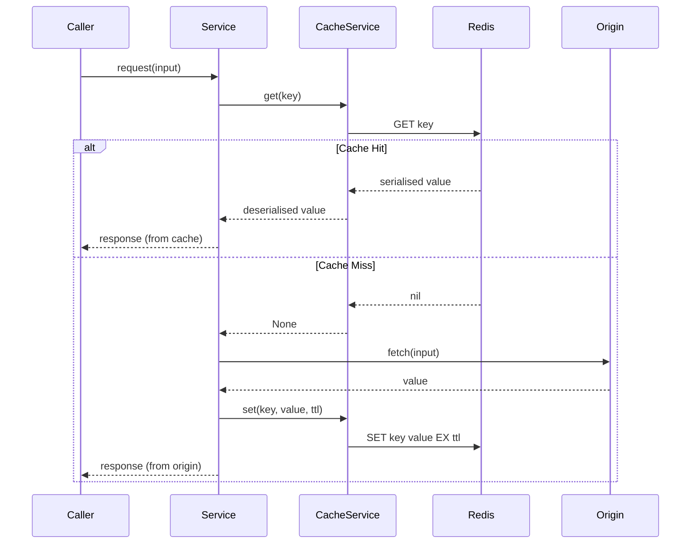
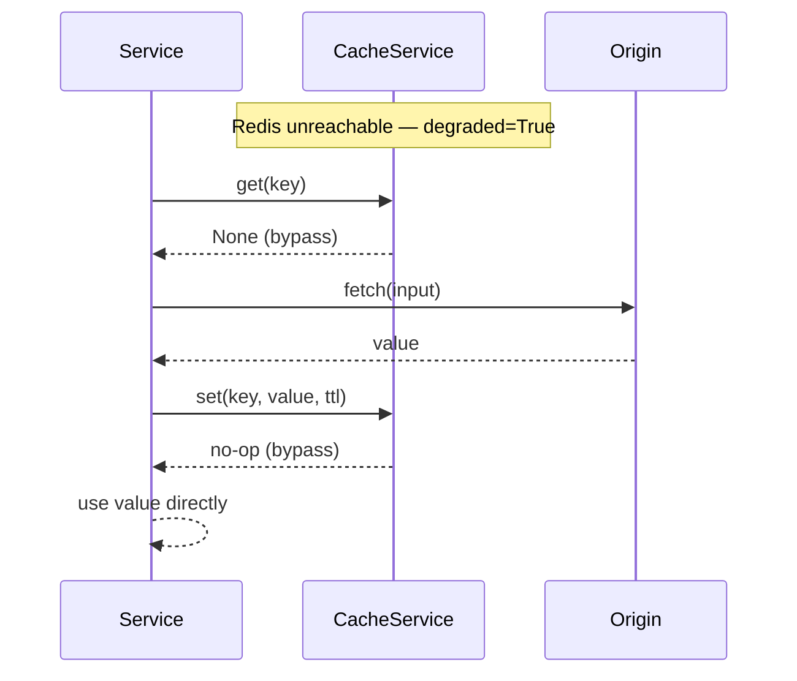

# Design Document — Caching and Performance

## Overview

This design introduces a Redis-backed `CacheService` to the Diagno-Pilot backend. The goal is to eliminate redundant MongoDB queries and OpenAI API calls, share state across multiple application instances, and migrate rate-limit storage from per-process memory to Redis.

The implementation follows a **degraded-mode-safe** pattern: if Redis is unavailable at any point, every service falls through to its existing origin data source without raising errors. This preserves the application's current availability guarantees while adding caching as an optional performance layer.

### Key design decisions

- **Single shared `CacheService` singleton** — all services import the same instance; no per-service Redis connections.
- **Versioned cache keys** (`v1:domain:identifier`) — changing `CACHE_KEY_VERSION` invalidates all stale entries on restart without a manual flush.
- **Non-blocking warm-up** — the lifespan handler fires warm-up as a background task and yields immediately, so the application accepts traffic before warm-up completes.
- **Prometheus metrics** — `cache_hits_total`, `cache_misses_total`, and `cache_degraded` are registered at module import time alongside the existing HTTP metrics.

---

## Architecture

```mermaid
graph TD
    subgraph FastAPI Application
        LF[lifespan handler]
        PS[PrescriptionService]
        AS[AlertService]
        EM[EmbeddingModel]
        RS[RAGService]
        RL[Rate Limiter - slowapi]
        ADM[Admin Router]
        DOC[Documents Router]
        HLT[/health endpoint]
    end

    subgraph Core
        CS[CacheService\nbackend/core/cache.py]
        CFG[Settings\nbackend/core/config.py]
    end

    subgraph External
        RD[(Redis)]
        MDB[(MongoDB)]
        OAI[OpenAI API]
    end

    CFG -->|REDIS_URL, TTLs, KEY_VERSION| CS
    LF -->|connect + warm-up| CS
    PS -->|get/set protocol:<name>| CS
    AS -->|get/set drug_interactions:all| CS
    EM -->|get/set embedding:<sha256>| CS
    RS -->|get/set rag:<sha256>| CS
    ADM -->|delete protocol:<name>\ndelete drug_interactions:all| CS
    DOC -->|flush_pattern rag:*| CS
    HLT -->|redis_status| CS
    RL -->|storage_uri=REDIS_URL| RD

    CS -->|aioredis / redis-py async| RD
    CS -.->|degraded fallback| PS
    CS -.->|degraded fallback| AS
    CS -.->|degraded fallback| EM
    CS -.->|degraded fallback| RS

    PS -->|load_protocols_from_db| MDB
    AS -->|load_interactions_from_db| MDB
    EM -->|encode| OAI
    RS -->|$vectorSearch + LLM| MDB
```

### Data flow — cache hit vs miss



### Degraded mode flow



---

## Components and Interfaces

### `CacheService` — `backend/core/cache.py`

The central component. Manages the Redis connection pool, implements degraded mode, exposes typed get/set/delete/flush operations, and registers Prometheus metrics.

```python
class CacheService:
    def __init__(self, settings: Settings) -> None: ...

    # Lifecycle
    async def connect(self) -> None: ...
    async def disconnect(self) -> None: ...

    # Core operations
    async def get(self, key: str) -> str | None: ...
    async def set(self, key: str, value: str, ttl: int) -> None: ...
    async def delete(self, key: str) -> None: ...
    async def flush_pattern(self, pattern: str) -> int: ...

    # Key construction
    def make_key(self, domain: str, identifier: str) -> str: ...

    # Health
    @property
    def is_degraded(self) -> bool: ...
    async def ping(self) -> bool: ...
```

**Key construction** always uses `make_key(domain, identifier)` which returns `f"{version}:{domain}:{identifier}"` where `version` comes from `settings.CACHE_KEY_VERSION`.

**Degraded mode** is entered when:
1. `connect()` fails at startup (Redis unreachable).
2. A Redis operation raises an exception during normal operation.

When degraded, `get()` returns `None` and `set()`/`delete()`/`flush_pattern()` are no-ops. The `cache_degraded` gauge is set to `1`.

**Reconnection** is handled by `redis-py`'s built-in connection pool retry logic with exponential back-off. The service re-tests connectivity on each operation and clears degraded mode when Redis becomes reachable again.

**Prometheus metrics** (registered at module level):

```python
cache_hits_total   = Counter("cache_hits_total",   "Cache hits",   ["cache"])
cache_misses_total = Counter("cache_misses_total",  "Cache misses", ["cache"])
cache_degraded     = Gauge("cache_degraded", "1 when cache is in degraded mode")
```

The `cache` label takes values: `protocol`, `interaction`, `embedding`, `rag`.

### `Settings` additions — `backend/core/config.py`

```python
REDIS_URL: str = "redis://localhost:6379/0"
CACHE_TTL_PROTOCOLS: int = 3600
CACHE_TTL_INTERACTIONS: int = 3600
CACHE_TTL_EMBEDDINGS: int = 86400
CACHE_TTL_RAG: int = 300
CACHE_KEY_VERSION: str = "v1"
```

`RATE_LIMIT_STORAGE_URI` default changes to use `REDIS_URL` when set:

```python
@model_validator(mode="after")
def set_rate_limit_storage(self) -> "Settings":
    if self.RATE_LIMIT_STORAGE_URI == "memory://" and self.REDIS_URL:
        self.RATE_LIMIT_STORAGE_URI = self.REDIS_URL
    return self
```

### `PrescriptionService` integration

`load_protocols_from_db()` is extended to check Redis first:

```
for each protocol in MongoDB:
    key = cache.make_key("protocol", name)   # → v1:protocol:<name>
    cache.set(key, json.dumps(protocol_dict), ttl=CACHE_TTL_PROTOCOLS)
```

`_get_protocol(name)` lookup order:
1. `cache.get(make_key("protocol", name))` → deserialise → return
2. `self._protocols_cache` (in-memory dict, existing behaviour)
3. `ANTIBIOTIC_PROTOCOLS` (built-in fallback)

Admin invalidation in `reload_protocols()`:
```
cache.delete(make_key("protocol", name))   # single key
# or
cache.flush_pattern(make_key("protocol", "*"))  # full reload
```

### `AlertService` integration

`load_interactions_from_db()` stores the full list under a single key:

```
key = cache.make_key("drug_interactions", "all")   # → v1:drug_interactions:all
cache.set(key, json.dumps(interactions_list), ttl=CACHE_TTL_INTERACTIONS)
```

`_get_interactions()` lookup order:
1. `cache.get(make_key("drug_interactions", "all"))` → deserialise → return
2. `self._interactions_cache` (in-memory list)

Admin invalidation:
```
cache.delete(make_key("drug_interactions", "all"))
```

### `EmbeddingModel` integration

`encode(text)` is wrapped with a cache layer:

```python
import hashlib, json

async def encode(self, text: str) -> list[float]:
    digest = hashlib.sha256(text.encode()).hexdigest()
    key = cache_service.make_key("embedding", digest)   # → v1:embedding:<sha256>

    cached = await cache_service.get(key)
    if cached is not None:
        cache_hits_total.labels(cache="embedding").inc()
        return json.loads(cached)

    cache_misses_total.labels(cache="embedding").inc()
    vector = await self._call_api(text)
    await cache_service.set(key, json.dumps(vector), ttl=settings.CACHE_TTL_EMBEDDINGS)
    return vector
```

### `RAGService` integration

`query(question, context, top_k)` is wrapped with a cache layer:

```python
import hashlib, json

async def query(self, question: str, context: PatientProfile | None, top_k: int) -> RAGResponse:
    q_hash = hashlib.sha256(question.encode()).hexdigest()
    if context is not None:
        ctx_hash = hashlib.sha256(context.model_dump_json().encode()).hexdigest()
        identifier = f"{q_hash}:{ctx_hash}"
    else:
        identifier = q_hash
    key = cache_service.make_key("rag", identifier)   # → v1:rag:<sha256> or v1:rag:<sha256>:<ctx_hash>

    cached = await cache_service.get(key)
    if cached is not None:
        cache_hits_total.labels(cache="rag").inc()
        return RAGResponse.model_validate_json(cached)

    cache_misses_total.labels(cache="rag").inc()
    response = await self._execute_pipeline(question, context, top_k)
    await cache_service.set(key, response.model_dump_json(), ttl=settings.CACHE_TTL_RAG)
    return response
```

### Documents router — RAG cache flush

After successful ingestion in `upload_document`:

```python
from backend.core.cache import cache_service

flushed = await cache_service.flush_pattern(
    cache_service.make_key("rag", "*")   # → v1:rag:*
)
logger.info("Flushed %d RAG cache entries after document upload", flushed)
```

### Lifespan handler additions — `backend/main.py`

```python
# 1. Connect CacheService (non-blocking — degraded mode if Redis is down)
from backend.core.cache import cache_service
await cache_service.connect()

# 2. Fire warm-up as a background task (non-blocking)
import asyncio
asyncio.create_task(_warm_up_cache())

# ... existing MongoDB setup, service init ...

yield

await cache_service.disconnect()
```

`_warm_up_cache()` implementation:

```python
async def _warm_up_cache() -> None:
    try:
        async with asyncio.timeout(10):
            await prescription_service.load_protocols_from_db()
            await alert_service.load_interactions_from_db()
    except TimeoutError:
        logger.warning("Cache warm-up timed out after 10 s; starting with cold cache")
    except Exception:
        logger.error("Cache warm-up failed; starting with cold cache", exc_info=True)
```

### `/health` endpoint extension

```python
@app.get("/health", tags=["health"])
async def health():
    # MongoDB ping (existing)
    try:
        await db.get_db().client.admin.command("ping")
        db_status = "ok"
    except Exception as exc:
        db_status = f"unreachable: {exc}"

    # Redis ping (new)
    redis_ok = await cache_service.ping()
    redis_status = "ok" if redis_ok else "degraded"

    overall = "ok" if db_status == "ok" and redis_ok else "degraded"
    return {
        "status": overall,
        "db": db_status,
        "redis": redis_status,
    }
```

---

## Data Models

### Cache key schema

| Domain | Identifier | Full key example | TTL |
|---|---|---|---|
| `protocol` | `<name>` | `v1:protocol:amoxicillin` | 3600 s |
| `drug_interactions` | `all` | `v1:drug_interactions:all` | 3600 s |
| `embedding` | `<sha256(text)>` | `v1:embedding:a3f2...` | 86400 s |
| `rag` | `<sha256(question)>` | `v1:rag:b7c1...` | 300 s |
| `rag` (with patient) | `<sha256(q)>:<sha256(ctx)>` | `v1:rag:b7c1...:d4e9...` | 300 s |

### Serialisation formats

| Cache | Stored as | Deserialised to |
|---|---|---|
| Protocol | `json.dumps(dataclasses.asdict(protocol))` | `AntibioticProtocol` via `_doc_to_protocol()` |
| Interactions | `json.dumps([(a, b, msg), ...])` | `list[tuple[str, str, str]]` |
| Embedding | `json.dumps([float, ...])` | `list[float]` |
| RAG response | `response.model_dump_json()` | `RAGResponse.model_validate_json()` |

### Settings fields

| Field | Type | Default | Env var |
|---|---|---|---|
| `REDIS_URL` | `str` | `redis://localhost:6379/0` | `REDIS_URL` |
| `CACHE_TTL_PROTOCOLS` | `int` | `3600` | `CACHE_TTL_PROTOCOLS` |
| `CACHE_TTL_INTERACTIONS` | `int` | `3600` | `CACHE_TTL_INTERACTIONS` |
| `CACHE_TTL_EMBEDDINGS` | `int` | `86400` | `CACHE_TTL_EMBEDDINGS` |
| `CACHE_TTL_RAG` | `int` | `300` | `CACHE_TTL_RAG` |
| `CACHE_KEY_VERSION` | `str` | `v1` | `CACHE_KEY_VERSION` |

---

## Correctness Properties

*A property is a characteristic or behavior that should hold true across all valid executions of a system — essentially, a formal statement about what the system should do. Properties serve as the bridge between human-readable specifications and machine-verifiable correctness guarantees.*

### Property 1: Degraded mode is a transparent no-op

*For any* cache key and any value, when `CacheService` is in degraded mode, `get()` must return `None` and `set()` must complete without raising an exception, leaving the caller's behaviour unchanged.

**Validates: Requirements 1.4, 2.6, 3.5, 4.5, 5.6**

---

### Property 2: Protocol cache round-trip

*For any* `AntibioticProtocol` object, serialising it to JSON and storing it under its versioned key, then retrieving and deserialising it, must produce a protocol object equal to the original.

**Validates: Requirements 2.1, 2.2, 2.3**

---

### Property 3: Interaction cache round-trip

*For any* list of drug interaction tuples `(drug_a, drug_b, message)`, serialising and storing the list under `v1:drug_interactions:all`, then retrieving and deserialising it, must produce a list equal to the original.

**Validates: Requirements 3.1, 3.2, 3.3**

---

### Property 4: Embedding cache round-trip

*For any* text string, calling `EmbeddingModel.encode()`, caching the resulting vector, then retrieving and deserialising it from cache must produce a vector where every element is equal to the original within standard IEEE 754 float64 precision.

**Validates: Requirements 4.2, 4.3, 4.4, 4.6**

---

### Property 5: RAG response cache round-trip

*For any* `RAGResponse` object, serialising it via `model_dump_json()` and storing it in cache, then retrieving and deserialising it via `model_validate_json()`, must produce a `RAGResponse` equal to the original.

**Validates: Requirements 5.2, 5.3, 5.4**

---

### Property 6: Deterministic cache key derivation

*For any* text string passed to `EmbeddingModel.encode()` or question string passed to `RAGService.query()`, calling the key-derivation function twice with the same input must always produce the same cache key.

**Validates: Requirements 4.1, 5.1**

---

### Property 7: Cache key format invariant

*For any* version string, domain string, and identifier string, `CacheService.make_key(domain, identifier)` must return a string matching the pattern `<version>:<domain>:<identifier>` where `<version>` equals `settings.CACHE_KEY_VERSION`.

**Validates: Requirements 9.1, 9.2, 9.3**

---

### Property 8: Patient context key isolation

*For any* question string and any two distinct `PatientProfile` objects, `RAGService` must derive different cache keys, ensuring that a cached response for one patient is never returned for a different patient.

**Validates: Requirements 5.7**

---

### Property 9: Cache invalidation on admin write

*For any* protocol name, after an admin create or update operation completes, `CacheService.get(make_key("protocol", name))` must return `None`. Equivalently, after an admin drug-interaction write, `CacheService.get(make_key("drug_interactions", "all"))` must return `None`.

**Validates: Requirements 2.4, 3.4**

---

### Property 10: Metrics counters increment on every hit and miss

*For any* cache domain (`protocol`, `interaction`, `embedding`, `rag`), a cache hit must increment `cache_hits_total{cache=<domain>}` by exactly 1, and a cache miss must increment `cache_misses_total{cache=<domain>}` by exactly 1.

**Validates: Requirements 8.1, 8.2**

---

### Property 11: TTL settings reject non-integer values

*For any* non-integer string value assigned to `CACHE_TTL_PROTOCOLS`, `CACHE_TTL_INTERACTIONS`, `CACHE_TTL_EMBEDDINGS`, or `CACHE_TTL_RAG`, instantiating `Settings` must raise a `pydantic.ValidationError`.

**Validates: Requirements 7.3**

---

## Error Handling

| Scenario | Behaviour |
|---|---|
| Redis unreachable at startup | `CacheService.connect()` logs `WARNING`, sets `degraded=True`, `cache_degraded` gauge → 1. Application starts normally. |
| Redis operation raises during request | `CacheService` catches the exception, logs `WARNING`, sets `degraded=True`, returns `None` from `get()` / no-op for `set()`. |
| Redis recovers | On the next operation, `CacheService` attempts a `PING`; if successful, clears `degraded=True` and sets `cache_degraded` gauge → 0. |
| Warm-up exceeds 10 s | `asyncio.timeout(10)` raises `TimeoutError`; warm-up task logs `WARNING` and exits. Application is already serving traffic. |
| Warm-up raises unexpected exception | Caught by bare `except Exception`; logged at `ERROR` level. Application continues with cold cache. |
| `flush_pattern` on large keyspace | Uses `SCAN` + `DEL` in batches (not `KEYS`) to avoid blocking the Redis event loop. |
| Deserialisation error on cached value | `CacheService.get()` catches `json.JSONDecodeError`, deletes the corrupt key, and returns `None` (treated as a cache miss). |
| `CACHE_TTL_*` set to non-integer | `pydantic-settings` raises `ValidationError` at startup before any connections are made. |

---

## Testing Strategy

### Dual testing approach

Both unit tests and property-based tests are required. Unit tests cover specific examples, integration points, and error conditions. Property-based tests verify universal correctness across randomly generated inputs.

### Unit tests

Focus areas:
- `CacheService.make_key()` — verify key format for known inputs.
- `CacheService` degraded mode — mock Redis to raise `ConnectionError`; assert `get()` returns `None` and `set()` is a no-op.
- `/health` endpoint — assert response includes `redis` field with `"ok"` or `"degraded"`.
- `Settings` defaults — assert all new fields have correct default values when env vars are absent.
- `Settings` rate-limit migration — assert `RATE_LIMIT_STORAGE_URI` equals `REDIS_URL` when `REDIS_URL` is set.
- Warm-up timeout — mock `load_protocols_from_db` to sleep > 10 s; assert warm-up exits without blocking.
- RAG cache flush on document upload — mock `cache_service.flush_pattern`; assert it is called with `v1:rag:*` after successful ingestion.
- `cache_degraded` gauge — assert gauge is `1` in degraded mode and `0` when healthy.
- `/metrics` endpoint — assert response body contains `cache_hits_total`, `cache_misses_total`, `cache_degraded`.

### Property-based tests (Hypothesis)

The project already uses Hypothesis (`.hypothesis/` directory present). All property tests use `@settings(max_examples=100)`.

Each test is tagged with a comment referencing the design property:
```python
# Feature: caching-and-performance, Property N: <property_text>
```

**Property 1 — Degraded mode is a transparent no-op**
```python
@given(key=st.text(min_size=1), value=st.text())
@settings(max_examples=100)
async def test_degraded_mode_bypass(key, value):
    # Feature: caching-and-performance, Property 1: degraded mode is a transparent no-op
    svc = CacheService.__new__(CacheService)
    svc._degraded = True
    assert await svc.get(key) is None
    await svc.set(key, value, ttl=60)  # must not raise
```

**Property 2 — Protocol cache round-trip**
```python
@given(protocol=st_antibiotic_protocol())
@settings(max_examples=100)
async def test_protocol_round_trip(protocol, redis_mock):
    # Feature: caching-and-performance, Property 2: protocol cache round-trip
    key = cache_service.make_key("protocol", protocol.name)
    await cache_service.set(key, json.dumps(dataclasses.asdict(protocol)), ttl=3600)
    raw = await cache_service.get(key)
    restored = _doc_to_protocol(json.loads(raw))
    assert restored == protocol
```

**Property 3 — Interaction cache round-trip**
```python
@given(interactions=st.lists(st.tuples(st.text(), st.text(), st.text()), min_size=0))
@settings(max_examples=100)
async def test_interaction_round_trip(interactions, redis_mock):
    # Feature: caching-and-performance, Property 3: interaction cache round-trip
    key = cache_service.make_key("drug_interactions", "all")
    await cache_service.set(key, json.dumps(interactions), ttl=3600)
    raw = await cache_service.get(key)
    assert json.loads(raw) == interactions
```

**Property 4 — Embedding cache round-trip**
```python
@given(vector=st.lists(st.floats(allow_nan=False, allow_infinity=False), min_size=1, max_size=3072))
@settings(max_examples=100)
async def test_embedding_round_trip(vector, redis_mock):
    # Feature: caching-and-performance, Property 4: embedding cache round-trip
    text = "test"
    digest = hashlib.sha256(text.encode()).hexdigest()
    key = cache_service.make_key("embedding", digest)
    await cache_service.set(key, json.dumps(vector), ttl=86400)
    raw = await cache_service.get(key)
    restored = json.loads(raw)
    assert all(abs(a - b) < 1e-9 for a, b in zip(restored, vector))
```

**Property 5 — RAG response cache round-trip**
```python
@given(response=st_rag_response())
@settings(max_examples=100)
async def test_rag_round_trip(response, redis_mock):
    # Feature: caching-and-performance, Property 5: RAG response cache round-trip
    key = cache_service.make_key("rag", "testhash")
    await cache_service.set(key, response.model_dump_json(), ttl=300)
    raw = await cache_service.get(key)
    assert RAGResponse.model_validate_json(raw) == response
```

**Property 6 — Deterministic cache key derivation**
```python
@given(text=st.text(min_size=1))
@settings(max_examples=100)
def test_key_derivation_is_deterministic(text):
    # Feature: caching-and-performance, Property 6: deterministic cache key derivation
    k1 = hashlib.sha256(text.encode()).hexdigest()
    k2 = hashlib.sha256(text.encode()).hexdigest()
    assert k1 == k2
```

**Property 7 — Cache key format invariant**
```python
@given(domain=st.text(min_size=1), identifier=st.text(min_size=1))
@settings(max_examples=100)
def test_key_format(domain, identifier):
    # Feature: caching-and-performance, Property 7: cache key format invariant
    key = cache_service.make_key(domain, identifier)
    version = settings.CACHE_KEY_VERSION
    assert key == f"{version}:{domain}:{identifier}"
```

**Property 8 — Patient context key isolation**
```python
@given(question=st.text(min_size=1), p1=st_patient_profile(), p2=st_patient_profile())
@settings(max_examples=100)
def test_patient_key_isolation(question, p1, p2):
    # Feature: caching-and-performance, Property 8: patient context key isolation
    assume(p1.model_dump_json() != p2.model_dump_json())
    k1 = _rag_cache_key(question, p1)
    k2 = _rag_cache_key(question, p2)
    assert k1 != k2
```

**Property 9 — Cache invalidation on admin write**
```python
@given(name=st.text(min_size=1, alphabet=st.characters(whitelist_categories=("Ll",))))
@settings(max_examples=100)
async def test_protocol_invalidation(name, redis_mock):
    # Feature: caching-and-performance, Property 9: cache invalidation on admin write
    key = cache_service.make_key("protocol", name)
    await cache_service.set(key, "{}", ttl=3600)
    await cache_service.delete(key)
    assert await cache_service.get(key) is None
```

**Property 10 — Metrics counters increment on every hit and miss**
```python
@given(domain=st.sampled_from(["protocol", "interaction", "embedding", "rag"]))
@settings(max_examples=100)
async def test_metrics_increment(domain, redis_mock):
    # Feature: caching-and-performance, Property 10: metrics counters increment on every hit and miss
    before_miss = cache_misses_total.labels(cache=domain)._value.get()
    await cache_service.get(cache_service.make_key(domain, "nonexistent"))
    assert cache_misses_total.labels(cache=domain)._value.get() == before_miss + 1
```

**Property 11 — TTL settings reject non-integer values**
```python
@given(bad_value=st.text().filter(lambda s: not s.strip().lstrip("-").isdigit()))
@settings(max_examples=100)
def test_ttl_validation(bad_value, monkeypatch):
    # Feature: caching-and-performance, Property 11: TTL settings reject non-integer values
    monkeypatch.setenv("CACHE_TTL_PROTOCOLS", bad_value)
    with pytest.raises(ValidationError):
        Settings()
```

### Test file layout

```
backend/tests/
  test_cache_service.py          # unit + property tests for CacheService
  test_cache_integration.py      # integration tests with fakeredis
  test_prescription_cache.py     # PrescriptionService cache integration
  test_alert_cache.py            # AlertService cache integration
  test_embedding_cache.py        # EmbeddingModel cache integration
  test_rag_cache.py              # RAGService cache integration
  test_cache_settings.py         # Settings validation (Property 11)
```

Use `fakeredis` (async variant) for all tests that need a Redis instance — no live Redis required in CI.
