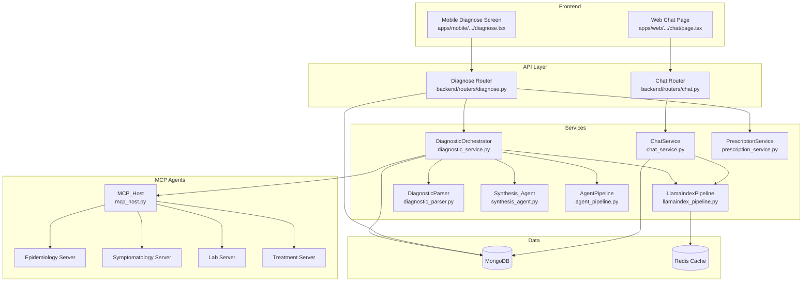

# Design Document: Chat & Diagnosis Workflow Improvements

## Overview

This design addresses 27 requirements spanning the Chat and Diagnosis workflows in Diagno-Pilot. The changes fall into seven categories:

1. **Chat workflow hardening** (Req 1–10): conversation history passthrough, session ownership, listing/pagination, cache key context-awareness, input validation, TTL cleanup, frontend persistence, rollback consistency, and source relevance filtering.
2. **Diagnosis workflow fixes** (Req 11–21): duplicate consultation write prevention, prescription linking, ownership enforcement, parser failure signaling, symptom deduplication, input validation, dose floor clamping, timeout simplification, audit completeness, idempotency, and error resilience.
3. **Agent sub-question improvements** (Req 22): West African tropical medicine context in all agent sub-questions.
4. **Prompt/system prompt improvements** (Req 23): locale-aware instruction language, matching_symptoms in JSON schema, no markdown wrappers, West African context in system prompts.
5. **Language detection and response** (Req 24): user message language wins, locale fallback.
6. **Frontend parse failure warning** (Req 25): display warning banner when `parse_failed` is true.
7. **Data migration** (Req 26): backfill `updated_at` on existing chat sessions for TTL eligibility.
8. **Documentation updates** (Req 27): rag-chat-workflow.md, architecture.md, api-reference.md, hipaa-compliance.md, ops-guide.

The implementation touches backend Python services, FastAPI routers, Pydantic models, MCP server handlers, the Next.js web frontend, and the React Native mobile app.

## Architecture

### High-Level Component Interaction



### Change Impact Map

| Requirement | Files Modified |
|---|---|
| Req 1 (History passthrough) | `chat_service.py`, `llamaindex_pipeline.py` |
| Req 2 (Session ownership) | `chat.py` (router), `chat_service.py` |
| Req 3 (Session listing) | `chat.py` (router), `chat_service.py` |
| Req 4 (Pagination) | `chat.py` (router), `chat_service.py` |
| Req 5 (Cache key) | `llamaindex_pipeline.py` |
| Req 6 (Chat input validation) | `chat.py` (router models) |
| Req 7 (TTL/cleanup) | `main.py` (startup), `chat.py` (router) |
| Req 8 (Frontend persistence) | `chat/page.tsx`, `diagnose.tsx` |
| Req 9 (Rollback consistency) | `chat/page.tsx`, `diagnose.tsx` |
| Req 10 (Source filtering) | `llamaindex_pipeline.py`, `chat/page.tsx` |
| Req 11 (Duplicate writes) | `diagnostic_service.py`, `diagnose.py` (router) |
| Req 12 (Prescription linking) | `diagnose.py` (router models) |
| Req 13 (Diagnosis ownership) | `diagnose.py` (router) |
| Req 14 (Parser failure) | `diagnostic_parser.py`, `diagnostic_service.py`, `diagnose.py` |
| Req 15 (Symptom dedup) | `synthesis_agent.py` |
| Req 16 (Diagnosis validation) | `diagnose.py` (router models), `consultation.py` |
| Req 17 (Dose floor) | `prescription_service.py` |
| Req 18 (Timeout simplification) | `mcp_host.py` |
| Req 19 (Audit completeness) | `diagnostic_service.py` |
| Req 20 (Idempotency) | `diagnose.py` (router), `main.py` (index) |
| Req 21 (Error resilience) | `agent_pipeline.py` |
| Req 22 (Sub-questions) | `agent_pipeline.py`, all 4 MCP servers |
| Req 23 (Prompts) | `prompt_builder.py`, `diagnostic_service.py` |
| Req 24 (Language) | `llamaindex_pipeline.py`, `diagnostic_service.py` |
| Req 25 (Parse failure warning) | `chat/page.tsx`, `diagnose.tsx` |
| Req 26 (Backfill migration) | `main.py` (startup) |
| Req 27 (Docs) | `docs/*.md` |

## Components and Interfaces

### 1. ChatService Changes (Req 1, 2, 3, 4)

**`ChatService.send_message`** — modified to load history and pass it to the pipeline:

```python
async def send_message(self, session_id, user_message, patient_context, user_id):
    session_id = session_id or str(uuid.uuid4())
    history = await self._load_history(session_id)  # Req 1.1
    history = history[-20:]  # Req 1.4: cap at 20 messages

    rag_response = await self._rag.query(
        question=user_message,
        context=patient_context,
        top_k=5,
        session_history=history,  # Req 1.2: pass to pipeline
    )
    # ... persist turns as before
```

**`ChatService.get_history`** — modified to accept `user_id` filter:

```python
async def get_history(self, session_id: str, user_id: str | None = None) -> dict | None:
    query = {"session_id": session_id}
    if user_id is not None:
        query["user_id"] = user_id  # Req 2.3
    return await self._db[self.COLLECTION].find_one(query, {"_id": 0})
```

**`ChatService.list_sessions`** — new method (Req 3):

```python
async def list_sessions(self, user_id: str, skip: int = 0, limit: int = 20) -> list[dict]:
    cursor = self._db[self.COLLECTION].find(
        {"user_id": user_id},
        {"session_id": 1, "created_at": 1, "updated_at": 1, "messages": {"$slice": 1}, "_id": 0},
    ).sort("updated_at", -1).skip(skip).limit(limit)
    return await cursor.to_list(length=limit)
```

**`ChatService.get_history_paginated`** — new method (Req 4):

```python
async def get_history_paginated(self, session_id, user_id, skip=0, limit=50):
    doc = await self._db[self.COLLECTION].find_one(
        {"session_id": session_id, **({"user_id": user_id} if user_id else {})},
        {"session_id": 1, "messages": {"$slice": [skip, limit]}, "patient_context": 1,
         "created_at": 1, "updated_at": 1, "_id": 0},
    )
    if doc is None:
        return None
    total = await self._db[self.COLLECTION].aggregate([
        {"$match": {"session_id": session_id}},
        {"$project": {"total": {"$size": "$messages"}}},
    ]).to_list(1)
    doc["total_messages"] = total[0]["total"] if total else 0
    return doc
```

**`ChatService.delete_session`** — new method (Req 7):

```python
async def delete_session(self, session_id: str, user_id: str | None = None) -> bool:
    query = {"session_id": session_id}
    if user_id is not None:
        query["user_id"] = user_id
    result = await self._db[self.COLLECTION].delete_one(query)
    return result.deleted_count > 0
```

### 2. Chat Router Changes (Req 2, 3, 4, 6, 7)

**Input validation** (Req 6):
```python
class ChatMessageRequest(BaseModel):
    message: str = Field(min_length=1, max_length=4000)
    session_id: str | None = None
    patient_context: PatientProfile | None = None

    @field_validator("message", mode="before")
    @classmethod
    def strip_whitespace(cls, v):
        if isinstance(v, str):
            v = v.strip()
        return v
```

**New endpoints**:
- `GET /api/v1/chat/sessions` — list user's sessions (Req 3)
- `DELETE /api/v1/chat/sessions/{session_id}` — delete session (Req 7)

**Modified endpoints**:
- `GET /api/v1/chat/history/{session_id}` — add `skip`/`limit` params, ownership check (Req 2, 4)
- `POST /api/v1/chat/message` — ownership check on existing session (Req 2)

**Ownership logic** (Req 2.1–2.4, 7.3–7.5):
```python
# Admin bypass: if current_user["role"] == "admin", skip user_id filter
user_id_filter = None if current_user.get("role") == "admin" else str(current_user["_id"])
```

### 3. LlamaIndexPipeline Changes (Req 5, 10)

**Cache key with history hash** (Req 5):
```python
@staticmethod
def _build_cache_key(question, context, region, session_history=None):
    q_hash = hashlib.sha256(question.encode()).hexdigest()
    # ... existing context/region logic ...
    if session_history:
        history_str = json.dumps(session_history, sort_keys=True, default=str)
        h_hash = hashlib.sha256(history_str.encode()).hexdigest()
        identifier = f"{identifier}:hist={h_hash}"
    return cache_service.make_key("rag", identifier)
```

**Source relevance filtering** (Req 10):
```python
# After building sources list, filter by SOURCE_RELEVANCE_THRESHOLD
source_threshold = settings.SOURCE_RELEVANCE_THRESHOLD  # default 0.3
sources = [
    s for s, c in zip(sources, top_chunks)
    if float(c.get("ce_score", c.get("score", 0.0))) >= source_threshold
]
```

### 4. Diagnose Router Changes (Req 11, 12, 13, 14, 16, 20)

**DiagnoseRequest model** (Req 16, 20):
```python
class DiagnoseRequest(BaseModel):
    symptoms: list[Symptom] = Field(min_length=1, max_length=30)
    patient_profile: PatientProfile | None = None
    session_id: str | None = None
    idempotency_key: str | None = None  # Req 20
```

**Symptom model** (Req 16.3):
```python
class Symptom(BaseModel):
    name: str = Field(max_length=200)
    severity: str | None = None
    duration_days: int | None = Field(default=None, ge=0)
```

**Duplicate write prevention** (Req 11):
```python
# In diagnose_symptoms endpoint:
if result.session_id is not None:
    # MCP path already persisted — skip router insert
    pass
else:
    # RAG/AgentPipeline path — router performs insert
    await database["consultations"].insert_one(doc)
```

**DiagnosticResult flag** (Req 11.3):
```python
@dataclass
class DiagnosticResult:
    # ... existing fields ...
    consultation_persisted: bool = False  # True when MCP path wrote the consultation
```

**Idempotency** (Req 20):
```python
if body.idempotency_key:
    existing = await database["consultations"].find_one({"idempotency_key": body.idempotency_key})
    if existing:
        return DiagnoseResponse(session_id=existing["session_id"], diagnoses=existing["diagnoses"], ...)
```

**Prescription linking** (Req 12):
```python
class PrescriptionRequest(BaseModel):
    antibiotic: str
    patient_profile: PatientProfile
    session_id: str | None = None  # Req 12.1

# In create_prescription:
if body.session_id:
    # Ownership check: only update consultation belonging to current user (or admin)
    query = {"session_id": body.session_id}
    if current_user.get("role") != "admin":
        query["user_id"] = ObjectId(str(current_user["_id"]))
    update_result = await database["consultations"].update_one(
        query,
        {"$set": {"prescription": rx.model_dump(), "alerts": [a.model_dump() for a in alerts]}},
    )
    # If no document matched, the session doesn't exist or doesn't belong to the user — silently skip
```

**Ownership enforcement** (Req 13):
```python
# In get_diagnosis_session:
query = {"session_id": session_id}
if current_user.get("role") != "admin":
    query["user_id"] = ObjectId(str(current_user["_id"]))
doc = await database["consultations"].find_one(query)
```

### 5. DiagnosticParser Changes (Req 14)

The `parse()` method return type changes from `list[DifferentialDiagnosis]` to `tuple[list[DifferentialDiagnosis], bool]`. All callers must be updated to unpack the tuple.

```python
class DiagnosticParser:
    def parse(self, llm_answer: str, locale: str = "en") -> tuple[list[DifferentialDiagnosis], bool]:
        # ... existing parse logic ...
        if len(diagnoses) >= 3:
            return sorted(diagnoses, ...), False  # parse_failed=False

        # Localized placeholders (Req 14.4)
        placeholder_text = "Diagnostic indisponible" if locale.startswith("fr") else "Diagnosis unavailable"
        placeholders = [
            DifferentialDiagnosis(condition=placeholder_text, probability=0.0, icd_code=None)
            for _ in range(3)
        ]
        return placeholders, True  # parse_failed=True
```

**Caller updates required:**

In `diagnostic_service.py` (`_get_diagnosis_via_rag`):
```python
# Before: diagnoses = self._diagnostic_parser.parse(rag_response.answer)
diagnoses, parse_failed = self._diagnostic_parser.parse(rag_response.answer, locale=locale)
result = DiagnosticResult(diagnoses=diagnoses, ..., parse_failed=parse_failed)
```

In `diagnostic_service.py` (`_get_diagnosis_via_mcp`, LLM fallback block):
```python
# Before: parsed = self._diagnostic_parser.parse(llm_result.answer)
parsed, _parse_failed = self._diagnostic_parser.parse(llm_result.answer, locale=locale)
```

In `agent_pipeline.py` (`_parse_partial_differential`):
```python
# This function is separate from DiagnosticParser and does not need updating —
# it returns list[DifferentialDiagnosis] directly and is not affected by the
# DiagnosticParser return type change.
```

**DiagnosticResult** (Req 14.2):
```python
@dataclass
class DiagnosticResult:
    # ... existing fields ...
    parse_failed: bool = False
```

### 6. Synthesis_Agent Changes (Req 15)

**Symptom deduplication fix**:
```python
# In synthesize(), when merging duplicate conditions:
for result in active_results:
    for diag in result.partial_differential:
        key = diag.condition.strip().lower()
        existing = merged.get(key)
        if existing is None:
            merged[key] = diag
        else:
            # Req 15.3: keep highest probability
            if diag.probability > existing.probability:
                merged[key] = DifferentialDiagnosis(
                    condition=existing.condition,
                    probability=diag.probability,
                    icd_code=existing.icd_code or diag.icd_code,
                    matching_symptoms=_union_symptoms(existing.matching_symptoms, diag.matching_symptoms),
                )
            else:
                merged[key] = DifferentialDiagnosis(
                    condition=existing.condition,
                    probability=existing.probability,
                    icd_code=existing.icd_code or diag.icd_code,
                    matching_symptoms=_union_symptoms(existing.matching_symptoms, diag.matching_symptoms),
                )

def _union_symptoms(a: list[str], b: list[str]) -> list[str]:
    """Case-insensitive union of symptom lists (Req 15.2)."""
    seen: set[str] = set()
    result: list[str] = []
    for s in a + b:
        key = s.strip().lower()
        if key not in seen:
            seen.add(key)
            result.append(s.strip())
    return result
```

### 7. PrescriptionService Changes (Req 17)

```python
# In calculate_prescription, after paediatric/adult dose selection but BEFORE adjustments:
# At this point dose_mg is the base dose (paediatric weight-based or adult max, possibly capped)
pre_adjustment_dose = dose_mg  # capture before any organ-failure adjustments

renal_failure = patient.comorbidities.renal_failure if patient.comorbidities else False
hepatic_failure = patient.comorbidities.hepatic_failure if patient.comorbidities else False
if renal_failure:
    dose_mg *= protocol.renal_adjustment_factor
if hepatic_failure:
    dose_mg *= protocol.hepatic_adjustment_factor

# Req 17.1–17.4: dose floor clamping (only when BOTH adjustments are active)
if renal_failure and hepatic_failure:
    floor_pct = getattr(protocol, 'min_dose_floor_pct', 10) / 100.0
    min_dose = pre_adjustment_dose * floor_pct
    if dose_mg < min_dose:
        logger.warning(
            "Dose clamped for %s: %.2f mg → %.2f mg (floor=%d%%)",
            protocol.name, dose_mg, min_dose, int(floor_pct * 100),
        )
        dose_mg = min_dose
```

**AntibioticProtocol** (Req 17.4):
```python
@dataclass
class AntibioticProtocol:
    # ... existing fields ...
    min_dose_floor_pct: int = 10  # default 10%, overridable per protocol
```

### 8. MCP_Host Changes (Req 18)

Remove the inner `asyncio.wait_for` in `_call_agent_http` — the outer `asyncio.wait_for` in `run_diagnostic` is the single timeout layer:

```python
# run_diagnostic (KEEP — single timeout layer):
async def _call_with_timeout(name: str) -> AgentResult:
    return await asyncio.wait_for(
        self._call_agent_http(name, symptoms, patient_profile, locale, region),
        timeout=AGENT_TIMEOUT,
    )

# _call_agent_http (REMOVE any internal timeout wrapping):
# The method body stays the same but without any asyncio.wait_for inside
```

### 9. DiagnosticOrchestrator Changes (Req 19)

```python
# In _write_audit:
audit = DiagnosticAudit(
    # ...
    confidence_score=result.confidence_score,  # Req 19.1: use actual score
    agent_results=[
        AgentAuditResult(
            agent_name=c.agent_name if hasattr(c, 'agent_name') else c.get("agent_name", ""),
            # ...
        )
        for c in result.agent_contributions  # Req 19.2: use actual contributions
    ] if result.agent_contributions else [],
)
```

### 10. AgentPipeline Changes (Req 21)

```python
# In run():
agent_names = list(self.AGENTS.keys())
tasks = [
    self._run_agent(
        agent_name=name,
        sub_question=_SUB_QUESTIONS.get(name, "{symptoms}").format(...),
        patient_profile=patient_profile,
        region=region,
    )
    for name in agent_names
]

results_raw = await asyncio.gather(
    *tasks, return_exceptions=True  # Req 21.1
)

# Convert exceptions to AgentResult with correct agent name (Req 21.2)
processed = []
for i, r in enumerate(results_raw):
    if isinstance(r, Exception):
        processed.append(AgentResult(
            agent_name=agent_names[i],  # preserve agent identity from task order
            sub_question="",
            error=str(r),
        ))
    else:
        processed.append(r)

return self._aggregate(processed)
```

### 11. Agent Sub-Question Improvements (Req 22)

**AgentPipeline `_SUB_QUESTIONS`** — rewritten with West African tropical medicine context:

```python
_SUB_QUESTIONS: dict[str, str] = {
    "symptomatology": (
        "En contexte de médecine tropicale ouest-africaine (paludisme, fièvre typhoïde, dengue, "
        "méningite, schistosomiase), quels diagnostics différentiels correspondent aux symptômes "
        "suivants : {symptoms}? Considérer la sévérité et la durée des symptômes pour prioriser "
        "les pathologies endémiques de la région {region}. {patient_context}"
    ),
    "epidemiology": (
        "Quelles pathologies endémiques d'Afrique de l'Ouest sont compatibles avec les symptômes : "
        "{symptoms}? Considérer la prévalence régionale, les patterns saisonniers (saison des pluies/"
        "saison sèche), les données d'épidémies récentes spécifiques à la région {region}, "
        "et les guidelines du {guidelines_ref}. {patient_context}"
    ),
    "lab": (
        "Quels examens de laboratoire disponibles en milieu clinique ouest-africain (goutte épaisse/"
        "frottis mince, test de Widal, TDR paludisme, NFS) sont indiqués pour les symptômes : "
        "{symptoms}? Prioriser les tests qui affinent le diagnostic différentiel tropical. "
        "{patient_context}"
    ),
    "treatment": (
        "Quels protocoles de traitement alignés sur les formulaires nationaux ouest-africains et "
        "les guidelines OMS AFRO sont recommandés pour les symptômes : {symptoms}? Tenir compte "
        "des allergies, comorbidités, groupe d'âge et disponibilité régionale des médicaments "
        "dans la région {region}. {patient_context}"
    ),
    "synthesis": (
        "Synthétiser les diagnostics différentiels pour les symptômes : {symptoms} en contexte "
        "ouest-africain. Réconcilier les diagnostics conflictuels entre agents, pondérer les "
        "preuves par qualité de source, et prioriser les conditions à haute morbidité/mortalité "
        "dans le contexte tropical. {patient_context}"
    ),
}
```

**MCP server tool handlers** — all four servers updated to include patient profile data (age group, weight, allergies, comorbidities) and symptom severity/duration in sub-question text (Req 22.8, 22.9).

**AgentPipeline.run() — placeholder population:**

The `run()` method must build the `patient_context` and `guidelines_ref` strings before formatting sub-questions:

```python
async def run(self, symptoms, patient_profile=None, region=None):
    symptom_text = ", ".join(
        f"{s.get('name', str(s))} (sévérité={s.get('severity', '?')}, durée={s.get('duration_days', '?')}j)"
        if isinstance(s, dict) else str(s)
        for s in symptoms
    )

    # Build patient_context string from profile (Req 22.2)
    patient_context = ""
    if patient_profile:
        parts = []
        if patient_profile.age_group:
            parts.append(f"groupe d'âge: {patient_profile.age_group.value}")
        if patient_profile.weight_kg:
            parts.append(f"poids: {patient_profile.weight_kg} kg")
        if patient_profile.allergies:
            parts.append(f"allergies: {', '.join(patient_profile.allergies)}")
        if patient_profile.comorbidities:
            comorbidities = []
            if patient_profile.comorbidities.renal_failure:
                comorbidities.append("insuffisance rénale")
            if patient_profile.comorbidities.hepatic_failure:
                comorbidities.append("insuffisance hépatique")
            if comorbidities:
                parts.append(f"comorbidités: {', '.join(comorbidities)}")
        if parts:
            patient_context = f"Profil patient : {'; '.join(parts)}."

    # Map region to guidelines reference (Req 22.4)
    guidelines_map = {"TG": "CHU Lomé", "BJ": "CHU Abomey-Calavi"}
    guidelines_ref = guidelines_map.get(region, "OMS AFRO / MSF")

    tasks = [
        self._run_agent(
            agent_name=name,
            sub_question=_SUB_QUESTIONS.get(name, "{symptoms}").format(
                symptoms=symptom_text,
                region=region or "ALL",
                patient_context=patient_context,
                guidelines_ref=guidelines_ref,
            ),
            patient_profile=patient_profile,
            region=region,
        )
        for name in self.AGENTS
    ]
    # ...
```

### 12. Prompt and System Prompt Improvements (Req 23, 24)

**PromptBuilder** — locale-aware instruction paragraph:
```python
def build(self, symptoms, patient_profile, locale="fr-TG", region=None):
    # ... existing sections ...
    if locale.startswith("fr"):
        instruction = (
            "En vous basant sur le profil patient et les symptômes ci-dessus, fournissez un "
            "diagnostic différentiel. Retournez AU MOINS 3 diagnostics sous forme de tableau JSON :\n"
            '[{"condition": "<nom>", "probability": <0.0-1.0>, "icd_code": "<CIM-10>", '
            '"matching_symptoms": ["<symptôme>"]}, ...]\n'
            "Ordonnez par probabilité décroissante. Incluez uniquement le tableau JSON."
        )
    else:
        instruction = (
            "Based on the patient profile and symptoms above, provide a differential diagnosis. "
            "Return AT LEAST 3 diagnoses as a JSON array:\n"
            '[{"condition": "<name>", "probability": <0.0-1.0>, "icd_code": "<ICD-10>", '
            '"matching_symptoms": ["<symptom>"]}, ...]\n'
            "Order by descending probability. Include only the JSON array."
        )
    lines.append(instruction)
```

**DIAGNOSIS_SYSTEM_PROMPT** — updated:
```python
DIAGNOSIS_SYSTEM_PROMPT = (
    "Tu es un assistant médical expert en maladies tropicales d'Afrique de l'Ouest "
    "(paludisme, fièvre typhoïde, dengue, méningite, schistosomiase, etc.). "
    "En te basant en priorité sur les passages de documents fournis, "
    "génère un diagnostic différentiel au format JSON strict. "
    "Si les passages ne contiennent pas assez d'information, utilise tes connaissances "
    "médicales pour compléter le diagnostic, en priorisant les pathologies endémiques "
    "de la région du patient (Togo, Bénin, Afrique de l'Ouest). "
    "Réponds UNIQUEMENT avec un tableau JSON valide, sans bloc de code markdown, "
    "sans texte avant ou après. "
    "Détecte la langue du message de l'utilisateur et réponds dans cette même langue. "
    "En cas d'ambiguïté linguistique, utilise la langue de la locale fournie. "
    "Format requis : "
    '[{"condition": "<nom>", "probability": <0.0-1.0>, "icd_code": "<CIM-10>", '
    '"matching_symptoms": ["<symptôme>"]}, ...]. '
    "Inclure au moins 3 diagnostics ordonnés par probabilité décroissante."
)
```

**GROUNDING_SYSTEM_PROMPT** — updated (Req 24):
```python
GROUNDING_SYSTEM_PROMPT = (
    "Tu es un assistant médical spécialisé en maladies tropicales et médecine générale. "
    "Détecte la langue du message de l'utilisateur et réponds dans cette même langue. "
    "En cas d'ambiguïté (mot unique, texte mixte), utilise la langue de la locale fournie. "
    "Réponds en priorité en te basant sur les passages de documents fournis ci-dessous. "
    "Si les passages fournis ne contiennent pas d'information pertinente, tu peux utiliser "
    "tes connaissances médicales pour répondre, mais uniquement pour des questions médicales "
    "et cliniques. Précise alors que la réponse provient de tes connaissances générales. "
    "Refuse poliment toute question non médicale."
)
```

### 13. Frontend Changes (Req 8, 9, 10, 25)

**Web chat page** (`chat/page.tsx`):
- Store `sessionId` in `localStorage` under key `diagno-pilot-chat-session` (Req 8.1)
- Restore on page load (Req 8.2)
- Clear on "New Session" (Req 8.3)
- Load history from backend on restore (Req 8.4)
- On send failure: remove optimistic message, restore input, show "Retry" button (Req 9.1–9.4)
- Hide Sources panel when `sources.length === 0` (Req 10.5)

**Web diagnosis results view** (`chat/page.tsx` or diagnosis results component):
- When `parse_failed` is true in the diagnosis response, display a localized warning banner (Req 25.1, 25.3)
- When `parse_failed` is false or absent, hide the warning banner (Req 25.4)

**Mobile diagnose screen** (`diagnose.tsx`):
- Persist state (step, symptoms, diagnoses, prescription) via `AsyncStorage` (Req 8.5)
- Show "Retry" button on API failure instead of generic Alert (Req 9.5)
- When `parse_failed` is true in the diagnosis response, display a localized warning banner (Req 25.2, 25.3)
- When `parse_failed` is false or absent, hide the warning banner (Req 25.4)

### 14. Startup / Index / Migration Changes (Req 7, 20, 26)

In `main.py` lifespan:
```python
# Req 26: Backfill updated_at on existing chat_sessions (idempotent, one-time migration)
backfill_result = await _db["chat_sessions"].update_many(
    {"updated_at": {"$exists": False}},
    [{"$set": {"updated_at": {"$ifNull": ["$created_at", datetime.utcnow()]}}}],
)
if backfill_result.modified_count > 0:
    logger.info("Backfilled updated_at on %d chat_sessions documents", backfill_result.modified_count)

# Req 7.1: TTL index on chat_sessions.updated_at (90 days)
await _db["chat_sessions"].create_index(
    "updated_at",
    expireAfterSeconds=90 * 24 * 3600,
    background=True,
)

# Req 20.4: unique index on consultations.idempotency_key
await _db["consultations"].create_index(
    "idempotency_key",
    unique=True,
    sparse=True,  # allow null values
    background=True,
)
```

## Data Models

### Modified Models

**DiagnosticResult** (dataclass in `diagnostic_service.py`):
```python
@dataclass
class DiagnosticResult:
    diagnoses: list[DifferentialDiagnosis]
    fallback_used: bool
    degraded_warning: str | None
    locale: str = "fr-TG"
    language_mismatch: bool = False
    disclaimer: str | None = None
    session_id: str | None = None
    confidence_score: float = 0.0
    evidence_citations: list = field(default_factory=list)
    agent_contributions: list = field(default_factory=list)
    parse_failed: bool = False              # NEW (Req 14.2)
    consultation_persisted: bool = False     # NEW (Req 11.3)
```

**Symptom** (Pydantic in `consultation.py`):
```python
class Symptom(BaseModel):
    name: str = Field(max_length=200)       # CHANGED (Req 16.3)
    severity: str | None = None
    duration_days: int | None = Field(default=None, ge=0)
```

**AntibioticProtocol** (dataclass in `prescription_service.py`):
```python
@dataclass
class AntibioticProtocol:
    # ... existing fields ...
    min_dose_floor_pct: int = 10            # NEW (Req 17.4)
```

**DiagnoseRequest** (Pydantic in `diagnose.py`):
```python
class DiagnoseRequest(BaseModel):
    symptoms: list[Symptom] = Field(min_length=1, max_length=30)  # CHANGED (Req 16.1, 16.2)
    patient_profile: PatientProfile | None = None
    session_id: str | None = None
    idempotency_key: str | None = None      # NEW (Req 20.1)
```

**DiagnoseResponse** (Pydantic in `diagnose.py`):
```python
class DiagnoseResponse(BaseModel):
    session_id: str
    diagnoses: list[DifferentialDiagnosis]
    fallback_warning: str | None = None
    degraded_warning: str | None = None
    warnings_present: bool = False
    mcp_session_id: str | None = None
    confidence_score: float | None = None
    agent_contributions: list[dict] = []
    evidence_citations: list[dict] = []
    parse_failed: bool = False              # NEW (Req 14.3)
```

**PrescriptionRequest** (Pydantic in `diagnose.py`):
```python
class PrescriptionRequest(BaseModel):
    antibiotic: str
    patient_profile: PatientProfile
    session_id: str | None = None           # NEW (Req 12.1)
```

**ChatMessageRequest** (Pydantic in `chat.py`):
```python
class ChatMessageRequest(BaseModel):
    message: str = Field(min_length=1, max_length=4000)  # CHANGED (Req 6.1, 6.3)
    session_id: str | None = None
    patient_context: PatientProfile | None = None
```

### New MongoDB Indexes

| Collection | Index | Type | Purpose |
|---|---|---|---|
| `chat_sessions` | `updated_at` | TTL (90 days) | Req 7.1 |
| `consultations` | `idempotency_key` | Unique, sparse | Req 20.4 |

### Settings Addition

```python
# In backend/core/config.py Settings class:
SOURCE_RELEVANCE_THRESHOLD: float = 0.3  # Req 10.2
```


## Correctness Properties

*A property is a characteristic or behavior that should hold true across all valid executions of a system — essentially, a formal statement about what the system should do. Properties serve as the bridge between human-readable specifications and machine-verifiable correctness guarantees.*

### Property 1: History cap invariant

*For any* chat session with N messages (where N ≥ 0), the `session_history` passed to `LlamaIndexPipeline.query()` SHALL contain at most 20 messages, and those 20 messages SHALL be the most recent ones from the session.

**Validates: Requirements 1.4**

### Property 2: Session ownership enforcement

*For any* (session_owner_id, requester_id, requester_role) triple, access to a chat session or diagnosis consultation SHALL be granted if and only if `requester_id == session_owner_id` OR `requester_role == "admin"`. In all other cases, the system SHALL return HTTP 404.

**Validates: Requirements 2.1, 2.2, 2.4, 7.3, 7.4, 7.5, 13.1, 13.2, 13.3**

### Property 3: Session listing invariants

*For any* user with N chat sessions, the `GET /api/v1/chat/sessions` endpoint SHALL return only sessions belonging to that user, sorted by `updated_at` in descending order, with each session containing `session_id`, `created_at`, `updated_at`, and a first-message preview. The returned count SHALL respect `min(limit, 100)` and the `skip` offset.

**Validates: Requirements 3.1, 3.2, 3.3, 3.5**

### Property 4: Pagination parameter clamping

*For any* integer value of `limit` provided to a paginated endpoint, the effective limit SHALL be `min(max(limit, 1), cap)` where `cap` is 100 for session listing, 200 for chat history, and 100 for diagnosis consultations. When `limit` is not provided, the default SHALL be used (20 for sessions, 50 for history).

**Validates: Requirements 3.3, 4.2**

### Property 5: Context-aware cache key determinism and differentiation

*For any* two calls to `_build_cache_key` with inputs (question₁, context₁, region₁, history₁) and (question₂, context₂, region₂, history₂): if all four inputs are identical, the cache keys SHALL be identical; if any input differs, the cache keys SHALL differ. When `session_history` is empty or None, the key SHALL match the legacy format (no history hash component).

**Validates: Requirements 5.1, 5.2, 5.3**

### Property 6: Chat message validation

*For any* string `message`, the `ChatMessageRequest` model SHALL accept it if and only if `1 ≤ len(message.strip()) ≤ 4000`. Strings that are empty after whitespace trimming or exceed 4000 characters SHALL be rejected with HTTP 422.

**Validates: Requirements 6.1, 6.2, 6.3**

### Property 7: Source relevance filtering

*For any* list of retrieved chunks with associated scores and a configured `SOURCE_RELEVANCE_THRESHOLD`, the sources included in the `RAGResponse` SHALL contain only chunks whose score is ≥ the threshold. When no chunks meet the threshold, the sources list SHALL be empty.

**Validates: Requirements 10.1, 10.3**

### Property 8: Diagnostic parser failure signaling

*For any* raw LLM response string and locale, if the parser extracts fewer than 3 valid diagnoses, `parse_failed` SHALL be `True` and the returned placeholders SHALL use "Diagnostic indisponible" for French locales (fr-TG, fr-BJ, fr) and "Diagnosis unavailable" for English locales (en). If ≥ 3 valid diagnoses are extracted, `parse_failed` SHALL be `False`.

**Validates: Requirements 14.1, 14.4**

### Property 9: Synthesis agent merge correctness

*For any* list of `AgentResult` objects where two or more agents report the same condition (case-insensitive), the merged result SHALL have: (a) the highest probability among duplicates, (b) a `matching_symptoms` list that is the case-insensitive union of all contributing agents' symptom lists with no duplicates, and (c) the merged condition appearing exactly once in the output.

**Validates: Requirements 15.1, 15.2, 15.3**

### Property 10: Diagnosis input validation

*For any* `DiagnoseRequest`, the model SHALL accept it if and only if `1 ≤ len(symptoms) ≤ 30` and every symptom's `name` has `len(name) ≤ 200`. Requests violating these constraints SHALL be rejected with HTTP 422.

**Validates: Requirements 16.1, 16.2, 16.3, 16.4**

### Property 11: Prescription dose floor clamping

*For any* antibiotic protocol with adjustment factors (renal and/or hepatic), when BOTH renal and hepatic failure are present, the final calculated dose SHALL be at least `pre_adjustment_dose × (min_dose_floor_pct / 100)`, where `min_dose_floor_pct` defaults to 10 but can be overridden per protocol. When only one adjustment is active, no floor clamping SHALL be applied.

**Validates: Requirements 17.1, 17.2, 17.4**

### Property 12: Idempotency on diagnosis requests

*For any* `idempotency_key`, if a consultation with that key already exists in the database, submitting a new `DiagnoseRequest` with the same key SHALL return the existing consultation's response with HTTP 200 and SHALL NOT create a new consultation document.

**Validates: Requirements 20.2, 20.3**

### Property 13: PromptBuilder locale-aware instruction language

*For any* locale string, the instruction paragraph produced by `PromptBuilder.build()` SHALL be written in French when the locale starts with "fr" and in English otherwise. The JSON schema in the instruction SHALL include the `matching_symptoms` field.

**Validates: Requirements 23.1, 23.2**

## Error Handling

### Chat Workflow Errors

| Error Condition | Handler | Response | Req |
|---|---|---|---|
| Message > 4000 chars or whitespace-only | Pydantic validation | HTTP 422 + validation detail | 6 |
| Session not found or ownership mismatch | Chat Router | HTTP 404 "Chat session not found" | 2, 7 |
| RAG pipeline failure | ChatService | HTTP 503 (propagated from LLMRouter) | — |
| Redis cache unavailable | CacheService | Degraded mode (no-op cache) | — |
| MongoDB unavailable | ChatService | HTTP 500 (startup fails if persistent) | — |

### Diagnosis Workflow Errors

| Error Condition | Handler | Response | Req |
|---|---|---|---|
| Empty or >30 symptoms | Pydantic validation | HTTP 422 + validation detail | 16 |
| Symptom name > 200 chars | Pydantic validation | HTTP 422 + validation detail | 16 |
| Session not found or ownership mismatch | Diagnose Router | HTTP 404 "Session not found" | 13 |
| Parser fails to extract ≥3 diagnoses | DiagnosticParser | Returns placeholders + `parse_failed=True` | 14 |
| Individual agent failure | AgentPipeline | `AgentResult.error` set, `degraded_warning` in response | 21 |
| MCP agent timeout | MCP_Host | `AgentResult.timed_out=True`, zero chunks contributed | 18 |
| Both LLMs unavailable | LLMRouter | HTTP 503 `LLM_UNAVAILABLE` | — |
| Duplicate idempotency_key | Diagnose Router | HTTP 200 with existing response | 20 |
| Dose below clinical floor | PrescriptionService | Clamp to floor + log warning | 17 |
| Unknown antibiotic | PrescriptionService | HTTP 422 "unknown_antibiotic" | — |
| Consultation write failure (MCP) | DiagnosticOrchestrator | Best-effort, logged, never blocks response | 11 |
| Audit write failure | DiagnosticOrchestrator | Best-effort, logged, never blocks response | 19 |

### Frontend Error Handling

| Error Condition | Handler | Behavior | Req |
|---|---|---|---|
| Message send failure (network/500) | Chat page | Remove optimistic msg, restore input, show Retry | 9 |
| Session restore failure | Chat page | Start fresh session, clear localStorage | 8 |
| Diagnosis API failure | Mobile diagnose | Show Retry button instead of Alert | 9 |
| Prescription API failure | Mobile diagnose | Show Retry button instead of Alert | 9 |

## Testing Strategy

### Property-Based Tests (Hypothesis)

The project already uses Hypothesis (`.hypothesis/` directory present). All property tests will use `hypothesis` with `@given` decorators and a minimum of 100 examples per property.

Each property test will be tagged with a comment referencing the design property:
```python
# Feature: chat-diagnosis-improvements, Property N: <property_text>
```

**Property tests to implement:**

| Property | Module Under Test | Generator Strategy |
|---|---|---|
| P1: History cap | `ChatService._load_history` + slicing | `st.lists(st.fixed_dictionaries({...}), min_size=0, max_size=100)` |
| P2: Ownership enforcement | Router ownership logic (extracted to helper) | `st.tuples(st.uuids(), st.uuids(), st.sampled_from(["admin","medecin","guest"]))` |
| P3: Session listing | `ChatService.list_sessions` | `st.lists(session_strategy, min_size=0, max_size=50)` |
| P4: Pagination clamping | Pagination helper function | `st.integers(min_value=-10, max_value=500)` |
| P5: Cache key | `LlamaIndexPipeline._build_cache_key` | `st.tuples(st.text(), optional_context, optional_region, optional_history)` |
| P6: Chat validation | `ChatMessageRequest` model | `st.text(min_size=0, max_size=5000)` |
| P7: Source filtering | Source filter function | `st.lists(chunk_strategy), st.floats(0.0, 1.0)` |
| P8: Parser failure | `DiagnosticParser.parse` | `st.text()` + `st.sampled_from(["fr-TG","fr-BJ","en"])` |
| P9: Synthesis merge | `Synthesis_Agent.synthesize` | `st.lists(agent_result_strategy, min_size=2, max_size=6)` |
| P10: Diagnosis validation | `DiagnoseRequest` model | `st.lists(symptom_strategy, min_size=0, max_size=50)` |
| P11: Dose floor | `PrescriptionService.calculate_prescription` | `st.tuples(protocol_strategy, patient_strategy)` |
| P12: Idempotency | Diagnose router idempotency logic | `st.uuids()` for keys |
| P13: PromptBuilder locale | `PromptBuilder.build` | `st.sampled_from(["fr-TG","fr-BJ","fr","en"])` + symptom lists |

### Unit Tests

Unit tests cover specific examples, edge cases, and integration points not suitable for PBT:

- **Req 1**: Verify `session_history` parameter is passed to `LlamaIndexPipeline.query()`
- **Req 8**: localStorage/AsyncStorage persistence (mocked browser/mobile APIs)
- **Req 9**: Optimistic rollback behavior (React component tests)
- **Req 10**: Sources panel hidden when empty (React component test)
- **Req 11**: Router skips insert when `consultation_persisted=True`
- **Req 12**: Prescription linked to consultation via `session_id`
- **Req 18**: Single timeout layer in MCP_Host (no inner `asyncio.wait_for`)
- **Req 19**: Audit document contains actual confidence_score and agent_results
- **Req 22**: Sub-question templates contain tropical medicine keywords
- **Req 23**: System prompts contain required instructions (no markdown, language detection)
- **Req 24**: System prompts contain language detection instructions
- **Req 25**: Documentation files updated (manual review)

### Integration Tests

- **Req 1**: End-to-end chat with history passthrough (mocked LLM)
- **Req 7**: TTL index creation on startup
- **Req 11**: Single consultation document per MCP diagnostic session
- **Req 20**: Idempotency key prevents duplicate consultations (MongoDB)

### Smoke Tests

- **Req 7.1**: TTL index exists on `chat_sessions.updated_at`
- **Req 10.2**: `SOURCE_RELEVANCE_THRESHOLD` defaults to 0.3
- **Req 20.4**: Unique sparse index exists on `consultations.idempotency_key`
- **Req 23.3/23.4/24.1/24.2**: System prompt constants contain required keywords
