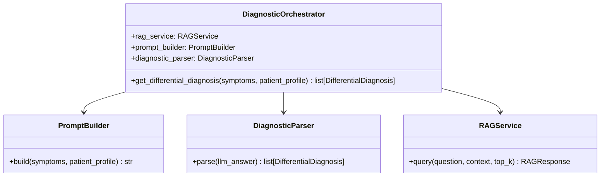
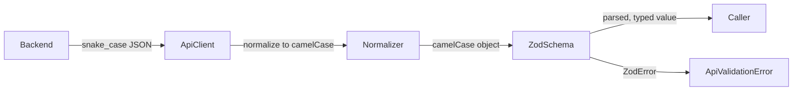

# Design Document: Code Quality Improvements

## Overview

This document covers the technical design for three targeted code quality improvements to Diagno-Pilot:

1. **DiagnosticService decomposition** — split the monolithic `DiagnosticService` into three focused collaborators: `PromptBuilder`, `DiagnosticParser`, and `DiagnosticOrchestrator`.
2. **Zod runtime validation** — replace hand-written TypeScript interfaces in `packages/types` with Zod-derived types, and wire Zod validation into `packages/api-client`.
3. **Backend docstrings** — add medical-context docstrings to `PrescriptionService`, `AlertService`, `RAGService`, `EmbeddingModel`, and the new diagnostic classes.

None of these changes alter observable API behavior. They improve testability, type safety at the network boundary, and long-term maintainability.

---

## Architecture

### DiagnosticService Decomposition

The current `DiagnosticService` violates the Single Responsibility Principle by combining prompt engineering, LLM response parsing, and orchestration. The refactoring introduces three classes with clear boundaries:



`DiagnosticService` becomes a module-level alias: `DiagnosticService = DiagnosticOrchestrator`. All existing import sites continue to work without modification.

### Zod Validation Architecture



`packages/types` becomes the single source of truth for both runtime schemas and compile-time types. `packages/api-client` imports schemas from `packages/types` and validates responses at the network boundary.

---

## Components and Interfaces

### PromptBuilder (`backend/services/prompt_builder.py`)

A pure, stateless class. No constructor arguments required.

```python
class PromptBuilder:
    def build(
        self,
        symptoms: list[Symptom],
        patient_profile: PatientProfile | None,
    ) -> str: ...
```

The prompt structure it produces:
1. Optional `## Patient profile` section (age group, weight, comorbidities, allergies) — omitted when `patient_profile` is `None`.
2. `## Symptoms` section listing each symptom with severity and duration.
3. Instruction paragraph asking the LLM to return a JSON array of ≥3 diagnoses ordered by descending probability.

### DiagnosticParser (`backend/services/diagnostic_parser.py`)

A pure, stateless class. No constructor arguments required.

```python
_ICD_CODE_RE = re.compile(r"^[A-Z][0-9]{2}(\.[0-9]{1,4})?$")

class DiagnosticParser:
    def parse(self, llm_answer: str) -> list[DifferentialDiagnosis]: ...
```

Parsing pipeline:
1. Search for a JSON array in the response using `re.search(r"\[.*?\]", ..., re.DOTALL)`.
2. Deserialize with `json.loads`.
3. For each entry: clamp `probability` to `[0.0, 1.0]`; nullify `icd_code` if it doesn't match `_ICD_CODE_RE`.
4. If ≥3 valid entries: sort by descending probability and return.
5. Otherwise (fewer than 3 entries, JSON parse error, or no JSON array found): log a warning and return 3 placeholder `DifferentialDiagnosis` objects with `probability=0.0` and `icd_code=None`.

### DiagnosticOrchestrator (`backend/services/diagnostic_service.py`)

```python
class DiagnosticOrchestrator:
    def __init__(
        self,
        rag_service: RAGService,
        prompt_builder: PromptBuilder | None = None,
        diagnostic_parser: DiagnosticParser | None = None,
    ) -> None: ...

    async def get_differential_diagnosis(
        self,
        symptoms: list[Symptom],
        patient_profile: PatientProfile | None = None,
    ) -> list[DifferentialDiagnosis]: ...

# Backward-compatibility alias
DiagnosticService = DiagnosticOrchestrator
```

The orchestrator's `get_differential_diagnosis` method:
1. Calls `self._prompt_builder.build(symptoms, patient_profile)`.
2. Calls `await self._rag.query(question=prompt, context=patient_profile, top_k=5)`.
3. Calls `self._diagnostic_parser.parse(rag_response.answer)`.
4. Returns the result (always ≥3 items, guaranteed by `DiagnosticParser`).

### Zod Schemas (`packages/types/index.ts`)

Each hand-written interface is replaced by a Zod schema. The TypeScript type is derived via `z.infer`. Both the schema and the type are exported.

Schema naming convention: `<InterfaceName>Schema` for the schema, same name as before for the type.

```typescript
import { z } from 'zod';

export const SymptomSchema = z.object({
  name: z.string(),
  severity: z.string(),
  duration_days: z.number(),
});
export type Symptom = z.infer<typeof SymptomSchema>;

// ... repeated for all 10 interfaces
```

Primitive union types (`AgeGroup`, `AlertLevel`, `UserRole`, `Locale`) become `z.enum([...])` schemas with corresponding `z.infer` types.

### ApiValidationError (`packages/api-client/index.ts`)

```typescript
export class ApiValidationError extends Error {
  constructor(
    public readonly zodError: import('zod').ZodError,
    public readonly rawData: unknown,
  ) {
    super(`API response validation failed: ${zodError.message}`);
    this.name = 'ApiValidationError';
  }
}
```

### Updated `parseResponse` (`packages/api-client/index.ts`)

```typescript
async function parseResponse<T>(
  res: Response,
  schema?: import('zod').ZodSchema<T>,
): Promise<T> {
  // ... existing HTTP error handling ...

  const data = await res.json();

  if (schema) {
    const normalized = normalizeKeys(data); // snake_case → camelCase
    const result = schema.safeParse(normalized);
    if (!result.success) {
      throw new ApiValidationError(result.error, normalized);
    }
    return result.data;
  }

  return data as T;
}
```

`normalizeKeys` is a recursive helper that converts `snake_case` object keys to `camelCase`. It handles nested objects and arrays.

---

## Data Models

### DifferentialDiagnosis (Python — unchanged)

```python
@dataclass
class DifferentialDiagnosis:
    condition: str
    probability: float   # clamped to [0.0, 1.0] by DiagnosticParser
    icd_code: str | None # nullified if invalid ICD-10 by DiagnosticParser
```

### DifferentialDiagnosis (TypeScript — Zod schema)

```typescript
export const DifferentialDiagnosisSchema = z.object({
  condition: z.string(),
  probability: z.number().min(0).max(1),
  icd_code: z.string().optional(),
  concordant_symptoms: z.array(z.string()),
});
export type DifferentialDiagnosis = z.infer<typeof DifferentialDiagnosisSchema>;
```

### PatientProfile (TypeScript — Zod schema)

```typescript
export const PatientProfileSchema = z.object({
  id: z.string().optional(),
  fullName: z.string().optional(),
  dateOfBirth: z.string().optional(),
  weightKg: z.number().optional(),
  ageGroup: AgeGroupSchema.optional(),
  allergies: z.array(z.string()),
  renalFailure: z.boolean(),
  hepaticFailure: z.boolean(),
  currentMedications: z.array(z.string()),
});
export type PatientProfile = z.infer<typeof PatientProfileSchema>;
```

All other schemas follow the same pattern, directly mirroring the existing interface shapes.

### File Layout After Refactoring

```
backend/services/
  prompt_builder.py        # new — PromptBuilder
  diagnostic_parser.py     # new — DiagnosticParser
  diagnostic_service.py    # updated — DiagnosticOrchestrator + alias

packages/types/
  index.ts                 # updated — Zod schemas + z.infer types

packages/api-client/
  index.ts                 # updated — ApiValidationError + schema-aware parseResponse
```

---

## Correctness Properties

*A property is a characteristic or behavior that should hold true across all valid executions of a system — essentially, a formal statement about what the system should do. Properties serve as the bridge between human-readable specifications and machine-verifiable correctness guarantees.*

### Property 1: PromptBuilder is a pure function

*For any* list of symptoms and any patient profile (including `None`), calling `PromptBuilder.build()` twice with the same arguments must return identical strings. This verifies the no-I/O, no-side-effect requirement.

**Validates: Requirements 1.1, 1.5**

---

### Property 2: PromptBuilder includes patient profile fields

*For any* patient profile with non-None age group, weight, comorbidities, or allergies, the string returned by `PromptBuilder.build()` must contain each of those field values as a substring.

**Validates: Requirements 1.2, 1.4**

---

### Property 3: DiagnosticParser probability clamping invariant

*For any* LLM answer string containing a JSON array where one or more entries have a `probability` value outside `[0.0, 1.0]`, every `DifferentialDiagnosis` in the list returned by `DiagnosticParser.parse()` must have `probability` in `[0.0, 1.0]`.

**Validates: Requirements 2.1, 2.4**

---

### Property 4: DiagnosticParser ICD-10 nullification invariant

*For any* LLM answer string containing a JSON array where one or more entries have an `icd_code` that does not match `^[A-Z][0-9]{2}(\.[0-9]{1,4})?$`, the corresponding `DifferentialDiagnosis` objects returned by `DiagnosticParser.parse()` must have `icd_code = None`.

**Validates: Requirements 2.5**

---

### Property 5: DiagnosticParser always returns at least 3 results

*For any* string input to `DiagnosticParser.parse()` — including empty strings, non-JSON content, and JSON arrays with fewer than 3 valid entries — the returned list must have length ≥ 3.

**Validates: Requirements 2.2, 2.3, 2.6**

---

### Property 6: DiagnosticParser round-trip

*For any* `DifferentialDiagnosis` object with `probability` in `[0.0, 1.0]` and `icd_code` either `None` or matching the ICD-10 pattern, serializing it to a JSON array string and passing that string to `DiagnosticParser.parse()` must return a list whose first element is equivalent to the original object.

**Validates: Requirements 2.7**

---

### Property 7: DiagnosticParser is a pure function

*For any* string input, calling `DiagnosticParser.parse()` twice with the same argument must return equivalent lists. This verifies the no-I/O, no-side-effect requirement.

**Validates: Requirements 2.8**

---

### Property 8: DiagnosticOrchestrator always returns at least 3 diagnoses

*For any* list of symptoms and any patient profile (including `None`), `DiagnosticOrchestrator.get_differential_diagnosis()` must return a list of at least 3 `DifferentialDiagnosis` objects with the correct structure (non-empty `condition`, `probability` in `[0.0, 1.0]`).

**Validates: Requirements 3.1, 3.6, 4.3**

---

### Property 9: Zod schemas accept all valid objects

*For any* object that conforms to a TypeScript interface defined in `packages/types`, the corresponding Zod schema's `parse()` method must succeed without throwing.

**Validates: Requirements 5.1, 5.2**

---

### Property 10: Zod schemas reject invalid objects

*For any* object that violates a TypeScript interface (missing required field, wrong type, out-of-range value), the corresponding Zod schema's `parse()` method must throw a `ZodError`.

**Validates: Requirements 5.3**

---

### Property 11: Zod schema round-trip serialization

*For any* valid object conforming to a schema in `packages/types`, `JSON.stringify(schema.parse(JSON.parse(JSON.stringify(obj))))` must equal `JSON.stringify(obj)`.

**Validates: Requirements 7.1**

---

### Property 12: ApiValidationError thrown on schema mismatch

*For any* HTTP response whose JSON body fails the provided Zod schema, `parseResponse()` must throw an `ApiValidationError` whose `zodError` property is a `ZodError` instance. *For any* HTTP response whose JSON body passes the provided Zod schema, `parseResponse()` must return the parsed value without throwing.

**Validates: Requirements 6.1, 6.2, 6.3**

---

### Property 13: snake_case normalization before validation

*For any* object with snake_case keys that is structurally equivalent to a camelCase schema, normalizing the keys and then parsing with the schema must succeed.

**Validates: Requirements 7.2**

---

## Error Handling

### DiagnosticParser

- **Malformed JSON / no JSON array**: log `WARNING`, return 3 placeholder `DifferentialDiagnosis` objects. Never raises an exception to the caller.
- **Probability out of range**: clamp silently, log `WARNING` with the original value and index.
- **Invalid ICD-10 code**: set to `None`, log `WARNING` with the original value and index.
- **Fewer than 3 valid entries**: log `WARNING`, return 3 placeholders.

The parser is designed to be fault-tolerant. It never propagates exceptions from LLM response parsing to the orchestrator.

### DiagnosticOrchestrator

- Propagates `HTTPException` from `RAGService` (e.g. LLM unavailable) unchanged.
- Does not catch exceptions from `PromptBuilder` (none expected — it's pure).
- Does not catch exceptions from `DiagnosticParser` (none expected — it's fault-tolerant).

### ApiValidationError

- Thrown by `parseResponse()` when a schema is provided and validation fails.
- Contains the `ZodError` (structured field-level errors) and the `rawData` (the normalized object that failed validation).
- Callers that do not provide a schema receive the raw parsed JSON as before — no breaking change.
- HTTP errors (non-2xx responses) continue to throw the existing `ApiError` object, unaffected by this change.

---

## Testing Strategy

### Unit Tests

Unit tests cover specific examples, edge cases, and integration points:

- `PromptBuilder.build()` with a full patient profile — verify all fields appear in output.
- `PromptBuilder.build()` with `patient_profile=None` — verify no patient section, symptoms section present.
- `DiagnosticParser.parse()` with a well-formed JSON array of 3+ entries — verify sorted order.
- `DiagnosticParser.parse()` with 0, 1, 2 entries — verify 3 placeholders returned.
- `DiagnosticParser.parse()` with non-JSON input — verify 3 placeholders returned.
- `DiagnosticOrchestrator` with mocked `RAGService`, `PromptBuilder`, `DiagnosticParser` — verify delegation.
- `DiagnosticService` import alias — verify `DiagnosticService is DiagnosticOrchestrator`.
- `ApiValidationError` — verify it is a subclass of `Error` and exposes `zodError` and `rawData`.
- `parseResponse()` without schema — verify existing behavior unchanged.

### Property-Based Tests

Property tests use **Hypothesis** (Python) and **fast-check** (TypeScript). Each test runs a minimum of 100 iterations.

#### Python (Hypothesis)

**Feature: code-quality, Property 1: PromptBuilder is a pure function**
```python
@given(symptoms=st.lists(symptom_strategy(), min_size=1),
       profile=st.one_of(st.none(), patient_profile_strategy()))
def test_prompt_builder_pure(symptoms, profile):
    pb = PromptBuilder()
    assert pb.build(symptoms, profile) == pb.build(symptoms, profile)
```

**Feature: code-quality, Property 2: PromptBuilder includes patient profile fields**
```python
@given(profile=patient_profile_strategy())
def test_prompt_includes_profile_fields(profile):
    prompt = PromptBuilder().build([], profile)
    if profile.age_group: assert profile.age_group.value in prompt
    if profile.weight_kg: assert str(profile.weight_kg) in prompt
```

**Feature: code-quality, Property 3: DiagnosticParser probability clamping invariant**
```python
@given(answer=llm_answer_with_out_of_range_probability())
def test_parser_clamps_probability(answer):
    results = DiagnosticParser().parse(answer)
    assert all(0.0 <= d.probability <= 1.0 for d in results)
```

**Feature: code-quality, Property 4: DiagnosticParser ICD-10 nullification invariant**
```python
@given(answer=llm_answer_with_invalid_icd())
def test_parser_nullifies_invalid_icd(answer):
    results = DiagnosticParser().parse(answer)
    for d in results:
        if d.icd_code is not None:
            assert _ICD_CODE_RE.match(d.icd_code)
```

**Feature: code-quality, Property 5: DiagnosticParser always returns at least 3 results**
```python
@given(answer=st.text())
def test_parser_always_returns_at_least_3(answer):
    assert len(DiagnosticParser().parse(answer)) >= 3
```

**Feature: code-quality, Property 6: DiagnosticParser round-trip**
```python
@given(diagnosis=valid_differential_diagnosis_strategy())
def test_parser_round_trip(diagnosis):
    serialized = json.dumps([{"condition": diagnosis.condition,
                               "probability": diagnosis.probability,
                               "icd_code": diagnosis.icd_code}])
    results = DiagnosticParser().parse(serialized)
    assert results[0].condition == diagnosis.condition
    assert results[0].probability == diagnosis.probability
    assert results[0].icd_code == diagnosis.icd_code
```

**Feature: code-quality, Property 7: DiagnosticParser is a pure function**
```python
@given(answer=st.text())
def test_parser_pure(answer):
    p = DiagnosticParser()
    r1, r2 = p.parse(answer), p.parse(answer)
    assert [(d.condition, d.probability, d.icd_code) for d in r1] == \
           [(d.condition, d.probability, d.icd_code) for d in r2]
```

**Feature: code-quality, Property 8: DiagnosticOrchestrator always returns at least 3 diagnoses**
```python
@given(symptoms=st.lists(symptom_strategy(), min_size=1),
       profile=st.one_of(st.none(), patient_profile_strategy()))
async def test_orchestrator_returns_at_least_3(symptoms, profile):
    rag = MockRAGService()
    orchestrator = DiagnosticOrchestrator(rag_service=rag)
    results = await orchestrator.get_differential_diagnosis(symptoms, profile)
    assert len(results) >= 3
    assert all(0.0 <= d.probability <= 1.0 for d in results)
```

#### TypeScript (fast-check)

**Feature: code-quality, Property 9: Zod schemas accept all valid objects**
```typescript
fc.assert(fc.property(validSymptomArbitrary(), (obj) => {
  expect(() => SymptomSchema.parse(obj)).not.toThrow();
}), { numRuns: 100 });
```

**Feature: code-quality, Property 10: Zod schemas reject invalid objects**
```typescript
fc.assert(fc.property(invalidSymptomArbitrary(), (obj) => {
  expect(() => SymptomSchema.parse(obj)).toThrow(ZodError);
}), { numRuns: 100 });
```

**Feature: code-quality, Property 11: Zod schema round-trip serialization**
```typescript
fc.assert(fc.property(validPatientProfileArbitrary(), (obj) => {
  const serialized = JSON.stringify(obj);
  const parsed = PatientProfileSchema.parse(JSON.parse(serialized));
  expect(JSON.stringify(parsed)).toEqual(serialized);
}), { numRuns: 100 });
```

**Feature: code-quality, Property 12: ApiValidationError thrown on schema mismatch**
```typescript
fc.assert(fc.property(invalidDiagnosisResponseArbitrary(), async (body) => {
  const res = mockResponse(body);
  await expect(parseResponse(res, DiagnosisResponseSchema))
    .rejects.toBeInstanceOf(ApiValidationError);
}), { numRuns: 100 });
```

**Feature: code-quality, Property 13: snake_case normalization before validation**
```typescript
fc.assert(fc.property(snakeCasePatientProfileArbitrary(), (snakeObj) => {
  const normalized = normalizeKeys(snakeObj);
  expect(() => PatientProfileSchema.parse(normalized)).not.toThrow();
}), { numRuns: 100 });
```

### Docstring Coverage

Docstring additions (Requirements 8–12) are pure documentation changes. They are verified by:
- **Manual review** during code review.
- **pydocstyle / interrogate** CI check configured to require docstrings on all public methods in `backend/services/`.
