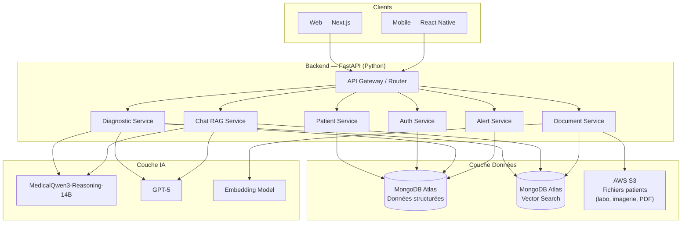
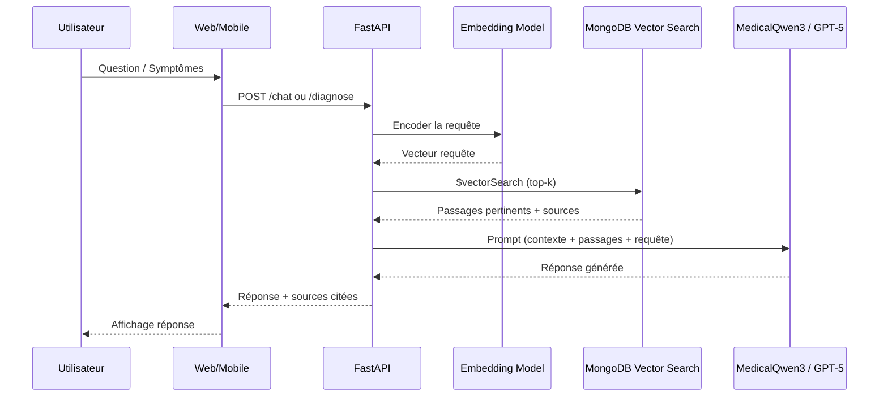

# Design Technique — Diagno-Pilot

## Vue d'ensemble

Diagno-pilot est une application web et mobile d'aide au diagnostic des maladies infectieuses et à la prescription antibiotique, destinée aux professionnels de santé (médecins, pédiatres, urgentistes, pharmaciens, internes). Elle combine un mode guidé de diagnostic différentiel et un assistant conversationnel RAG, alimenté par des documents médicaux de référence (CHU Lomé/Abomey-Calavi, OMS AFRO, MSF, PNLP). Disponible en français et en anglais.

### Contraintes technologiques

| Couche | Technologie |
|--------|-------------|
| Frontend web | Next.js (App Router, dernière version), TypeScript |
| Mobile | React Native (partage de code avec le web via monorepo) |
| Backend | Python, FastAPI |
| Base de données & vectorielle | MongoDB Atlas (données structurées + Vector Search RAG) |
| LLM | MedicalQwen3-Reasoning-14B (principal) + GPT-5 (fallback/complémentaire) |
| Stockage fichiers | AWS S3 (résultats labo, imagerie, PDF, CSV) |
| Environnement local | Docker Compose + LocalStack (émulation S3) |
| i18n | Français, Anglais |

---

## Architecture



### Flux RAG



---

## Monorepo — Partage de code Web / Mobile

```
diagno-pilot/
├── apps/
│   ├── web/          # Next.js App Router
│   └── mobile/       # React Native (Expo)
├── packages/
│   ├── ui/           # Composants partagés (React + React Native)
│   ├── api-client/   # Client HTTP partagé (fetch/axios)
│   ├── types/        # Types TypeScript partagés
│   └── i18n/         # Traductions FR/EN partagées
├── backend/          # FastAPI Python
├── docker-compose.yml
└── .env
```

---

## Environnement de développement local (Docker Compose + LocalStack)

```yaml
# docker-compose.yml
services:
  frontend:
    build: ./apps/web
    ports:
      - "3000:3000"
    environment:
      - NEXT_PUBLIC_API_URL=http://localhost:8000
    volumes:
      - ./apps/web:/app
      - /app/node_modules
    depends_on:
      - backend

  backend:
    build: ./backend
    ports:
      - "8000:8000"
    environment:
      - MONGODB_URI=mongodb://mongo:27017/diagno_pilot
      - AWS_ENDPOINT_URL=http://localstack:4566
      - AWS_ACCESS_KEY_ID=test
      - AWS_SECRET_ACCESS_KEY=test
      - AWS_DEFAULT_REGION=us-east-1
      - S3_BUCKET=diagno-pilot-files
      - LLM_PRIMARY_URL=${LLM_PRIMARY_URL}       # MedicalQwen3
      - LLM_PRIMARY_API_KEY=${LLM_PRIMARY_API_KEY}
      - LLM_FALLBACK_URL=${LLM_FALLBACK_URL}     # GPT-5
      - LLM_FALLBACK_API_KEY=${LLM_FALLBACK_API_KEY}
      - EMBED_MODEL=${EMBED_MODEL}
      - JWT_SECRET=${JWT_SECRET}
    volumes:
      - ./backend:/app
    depends_on:
      - mongo
      - localstack

  mongo:
    image: mongodb/mongodb-atlas-local:latest    # émule Atlas Vector Search en local
    ports:
      - "27017:27017"
    volumes:
      - mongo_data:/data/db

  localstack:
    image: localstack/localstack:latest          # émule AWS S3 en local
    ports:
      - "4566:4566"
    environment:
      - SERVICES=s3
      - DEFAULT_REGION=us-east-1
    volumes:
      - localstack_data:/var/lib/localstack
      - ./scripts/localstack-init.sh:/etc/localstack/init/ready.d/init.sh

volumes:
  mongo_data:
  localstack_data:
```

```bash
# scripts/localstack-init.sh — création du bucket S3 au démarrage
awslocal s3 mb s3://diagno-pilot-files
```

```dockerfile
# backend/Dockerfile
FROM python:3.12-slim
WORKDIR /app
COPY requirements.txt .
RUN pip install --no-cache-dir -r requirements.txt
COPY . .
CMD ["uvicorn", "main:app", "--host", "0.0.0.0", "--port", "8000", "--reload"]
```

```dockerfile
# apps/web/Dockerfile
FROM node:22-alpine
WORKDIR /app
COPY package*.json .
RUN npm ci
COPY . .
CMD ["npm", "run", "dev"]
```

```env
# .env
LLM_PRIMARY_URL=http://localhost:11434/v1        # ex. Ollama local pour MedicalQwen3
LLM_PRIMARY_API_KEY=your_key
LLM_FALLBACK_URL=https://api.openai.com/v1       # GPT-5
LLM_FALLBACK_API_KEY=your_openai_key
EMBED_MODEL=text-embedding-ada-002
JWT_SECRET=your_jwt_secret
MONGODB_URI=mongodb://mongo:27017/diagno_pilot
```

```bash
docker compose up --build          # démarrer tous les services
docker compose down -v             # réinitialiser les volumes
docker compose logs -f backend     # logs backend
```

---

## Composants Frontend (Next.js App Router)

| Route | Composant | Description |
|-------|-----------|-------------|
| `/` | `HomePage` | Tableau de bord principal |
| `/chat` | `ChatPage` | Interface Q&A conversationnelle |
| `/diagnose` | `DiagnosePage` | Mode guidé diagnostic |
| `/patients` | `PatientsPage` | Liste des patients |
| `/patients/[id]` | `PatientDetailPage` | Dossier patient + historique |
| `/admin` | `AdminPage` | Gestion documents / utilisateurs |
| `/login` | `LoginPage` | Authentification |

```typescript
// packages/types/index.ts
export type AgeGroup   = 'neonatal' | 'infant' | 'child' | 'adult';
export type AlertLevel = 'critical' | 'warning' | 'info';
export type UserRole   = 'medecin'  | 'pharmacien' | 'admin';
export type Locale     = 'fr' | 'en';

export interface ChatMessage {
  id: string;
  role: 'user' | 'assistant';
  content: string;
  sources?: DocumentSource[];
  timestamp: Date;
}

export interface DiagnosisStep {
  step: 'symptoms' | 'differential' | 'prescription' | 'alerts';
  data: SymptomsInput | DifferentialDiagnosis[] | Prescription | SafetyAlert[];
}
```

---

## API Backend (FastAPI)

```
POST   /api/v1/auth/login
POST   /api/v1/auth/logout
GET    /api/v1/auth/me

POST   /api/v1/chat/message
GET    /api/v1/chat/history/{session_id}

POST   /api/v1/diagnose/symptoms
POST   /api/v1/diagnose/prescription
GET    /api/v1/diagnose/session/{session_id}

GET    /api/v1/patients
POST   /api/v1/patients
GET    /api/v1/patients/{id}
PUT    /api/v1/patients/{id}
GET    /api/v1/patients/{id}/consultations
POST   /api/v1/patients/{id}/consultations

POST   /api/v1/documents/upload
GET    /api/v1/documents
DELETE /api/v1/documents/{id}

POST   /api/v1/files/upload          # fichiers patients → S3
GET    /api/v1/files/{file_id}       # URL présignée S3

GET    /api/v1/alerts/check
```

```python
class LLMRouter:
    """Route vers MedicalQwen3 en priorité, GPT-5 en fallback."""
    async def generate(self, prompt: str, context: list[dict]) -> str:
        try:
            return await self.qwen.generate(prompt, context)
        except LLMUnavailableError:
            return await self.gpt5.generate(prompt, context)

class RAGService:
    def __init__(self, mongo_client: AsyncIOMotorClient, llm_router: LLMRouter, embedder: EmbeddingModel):
        self.db = mongo_client["diagno_pilot"]
        self.chunks = self.db["document_chunks"]
        self.llm = llm_router
        self.embedder = embedder

    async def query(self, question: str, context: PatientContext | None, top_k: int = 5) -> RAGResponse:
        query_vector = await self.embedder.encode(question)
        pipeline = [{
            "$vectorSearch": {
                "index": "embedding_index",
                "path": "embedding",
                "queryVector": query_vector,
                "numCandidates": top_k * 10,
                "limit": top_k
            }
        }]
        chunks = await self.chunks.aggregate(pipeline).to_list(top_k)
        return await self.llm.generate(question, chunks, context)

class S3Service:
    """Gestion des fichiers patients sur AWS S3 (LocalStack en local)."""
    async def upload(self, file: UploadFile, patient_id: str) -> str:
        """Upload un fichier et retourne la clé S3."""
        ...
    async def get_presigned_url(self, key: str, expires_in: int = 3600) -> str:
        """Génère une URL présignée pour accès temporaire."""
        ...

class AlertService:
    async def check_prescription(
        self, prescription: Prescription, patient: PatientProfile
    ) -> list[SafetyAlert]:
        """Vérifie allergies, interactions et contre-indications."""
        ...
```

---

## Modèles de données

### Collections MongoDB

```javascript
// users
{ _id: ObjectId, email: String, password_hash: String,
  role: String,  // 'medecin'|'pharmacien'|'admin'
  full_name: String, locale: String,  // 'fr'|'en'
  created_at: Date, last_login: Date }

// patients
{ _id: ObjectId, full_name: String, date_of_birth: Date, weight_kg: Number,
  allergies: [String], comorbidities: { renal_failure: Boolean, hepatic_failure: Boolean },
  current_medications: [String], created_by: ObjectId, created_at: Date, updated_at: Date }

// consultations
{ _id: ObjectId, patient_id: ObjectId,  // null si one-shot
  user_id: ObjectId,
  symptoms: [{ name: String, severity: String, duration_days: Number }],
  diagnoses: [{ condition: String, probability: Number, icd_code: String }],
  prescription: { antibiotic: String, dose_mg: Number, dose_per_kg: Number,
                  frequency: String, duration_days: Number, route: String,
                  is_capped_to_adult_dose: Boolean },
  alerts: [{ level: String, type: String, message: String }],
  llm_used: String,  // 'qwen3'|'gpt5'
  is_one_shot: Boolean, created_at: Date }

// patient_files  — métadonnées des fichiers stockés sur S3
{ _id: ObjectId, patient_id: ObjectId, consultation_id: ObjectId,
  file_type: String,  // 'lab_result'|'imaging'|'pdf'|'csv'
  s3_key: String, original_name: String, size_bytes: Number,
  uploaded_by: ObjectId, created_at: Date }

// medical_documents
{ _id: ObjectId, title: String,
  source: String,  // 'CHU_LOME'|'OMS_AFRO'|'MSF'|'PNLP'
  s3_key: String, indexed_at: Date, chunk_count: Number, created_at: Date }

// document_chunks  — Vector Search index sur "embedding"
{ _id: ObjectId, document_id: ObjectId, content: String,
  embedding: [Number],  // 1536 dims
  metadata: { source: String, page: Number, section: String } }

// audit_logs
{ _id: ObjectId, user_id: ObjectId, action: String, resource: String,
  resource_id: ObjectId, details: Object, ip_address: String, created_at: Date }
```

### Modèles Pydantic (Backend)

```python
class AgeGroup(str, Enum):
    NEONATAL = "neonatal"   # 0–28 jours
    INFANT   = "infant"     # 1–23 mois
    CHILD    = "child"      # 2–17 ans
    ADULT    = "adult"      # 18+ ans

class AlertLevel(str, Enum):
    CRITICAL = "critical"
    WARNING  = "warning"
    INFO     = "info"

class Locale(str, Enum):
    FR = "fr"
    EN = "en"

class PatientProfile(BaseModel):
    id: str | None = None
    full_name: str | None = None
    date_of_birth: date | None = None
    weight_kg: float | None = None
    age_group: AgeGroup | None = None
    allergies: list[str] = []
    renal_failure: bool = False
    hepatic_failure: bool = False
    current_medications: list[str] = []

class Prescription(BaseModel):
    antibiotic: str
    dose_mg: float
    dose_per_kg: float | None = None
    frequency: str
    duration_days: int
    route: str                       # oral | IV | IM
    is_capped_to_adult_dose: bool = False

class SafetyAlert(BaseModel):
    level: AlertLevel
    type: str                        # 'allergy'|'interaction'|'contraindication'
    message: str
    affected_drug: str | None = None

class RAGResponse(BaseModel):
    answer: str
    sources: list[DocumentSource]
    llm_used: str                    # 'qwen3'|'gpt5'
    confidence: float | None = None
```

### Modèles TypeScript partagés (packages/types)

```typescript
export type AgeGroup   = 'neonatal' | 'infant' | 'child' | 'adult';
export type AlertLevel = 'critical' | 'warning' | 'info';
export type UserRole   = 'medecin'  | 'pharmacien' | 'admin';
export type Locale     = 'fr' | 'en';

export interface PatientProfile {
  id?: string;
  fullName?: string;
  dateOfBirth?: string;
  weightKg?: number;
  ageGroup?: AgeGroup;
  allergies: string[];
  renalFailure: boolean;
  hepaticFailure: boolean;
  currentMedications: string[];
}

export interface Consultation {
  id: string;
  patientId?: string;
  symptoms: Symptom[];
  diagnoses: DifferentialDiagnosis[];
  prescription?: Prescription;
  alerts: SafetyAlert[];
  llmUsed: string;
  createdAt: string;
  isOneShot: boolean;
}

export interface ChatSession {
  id: string;
  messages: ChatMessage[];
  patientContext?: PatientProfile;
  createdAt: string;
}
```
