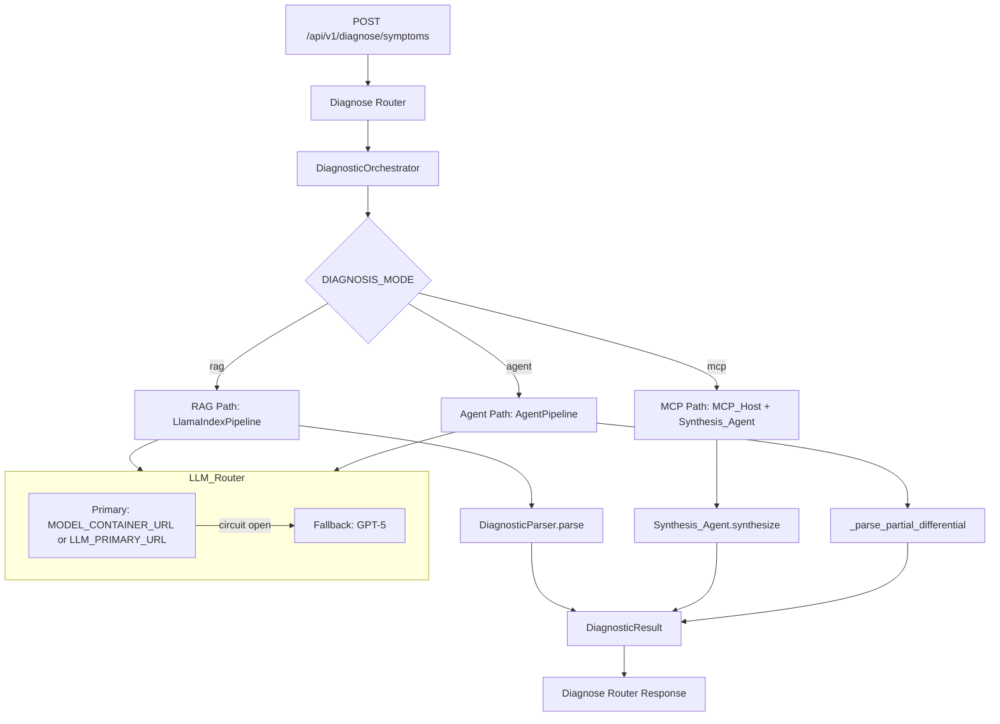
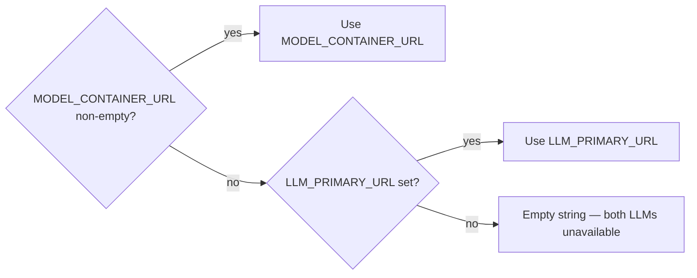

# Design Document: Diagnosis Workflow Fix

## Overview

The Diagno-Pilot diagnosis workflow has three execution paths (RAG, MCP multi-agent, AgentPipeline), but only the RAG path executes due to missing routing logic. The RAG path itself has critical bugs: confidence score is always `None` in the API response, the diagnostic parser fails on markdown-wrapped LLM output, and the LLM URL priority is inverted. Infrastructure configuration (MongoDB auth, Redis auth, exposed API keys) and the AgentPipeline's French-regex parser are also broken.

This design addresses all 11 requirements by:
1. Adding a `DIAGNOSIS_MODE` config flag to route between the three paths
2. Fixing the LLM URL priority so `LLM_PRIMARY_URL` is used when `MODEL_CONTAINER_URL` is empty
3. Fixing infrastructure auth (MongoDB, Redis) and removing exposed API keys
4. Adding markdown/think-block stripping to the diagnostic parser
5. Removing the `session_id` guard from `confidence_score` in the diagnose router
6. Adding JSON-first parsing to the AgentPipeline's partial differential parser
7. Adding empty knowledge base warnings, data migration, and documentation updates

## Architecture

The diagnosis workflow follows a layered orchestration pattern:



The key architectural change is the addition of a `DIAGNOSIS_MODE` setting that controls which path the `DiagnosticOrchestrator.get_differential_diagnosis()` method delegates to. The existing three private methods (`_get_diagnosis_via_rag`, `_get_diagnosis_via_mcp`, `_get_diagnosis_via_agent_pipeline`) are already implemented — only the routing logic is missing.

### LLM URL Priority



The current bug: `MODEL_CONTAINER_URL` defaults to `http://model:8080/v1`, which always takes precedence over `LLM_PRIMARY_URL` in the `LLMRouter.__init__` chain. Fix: change the default to `""`.

## Components and Interfaces

### 1. Settings (backend/core/config.py)

**Changes:**
- Add `DIAGNOSIS_MODE: Literal["rag", "mcp", "agent"] = "rag"` field
- Change `MODEL_CONTAINER_URL` default from `"http://model:8080/v1"` to `""`
- Add a model validator that warns when `MONGODB_URI` lacks credentials on a Docker hostname

```python
from typing import Literal

class Settings(BaseSettings):
    DIAGNOSIS_MODE: Literal["rag", "mcp", "agent"] = "rag"
    MODEL_CONTAINER_URL: str = ""  # was "http://model:8080/v1"
    # ... rest unchanged
```

Pydantic's `Literal` type handles validation automatically — unrecognized values raise `ValidationError` at startup.

### 2. DiagnosticOrchestrator (backend/services/diagnostic_service.py)

**Changes to `get_differential_diagnosis()`:**

```python
async def get_differential_diagnosis(self, symptoms, patient_profile, locale, region, user_id):
    mode = settings.DIAGNOSIS_MODE
    
    if mode == "mcp":
        if self._mcp_host is None:
            logger.warning("DIAGNOSIS_MODE=mcp but MCP_Host not configured; falling back to RAG")
            result = await self._get_diagnosis_via_rag(...)
        else:
            result = await self._get_diagnosis_via_mcp(...)
    elif mode == "agent":
        if self._agent_pipeline is None:
            logger.warning("DIAGNOSIS_MODE=agent but AgentPipeline not configured; falling back to RAG")
            result = await self._get_diagnosis_via_rag(...)
        else:
            result = await self._get_diagnosis_via_agent_pipeline(...)
    else:  # "rag" (default)
        result = await self._get_diagnosis_via_rag(...)
    
    # ... disclaimer, audit unchanged
```

### 3. DiagnosticParser (backend/services/diagnostic_parser.py)

**Changes to `parse()`:**

Add a `_clean_llm_response()` preprocessing step before JSON extraction:

```python
@staticmethod
def _clean_llm_response(raw: str) -> str:
    """Strip markdown fences, <think> blocks, and preamble/postamble."""
    # 1. Remove <think>...</think> blocks (case-insensitive)
    cleaned = re.sub(r"<think>.*?</think>", "", raw, flags=re.DOTALL | re.IGNORECASE)
    # 2. Remove markdown code fences (```json, ```JSON, ```)
    cleaned = re.sub(r"```(?:json|JSON)?\s*\n?", "", cleaned)
    # 3. Strip preamble before first [ and postamble after last ]
    first_bracket = cleaned.find("[")
    last_bracket = cleaned.rfind("]")
    if first_bracket != -1 and last_bracket != -1 and last_bracket > first_bracket:
        cleaned = cleaned[first_bracket:last_bracket + 1]
    return cleaned.strip()
```

### 4. _parse_partial_differential (backend/services/agent_pipeline.py)

**Changes:** JSON-first parsing with regex fallback.

```python
def _parse_partial_differential(answer: str) -> list[DifferentialDiagnosis]:
    # 1. Try JSON extraction first
    json_match = re.search(r"\[.*\]", answer, re.DOTALL)
    if json_match:
        try:
            raw = json.loads(json_match.group())
            results = []
            for item in raw:
                if not isinstance(item, dict):
                    continue
                prob = max(0.0, min(1.0, float(item.get("probability", 0.5))))
                results.append(DifferentialDiagnosis(
                    condition=item.get("condition", "Unknown"),
                    probability=prob,
                    icd_code=item.get("icd_code"),
                    matching_symptoms=item.get("matching_symptoms", []),
                ))
            if results:
                return results
        except (json.JSONDecodeError, ValueError, TypeError):
            pass
    
    # 2. Fallback to French-keyword regex
    results = []
    for match in _CONDITION_RE.finditer(answer):
        condition = match.group(1).strip().rstrip(".")
        icd_match = _ICD_RE.search(answer[match.start():match.start() + 120])
        results.append(DifferentialDiagnosis(
            condition=condition, probability=0.5,
            icd_code=icd_match.group(1) if icd_match else None,
            matching_symptoms=[],
        ))
    return results
```

### 5. Diagnose Router (backend/routers/diagnose.py)

**Changes:** Remove the `session_id` guard from `confidence_score`.

```python
# BEFORE (bug):
"confidence_score": result.confidence_score if result.session_id else None,

# AFTER (fix):
"confidence_score": result.confidence_score,
```

This applies to both the MongoDB document construction and the `DiagnoseResponse` return.

### 6. LlamaIndexPipeline (backend/services/llamaindex_pipeline.py)

**Changes:** Add distinct `degraded_warning` messages for empty collection vs. no matching chunks.

In the `query()` method, before the existing `if not chunks:` block:
- Check if the collection is empty (via `estimated_document_count()`, which is O(1)) → set specific warning
- If collection has documents but retrieval returned nothing → set different warning

**Note:** `RAGResponse` in `backend/models/document.py` must be updated to include an optional `degraded_warning: str | None = None` field if it doesn't already have one.

### 7. Startup Migration (backend/main.py)

**Changes:** Add idempotent backfill in the `lifespan` function:

```python
# Backfill confidence_score on existing consultations
backfill_cs = await _db["consultations"].update_many(
    {"confidence_score": {"$exists": False}},
    {"$set": {"confidence_score": None}},
)
# Backfill diagnosis_mode on existing consultations
backfill_dm = await _db["consultations"].update_many(
    {"diagnosis_mode": {"$exists": False}},
    {"$set": {"diagnosis_mode": "rag"}},
)
```

### 8. Configuration Files

**.env changes:**
- `MONGODB_URI` → include auth credentials
- `REDIS_URL` → include password
- `LLM_FALLBACK_API_KEY` → replace with placeholder
- Remove real API keys

**.env.example changes:**
- Add `DIAGNOSIS_MODE` documentation
- Update `MODEL_CONTAINER_URL` documentation with priority explanation
- Ensure all fields have descriptive comments

**.gitignore:** Already includes `.env` — no change needed.

## Data Models

### Settings (modified)

| Field | Type | Default | Change |
|---|---|---|---|
| `DIAGNOSIS_MODE` | `Literal["rag", "mcp", "agent"]` | `"rag"` | **New** |
| `MODEL_CONTAINER_URL` | `str` | `""` | **Changed** from `"http://model:8080/v1"` |

### RAGResponse (modified — backend/models/document.py)

| Field | Type | Default | Change |
|---|---|---|---|
| `degraded_warning` | `str \| None` | `None` | **New** — set when no document context is available |

### DiagnosticResult (modified)

| Field | Type | Change |
|---|---|---|
| `confidence_score` | `float` | No schema change — fix is in the router that was nullifying it |
| `diagnosis_mode` | `str` | **New** — records which path produced the result |

### DiagnoseResponse (modified)

| Field | Type | Change |
|---|---|---|
| `confidence_score` | `float \| None` | No schema change — fix removes the `session_id` guard |
| `diagnosis_mode` | `str \| None` | **New** — additive field |

### MongoDB consultation document (modified)

| Field | Type | Change |
|---|---|---|
| `confidence_score` | `float \| None` | No schema change — fix ensures it's always written |
| `diagnosis_mode` | `str` | **New** — backfilled to `"rag"` for existing docs |


## Correctness Properties

*A property is a characteristic or behavior that should hold true across all valid executions of a system — essentially, a formal statement about what the system should do. Properties serve as the bridge between human-readable specifications and machine-verifiable correctness guarantees.*

### Property 1: DIAGNOSIS_MODE validation accepts exactly the valid set

*For any* string value, `Settings(DIAGNOSIS_MODE=value)` succeeds if and only if the value is in `{"rag", "mcp", "agent"}`. For any string not in that set, construction raises a Pydantic `ValidationError`.

**Validates: Requirements 1.1, 1.2**

### Property 2: Diagnosis mode routing selects the correct path

*For any* `DIAGNOSIS_MODE` value in `{"rag", "mcp", "agent"}`, any valid symptom list, and any dependency configuration (MCP_Host present/absent, AgentPipeline present/absent), the `DiagnosticOrchestrator` delegates to the correct internal method: `_get_diagnosis_via_rag` for `"rag"`, `_get_diagnosis_via_mcp` for `"mcp"` (when MCP_Host is configured), `_get_diagnosis_via_agent_pipeline` for `"agent"` (when AgentPipeline is configured), and falls back to `_get_diagnosis_via_rag` when the requested dependency is `None`.

**Validates: Requirements 1.3, 1.4, 1.5, 1.6, 1.7**

### Property 3: LLM URL priority selection

*For any* pair of `(MODEL_CONTAINER_URL, LLM_PRIMARY_URL)` strings, the `LLMRouter` selects `MODEL_CONTAINER_URL` as the primary endpoint when it is non-empty, and `LLM_PRIMARY_URL` when `MODEL_CONTAINER_URL` is empty.

**Validates: Requirements 2.1, 2.2**

### Property 4: Diagnostic parser markdown stripping round-trip

*For any* valid JSON array of 3+ diagnosis objects (each with `condition`, `probability` in [0.0, 1.0], optional `icd_code`, optional `matching_symptoms`), wrapping the JSON in any combination of markdown code fences (`` ```json ``, `` ``` ``), `<think>...</think>` blocks, and arbitrary preamble/postamble text, the `DiagnosticParser.parse()` method SHALL produce the same list of `DifferentialDiagnosis` objects as parsing the bare JSON array.

**Validates: Requirements 5.1, 5.2, 5.3, 5.5**

### Property 5: Confidence score is never nullified by session_id

*For any* `DiagnosticResult` with a `confidence_score` value (including 0.0) and any `session_id` value (including `None`), the diagnose router SHALL include the original `confidence_score` in both the API response and the MongoDB consultation document, without conditional nullification.

**Validates: Requirements 8.1, 8.2, 8.3, 8.4**

### Property 6: AgentPipeline JSON-first parsing with correct extraction

*For any* valid JSON array of diagnosis objects (each with `condition`, `probability`, `icd_code`, `matching_symptoms`), the `_parse_partial_differential` function SHALL extract `DifferentialDiagnosis` objects with matching field values (probability clamped to [0.0, 1.0]), and the JSON path SHALL take priority over regex extraction.

**Validates: Requirements 9.1, 9.3, 9.5**

### Property 7: AgentPipeline regex fallback for French-keyword text

*For any* string containing one or more French diagnostic keyword patterns (e.g., "diagnostic : <condition>") but no valid JSON array, the `_parse_partial_differential` function SHALL extract at least one `DifferentialDiagnosis` with the condition name from the keyword match.

**Validates: Requirements 9.2**

### Property 8: Degraded warning propagation

*For any* `RAGResponse` with a non-None `degraded_warning` string, the `DiagnosticOrchestrator` SHALL propagate that exact string to the `DiagnosticResult.degraded_warning` field.

**Validates: Requirements 6.3**

### Property 9: MongoDB URI credential detection

*For any* MongoDB URI string where the hostname is a single-label Docker service name (no dots, not `localhost` or `127.0.0.1`) and the URI contains no `@` character (indicating no credentials), the Settings validator SHALL emit a warning about potentially missing authentication.

**Validates: Requirements 3.3**

## Error Handling

### LLM Failures
- **Primary LLM unavailable:** Circuit breaker opens after 5 consecutive failures; requests route to GPT-5 fallback. `fallback_used=True` is set on the result, and a disclaimer is added.
- **Both LLMs unavailable:** HTTP 503 with `LLM_UNAVAILABLE` error code and `retryable=True`.
- **LLM returns unparseable response:** `DiagnosticParser` returns 3 placeholder diagnoses with `parse_failed=True`. The AgentPipeline parser returns an empty list, which the aggregation handles gracefully.

### Infrastructure Failures
- **MongoDB connection failure:** Application logs a critical error and exits (existing behavior). Authentication failures produce a clear error message.
- **Redis connection failure:** Application continues in degraded mode with caching disabled (existing behavior). Auth failures are logged as warnings.
- **MCP agent timeout:** Individual agents that time out contribute zero grounded chunks. The synthesis agent proceeds with available results.

### Configuration Errors
- **Invalid DIAGNOSIS_MODE:** Pydantic `ValidationError` at startup with a message listing valid options.
- **Missing MCP_Host/AgentPipeline for selected mode:** Graceful fallback to RAG path with a logged warning.
- **MODEL_CONTAINER_URL unreachable:** The existing `_probe_llm_primary()` in `main.py` already probes the LLM endpoint via the `/health` route. When `MODEL_CONTAINER_URL` is empty and `LLM_PRIMARY_URL` is used instead, the health check naturally probes the correct URL. No new health-check code is needed (Req 2 AC3).

### Migration Failures
- **Backfill migration fails:** Error is logged and startup continues. The migration is idempotent and can be retried on next startup.

## Testing Strategy

### Property-Based Tests (Hypothesis)

The following properties will be tested using the Hypothesis library with a minimum of 100 iterations per property:

| Property | Target | Strategy |
|---|---|---|
| Property 1: DIAGNOSIS_MODE validation | `Settings` | Generate random strings; verify acceptance iff in valid set |
| Property 2: Routing correctness | `DiagnosticOrchestrator` | Generate (mode, has_mcp, has_agent) tuples; mock paths; verify correct delegation |
| Property 3: LLM URL priority | `LLMRouter.__init__` | Generate (container_url, primary_url) pairs; verify selected URL |
| Property 4: Parser markdown stripping | `DiagnosticParser.parse` | Generate valid diagnosis JSON; wrap in random markdown/think/preamble (including `<think>` blocks with random reasoning text inside); verify round-trip |
| Property 5: Confidence score propagation | `diagnose_symptoms` | Generate (confidence_score, session_id) pairs; verify no nullification |
| Property 6: AgentPipeline JSON parsing | `_parse_partial_differential` | Generate valid JSON diagnosis arrays; verify correct extraction and round-trip |
| Property 7: AgentPipeline regex fallback | `_parse_partial_differential` | Generate French-keyword strings without JSON; verify extraction |
| Property 8: Degraded warning propagation | `DiagnosticOrchestrator` | Generate RAGResponse with random degraded_warning; verify propagation |
| Property 9: MongoDB URI credential detection | `Settings` validator | Generate URIs with/without credentials and various hostnames; verify warning behavior |

Each test will be tagged with: `Feature: diagnosis-workflow-fix, Property {N}: {title}`

### Unit Tests (Example-Based)

| Requirement | Test |
|---|---|
| Req 2.1 | Verify `Settings().MODEL_CONTAINER_URL == ""` |
| Req 5.4 | Verify parser returns placeholders with `parse_failed=True` for arrays with < 3 items |
| Req 6.1 | Verify `degraded_warning` set when collection is empty |
| Req 6.2 | Verify `degraded_warning` set when retrieval returns no chunks |
| Req 9.4 | Verify empty list returned for text with no JSON or French keywords |
| Req 10.1–10.4 | Verify migration idempotency and error handling |

### Integration Tests

| Requirement | Test |
|---|---|
| Req 1 | End-to-end `/api/v1/diagnose/symptoms` with each DIAGNOSIS_MODE value |
| Req 6 | End-to-end with empty document_chunks collection |

### Smoke Tests

| Requirement | Test |
|---|---|
| Req 4.3 | Verify `.gitignore` contains `.env` |
| Req 11 | Verify documentation files contain expected sections |

### Test Configuration

- **Library:** Hypothesis (Python property-based testing)
- **Minimum iterations:** 100 per property test (via `@settings(max_examples=100)`)
- **Tag format:** `Feature: diagnosis-workflow-fix, Property {N}: {title}`
- **Test location:** `tests/test_diagnosis_workflow_fix_properties.py` for PBT, alongside existing test files for unit/integration tests
