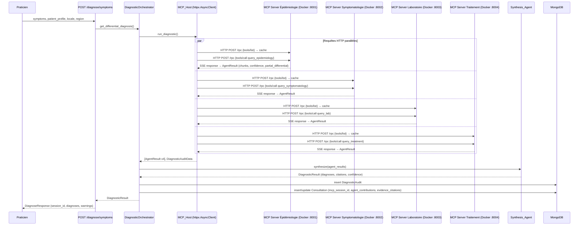
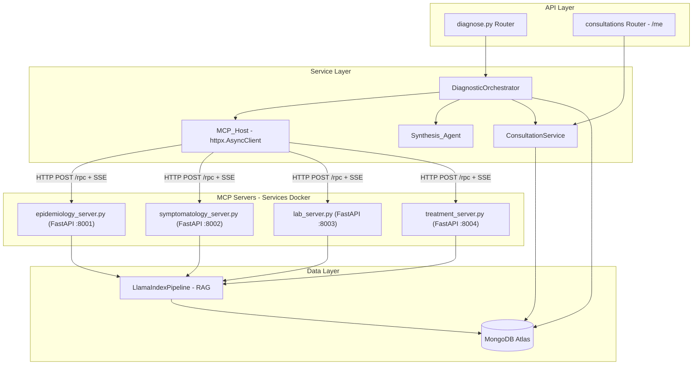
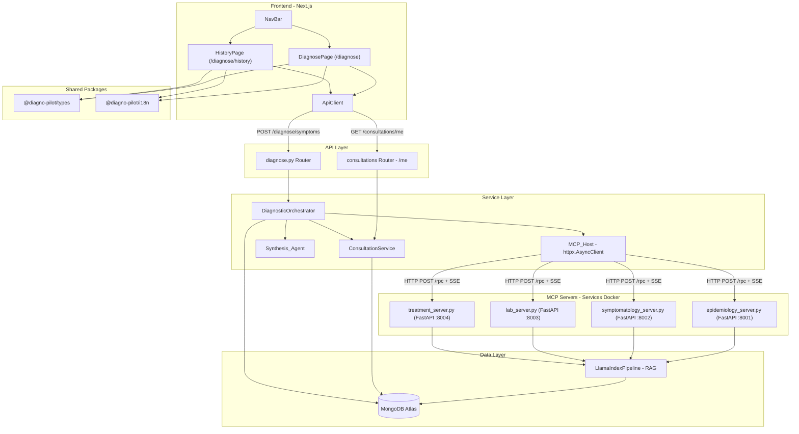

# Document de Conception — Diagnostic Guidé Multi-Agent

## Vue d'ensemble

Ce document décrit la conception technique du mode « Diagnostic Guidé Multi-Agent » de Diagno-Pilot. L'objectif est de refactorer le pipeline de diagnostic existant pour adopter pleinement le protocole MCP (Model Context Protocol) standard, où chaque agent spécialiste devient un serveur MCP HTTP (FastAPI/Starlette) exposant trois primitives (Tools, Resources, Prompts) et le MCP_Host agit comme client/hôte MCP communiquant via JSON-RPC 2.0 sur transport HTTP+SSE (requêtes via HTTP POST vers `/rpc`, réponses via Server-Sent Events).

Le périmètre couvre :
- Refactoring du `MCP_Host` pour utiliser JSON-RPC 2.0 via HTTP POST + SSE avec découverte et cache des primitives
- Création de 4 serveurs MCP spécialistes comme services Docker HTTP (Épidémiologie, Symptomatologie, Laboratoire, Traitement)
- Enrichissement du `Synthesis_Agent` avec citations de preuves et score de confiance pondéré
- Extension du modèle `Consultation` avec `mcp_session_id`, `agent_contributions`, `evidence_citations`
- Nouveau endpoint `GET /api/v1/consultations/me`
- Script de migration idempotent avec rollback
- Configuration Docker Compose pour les services agents HTTP

### Décisions architecturales clés

| Décision | Choix | Justification |
|---|---|---|
| Transport MCP | HTTP POST + SSE (JSON-RPC 2.0) | Conformité MCP standard, isolation par service Docker, communication réseau standard |
| Cache des primitives | Dict en mémoire par serveur | Évite les requêtes de découverte répétées, invalidé quand un serveur HTTP est injoignable |
| Pool de connexions HTTP | httpx.AsyncClient avec pool intégré | Réduit la latence de connexion entre les sessions ; le pool est toujours actif |
| Score de confiance global | Moyenne pondérée par nombre de chunks | Donne plus de poids aux agents avec plus de preuves documentaires |
| Migration | Script idempotent standalone | Cohérent avec le pattern existant dans `backend/scripts/` |
| Bibliothèque PBT | Hypothesis (existante) | Déjà utilisée dans le projet, min 100 itérations par propriété |
| Déploiement agents | Services Docker (FastAPI) | Isolation par conteneur, health checks natifs, scaling indépendant |

## Architecture

### Diagramme de flux principal



### Diagramme de composants



## Composants et Interfaces

### 1. Serveurs MCP Spécialistes (`backend/agents/mcp_servers/`)

Chaque serveur MCP est une application FastAPI/Starlette autonome déployée comme service Docker. Il expose trois primitives MCP standard via un endpoint HTTP `/rpc` acceptant des requêtes JSON-RPC 2.0 par POST et retournant les réponses via Server-Sent Events (SSE). Chaque serveur expose également un endpoint `GET /health` pour les vérifications de disponibilité.

#### Structure commune — Classe de base `BaseMCPServer`

Fichier : `backend/agents/mcp_servers/base_server.py`

```python
class BaseMCPServer:
    """Classe de base pour les serveurs MCP spécialistes.
    
    Gère le protocole JSON-RPC 2.0 sur HTTP+SSE :
    - Réception de requêtes JSON-RPC 2.0 via HTTP POST sur /rpc
    - Dispatch vers tools/list, resources/list, prompts/list, tools/call, resources/read, prompts/get
    - Retour de réponses JSON-RPC 2.0 via SSE (text/event-stream)
    """
    
    def __init__(self, server_name: str, port: int):
        self.server_name = server_name
        self.port = port
        self._tools: list[MCPToolDefinition] = []
        self._resources: list[MCPResourceDefinition] = []
        self._prompts: list[MCPPromptDefinition] = []
        self._app = FastAPI(title=f"MCP Server - {server_name}")
        self._setup_routes()
    
    def _setup_routes(self) -> None:
        """Configure les routes FastAPI : POST /rpc et GET /health."""
        @self._app.post("/rpc")
        async def handle_rpc(request: Request) -> EventSourceResponse:
            body = await request.json()
            response = await self.handle_request(body)
            return EventSourceResponse(self._sse_generator(response))
        
        @self._app.get("/health")
        async def health() -> dict:
            return {"status": "ok", "server": self.server_name}
    
    def register_tool(self, name: str, description: str, input_schema: dict, handler: Callable) -> None: ...
    def register_resource(self, uri: str, name: str, description: str, mime_type: str) -> None: ...
    def register_prompt(self, name: str, description: str, arguments: list[dict]) -> None: ...
    
    async def handle_request(self, request: dict) -> dict:
        """Dispatch une requête JSON-RPC 2.0 vers le handler approprié."""
        ...
    
    async def _sse_generator(self, response: dict):
        """Génère un événement SSE contenant la réponse JSON-RPC 2.0."""
        yield {"data": json.dumps(response)}
    
    def run(self) -> None:
        """Démarre le serveur FastAPI via uvicorn sur le port configuré."""
        import uvicorn
        uvicorn.run(self._app, host="0.0.0.0", port=self.port)
```

#### Primitives exposées par chaque serveur

| Serveur | Tool | Resource URI | Prompt |
|---|---|---|---|
| Épidémiologie | `query_epidemiology` | `epidemiology://documents` | `epidemiology_query` |
| Symptomatologie | `query_symptomatology` | `guidelines://documents` | `symptomatology_query` |
| Laboratoire | `query_lab` | `laboratory://documents` | `lab_query` |
| Traitement | `query_treatment` | `protocols://documents` | `treatment_query` |

#### Schéma JSON d'entrée commun pour les Tools

```json
{
  "type": "object",
  "properties": {
    "symptoms": {
      "type": "array",
      "items": {
        "type": "object",
        "properties": {
          "name": {"type": "string"},
          "severity": {"type": "string", "nullable": true},
          "duration_days": {"type": "integer", "nullable": true}
        },
        "required": ["name"]
      }
    },
    "patient_profile": {"type": "object", "nullable": true},
    "locale": {"type": "string"},
    "region": {"type": "string", "nullable": true}
  },
  "required": ["symptoms", "locale"]
}
```

#### Schéma de sortie AgentResult (retourné dans `result` du JSON-RPC 2.0)

```json
{
  "agent_name": "string",
  "sub_question": "string",
  "chunks": [
    {
      "document_id": "string",
      "title": "string",
      "source": "string",
      "excerpt": "string",
      "page": "integer|null"
    }
  ],
  "confidence_score": "float [0.0, 1.0]",
  "partial_differential": [
    {
      "condition": "string",
      "probability": "float [0.0, 1.0]",
      "icd_code": "string|null",
      "matching_symptoms": ["string"]
    }
  ],
  "fallback_used": "boolean"
}
```

#### Fichiers à créer

- `backend/agents/mcp_servers/__init__.py`
- `backend/agents/mcp_servers/base_server.py` — Classe de base `BaseMCPServer` (FastAPI + SSE)
- `backend/agents/mcp_servers/epidemiology_server.py` — `EpidemiologyMCPServer`
- `backend/agents/mcp_servers/symptomatology_server.py` — `SymptomatologyMCPServer`
- `backend/agents/mcp_servers/lab_server.py` — `LabMCPServer`
- `backend/agents/mcp_servers/treatment_server.py` — `TreatmentMCPServer`
- `backend/agents/mcp_servers/Dockerfile` — Dockerfile commun pour les serveurs agents

Chaque serveur hérite de `BaseMCPServer`, enregistre ses primitives dans `__init__`, et implémente le handler du tool principal. Le handler utilise `LlamaIndexPipeline` (importé en interne) pour la recherche vectorielle avec le `source_filter` approprié.

Chaque service Docker agent établit sa propre connexion MongoDB via `Motor` au démarrage (en lisant `MONGODB_URI` depuis les variables d'environnement), instancie son propre `EmbeddingModel`, `IndexManager` et `LlamaIndexPipeline`. Cette isolation garantit qu'aucune ressource du processus backend n'est partagée. Le seuil de similarité vectorielle (`LLAMAINDEX_SIMILARITY_THRESHOLD`, par défaut 0.75) est utilisé pour filtrer les chunks non pertinents. La communication entre le backend et les agents se fait via le réseau Docker interne.

#### Ports des services agents

| Service | Port interne | Hostname Docker |
|---|---|---|
| Agent Épidémiologie | 8001 | `agent-epidemiology` |
| Agent Symptomatologie | 8002 | `agent-symptomatology` |
| Agent Laboratoire | 8003 | `agent-lab` |
| Agent Traitement | 8004 | `agent-treatment` |

### 2. MCP_Host refactoré (`backend/services/mcp_host.py`)

Le `MCP_Host` existant est refactoré pour utiliser le protocole JSON-RPC 2.0 standard via HTTP POST + SSE.

#### Code obsolète à supprimer de `backend/services/mcp_host.py`

Les éléments suivants du fichier existant deviennent obsolètes et doivent être supprimés :
- Constante `_AGENT_SCRIPTS` (mapping nom → chemin de script subprocess)
- Fonction `_build_sub_question()` (remplacée par les MCP_Prompts exposés par chaque serveur)
- Constante `SOURCE_FILTERS` (les filtres de source sont désormais internes à chaque serveur MCP)
- Méthode `_call_agent()` (remplacée par `_send_rpc()` via HTTP)
- Toute logique `asyncio.create_subprocess_exec` et `proc.communicate()`

#### Interface publique

```python
class MCP_Host:
    """Client/hôte MCP — orchestre les serveurs MCP spécialistes via JSON-RPC 2.0 sur HTTP+SSE."""
    
    def __init__(self):
        self._capability_cache: dict[str, MCPCapabilities] = {}
        self._client: httpx.AsyncClient = httpx.AsyncClient(timeout=AGENT_TIMEOUT)
    
    async def run_diagnostic(
        self,
        symptoms: list[Symptom],
        patient_profile: PatientProfile | None,
        locale: str,
        region: str | None,
    ) -> tuple[list[AgentResult], DiagnosticAuditData]:
        """Lance les requêtes vers les 4 serveurs MCP en parallèle via HTTP et collecte les résultats."""
        ...
    
    async def shutdown(self) -> None:
        """Ferme le client HTTP et toutes les connexions actives."""
        await self._client.aclose()
```

#### Protocole de communication JSON-RPC 2.0 sur HTTP+SSE

Chaque échange suit ce format :

**Requête (MCP_Host → Serveur via HTTP POST /rpc) :**
```http
POST /rpc HTTP/1.1
Host: agent-epidemiology:8001
Content-Type: application/json

{"jsonrpc": "2.0", "method": "tools/list", "params": {}, "id": 1}
```

**Réponse (Serveur → MCP_Host via SSE) :**
```http
HTTP/1.1 200 OK
Content-Type: text/event-stream

data: {"jsonrpc": "2.0", "result": {"tools": [...]}, "id": 1}
```

**Erreur JSON-RPC 2.0 (via SSE) :**
```http
data: {"jsonrpc": "2.0", "error": {"code": -32601, "message": "Method not found"}, "id": 1}
```

**Erreur HTTP (serveur injoignable) :**
```http
HTTP/1.1 503 Service Unavailable
```

#### Séquence d'appel par agent

1. **Health check** : `GET http://agent-{name}:{port}/health` — vérifier que le serveur est prêt
2. **Découverte** (si pas en cache) :
   - `POST /rpc` avec `tools/list` → mettre en cache les tools
   - `POST /rpc` avec `resources/list` → mettre en cache les resources
   - `POST /rpc` avec `prompts/list` → mettre en cache les prompts
3. **Invocation** :
   - `POST /rpc` avec `prompts/get` pour obtenir le template de requête
   - `POST /rpc` avec `resources/read` pour obtenir le contexte documentaire
   - `POST /rpc` avec `tools/call` avec les arguments structurés
4. **Réception** : Parser la réponse SSE, extraire le JSON-RPC 2.0, parser l'`AgentResult`

Le timeout de 30 secondes s'applique à l'ensemble de la séquence (étapes 1-4) par agent, et non à chaque requête individuellement. Si la découverte prend 2s, il reste 28s pour les étapes 3-4.

#### Dataclasses de support

```python
@dataclass
class MCPCapabilities:
    """Primitives découvertes et mises en cache pour un serveur MCP."""
    tools: list[dict]
    resources: list[dict]
    prompts: list[dict]

@dataclass  
class MCPRequest:
    """Requête JSON-RPC 2.0 sortante via HTTP POST."""
    method: str
    params: dict
    id: int
    
    def to_json(self) -> str:
        return json.dumps({
            "jsonrpc": "2.0",
            "method": self.method,
            "params": self.params,
            "id": self.id,
        })
```

#### Configuration des URLs des agents

Les URLs des agents sont lues depuis la configuration (`backend/core/config.py`) via des variables d'environnement, permettant de les surcharger par environnement (Docker, local, test) :

```python
# Dans backend/core/config.py — Settings
AGENT_EPIDEMIOLOGY_URL: str = "http://agent-epidemiology:8001"
AGENT_SYMPTOMATOLOGY_URL: str = "http://agent-symptomatology:8002"
AGENT_LAB_URL: str = "http://agent-lab:8003"
AGENT_TREATMENT_URL: str = "http://agent-treatment:8004"
```

```python
# Dans backend/services/mcp_host.py
from backend.core.config import settings

_AGENT_URLS: dict[str, str] = {
    "epidemiology": settings.AGENT_EPIDEMIOLOGY_URL,
    "symptomatology": settings.AGENT_SYMPTOMATOLOGY_URL,
    "lab": settings.AGENT_LAB_URL,
    "treatment": settings.AGENT_TREATMENT_URL,
}
```

#### Gestion des connexions HTTP (Exigence 14)

```python
async def _check_agent_health(self, agent_name: str) -> bool:
    """Vérifie la disponibilité d'un serveur agent via GET /health."""
    url = f"{_AGENT_URLS[agent_name]}/health"
    try:
        resp = await self._client.get(url, timeout=5.0)
        return resp.status_code == 200
    except (httpx.ConnectError, httpx.TimeoutException):
        return False

async def _send_rpc(self, agent_name: str, method: str, params: dict, request_id: int) -> dict:
    """Envoie une requête JSON-RPC 2.0 via HTTP POST et parse la réponse SSE."""
    url = f"{_AGENT_URLS[agent_name]}/rpc"
    payload = MCPRequest(method=method, params=params, id=request_id).to_json()
    resp = await self._client.post(url, content=payload, headers={"Content-Type": "application/json"})
    resp.raise_for_status()
    # Parse SSE response — extract JSON from 'data:' lines
    return self._parse_sse_response(resp.text)

async def shutdown(self) -> None:
    """Ferme le client HTTP et toutes les connexions actives."""
    await self._client.aclose()
```

#### Pool de connexions HTTP (Exigence 14.3)

Le pool de connexions HTTP est géré nativement par `httpx.AsyncClient`. Le client est instancié une seule fois dans `__init__` et réutilisé pour toutes les sessions diagnostiques. Les connexions TCP sont maintenues ouvertes (keep-alive) entre les requêtes, éliminant le coût de handshake TCP/TLS à chaque session. Le client est fermé lors du `shutdown()` de l'application.

### 3. Synthesis_Agent enrichi (`backend/agents/synthesis_agent.py`)

Le `Synthesis_Agent` existant est enrichi avec :
- Citations de preuves (`EvidenceCitation`)
- Score de confiance pondéré par nombre de chunks

#### Nouvelles structures de données

```python
@dataclass
class EvidenceCitation:
    """Citation de preuve associée à un diagnostic."""
    document_id: str
    title: str
    source: str
    excerpt: str
    page: int | None = None

@dataclass
class AgentContribution:
    """Contribution d'un agent spécialiste à la session diagnostique."""
    agent_name: str
    confidence_score: float
    partial_differential: list[dict]
```

#### Modifications de `synthesize()`

```python
def synthesize(
    self,
    agent_results: list[AgentResult],
    locale: str = "fr-TG",
) -> DiagnosticResult:
    # ... (logique existante de filtrage, fusion, déduplication, tri, padding) ...
    
    # NOUVEAU : Construire les citations de preuves (Exigence 5.7)
    evidence_citations = self._build_evidence_citations(active_results, merged_diagnoses)
    
    # NOUVEAU : Score de confiance pondéré (Exigence 5.8)
    global_confidence = self._compute_weighted_confidence(active_results)
    
    # NOUVEAU : Contributions des agents (Exigence 11.6)
    agent_contributions = self._build_agent_contributions(agent_results)
    
    return DiagnosticResult(
        diagnoses=diagnoses,
        fallback_used=fallback_used,
        degraded_warning=degraded_warning,
        locale=locale,
        confidence_score=global_confidence,
        evidence_citations=evidence_citations,
        agent_contributions=agent_contributions,
    )
```

#### Calcul du score de confiance pondéré (Exigence 5.8)

```python
def _compute_weighted_confidence(self, active_results: list[AgentResult]) -> float:
    """Moyenne pondérée : sum(score_i * len(chunks_i)) / sum(len(chunks_i))"""
    total_weight = sum(len(r.chunks) for r in active_results)
    if total_weight == 0:
        return 0.0
    weighted_sum = sum(r.confidence_score * len(r.chunks) for r in active_results)
    return weighted_sum / total_weight
```

#### Construction des citations de preuves (Exigence 5.7)

Pour chaque diagnostic dans le résultat fusionné, on associe les chunks des agents actifs qui ont contribué ce diagnostic. Chaque chunk devient une `EvidenceCitation`.

### 4. DiagnosticOrchestrator enrichi (`backend/services/diagnostic_service.py`)

#### Modifications

- **MCP_Session_ID** : Générer un UUID unique par session MCP, persisté dans MongoDB et retourné dans la réponse.
- **Auto-création de Consultation** : Après chaque session MCP réussie, créer automatiquement un document `Consultation` avec les nouveaux champs.
- **Journalisation de la durée** : Logger `duration_ms` pour chaque session.

```python
async def _get_diagnosis_via_mcp(self, symptoms, patient_profile, locale, region, user_id) -> DiagnosticResult:
    mcp_session_id = str(uuid.uuid4())
    start = time.perf_counter()
    
    agent_results, audit_data = await self._mcp_host.run_diagnostic(...)
    result = self._synthesis_agent.synthesize(agent_results, locale=locale)
    
    duration_ms = round((time.perf_counter() - start) * 1000, 1)
    logger.info("MCP session %s completed in %.1f ms", mcp_session_id, duration_ms)
    
    # Auto-création de la Consultation (Exigence 11, best-effort)
    await self._create_mcp_consultation(
        mcp_session_id=mcp_session_id,
        user_id=user_id,
        patient_id=patient_id,
        symptoms=symptoms,
        result=result,
    )
    
    result.session_id = mcp_session_id
    return result
```

**Propagation du `user_id`** : La signature de `get_differential_diagnosis()` est étendue avec un paramètre optionnel `user_id: str | None = None`. Le router `diagnose.py` passe `user_id=str(current_user["_id"])` lors de l'appel. Quand `user_id` est `None` (appels internes ou tests), la création de Consultation est ignorée. Cette approche préserve la rétrocompatibilité avec les appels existants qui n'ont pas de contexte utilisateur.

### 5. Modèle Consultation étendu (`backend/models/consultation.py`)

#### Nouveaux champs

```python
class Consultation(BaseModel):
    # ... champs existants ...
    mcp_session_id: str | None = None
    agent_contributions: list[AgentContribution] = []
    evidence_citations: list[EvidenceCitation] = []
```

Les champs `agent_contributions` et `evidence_citations` utilisent les modèles Pydantic typés pour bénéficier de la validation automatique. La sérialisation vers MongoDB utilise `.model_dump()` et la désérialisation dans `_doc_to_consultation()` reconstruit les objets typés.

Les nouveaux champs ont des valeurs par défaut (`None` / `[]`) pour la compatibilité ascendante avec les documents existants.

### 6. ConsultationService — `list_my_consultations()` (`backend/services/consultation_service.py`)

#### Nouvelle méthode

La fonction `_doc_to_consultation()` existante doit être mise à jour pour lire les nouveaux champs MCP :

```python
def _doc_to_consultation(doc: dict) -> Consultation:
    return Consultation(
        id=str(doc["_id"]),
        patient_id=str(doc["patient_id"]) if doc.get("patient_id") else None,
        user_id=str(doc["user_id"]),
        symptoms=doc.get("symptoms", []),
        diagnoses=doc.get("diagnoses", []),
        prescription=doc.get("prescription"),
        alerts=doc.get("alerts", []),
        llm_used=doc.get("llm_used"),
        is_one_shot=doc.get("is_one_shot", False),
        created_at=doc.get("created_at"),
        # Nouveaux champs MCP
        mcp_session_id=doc.get("mcp_session_id"),
        agent_contributions=doc.get("agent_contributions", []),
        evidence_citations=doc.get("evidence_citations", []),
    )
```

Puis la nouvelle méthode `list_my_consultations` :

```python
async def list_my_consultations(user_id: str, page: int = 1, page_size: int = 20) -> tuple[list[Consultation], int]:
    """Retourne l'historique complet des consultations du praticien, triées par created_at desc."""
    database = db.get_db()
    query = {"user_id": ObjectId(user_id)}
    
    total = await database["consultations"].count_documents(query)
    skip = (page - 1) * page_size
    
    cursor = database["consultations"].find(query).sort("created_at", -1).skip(skip).limit(page_size)
    docs = await cursor.to_list(length=page_size)
    
    return [_doc_to_consultation(d) for d in docs], total
```

#### Nouveau endpoint — `GET /api/v1/consultations/me`

Ajouté dans un nouveau router `backend/routers/consultations.py` ou directement dans `diagnose.py` :

```python
@router.get(
    "/consultations/me",
    response_model=PaginatedResponse[Consultation],
    status_code=status.HTTP_200_OK,
)
@limiter.limit("30/minute")
async def list_my_consultations(
    request: Request,
    page: int = Query(default=1, ge=1),
    page_size: int = Query(default=20, ge=1, le=100),
    current_user: dict = Depends(require_role(["admin", "medecin", "infirmière"])),
):
    items, total = await consultation_service.list_my_consultations(
        user_id=str(current_user["_id"]), page=page, page_size=page_size,
    )
    return PaginatedResponse[Consultation](items=items, total=total, page=page, page_size=page_size)
```

Ce endpoint est ajouté au router principal dans `main.py` avec le préfixe `/api/v1`.

### 7. Script de migration (`backend/scripts/migrate_consultations_add_mcp_fields.py`)

#### Comportement

1. **Ajout des champs** : `mcp_session_id=null`, `agent_contributions=[]`, `evidence_citations=[]` aux documents existants qui ne les ont pas.
2. **Création d'index** :
   - `consultations.mcp_session_id` (sparse)
   - `consultations.{user_id: 1, created_at: -1}`
   - `diagnostic_audit.{user_id: 1, patient_id: 1, created_at: -1}`
3. **Idempotence** : Utilise `$exists: false` pour ne modifier que les documents non migrés. Les index sont créés avec `background=True` (MongoDB ignore si l'index existe déjà).
4. **Rollback** : Flag `--rollback` qui supprime les champs ajoutés et les index créés.
5. **Journalisation** : Log le nombre de documents mis à jour et d'index créés.

#### Pattern (cohérent avec `migrate_protocols_add_region.py`)

```python
async def migrate(db) -> None:
    result = await db["consultations"].update_many(
        {"mcp_session_id": {"$exists": False}},
        {"$set": {
            "mcp_session_id": None,
            "agent_contributions": [],
            "evidence_citations": [],
        }},
    )
    logger.info("Migration: %d document(s) mis à jour.", result.modified_count)

async def create_indexes(db) -> None:
    await db["consultations"].create_index("mcp_session_id", sparse=True, background=True)
    await db["consultations"].create_index([("user_id", 1), ("created_at", -1)], background=True)
    await db["diagnostic_audit"].create_index(
        [("user_id", 1), ("patient_id", 1), ("created_at", -1)], background=True
    )
    logger.info("3 index créés.")

async def rollback(db) -> None:
    # Ne supprimer les champs que sur les documents migrés (mcp_session_id == null)
    # Les documents avec un mcp_session_id non-null ont été créés par le pipeline MCP
    await db["consultations"].update_many(
        {"mcp_session_id": None},
        {"$unset": {
            "mcp_session_id": "", "agent_contributions": "", "evidence_citations": "",
        }},
    )
    await db["consultations"].drop_index("mcp_session_id_1")
    await db["consultations"].drop_index("user_id_1_created_at_-1")
    await db["diagnostic_audit"].drop_index("user_id_1_patient_id_1_created_at_-1")
    logger.info("Rollback terminé.")
```

## Modèles de données

### Docker Compose — Services agents (Exigence 14.5, 14.6)

Les quatre serveurs MCP spécialistes sont définis comme services Docker dans `docker-compose.yml` :

```yaml
  agent-epidemiology:
    build:
      context: ./backend
      dockerfile: agents/mcp_servers/Dockerfile
    command: python -m backend.agents.mcp_servers.epidemiology_server
    ports:
      - "8001:8001"
    environment:
      - MONGODB_URI=mongodb://mongo:27017/diagno_pilot
      - LLM_PRIMARY_URL=${LLM_PRIMARY_URL}
      - LLM_PRIMARY_API_KEY=${LLM_PRIMARY_API_KEY}
      - LLM_FALLBACK_URL=${LLM_FALLBACK_URL}
      - LLM_FALLBACK_API_KEY=${LLM_FALLBACK_API_KEY}
      - EMBED_MODEL=${EMBED_MODEL}
      - SERVER_PORT=8001
    depends_on:
      mongo:
        condition: service_healthy
    healthcheck:
      test: ["CMD", "curl", "-f", "http://localhost:8001/health"]
      interval: 10s
      timeout: 5s
      retries: 5
      start_period: 15s

  agent-symptomatology:
    build:
      context: ./backend
      dockerfile: agents/mcp_servers/Dockerfile
    command: python -m backend.agents.mcp_servers.symptomatology_server
    ports:
      - "8002:8002"
    environment:
      - MONGODB_URI=mongodb://mongo:27017/diagno_pilot
      - LLM_PRIMARY_URL=${LLM_PRIMARY_URL}
      - LLM_PRIMARY_API_KEY=${LLM_PRIMARY_API_KEY}
      - LLM_FALLBACK_URL=${LLM_FALLBACK_URL}
      - LLM_FALLBACK_API_KEY=${LLM_FALLBACK_API_KEY}
      - EMBED_MODEL=${EMBED_MODEL}
      - SERVER_PORT=8002
    depends_on:
      mongo:
        condition: service_healthy
    healthcheck:
      test: ["CMD", "curl", "-f", "http://localhost:8002/health"]
      interval: 10s
      timeout: 5s
      retries: 5
      start_period: 15s

  agent-lab:
    build:
      context: ./backend
      dockerfile: agents/mcp_servers/Dockerfile
    command: python -m backend.agents.mcp_servers.lab_server
    ports:
      - "8003:8003"
    environment:
      - MONGODB_URI=mongodb://mongo:27017/diagno_pilot
      - LLM_PRIMARY_URL=${LLM_PRIMARY_URL}
      - LLM_PRIMARY_API_KEY=${LLM_PRIMARY_API_KEY}
      - LLM_FALLBACK_URL=${LLM_FALLBACK_URL}
      - LLM_FALLBACK_API_KEY=${LLM_FALLBACK_API_KEY}
      - EMBED_MODEL=${EMBED_MODEL}
      - SERVER_PORT=8003
    depends_on:
      mongo:
        condition: service_healthy
    healthcheck:
      test: ["CMD", "curl", "-f", "http://localhost:8003/health"]
      interval: 10s
      timeout: 5s
      retries: 5
      start_period: 15s

  agent-treatment:
    build:
      context: ./backend
      dockerfile: agents/mcp_servers/Dockerfile
    command: python -m backend.agents.mcp_servers.treatment_server
    ports:
      - "8004:8004"
    environment:
      - MONGODB_URI=mongodb://mongo:27017/diagno_pilot
      - LLM_PRIMARY_URL=${LLM_PRIMARY_URL}
      - LLM_PRIMARY_API_KEY=${LLM_PRIMARY_API_KEY}
      - LLM_FALLBACK_URL=${LLM_FALLBACK_URL}
      - LLM_FALLBACK_API_KEY=${LLM_FALLBACK_API_KEY}
      - EMBED_MODEL=${EMBED_MODEL}
      - SERVER_PORT=8004
    depends_on:
      mongo:
        condition: service_healthy
    healthcheck:
      test: ["CMD", "curl", "-f", "http://localhost:8004/health"]
      interval: 10s
      timeout: 5s
      retries: 5
      start_period: 15s
```

Le service `backend` doit ajouter les dépendances vers les agents :

```yaml
  backend:
    depends_on:
      agent-epidemiology:
        condition: service_healthy
      agent-symptomatology:
        condition: service_healthy
      agent-lab:
        condition: service_healthy
      agent-treatment:
        condition: service_healthy
    environment:
      - AGENT_EPIDEMIOLOGY_URL=http://agent-epidemiology:8001
      - AGENT_SYMPTOMATOLOGY_URL=http://agent-symptomatology:8002
      - AGENT_LAB_URL=http://agent-lab:8003
      - AGENT_TREATMENT_URL=http://agent-treatment:8004
```

## Modèles de données

### Consultation (étendu)

```python
class Consultation(BaseModel):
    id: str | None = None
    patient_id: str | None = None
    user_id: str
    symptoms: list[Symptom]
    diagnoses: list[DifferentialDiagnosis] = []
    prescription: Prescription | None = None
    alerts: list[SafetyAlert] = []
    llm_used: str | None = None
    is_one_shot: bool = False
    created_at: datetime | None = None
    # Nouveaux champs MCP
    mcp_session_id: str | None = None
    agent_contributions: list[AgentContribution] = []
    evidence_citations: list[EvidenceCitation] = []
```

### EvidenceCitation

```python
class EvidenceCitation(BaseModel):
    document_id: str
    title: str
    source: str
    excerpt: str
    page: int | None = None
```

### AgentContribution

```python
class AgentContribution(BaseModel):
    agent_name: str
    confidence_score: float = Field(ge=0.0, le=1.0)
    partial_differential: list[dict] = []
```

### MCPCapabilities

```python
@dataclass
class MCPCapabilities:
    tools: list[dict]
    resources: list[dict]
    prompts: list[dict]
```

### DiagnosticResult (étendu)

```python
@dataclass
class DiagnosticResult:
    diagnoses: list[DifferentialDiagnosis]
    fallback_used: bool
    degraded_warning: str | None
    locale: str = "fr-TG"
    language_mismatch: bool = False
    disclaimer: str | None = None
    # Nouveaux champs
    session_id: str | None = None
    confidence_score: float = 0.0
    evidence_citations: list[EvidenceCitation] = field(default_factory=list)
    agent_contributions: list[AgentContribution] = field(default_factory=list)
```

### AgentResult (étendu)

Le dataclass `AgentResult` existant dans `backend/services/mcp_host.py` est étendu avec un champ `fallback_used` :

```python
@dataclass
class AgentResult:
    agent_name: str
    sub_question: str
    chunks: list[dict] = field(default_factory=list)
    confidence_score: float = 0.0
    partial_differential: list[DifferentialDiagnosis] = field(default_factory=list)
    timed_out: bool = False
    omitted: bool = False
    fallback_used: bool = False  # True si le LLM de secours a été utilisé par ce serveur
```

Ce champ est rempli par chaque serveur MCP spécialiste dans sa réponse JSON-RPC 2.0 et propagé au `DiagnosticOrchestrator` pour déterminer si un avertissement de fallback doit être ajouté à la réponse.

### Index MongoDB

| Collection | Index | Type | Objectif |
|---|---|---|---|
| `consultations` | `mcp_session_id` | sparse | Recherche par session MCP |
| `consultations` | `{user_id: 1, created_at: -1}` | composé | Historique du praticien (`/me`) |
| `diagnostic_audit` | `{user_id: 1, patient_id: 1, created_at: -1}` | composé | Recherche d'audits par praticien/patient |


## Propriétés de Correction

*Une propriété est une caractéristique ou un comportement qui doit rester vrai pour toutes les exécutions valides d'un système — essentiellement, une déclaration formelle de ce que le système doit faire. Les propriétés servent de pont entre les spécifications lisibles par l'humain et les garanties de correction vérifiables par la machine.*

Les propriétés suivantes sont dérivées de l'analyse des critères d'acceptation des 15 exigences. Chaque propriété est universellement quantifiée et implémentable comme test property-based avec Hypothesis (minimum 100 itérations).

### Propriété 1 : Aller-retour de sérialisation JSON des payloads MCP

*Pour tout* AgentResult valide et *pour tout* dictionnaire d'arguments d'invocation de MCP_Tool, la sérialisation en JSON puis la désérialisation doit produire un payload équivalent à l'original.

**Valide : Exigences 3.4**

### Propriété 2 : Validité structurelle des requêtes JSON-RPC 2.0

*Pour tout* appel de méthode MCP (tools/list, tools/call, resources/list, resources/read, prompts/list, prompts/get) avec *n'importe quels* paramètres valides, la requête JSON-RPC 2.0 générée par le MCP_Host doit contenir les champs `jsonrpc` (valeur `"2.0"`), `method` (chaîne non vide), `params` (objet) et `id` (entier positif unique).

**Valide : Exigences 2.4, 3.1**

### Propriété 3 : Idempotence du cache de découverte des primitives

*Pour toute* séquence de N invocations (N ≥ 1) sur le même serveur MCP, les requêtes de découverte (`tools/list`, `resources/list`, `prompts/list`) ne doivent être envoyées qu'une seule fois. Les invocations suivantes doivent utiliser les primitives en cache sans renvoyer de requêtes de découverte. Quand un serveur HTTP est injoignable (connexion refusée, timeout), le cache doit être invalidé et la découverte relancée lors de la reconnexion.

**Valide : Exigences 2.2, 2.3, 2.4**

### Propriété 4 : Agents en erreur marqués comme omis

*Pour tout* serveur MCP spécialiste qui retourne un JSON invalide, une erreur JSON-RPC 2.0, ou qui dépasse le timeout, le MCP_Host doit marquer cet agent comme omis dans `DiagnosticAuditData.omissions` et continuer le traitement avec les agents restants.

**Valide : Exigences 2.9, 3.6**

### Propriété 5 : Invariant structurel des AgentResult

*Pour tout* AgentResult produit par un serveur MCP spécialiste, le `confidence_score` doit être compris dans l'intervalle [0.0, 1.0], et chaque élément de `partial_differential` doit contenir un `condition` non vide, une `probability` dans [0.0, 1.0], un `icd_code` optionnel (chaîne ou null), et une liste `matching_symptoms`.

**Valide : Exigences 4.5, 4.6**

### Propriété 6 : Déduplication par probabilité maximale

*Pour tout* ensemble de résultats d'agents où deux agents ou plus retournent le même diagnostic (comparaison insensible à la casse), le `Synthesis_Agent` doit produire une seule entrée pour ce diagnostic avec la probabilité la plus élevée parmi toutes les occurrences.

**Valide : Exigence 5.2**

### Propriété 7 : Tri des diagnostics par probabilité décroissante

*Pour tout* ensemble de résultats d'agents, la liste de diagnostics produite par `Synthesis_Agent.synthesize()` doit être triée par probabilité décroissante (chaque élément a une probabilité ≥ à celle de l'élément suivant).

**Valide : Exigence 5.3**

### Propriété 8 : Garantie de minimum 3 diagnostics

*Pour tout* ensemble de résultats d'agents (y compris le cas où tous les agents retournent zéro chunks), `Synthesis_Agent.synthesize()` doit produire une liste de diagnostics de longueur ≥ 3.

**Valide : Exigence 5.4**

*Note : Cette propriété est déjà couverte par le test existant `test_property_6_synthesis_agent_guarantees_at_least_3_diagnoses`. Elle est conservée ici pour traçabilité.*

### Propriété 9 : Citations de preuves associées à chaque diagnostic non-placeholder

*Pour tout* diagnostic dans le résultat de synthèse produit à partir d'agents actifs (ayant des chunks) et qui n'est pas un diagnostic placeholder, il doit exister au moins une `EvidenceCitation` associée contenant `document_id`, `title`, `source`, `excerpt` et `page`. Les diagnostics placeholder (ajoutés pour atteindre le minimum de 3) doivent avoir une liste de citations vide.

**Valide : Exigence 5.7**

### Propriété 10 : Score de confiance pondéré par chunks

*Pour tout* ensemble de résultats d'agents actifs (avec chunks non vides), le score de confiance global calculé par le `Synthesis_Agent` doit être égal à `sum(score_i × len(chunks_i)) / sum(len(chunks_i))`. Quand aucun agent n'est actif, le score doit être 0.0.

**Valide : Exigence 5.8**

### Propriété 11 : Disclaimer ajouté lors du fallback LLM

*Pour tout* `DiagnosticResult` où au moins un `AgentResult` a `fallback_used=True`, le champ `disclaimer` doit être non-null et contenir le texte d'avertissement de vérification clinique. Le champ `fallback_used` du `DiagnosticResult` doit être `True` si et seulement si au moins un `AgentResult` a `fallback_used=True`.

**Valide : Exigences 4.7, 6.2, 8.3**

### Propriété 12 : Champ warnings_present dérivé correctement

*Pour toute* `DiagnoseResponse`, le champ `warnings_present` doit être égal à `bool(fallback_warning or degraded_warning)`.

**Valide : Exigence 8.4**

### Propriété 13 : Passthrough de la Locale sans transformation

*Pour toute* valeur de Locale (chaîne BCP-47) et *toute* valeur de Région, le `DiagnosticOrchestrator` et le `MCP_Host` doivent transmettre la Locale et la Région aux serveurs MCP spécialistes sans aucune transformation.

**Valide : Exigences 9.1, 9.4, 9.5**

### Propriété 14 : Intégrité structurelle des Consultations MCP

*Pour toute* session diagnostique MCP complétée, la `Consultation` créée doit contenir : `user_id` non-null, `mcp_session_id` non-null, `agent_contributions` (liste), `evidence_citations` (liste), `symptoms` (liste non vide), `diagnoses` (liste), `created_at` (datetime).

**Valide : Exigences 11.2, 11.5, 11.6, 11.7, 11.8**

### Propriété 15 : Historique des consultations trié par date décroissante

*Pour tout* praticien ayant N consultations, le endpoint `GET /api/v1/consultations/me` doit retourner les consultations triées par `created_at` décroissant (chaque élément a un `created_at` ≥ à celui de l'élément suivant).

**Valide : Exigence 11.10**

### Propriété 16 : Idempotence de la migration et préservation des champs

*Pour tout* état de la base de données, exécuter le script de migration deux fois doit produire le même état que l'exécuter une seule fois (`f(f(x)) = f(x)`). De plus, *pour tout* document Consultation existant, tous les champs originaux doivent être préservés inchangés après la migration.

**Valide : Exigences 12.5, 12.6**

### Propriété 17 : Exécution parallèle des agents (structurelle)

*Pour tout* appel à `MCP_Host.run_diagnostic()`, les 4 agents doivent être contactés via `asyncio.gather()` avec des requêtes HTTP concurrentes (et non séquentiellement). Vérifié structurellement : avec 4 agents mockés ayant chacun un délai contrôlé de `d` secondes, la durée totale doit être inférieure à `2 × d` (et non `4 × d`), confirmant l'exécution parallèle des requêtes HTTP.

**Valide : Exigence 15.3**

## 8. Intégration Frontend — Interface du diagnostic guidé (Exigence 16)

### 8.1 Mise à jour des types partagés (`packages/types/index.ts`)

Ajout des schémas Zod pour les citations de preuves et les contributions des agents :

```typescript
/** Citation de preuve associée à un diagnostic (Exigence 16.7) */
export const EvidenceCitationSchema = z.object({
  documentId: z.string(),
  title: z.string(),
  source: z.string(),
  excerpt: z.string(),
  page: z.number().nullable().optional(),
});
export type EvidenceCitation = z.infer<typeof EvidenceCitationSchema>;

/** Contribution d'un agent spécialiste à la session diagnostique (Exigence 16.7) */
export const AgentContributionSchema = z.object({
  agentName: z.string(),
  confidenceScore: z.number().min(0).max(1),
  partialDifferential: z.array(z.record(z.unknown())).optional().default([]),
});
export type AgentContribution = z.infer<typeof AgentContributionSchema>;
```

Extension du `ConsultationSchema` existant (Exigence 16.6) :

```typescript
export const ConsultationSchema = z.object({
  // ... champs existants ...
  mcpSessionId: z.string().optional(),
  agentContributions: z.array(AgentContributionSchema).optional().default([]),
  evidenceCitations: z.array(EvidenceCitationSchema).optional().default([]),
});
```

### 8.2 Mise à jour du type `DiagnosisResponse` (`packages/api-client/index.ts`)

Extension de l'interface et du schéma Zod (Exigence 16.5) :

```typescript
export interface DiagnosisResponse {
  sessionId: string;
  diagnoses: { /* ... existant ... */ }[];
  llmUsed?: string;
  sources?: DocumentSource[];
  // Nouveaux champs MCP
  fallbackWarning?: string;
  degradedWarning?: string;
  warningsPresent: boolean;
  confidenceScore: number;
  agentContributions: {
    agentName: string;
    confidenceScore: number;
    partialDifferential: Record<string, unknown>[];
  }[];
  evidenceCitations: {
    documentId: string;
    title: string;
    source: string;
    excerpt: string;
    page?: number | null;
  }[];
}
```

Le `DiagnosisResponseSchema` Zod est étendu avec les mêmes champs, utilisant `.optional().default()` pour la compatibilité ascendante avec les réponses backend qui ne contiennent pas encore ces champs.

### 8.3 Améliorations de la page DiagnosePage (`apps/web/src/app/[locale]/diagnose/page.tsx`)

#### Bandeaux d'avertissement (Exigence 16.1)

Après la réception des résultats, si `results.warningsPresent` est `true` :
- Afficher un bandeau orange pour `fallbackWarning` (icône ⚠️, texte de l'avertissement)
- Afficher un bandeau jaune pour `degradedWarning` (icône ℹ️, noms des agents omis)

```tsx
{results.warningsPresent && (
  <div className="space-y-2">
    {results.fallbackWarning && (
      <div role="alert" className="bg-orange-50 border-l-4 border-orange-400 p-3 text-sm text-orange-800">
        ⚠️ {results.fallbackWarning}
      </div>
    )}
    {results.degradedWarning && (
      <div role="alert" className="bg-yellow-50 border-l-4 border-yellow-400 p-3 text-sm text-yellow-800">
        ℹ️ {results.degradedWarning}
      </div>
    )}
  </div>
)}
```

#### Score de confiance global (Exigence 16.2)

Affiché sous le titre des résultats :

```tsx
{results.confidenceScore != null && (
  <div className="flex items-center gap-2">
    <span className="text-sm font-medium text-gray-600">{t('confidenceScore')}:</span>
    <span className="text-lg font-bold">{Math.round(results.confidenceScore * 100)}%</span>
  </div>
)}
```

#### Citations de preuves par diagnostic (Exigence 16.3)

Dans chaque carte de diagnostic, après les symptômes concordants :

```tsx
{results.evidenceCitations?.filter(c => /* associée à ce diagnostic */).map((citation, j) => (
  <div key={j} className="text-xs bg-gray-50 rounded px-3 py-1.5">
    <span className="font-medium">{citation.title}</span>
    <span className="text-gray-400"> — {citation.source}</span>
    {citation.page && <span className="text-gray-400"> (p. {citation.page})</span>}
    {citation.excerpt && <p className="text-gray-500 mt-1 italic">« {citation.excerpt} »</p>}
  </div>
))}
```

#### Contributions des agents (Exigence 16.4)

Section dédiée après les diagnostics :

```tsx
{results.agentContributions?.length > 0 && (
  <section className="mt-4">
    <h3 className="text-sm font-semibold text-gray-600 mb-2">{t('agentContributions')}</h3>
    <div className="grid grid-cols-2 gap-2">
      {results.agentContributions.map((agent, i) => (
        <div key={i} className="bg-gray-50 rounded px-3 py-2 text-sm">
          <span className="font-medium">{agent.agentName}</span>
          <span className="text-gray-500 ml-2">{Math.round(agent.confidenceScore * 100)}%</span>
        </div>
      ))}
    </div>
  </section>
)}
```

### 8.4 Page d'historique des diagnostics (Exigence 16.8, 16.9)

Nouvelle page à `apps/web/src/app/[locale]/diagnose/history/page.tsx` :

- Appelle `GET /api/v1/consultations/me` via un nouveau méthode `apiClient.diagnose.listMyConsultations(page, pageSize)`
- Affiche une liste paginée de consultations avec : date (`createdAt`), résumé des symptômes (premiers 3 noms), diagnostic principal (premier diagnostic), score de confiance, lien vers les détails
- Pagination avec boutons « Précédent » / « Suivant »
- Accessible depuis la page `/diagnose` via un bouton/lien « Historique des diagnostics » (Exigence 16.11)

#### Nouveau méthode dans l'API client

```typescript
// Dans diagnose namespace
listMyConsultations(page = 1, pageSize = 20, signal?: AbortSignal): Promise<PaginatedResponse<Consultation>> {
  return get<PaginatedResponse<Consultation>>(
    `/api/v1/consultations/me?page=${page}&page_size=${pageSize}`,
    signal,
  );
}
```

### 8.5 Clés i18n (Exigence 16.10)

Nouvelles clés ajoutées dans `diagnose` pour les 4 fichiers de traduction :

```json
{
  "diagnose": {
    "fallbackWarning": "⚠️ Certains résultats ont été produits par le modèle de secours. Vérification clinique recommandée.",
    "degradedWarning": "Mode dégradé : les agents suivants n'ont pas pu contribuer : {agents}",
    "confidenceScore": "Score de confiance",
    "agentContributions": "Contributions des agents",
    "agentName": "Agent",
    "agentConfidence": "Confiance",
    "evidenceCitations": "Citations de preuves",
    "citationTitle": "Document",
    "citationSource": "Source",
    "citationExcerpt": "Extrait",
    "citationPage": "Page",
    "history": {
      "title": "Historique des diagnostics",
      "noHistory": "Aucun diagnostic enregistré.",
      "date": "Date",
      "topDiagnosis": "Diagnostic principal",
      "confidence": "Confiance",
      "viewDetails": "Voir les détails",
      "symptoms": "Symptômes",
      "previous": "Précédent",
      "next": "Suivant"
    }
  }
}
```

Les versions anglaises utilisent les traductions correspondantes. Les fichiers `fr-TG.json` et `fr-BJ.json` héritent du `fr.json` par défaut (seules les clés spécifiques à la région sont surchargées).

### Diagramme de composants mis à jour



## 9. Documentation (Exigence 17)

### 9.1 Mise à jour de `docs/api-reference.md`

Ajouter une section « Serveurs MCP — Endpoints JSON-RPC 2.0 » documentant :

- `POST /rpc` — Endpoint JSON-RPC 2.0 commun à tous les serveurs MCP. Accepte les méthodes `tools/list`, `tools/call`, `resources/list`, `resources/read`, `prompts/list`, `prompts/get`. Retourne les réponses via SSE (`text/event-stream`).
- `GET /health` — Endpoint de vérification de disponibilité. Retourne `{"status": "ok", "server": "<name>"}`.

Ajouter la documentation du schéma de réponse enrichi de `POST /api/v1/diagnose/symptoms` avec les nouveaux champs MCP :

```json
{
  "session_id": "uuid",
  "diagnoses": [...],
  "fallback_warning": "string | null",
  "degraded_warning": "string | null",
  "warnings_present": true,
  "confidence_score": 0.85,
  "agent_contributions": [
    {"agent_name": "Epidemiology_Agent", "confidence_score": 0.9, "partial_differential": [...]}
  ],
  "evidence_citations": [
    {"document_id": "...", "title": "...", "source": "...", "excerpt": "...", "page": 3}
  ]
}
```

Ajouter la documentation du endpoint `GET /api/v1/consultations/me` :

| Attribut | Valeur |
|----------|--------|
| Méthode | `GET` |
| Chemin | `/api/v1/consultations/me` |
| Rôles requis | `admin`, `medecin`, `infirmière` |
| Rate limit | 30 requêtes/minute |
| Paramètres query | `page` (int, défaut 1), `page_size` (int, défaut 20, max 100) |

### 9.2 Mise à jour de `docs/architecture.md`

Ajouter une section décrivant l'architecture MCP multi-agent avec :

- Diagramme mermaid montrant les 4 serveurs MCP Docker, le MCP_Host, le Synthesis_Agent et les flux HTTP+SSE
- Description de chaque serveur agent (port, tool exposé, resource URI, prompt)
- Flux de communication : Praticien → API → DiagnosticOrchestrator → MCP_Host → Serveurs MCP → Synthesis_Agent → Réponse
- Notes sur le transport (JSON-RPC 2.0, SSE, timeout 30s)

### 9.3 Mise à jour de `docs/developer-guide.md`

Ajouter une section « Développement de serveurs MCP » couvrant :

- Comment créer un nouveau serveur MCP agent en héritant de `BaseMCPServer`
- Comment enregistrer les primitives (tools, resources, prompts)
- Comment exécuter un serveur agent localement (`python -m backend.agents.mcp_servers.<name>_server`)
- Comment tester un serveur MCP (requêtes curl vers `/rpc` et `/health`)
- Comment ajouter le service au `docker-compose.yml`

### 9.4 Mise à jour de `docs/configuration.md`

Ajouter une section « Serveurs MCP Agents » avec le tableau :

| Variable | Type | Défaut | Description |
|---|---|---|---|
| `AGENT_EPIDEMIOLOGY_URL` | `str` | `http://agent-epidemiology:8001` | URL du serveur MCP Épidémiologie |
| `AGENT_SYMPTOMATOLOGY_URL` | `str` | `http://agent-symptomatology:8002` | URL du serveur MCP Symptomatologie |
| `AGENT_LAB_URL` | `str` | `http://agent-lab:8003` | URL du serveur MCP Laboratoire |
| `AGENT_TREATMENT_URL` | `str` | `http://agent-treatment:8004` | URL du serveur MCP Traitement |

Ajouter une note dans la section « LlamaIndex Pipeline » précisant que `LLAMAINDEX_SIMILARITY_THRESHOLD` est utilisé par chaque serveur MCP agent pour filtrer les chunks non pertinents.

### 9.5 Mise à jour de `docs/deployment.md`

Ajouter les 4 services agents dans le tableau des services Docker Compose :

| Service | Port | Description |
|---|---|---|
| `agent-epidemiology` | 8001 | Serveur MCP Épidémiologie |
| `agent-symptomatology` | 8002 | Serveur MCP Symptomatologie |
| `agent-lab` | 8003 | Serveur MCP Laboratoire |
| `agent-treatment` | 8004 | Serveur MCP Traitement |

Documenter la configuration des health checks (`GET /health`, interval 10s, timeout 5s, retries 5, start_period 15s) et les considérations de scaling (chaque agent est un service Docker indépendant, scalable horizontalement).

### 9.6 Mise à jour de `README.md`

- Section « Stack technique » : ajouter une ligne « Orchestration multi-agent | MCP (Model Context Protocol) via JSON-RPC 2.0 + SSE »
- Section « Structure du projet » : ajouter `backend/agents/mcp_servers/` dans l'arborescence
- Tableau « Accéder aux services » : ajouter les 4 services agents avec leurs URLs
- Section « Démarrage rapide » : ajouter une étape pour le script de migration `python -m backend.scripts.migrate_consultations_add_mcp_fields`
- Section « API — Endpoints principaux » : ajouter `GET /api/v1/consultations/me`

### 9.7 Docstrings des serveurs MCP

Chaque fichier de serveur MCP doit contenir un docstring de module au format suivant :

```python
"""
Serveur MCP {Nom} — Diagno-Pilot

Serveur MCP spécialiste pour le domaine {domaine}. Déployé comme service Docker
indépendant communiquant via JSON-RPC 2.0 sur HTTP+SSE.

Primitives exposées :
- Tool : `{tool_name}` — {description du tool}
- Resource : `{resource_uri}` — {description de la resource}
- Prompt : `{prompt_name}` — {description du prompt}

Configuration :
- MONGODB_URI : URI de connexion MongoDB
- LLM_PRIMARY_URL / LLM_FALLBACK_URL : URLs des LLMs
- EMBED_MODEL : Modèle d'embedding
- SERVER_PORT : Port d'écoute (défaut : {port})
- LLAMAINDEX_SIMILARITY_THRESHOLD : Seuil de similarité (défaut : 0.75)
"""
```

## Gestion des erreurs

### Stratégie par couche

| Couche | Erreur | Comportement | Exigence |
|---|---|---|---|
| MCP Server | Exception interne | Retourner erreur JSON-RPC 2.0 avec code -32603 via SSE | 3.2 |
| MCP Server | JSON invalide en entrée | Retourner erreur JSON-RPC 2.0 avec code -32700 via SSE | 3.2 |
| MCP_Host | Timeout 30s (requête HTTP + SSE) | Annuler la requête HTTP, fermer la connexion SSE, marquer comme timeout dans audit | 2.7, 2.8 |
| MCP_Host | Erreur HTTP (4xx, 5xx) | Marquer agent comme omis, continuer avec les autres | 2.9 |
| MCP_Host | Erreur JSON-RPC 2.0 (dans SSE) | Marquer agent comme omis, continuer avec les autres | 2.9 |
| MCP_Host | Agent HTTP injoignable (connexion refusée, DNS) | Marquer agent comme omis, invalider le cache, logger l'erreur | 3.6 |
| MCP_Host | Réponse SSE invalide | Marquer agent comme omis, logger l'erreur | 3.6 |
| Synthesis_Agent | Tous agents échouent | `fallback_used=True`, diagnostics placeholder | 8.1 |
| Synthesis_Agent | Agents partiellement omis | `degraded_warning` avec noms des agents omis | 8.2 |
| DiagnosticOrchestrator | Écriture audit échoue | Logger l'erreur, continuer sans faire échouer la requête | 7.3 |
| DiagnosticOrchestrator | Création consultation échoue | Logger l'erreur, retourner le DiagnosticResult | 11.11 |
| DiagnosticOrchestrator | LLM de secours utilisé par un agent | Lire `fallback_used` depuis les AgentResult, ajouter disclaimer | 4.7, 6.2 |
| Endpoint | Token JWT invalide | HTTP 401 | 10.1 |
| Endpoint | Rôle non autorisé | HTTP 403 | 10.2 |
| Endpoint | Rate limit dépassé | HTTP 429 avec Retry-After | 10.3 |

### Codes d'erreur JSON-RPC 2.0

| Code | Signification | Utilisation |
|---|---|---|
| -32700 | Parse error | JSON invalide reçu par le serveur |
| -32600 | Invalid Request | Requête JSON-RPC 2.0 mal formée |
| -32601 | Method not found | Méthode non supportée par le serveur |
| -32602 | Invalid params | Paramètres invalides pour la méthode |
| -32603 | Internal error | Erreur interne du serveur MCP |

## Stratégie de tests

### Tests unitaires (example-based)

| Test | Exigence | Description |
|---|---|---|
| Découverte MCP tools/list, resources/list, prompts/list | 1.7 | Vérifier que chaque serveur répond aux 3 méthodes de découverte via HTTP POST /rpc |
| Timeout 30s sur agent lent | 2.7, 2.8 | Mock un agent HTTP lent, vérifier le timeout et l'enregistrement dans audit |
| Erreur JSON-RPC 2.0 codes standards | 3.5 | Tester les codes -32700, -32600, -32601, -32602, -32603 via SSE |
| Accès avec rôle infirmière | 13.2 | Vérifier l'accès aux 3 endpoints diagnose |
| Accès admin refusé pour infirmière | 13.3 | Vérifier HTTP 403 sur /admin/* |
| Consultation auto-créée avec patient_id | 11.3 | Vérifier patient_id dans la consultation |
| Consultation one_shot sans patient_id | 11.4 | Vérifier is_one_shot=True et patient_id=None |
| Audit write failure ne bloque pas | 7.3 | Mock un échec d'écriture audit, vérifier que le résultat est retourné |
| Consultation write failure ne bloque pas | 11.11 | Mock un échec d'insertion, vérifier que le résultat est retourné |
| Agent HTTP injoignable | 3.6, 14.1 | Mock un serveur agent down, vérifier marquage omis |
| Health check avant session | 14.1 | Vérifier que le MCP_Host vérifie /health avant les requêtes |

### Tests property-based (Hypothesis, min 100 itérations)

Chaque test property-based est tagué avec le format : `Feature: guided-diagnosis-multi-agent, Property {N}: {titre}`

| Propriété | Tag | Stratégie Hypothesis |
|---|---|---|
| P1 : Sérialisation round-trip | `Property 1: Sérialisation round-trip` | `st.builds(AgentResult, ...)` + `json.dumps/loads` |
| P2 : Validité JSON-RPC 2.0 | `Property 2: Validité JSON-RPC 2.0` | `st.sampled_from(methods)` + `st.dictionaries(...)` |
| P3 : Idempotence cache | `Property 3: Idempotence cache` | `st.integers(min_value=1, max_value=10)` pour N appels HTTP |
| P4 : Agents erreur → omis | `Property 4: Agents erreur omis` | `st.lists(st.one_of(valid_result, error_result))` |
| P5 : Invariant AgentResult | `Property 5: Invariant AgentResult` | `st.builds(AgentResult, ...)` |
| P6 : Déduplication max prob | `Property 6: Déduplication max prob` | Deux agents avec même condition, probabilités différentes |
| P7 : Tri décroissant | `Property 7: Tri décroissant` | `st.lists(st.builds(AgentResult, ...))` |
| P8 : Min 3 diagnostics | `Property 8: Min 3 diagnostics` | Existant — `st.lists(_st_any_agent_result)` |
| P9 : Citations de preuves | `Property 9: Citations preuves` | `st.lists(_st_agent_result_with_chunks)` |
| P10 : Score pondéré | `Property 10: Score pondéré` | Agents avec chunks et scores connus |
| P11 : Disclaimer fallback | `Property 11: Disclaimer fallback` | `st.booleans()` pour fallback_used |
| P12 : warnings_present | `Property 12: warnings_present` | `st.one_of(st.none(), st.text())` pour warnings |
| P13 : Passthrough locale | `Property 13: Passthrough locale` | `st.sampled_from(["fr-TG", "fr-BJ", "en"])` |
| P14 : Intégrité consultation | `Property 14: Intégrité consultation` | `st.builds(Consultation, ...)` |
| P15 : Tri historique desc | `Property 15: Tri historique desc` | `st.lists(st.builds(Consultation, ...))` |
| P16 : Idempotence migration | `Property 16: Idempotence migration` | `st.lists(st.fixed_dictionaries({...}))` pour documents |
| P17 : Parallélisme | `Property 17: Parallélisme` | Mock 4 agents HTTP avec `asyncio.sleep(d)`, vérifier `total < 2*d` |

### Tests d'intégration

| Test | Exigence | Description |
|---|---|---|
| Pipeline MCP end-to-end | 2.1, 15.1 | Lancer les 4 serveurs Docker, vérifier le résultat complet via HTTP |
| Filtrage épidémiologique par région | 9.2 | Données TG vs BJ, vérifier le filtrage |
| Priorisation protocoles locaux | 9.3 | Protocoles PNLP TG vs BJ |
| Rate limiting 30/min | 10.3 | 31 requêtes, vérifier 429 |
| Consultation MCP dans historique patient | 11.9 | Créer consultation MCP, vérifier dans GET /patients/{id}/consultations |
| Migration + rollback | 12.9, 12.10 | Exécuter migration, vérifier, rollback, vérifier |
| Performance < 10s nominal | 15.1 | Mesurer latence end-to-end |
| Docker Compose health checks | 14.5 | Vérifier que les 4 services agents démarrent et passent les health checks |
| Agent HTTP injoignable end-to-end | 3.6 | Arrêter un service agent, vérifier le mode dégradé |

### Considérations de performance

- **Exécution parallèle** : Les 4 agents sont contactés via `asyncio.gather()` avec des requêtes HTTP concurrentes (httpx.AsyncClient) pour minimiser la latence totale (Exigence 15.3)
- **Cible nominale** : < 10s quand tous les agents répondent (Exigence 15.1)
- **Pire cas** : < 35s avec timeout de 30s sur un agent (Exigence 15.2)
- **Cache des primitives** : Évite les requêtes de découverte HTTP répétées, économisant ~50-100ms par agent par session
- **Pool de connexions HTTP** : httpx.AsyncClient maintient les connexions TCP keep-alive, éliminant le coût de handshake à chaque session (~10-50ms par agent)
- **Index MongoDB** : Les index composés sur `{user_id, created_at}` et `{user_id, patient_id, created_at}` optimisent les requêtes d'historique
- **Docker networking** : Communication inter-conteneurs via le réseau Docker bridge, latence réseau négligeable (~0.1ms)
