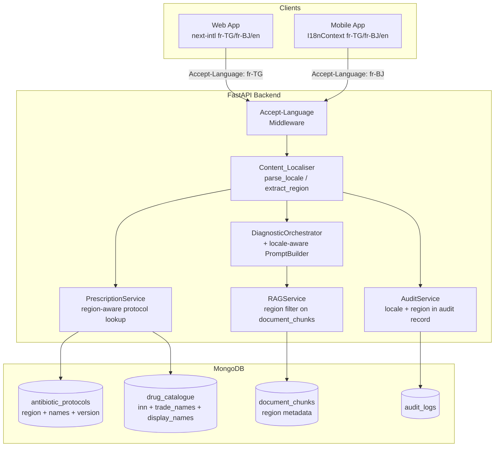

# Design Document: i18n-medical-content

## Overview

This feature extends Diagno-Pilot's internationalisation from UI strings to all medical content. Currently, `@diagno-pilot/i18n` supports only `fr` and `en`, and the backend serves protocols, drug names, and LLM diagnosis responses in a single language without region awareness.

The change introduces three supported locales — `fr-TG` (French / Togo), `fr-BJ` (French / Bénin), and `en` (English fallback) — and makes every layer of the stack locale-aware:

- **Backend**: a new `Content_Localiser` module centralises locale resolution; `PrescriptionService` gains region-aware protocol selection; `LLM_Adapter` (the `PromptBuilder` + `RAGService` pipeline) injects locale and region into prompts and RAG retrieval.
- **MongoDB**: `antibiotic_protocols` and a new `drug_catalogue` collection gain region and locale fields; protocol documents gain version history.
- **Web (Next.js)**: `next-intl` routing is extended to `fr-TG`, `fr-BJ`, `en`; the API client forwards `Accept-Language`.
- **Mobile (React Native / Expo)**: `I18nContext` is extended to the same three locales; API calls carry `Accept-Language`.
- **Shared types**: `LocaleSchema` in `@diagno-pilot/types` is widened to include `fr-TG` and `fr-BJ` while remaining assignable from the existing `'fr' | 'en'` union.

Backward compatibility is preserved: existing clients sending `fr` or `en` continue to work without modification.

---

## Architecture

The locale flows from the client through every layer as a single `Accept-Language` header value. The backend resolves it once at the request boundary and propagates the resolved `(locale, region)` pair to all downstream components.



### Key Design Decisions

1. **Single resolution point**: `Content_Localiser.parse_locale()` is called once per request in FastAPI middleware (or a dependency), and the resolved `(locale, region)` tuple is stored in `request.state`. All downstream services receive it as a parameter — they never re-parse the header.

2. **Composite cache key `(name, region)`**: `PrescriptionService._protocols_cache` is re-keyed from `name` to `(name, region)` to enable O(1) region-aware lookup (Requirement 2.7).

3. **Immutable protocol versions**: Protocol updates create new documents rather than overwriting, satisfying Requirement 11. The `PrescriptionService` always selects the latest version for a given `(name, region)` pair at cache-load time.

4. **Prompt injection, not post-processing**: Locale and region are injected into the LLM system prompt by `PromptBuilder`. The `LLM_Adapter` layer (RAGService + LLMRouter) does not translate responses after the fact — it instructs the model to respond in the correct language from the start.

5. **Cache invalidation SLA**: Protocol cache reload within 5 seconds (NFR 1) is achieved by having the admin `PUT /protocols/{id}` endpoint call `prescription_service.reload_protocols(name)` synchronously before returning `200 OK`.

---

## Components and Interfaces

### 1. Content_Localiser (new — `backend/services/content_localiser.py`)

A stateless Python module with three pure functions:

```python
SUPPORTED_LOCALES = {"fr-TG", "fr-BJ", "en"}
FALLBACK_CHAINS: dict[str, list[str]] = {
    "fr-TG": ["fr-TG", "fr", "en"],
    "fr-BJ": ["fr-BJ", "fr", "en"],
    "en":    ["en", "fr-TG", "fr"],
    "fr":    ["fr-TG", "fr", "en"],   # backward-compat alias
}

def parse_locale(accept_language: str | None) -> str:
    """Parse Accept-Language header; return best-matching supported locale.
    Falls back to DEFAULT_LOCALE env var (default: 'fr-TG')."""

def extract_region(locale: str) -> str | None:
    """Return ISO 3166-1 alpha-2 country code from locale, or None."""

def localise(content_object: dict, locale: str) -> str | None:
    """Select the correct string from content_object['translations'] map,
    applying the fallback chain. Returns None if no variant found."""
```

### 2. FastAPI Locale Middleware (`backend/core/locale_middleware.py`)

A Starlette middleware that runs before route handlers:

- Reads `Accept-Language` header.
- Calls `Content_Localiser.parse_locale()`.
- Stores `(locale, region)` in `request.state.locale` and `request.state.region`.
- Logs the resolved pair (Requirement 10.1).

### 3. PrescriptionService — region-aware extensions

**Cache key change**: `_protocols_cache: dict[tuple[str, str], AntibioticProtocol]` keyed by `(name.lower(), region)` where region ∈ `{"TG", "BJ", "ALL"}`.

**Lookup order** for a request with region `R`:
1. `(name, R)` — region-specific variant.
2. `(name, "ALL")` — universal fallback.
3. Built-in `ANTIBIOTIC_PROTOCOLS` dict (keyed by name, treated as `ALL`).

**Availability check**: Before returning a protocol, check `available_regions`. If the request region is not listed, find an alternative with the same ATC class and first-line status; if none, any available alternative in the same ATC class.

**New method signature**:
```python
async def calculate_prescription(
    self,
    antibiotic: str,
    patient: PatientProfile,
    locale: str = "fr-TG",
    region: str = "ALL",
) -> LocalisedPrescription:
```

`LocalisedPrescription` extends `Prescription` with:
- `display_name: str` — localised drug name from `names` map.
- `trade_name: str | None` — from `Drug_Catalogue` for the request region.
- `unavailable_in_region: bool` — flag when drug not in region formulary.
- `protocol_version: str` — version identifier of the protocol used.
- `locale: str` — resolved locale.
- `region: str` — resolved region.

### 4. PromptBuilder — locale-aware extensions

`build()` gains two new optional parameters:

```python
def build(
    self,
    symptoms: list[Symptom],
    patient_profile: PatientProfile | None,
    locale: str = "fr-TG",
    region: str | None = None,
) -> str:
```

The method prepends a system instruction block:

```
## Language and guidelines
- Respond in: French  (for fr-TG / fr-BJ) | English (for en)
- Prioritise guidelines from: CHU Lomé (TG) | CHU Abomey-Calavi (BJ) | OMS AFRO / MSF (en)
- Region: TG | BJ | (none)
```

### 5. RAGService — region-aware retrieval

`query()` gains a `region` parameter. When provided, the MongoDB `$vectorSearch` pipeline is extended with a pre-filter:

```python
{"$vectorSearch": {
    ...
    "filter": {"metadata.region": {"$in": [region, "ALL"]}}
}}
```

This ensures CHU Lomé documents are prioritised for `TG` requests and CHU Abomey-Calavi for `BJ` requests (Requirement 4.6).

### 6. LLM_Adapter language-mismatch detection

After `LLMRouter.generate()` returns, `DiagnosticOrchestrator` checks the response language against the requested locale using a lightweight heuristic (e.g. `langdetect`). If a mismatch is detected:
- A `language_mismatch: true` flag is added to `DiagnosticResult`.
- A warning is logged at `WARNING` level.

`DiagnosticResult` is extended:
```python
@dataclass
class DiagnosticResult:
    diagnoses: list[DifferentialDiagnosis]
    fallback_used: bool
    degraded_warning: str | None
    locale: str = "fr-TG"
    language_mismatch: bool = False
```

### 7. @diagno-pilot/types — LocaleSchema extension

```typescript
export const LocaleSchema = z.enum(['fr', 'en', 'fr-TG', 'fr-BJ']);
export type Locale = z.infer<typeof LocaleSchema>;
// Existing 'fr' | 'en' union remains assignable — no breaking change.
```

### 8. @diagno-pilot/i18n — extended locale support

```typescript
export const locales: Locale[] = ['fr', 'en', 'fr-TG', 'fr-BJ'];
export const defaultLocale: Locale = 'fr-TG';
```

New locale files:
- `locales/fr-TG.json` — extends `fr.json` with Togo-specific overrides.
- `locales/fr-BJ.json` — extends `fr.json` with Bénin-specific overrides.

`getMessages()` applies a merge strategy: base `fr.json` is loaded first, then the region-specific file is deep-merged on top.

### 9. Web App (Next.js) — next-intl extension

`apps/web/src/i18n/routing.ts`:
```typescript
export const routing = defineRouting({
  locales: ['fr-TG', 'fr-BJ', 'en'],
  defaultLocale: 'fr-TG',
  localeDetection: true,
});
```

`apps/web/src/middleware.ts` is updated to:
- Resolve `fr` → `fr-TG` for backward compatibility.
- Forward the resolved locale as `Accept-Language` on all API fetch calls (via a shared `apiFetch` wrapper).

User locale preference is persisted in a `diagno_locale` cookie (overrides browser detection).

### 10. Mobile App (React Native) — I18nContext extension

```typescript
export const SUPPORTED_LOCALES: Locale[] = ['fr-TG', 'fr-BJ', 'en'];
export const DEFAULT_LOCALE: Locale = 'fr-TG';
```

- Device locale detection: `expo-localization` `getLocales()` is used to detect `fr-TG` / `fr-BJ`.
- `setLocale()` triggers a cache invalidation event so all cached medical content is re-fetched.
- All API calls use a shared `apiClient` that injects `Accept-Language: <locale>`.

### 11. AuditService — locale/region fields

`log_action()` `details` dict is extended to always include `locale` and `region` when called from medical content endpoints. `PrescriptionService` stores `protocol_version`, `locale`, and `region` in the prescription audit record.

---

## Data Models

### MongoDB: `antibiotic_protocols` collection (extended)

```json
{
  "_id": "ObjectId",
  "name": "amoxicillin",
  "region": "TG",
  "available_regions": ["TG", "BJ"],
  "atc_class": "J01CA04",
  "first_line": true,
  "names": {
    "fr": "Amoxicilline",
    "fr-TG": "Amoxicilline",
    "fr-BJ": "Amoxicilline",
    "en": "Amoxicillin"
  },
  "paediatric_dose_per_kg": 50.0,
  "adult_max_dose_mg": 3000.0,
  "frequency": "3x/day",
  "duration_days": 7,
  "route": "oral",
  "renal_adjustment_factor": 0.75,
  "hepatic_adjustment_factor": 1.0,
  "contraindicated_age_groups": [],
  "alternative": null,
  "version": "2025-01-15T00:00:00Z",
  "created_at": "2025-01-15T00:00:00Z"
}
```

**Index**: `{ name: 1, region: 1, created_at: -1 }` (compound, supports O(1) region-aware lookup and version ordering).

**Migration**: existing documents without a `region` field are assigned `region: "ALL"` and `available_regions: ["TG", "BJ"]` by a one-time migration script.

### MongoDB: `drug_catalogue` collection (new)

```json
{
  "_id": "ObjectId",
  "inn": "amoxicillin",
  "display_names": {
    "fr": "Amoxicilline",
    "fr-TG": "Amoxicilline",
    "fr-BJ": "Amoxicilline",
    "en": "Amoxicillin"
  },
  "trade_names": {
    "TG": "Amoxil-TG",
    "BJ": "Clamoxyl"
  },
  "available_regions": ["TG", "BJ"],
  "atc_class": "J01CA04"
}
```

**Index**: `{ inn: 1 }` (unique), `{ "available_regions": 1 }`.

### MongoDB: `document_chunks` collection (extended)

Existing documents gain a `metadata.region` field: `"TG"`, `"BJ"`, or `"ALL"`. Used by the RAG pre-filter.

### Python: `AntibioticProtocol` dataclass (extended)

```python
@dataclass
class AntibioticProtocol:
    name: str
    region: str = "ALL"
    available_regions: list[str] = field(default_factory=lambda: ["TG", "BJ"])
    atc_class: str = ""
    first_line: bool = True
    names: dict[str, str] = field(default_factory=dict)
    paediatric_dose_per_kg: float = 0.0
    adult_max_dose_mg: float = 0.0
    frequency: str = ""
    duration_days: int = 0
    route: str = "oral"
    renal_adjustment_factor: float = 1.0
    hepatic_adjustment_factor: float = 1.0
    contraindicated_age_groups: list[AgeGroup] = field(default_factory=list)
    alternative: str | None = None
    version: str = ""
    created_at: str = ""
```

### Python: `LocalisedPrescription` (new Pydantic model)

```python
class LocalisedPrescription(Prescription):
    display_name: str
    trade_name: str | None = None
    unavailable_in_region: bool = False
    protocol_version: str
    locale: str
    region: str
```

### TypeScript: `Locale` type (extended)

```typescript
export const LocaleSchema = z.enum(['fr', 'en', 'fr-TG', 'fr-BJ']);
export type Locale = z.infer<typeof LocaleSchema>;
```

`AuthUser.locale` continues to accept `'fr' | 'en'` values — the Zod schema is a superset, so existing consumers compile without changes.


---

## Correctness Properties

*A property is a characteristic or behavior that should hold true across all valid executions of a system — essentially, a formal statement about what the system should do. Properties serve as the bridge between human-readable specifications and machine-verifiable correctness guarantees.*

### Property 1: parse_locale always returns a supported locale

*For any* string passed as an `Accept-Language` header value (including empty string, `None`, arbitrary unsupported tags, and the legacy `fr` alias), `Content_Localiser.parse_locale()` SHALL return a value that is a member of `{"fr-TG", "fr-BJ", "en"}`.

**Validates: Requirements 1.2, 1.3, 1.4, 1.7**

### Property 2: extract_region correctly derives region from locale

*For any* locale string that contains a BCP-47 region subtag (e.g. `fr-TG`, `fr-BJ`), `Content_Localiser.extract_region()` SHALL return the ISO 3166-1 alpha-2 country code portion. For locales without a region subtag (e.g. `en`, `fr`), it SHALL return `None`.

**Validates: Requirements 1.8, 5.5**

### Property 3: locale round-trip

*For any* locale string in `{"fr-TG", "fr-BJ", "en", "fr"}`, parsing the locale with `parse_locale`, formatting it back to a string, and parsing again SHALL produce an equivalent locale value — i.e. `parse_locale(format(parse_locale(s))) == parse_locale(s)`.

**Validates: Requirements 5.4**

### Property 4: localise follows the fallback chain

*For any* content object with a `translations` map and any locale string, `Content_Localiser.localise()` SHALL return the value for the most specific matching key in the fallback chain (`fr-TG → fr → en` for Togo, `fr-BJ → fr → en` for Bénin), and SHALL return `None` only when no key in the chain is present. It SHALL never raise an exception regardless of the locale value.

**Validates: Requirements 5.1, 5.2, 5.6**

### Property 5: region-aware protocol lookup priority

*For any* antibiotic name and region `R ∈ {"TG", "BJ"}`, when both a region-specific variant `(name, R)` and a universal variant `(name, "ALL")` exist in the protocol cache, `PrescriptionService._get_protocol()` SHALL return the region-specific variant. When only the `ALL` variant exists, it SHALL return the `ALL` variant.

**Validates: Requirements 2.2, 2.3**

### Property 6: unavailable protocol triggers alternative suggestion

*For any* antibiotic protocol whose `available_regions` list does not include the request region, `PrescriptionService.calculate_prescription()` SHALL NOT return that protocol as the primary prescription and SHALL include an alternative from the same ATC class in the response.

**Validates: Requirements 2.6, 3.5**

### Property 7: prescription response always includes localised display name

*For any* prescription response and any supported locale, the `display_name` field SHALL be a non-empty string derived from the protocol's `names` map (or the raw `name` field for legacy documents without a `names` map).

**Validates: Requirements 2.4, 2.5, 9.5**

### Property 8: drug catalogue response includes INN and conditional trade name

*For any* prescription response, the `inn` field SHALL always be present. The `trade_name` field SHALL be present and non-null when the drug catalogue contains a trade name for the request region; it SHALL be `None` (not an error) when no trade name exists for that region.

**Validates: Requirements 3.1, 3.2, 3.3**

### Property 9: prompt contains locale and region instructions for all supported locales

*For any* supported locale and region pair, the prompt string produced by `PromptBuilder.build()` SHALL contain a language instruction (French for `fr-TG`/`fr-BJ`, English for `en`) and a guideline reference (CHU Lomé for `TG`, CHU Abomey-Calavi for `BJ`, OMS AFRO/MSF for `en`).

**Validates: Requirements 4.1, 4.2, 4.3**

### Property 10: DiagnosticResult always carries locale metadata

*For any* diagnosis request with a specified locale, the returned `DiagnosticResult` SHALL include a `locale` field equal to the resolved locale. When the LLM response omits locale metadata, the field SHALL be set to the requested locale as a fallback.

**Validates: Requirements 4.4, 4.7**

### Property 11: RAG query includes region filter for non-ALL regions

*For any* diagnosis request with region `R ∈ {"TG", "BJ"}`, the MongoDB aggregation pipeline constructed by `RAGService.query()` SHALL include a filter restricting `metadata.region` to `{R, "ALL"}`.

**Validates: Requirements 4.6**

### Property 12: Accept-Language header is forwarded on all API requests

*For any* active locale in the web or mobile client, every outbound API request SHALL include an `Accept-Language` header whose value equals the active locale string.

**Validates: Requirements 6.3, 7.3**

### Property 13: mobile locale detection falls back to fr-TG for unsupported device locales

*For any* device locale string not in `{"fr-TG", "fr-BJ", "en"}`, the mobile `I18nContext` locale resolution SHALL return `"fr-TG"`.

**Validates: Requirements 7.2, 7.5**

### Property 14: protocol migration assigns region ALL to legacy documents

*For any* existing `antibiotic_protocols` document that lacks a `region` field, the migration script SHALL assign `region: "ALL"` without modifying any other field.

**Validates: Requirements 9.3**

### Property 15: protocol update creates a new version document

*For any* protocol update operation, the number of documents in `antibiotic_protocols` with the given `(name, region)` pair SHALL increase by exactly 1, and the original document SHALL remain unchanged.

**Validates: Requirements 11.1, 11.2**

### Property 16: last-variant deletion is rejected

*For any* antibiotic that has exactly one Protocol_Variant across all regions, a DELETE request for that variant SHALL be rejected with an error response, and the document SHALL remain in the collection.

**Validates: Requirements 8.5**

---

## Error Handling

### Locale Resolution Errors

| Condition | Behaviour |
|---|---|
| `Accept-Language` absent | Resolve to `DEFAULT_LOCALE` env var (default `fr-TG`) |
| Unsupported locale tag | Resolve to `fr-TG` via fallback; log at `INFO` |
| Malformed BCP-47 string | Treat as unsupported; resolve to `fr-TG`; log at `WARNING` |
| `fr` alias | Silently map to `fr-TG` |

### Protocol Lookup Errors

| Condition | Behaviour |
|---|---|
| No region-specific variant | Fall back to `ALL` variant |
| No `ALL` variant | Fall back to built-in `ANTIBIOTIC_PROTOCOLS` dict |
| Antibiotic not found anywhere | HTTP 422 `unknown_antibiotic` |
| Drug not available in region | Return `unavailable_in_region: true` + alternative suggestion |
| No alternative in same ATC class | Return `unavailable_in_region: true` + any available alternative |
| `names` map absent (legacy doc) | Use raw `name` field as display name |

### LLM / RAG Errors

| Condition | Behaviour |
|---|---|
| LLM responds in wrong language | Set `language_mismatch: true`; log `WARNING`; return response as-is |
| LLM response missing locale metadata | Set `locale` to requested locale; log `WARNING` |
| Vector search fails | Fall back to keyword search; set `degraded_warning` |
| Both search methods fail | Generate without context; set `degraded_warning` |

### Cache Reload Errors

| Condition | Behaviour |
|---|---|
| MongoDB unreachable during reload | Keep existing in-memory cache; log `ERROR`; return stale data |
| Redis unavailable | Skip Redis layer; use in-memory cache only |

### Frontend Errors

| Condition | Behaviour |
|---|---|
| API returns unexpected locale in response | Log warning; display content as received |
| SecureStore unavailable (mobile) | Default to `fr-TG`; do not crash |
| Cookie missing (web) | Fall back to browser locale detection; then `fr-TG` |

---

## Testing Strategy

### Dual Testing Approach

Both unit tests and property-based tests are required. Unit tests cover specific examples, integration points, and error conditions. Property-based tests verify universal correctness across all inputs.

### Property-Based Testing

**Library**: Python — `hypothesis`; TypeScript — `fast-check` (already present in `node_modules`).

**Minimum iterations**: 100 per property test.

**Tag format**: `# Feature: i18n-medical-content, Property {N}: {property_text}`

Each correctness property defined above MUST be implemented by a single property-based test:

| Property | Test file | Library |
|---|---|---|
| P1: parse_locale always returns supported locale | `backend/tests/test_content_localiser.py` | hypothesis |
| P2: extract_region derives region correctly | `backend/tests/test_content_localiser.py` | hypothesis |
| P3: locale round-trip | `backend/tests/test_content_localiser.py` | hypothesis |
| P4: localise follows fallback chain | `backend/tests/test_content_localiser.py` | hypothesis |
| P5: region-aware protocol lookup priority | `backend/tests/test_prescription_service_i18n.py` | hypothesis |
| P6: unavailable protocol triggers alternative | `backend/tests/test_prescription_service_i18n.py` | hypothesis |
| P7: prescription display name always present | `backend/tests/test_prescription_service_i18n.py` | hypothesis |
| P8: INN always present, trade name conditional | `backend/tests/test_prescription_service_i18n.py` | hypothesis |
| P9: prompt contains locale/region instructions | `backend/tests/test_prompt_builder_i18n.py` | hypothesis |
| P10: DiagnosticResult carries locale metadata | `backend/tests/test_diagnostic_orchestrator_i18n.py` | hypothesis |
| P11: RAG query includes region filter | `backend/tests/test_rag_service_i18n.py` | hypothesis |
| P12: Accept-Language forwarded on all API requests | `apps/web/src/__tests__/api-client-locale.test.ts` | fast-check |
| P13: mobile locale fallback to fr-TG | `apps/mobile/src/__tests__/I18nContext.test.tsx` | fast-check |
| P14: migration assigns ALL to legacy docs | `backend/tests/test_migration.py` | hypothesis |
| P15: protocol update creates new version | `backend/tests/test_protocol_versioning.py` | hypothesis |
| P16: last-variant deletion rejected | `backend/tests/test_admin_protocol.py` | hypothesis |

### Unit Tests

Unit tests focus on:

- **Content_Localiser**: specific examples for each supported locale, the `fr` alias, empty header, `None` header.
- **PrescriptionService**: integration test verifying `LocalisedPrescription` fields are populated correctly for `TG` and `BJ` requests.
- **PromptBuilder**: snapshot tests for each locale/region combination verifying the exact system instruction block.
- **DiagnosticOrchestrator**: mock LLM returning wrong-language response → `language_mismatch: true`.
- **Web middleware**: `resolveLocale` with `fr-TG`, `fr-BJ`, `en`, `fr`, and unsupported values.
- **Mobile I18nContext**: locale persistence round-trip via mocked `SecureStore`.
- **Admin API**: protocol CRUD with region scoping; cache reload within 5 s (NFR 1).
- **Audit logging**: prescription audit record contains `locale`, `region`, `protocol_version`.
- **Protocol versioning**: GET by version identifier returns the correct historical document.

### Integration Tests

- End-to-end: POST `/api/v1/diagnose/symptoms` with `Accept-Language: fr-TG` → response diagnoses are in French.
- End-to-end: POST `/api/v1/diagnose/prescription` with `Accept-Language: fr-BJ` → `LocalisedPrescription` contains BJ trade name.
- Migration script: run against a seeded collection of legacy documents; verify all gain `region: "ALL"`.
- Cache reload SLA: update a protocol via admin API; verify `PrescriptionService` returns updated data within 5 seconds.
