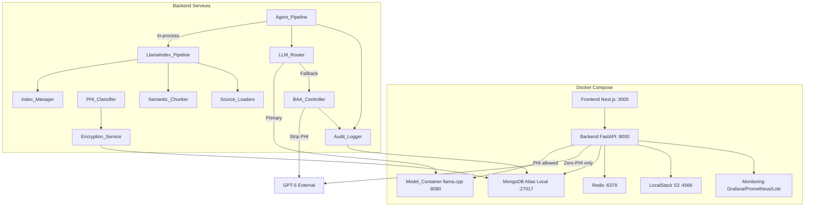
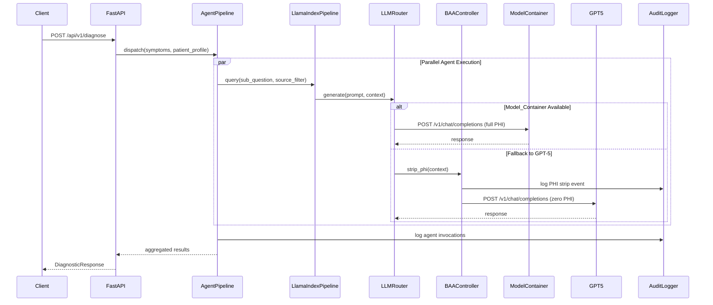

# Design Document: LLM LlamaIndex HIPAA Refactor

## Overview

This design covers the refactoring of Diagno-Pilot's LLM integration, RAG pipeline, and compliance layer. The system currently uses a custom regex-based chunker (`backend/services/chunker.py`), direct HTTP calls to an OpenAI-compatible LLM endpoint (`backend/services/llm_router.py`), subprocess-based specialist agents (`backend/agents/`), and a basic audit service (`backend/services/audit_service.py`).

The refactoring introduces:
1. A containerized local LLM (llama.cpp serving MedicalQwen3-Reasoning-4B.Q8_0.gguf) as a Docker service
2. LlamaIndex-powered RAG pipeline replacing the custom chunker, embedding service, and retrieval logic
3. HIPAA/BAA-compliant controls: PHI classification, AES-256 encryption, tamper-evident audit logging, and zero-PHI enforcement on external LLM calls
4. In-process agent pipeline replacing subprocess-based stdin/stdout communication

The backend remains FastAPI (Python 3.12) with MongoDB Atlas, Redis, and S3 (LocalStack in dev).

### Key Design Decisions

- **llama.cpp over vLLM/Ollama**: llama.cpp has the smallest footprint, native GGUF support, and built-in OpenAI-compatible API. The existing `model/MedicalQwen3-Reasoning-4B.Q8_0.gguf` file is directly usable.
- **LlamaIndex over LangChain**: LlamaIndex provides tighter integration with MongoDB Atlas Vector Search, built-in `SemanticSplitterNodeParser`, `QueryFusionRetriever`, and `SimilarityPostprocessor` — all of which map directly to requirements.
- **Field-level encryption over MongoDB CSFLE**: We use application-level AES-256 encryption via `cryptography` library for PHI fields. This avoids MongoDB Enterprise dependency while meeting HIPAA requirements.
- **In-process agents over subprocess**: Eliminates serialization overhead, enables direct PHI context passing to local model, and simplifies HIPAA boundary enforcement.

## Architecture



### Request Flow



## Components and Interfaces

### 1. Model_Container (Docker Service)

A llama.cpp server container exposing OpenAI-compatible endpoints.

```yaml
# docker-compose.yml addition
model:
  image: ghcr.io/ggerganov/llama.cpp:server
  ports:
    - "8080:8080"
  volumes:
    - ./model:/models:ro
  environment:
    - LLAMA_ARG_MODEL=/models/MedicalQwen3-Reasoning-4B.Q8_0.gguf
    - LLAMA_ARG_CTX_SIZE=${MODEL_CONTEXT_SIZE:-4096}
    - LLAMA_ARG_N_GPU_LAYERS=${MODEL_GPU_LAYERS:-99}
    - LLAMA_ARG_THREADS=${MODEL_THREADS:-4}
    - LLAMA_ARG_HOST=0.0.0.0
    - LLAMA_ARG_PORT=8080
  deploy:
    resources:
      reservations:
        devices:
          - driver: nvidia
            count: all
            capabilities: [gpu]
  profiles:
    - gpu
  healthcheck:
    test: ["CMD", "curl", "-f", "http://localhost:8080/health"]
    interval: 10s
    timeout: 5s
    retries: 5
    start_period: 30s

model-cpu:
  image: ghcr.io/ggerganov/llama.cpp:server
  ports:
    - "8080:8080"
  volumes:
    - ./model:/models:ro
  environment:
    - LLAMA_ARG_MODEL=/models/MedicalQwen3-Reasoning-4B.Q8_0.gguf
    - LLAMA_ARG_CTX_SIZE=${MODEL_CONTEXT_SIZE:-4096}
    - LLAMA_ARG_N_GPU_LAYERS=0
    - LLAMA_ARG_THREADS=${MODEL_THREADS:-4}
    - LLAMA_ARG_HOST=0.0.0.0
    - LLAMA_ARG_PORT=8080
  profiles:
    - cpu
  healthcheck:
    test: ["CMD", "curl", "-f", "http://localhost:8080/health"]
    interval: 10s
    timeout: 5s
    retries: 5
    start_period: 60s
```

**Endpoints:**
- `POST /v1/chat/completions` — chat completion (OpenAI-compatible)
- `POST /v1/embeddings` — embedding generation
- `GET /health` — health check (HTTP 200 when model loaded)

### 2. Semantic_Chunker

Replaces `backend/services/chunker.py` with LlamaIndex `SemanticSplitterNodeParser`.

```python
# backend/services/semantic_chunker.py
class SemanticChunkerService:
    """LlamaIndex-based semantic chunker replacing the regex Chunker."""
    
    def __init__(self, embed_model, max_tokens: int = 512):
        ...
    
    def chunk(self, documents: list[Document]) -> list[TextNode]:
        """Split documents into semantically coherent nodes with metadata."""
        ...
    
    def _preserve_table_boundaries(self, nodes: list[TextNode]) -> list[TextNode]:
        """Post-process to keep table rows together within token limits."""
        ...
    
    def _preserve_step_numbering(self, nodes: list[TextNode]) -> list[TextNode]:
        """Post-process to preserve clinical protocol step grouping."""
        ...
```

### 3. Source_Loaders

Per-format document loaders wrapping LlamaIndex readers.

```python
# backend/services/source_loaders.py
class SourceLoaderService:
    """Dispatches to format-specific LlamaIndex readers."""
    
    SUPPORTED_FORMATS = {"pdf", "docx", "csv", "txt", "html"}
    
    def load(self, content: bytes, filename: str, source: str, region: str = "ALL") -> list[Document]:
        """Load and return LlamaIndex Documents with metadata."""
        ...
    
    def _load_pdf(self, content: bytes) -> list[Document]: ...
    def _load_docx(self, content: bytes) -> list[Document]: ...
    def _load_csv(self, content: bytes) -> list[Document]: ...
    def _load_txt(self, content: bytes) -> list[Document]: ...
    def _load_html(self, content_or_url: str) -> list[Document]:
        """Load HTML from uploaded file bytes or fetch from URL."""
        ...
    
    def _attach_disease_tags(self, docs: list[Document]) -> list[Document]:
        """Tag documents with matching DISEASE_KEYWORDS."""
        ...
    
    def _infer_document_type(self, source: str) -> str:
        """Reuse existing infer_document_type logic."""
        ...
```

### 4. Index_Manager

Manages LlamaIndex VectorStoreIndex backed by MongoDB Atlas.

```python
# backend/services/index_manager.py
class IndexManager:
    """Creates and maintains LlamaIndex indices over MongoDB Atlas Vector Search."""
    
    def __init__(self, mongo_client, embed_model, collection_name: str = "document_chunks"):
        ...
    
    async def get_or_create_index(self) -> VectorStoreIndex:
        """Return existing index or create from MongoDB Atlas vector store."""
        ...
    
    async def insert_nodes(self, nodes: list[TextNode]) -> None:
        """Incrementally add nodes to the index without full rebuild."""
        ...
    
    def get_retriever(self, top_k: int = 5, region: str | None = None) -> QueryFusionRetriever:
        """Return hybrid retriever (vector + BM25) with optional region filter."""
        ...
    
    def get_postprocessors(self) -> list[NodePostprocessor]:
        """Return [SimilarityPostprocessor(0.75), CrossEncoderReranker]."""
        ...
```

### 5. LlamaIndex_Pipeline

Unified RAG pipeline replacing `RAGService`.

```python
# backend/services/llamaindex_pipeline.py
class LlamaIndexPipeline:
    """LlamaIndex-based RAG pipeline replacing RAGService."""
    
    def __init__(self, index_manager: IndexManager, llm_router: LLMRouter, cache_service):
        ...
    
    async def query(
        self, question: str, context: PatientProfile | None = None,
        top_k: int = 5, region: str | None = None,
        source_filter: dict | None = None,
        session_history: list[dict] | None = None,
    ) -> RAGResponse:
        """Execute retrieval + generation with caching."""
        ...
```

### 6. LLM_Router (Refactored)

Updated to point primary at Model_Container. Interface unchanged.

```python
# backend/services/llm_router.py (modified)
class LLMRouter:
    PRIMARY_MODEL = "MedicalQwen3-Reasoning-4B"  # updated model name
    FALLBACK_MODEL = "gpt-5"
    
    # Constructor now defaults primary URL to MODEL_CONTAINER_URL
    # Circuit breaker and retry logic unchanged
    # New: calls BAA_Controller.strip_phi() before fallback
```

### 7. PHI_Classifier

```python
# backend/services/phi_classifier.py
class PHIClassifier:
    """Classifies data fields as PHI or non-PHI."""
    
    PHI_FIELDS = {
        "full_name", "date_of_birth", "medical_record_number", "allergies",
        "current_medications", "comorbidities", "weight_kg",
        "diagnoses", "prescriptions", "consultation_notes",
        "differential_diagnoses", "partial_differential",
    }
    
    def is_phi(self, field_name: str) -> bool:
        """Return True if field is classified as PHI. Unknown fields default to PHI."""
        ...
    
    def classify_document(self, data: dict) -> dict[str, bool]:
        """Return {field_name: is_phi} for all fields in data."""
        ...
    
    def extract_phi_fields(self, data: dict) -> dict:
        """Return only PHI-classified fields from data."""
        ...
    
    def extract_non_phi_fields(self, data: dict) -> dict:
        """Return only non-PHI fields from data."""
        ...
```

### 8. Encryption_Service

```python
# backend/services/encryption_service.py
class EncryptionService:
    """AES-256 field-level encryption for PHI data."""
    
    def __init__(self, key_id: str):
        ...
    
    def encrypt_field(self, plaintext: str) -> str:
        """Encrypt a single field value. Returns base64-encoded ciphertext."""
        ...
    
    def decrypt_field(self, ciphertext: str) -> str:
        """Decrypt a single field value."""
        ...
    
    def encrypt_phi_fields(self, data: dict, classifier: PHIClassifier) -> dict:
        """Encrypt all PHI-classified fields in a dict."""
        ...
    
    def decrypt_phi_fields(self, data: dict, classifier: PHIClassifier) -> dict:
        """Decrypt all PHI-classified fields in a dict."""
        ...
    
    def rotate_key(self, new_key_id: str) -> None:
        """Rotate encryption key. Re-encrypts existing data with new key."""
        ...
```

### 9. Audit_Logger (Enhanced)

```python
# backend/services/audit_service.py (enhanced)
class AuditLogger:
    """HIPAA-compliant tamper-evident audit logging."""
    
    COLLECTION = "hipaa_audit_logs"
    FALLBACK_FILE = "/var/log/diagno-pilot/audit_fallback.jsonl"
    
    async def log_action(
        self, user_id: str, action: str, resource: str,
        resource_id: str | None = None, details: dict | None = None,
        ip_address: str | None = None,
    ) -> str:
        """Log with hash chain. Retries on failure, falls back to file."""
        ...
    
    async def _compute_hash_chain(self, record: dict) -> str:
        """SHA-256(previous_hash + json(record))."""
        ...
    
    async def _write_fallback(self, record: dict) -> None:
        """Append to local fallback file when MongoDB write fails."""
        ...
    
    async def verify_chain(self, start_id: str | None = None) -> bool:
        """Verify hash chain integrity from start_id to latest."""
        ...
```

### 10. BAA_Controller

```python
# backend/services/baa_controller.py
class BAAController:
    """Enforces zero-PHI on external LLM calls."""
    
    PHI_PLACEHOLDERS = {
        "full_name": "[PATIENT_NAME]",
        "date_of_birth": "[DOB]",
        "medical_record_number": "[MRN]",
        "allergies": "[ALLERGIES]",
        "current_medications": "[MEDICATIONS]",
        "weight_kg": "[WEIGHT]",
    }
    
    def strip_phi(self, context: list[dict], classifier: PHIClassifier) -> list[dict]:
        """Remove/replace all PHI from LLM context messages."""
        ...
    
    def verify_no_phi(self, context: list[dict], classifier: PHIClassifier) -> bool:
        """Return True if context contains zero PHI. Raises if PHI detected."""
        ...
```

### 11. Agent_Pipeline (Refactored)

```python
# backend/services/agent_pipeline.py
class AgentPipeline:
    """In-process multi-agent diagnostic pipeline using LlamaIndex query engines."""
    
    AGENTS = {
        "symptomatology": {"source_filter": {"metadata.document_type": "guideline"}},
        "epidemiology": {"source_filter": {"metadata.document_type": {"$in": ["protocol", "guideline"]}}},
        "lab": {"source_filter": {"metadata.source": {"$regex": "CHU|MSF"}}},
        "synthesis": {"source_filter": {}},
        "treatment": {"source_filter": {"metadata.document_type": "protocol"}},
    }
    
    async def run(
        self, symptoms: list[dict], patient_profile: PatientProfile | None = None,
        region: str | None = None,
    ) -> DiagnosticResponse:
        """Execute all agents in parallel, aggregate results."""
        ...
    
    async def _run_agent(
        self, agent_name: str, sub_question: str,
        patient_profile: PatientProfile | None, region: str | None,
    ) -> AgentResult:
        """Single agent execution via LlamaIndex query engine."""
        ...
```


### 12. Frontend Updates

Changes to the Next.js frontend to align with the refactored backend.

```
Files to modify:
├── apps/web/src/app/[locale]/documents/page.tsx   # Add HTML format support
├── apps/web/src/app/[locale]/diagnose/page.tsx     # Model name display
├── apps/web/src/app/[locale]/chat/page.tsx          # Citation metadata
└── packages/api-client/index.ts                     # Response type alignment
```

**Documents page** (`apps/web/src/app/[locale]/documents/page.tsx`):
- Update `ACCEPTED_FORMATS` from `'.pdf,.docx,.txt,.csv'` to `'.pdf,.docx,.txt,.csv,.html'`
- Update `SUPPORTED_FORMATS` set to include `'html'`
- File input `accept` attribute updated accordingly

**Diagnose page** (`apps/web/src/app/[locale]/diagnose/page.tsx`):
- `llmUsed` field already displayed — will now show `MedicalQwen3-Reasoning-4B` from Model_Container
- No structural changes needed; backend response shape unchanged

**Chat page** (`apps/web/src/app/[locale]/chat/page.tsx`):
- CitationChip tooltip enhanced to show `section` and `page` from LlamaIndex node metadata when available
- DocumentSource type already includes these fields — no type changes needed

**API client** (`packages/api-client/index.ts`):
- `DiagnosisResponse.llmUsed` and `DiagnosisResponse.sources` already optional — no breaking changes
- Ensure `DocumentSourceSchema` Zod validation accepts `section` and `page` fields (already present)

**Error handling**:
- LlamaIndex_Pipeline errors mapped to existing `ApiError` format (`{status, message, detail}`)
- Frontend 401 → silent refresh flow unchanged
- No internal pipeline details exposed to the client

### 13. Legacy Code Cleanup

Removal of backend modules superseded by the LlamaIndex_Pipeline.

```
Files to remove:
├── backend/services/chunker.py           # Replaced by Semantic_Chunker
├── backend/services/rag_service.py       # Replaced by LlamaIndex_Pipeline
├── backend/services/embedding_service.py # Replaced by LlamaIndex embedding
├── backend/agents/_base_agent.py         # FilteredRAGService + run_agent replaced by Agent_Pipeline
├── backend/agents/symptomatology.py      # Subprocess agent → in-process
├── backend/agents/epidemiology.py        # Subprocess agent → in-process
├── backend/agents/lab.py                 # Subprocess agent → in-process
├── backend/agents/synthesis.py           # Subprocess agent → in-process
└── backend/agents/treatment.py           # Subprocess agent → in-process
```

**Removal order** (dependency-safe):
1. Individual agent scripts (symptomatology, epidemiology, lab, synthesis, treatment) — these import from `_base_agent.py`
2. `_base_agent.py` — imports from `rag_service.py`, `embedding_service.py`, `llm_router.py`
3. `rag_service.py` — imports from `embedding_service.py`, `llm_router.py`
4. `embedding_service.py` — standalone
5. `chunker.py` — standalone

**Pre-removal validation**: Before each removal, verify zero import references to the module across the codebase using grep. If references exist, migrate them to LlamaIndex equivalents first.

**Imports to migrate** (known references):
- `backend/services/document_service.py` imports `Chunker, ChunkResult` from `chunker.py` → replace with `SemanticChunkerService`
- `backend/services/document_service.py` imports `EmbeddingModel` from `embedding_service.py` → replace with LlamaIndex embedding
- `backend/agents/_base_agent.py` imports `RAGService` from `rag_service.py` → replaced by `Agent_Pipeline`
- `backend/services/diagnostic_service.py` imports agent subprocess calls → replaced by `AgentPipeline.run()`
- Any test files importing legacy modules → update to test new equivalents

### 14. Data Migration

Re-indexes existing document chunks with the LlamaIndex pipeline.

```python
# scripts/migrate_chunks.py (or backend/services/migration_service.py)
class ChunkMigrationService:
    """Re-indexes existing document_chunks using the LlamaIndex pipeline."""
    
    def __init__(self, db, source_loader: SourceLoaderService, 
                 chunker: SemanticChunkerService, index_manager: IndexManager,
                 s3: S3Service):
        ...
    
    async def migrate_all(self) -> MigrationReport:
        """Re-index all documents. Returns report with success/failure counts."""
        ...
    
    async def migrate_document(self, doc_id: str) -> bool:
        """Re-index a single document: fetch from S3 → load → chunk → embed → replace chunks."""
        ...
    
    async def _replace_chunks(self, doc_id: ObjectId, new_nodes: list[TextNode]) -> int:
        """Delete old chunks for doc_id, insert new LlamaIndex nodes, return new count."""
        ...
```

**Migration flow:**
1. Iterate all `medical_documents` records
2. For each document: fetch raw file from S3 using `s3_key`
3. Load via `SourceLoaderService` (format detected from filename)
4. Chunk via `SemanticChunkerService`
5. Insert new nodes via `IndexManager.insert_nodes()`
6. Delete old chunks for that `document_id`
7. Update `chunk_count` on the `medical_documents` record
8. Log success/failure per document; continue on failure

**Execution:** One-time admin script (`POST /api/v1/admin/migrate-chunks` or CLI command), not triggered on startup.

## Data Models

### New/Modified Pydantic Models

```python
# backend/models/document.py — additions

class ChunkNode(BaseModel):
    """Represents a LlamaIndex TextNode stored in MongoDB."""
    id: str
    document_id: str
    content: str
    embedding: list[float]
    metadata: ChunkMetadata

class ChunkMetadata(BaseModel):
    source: str
    page: int | None = None
    section: str | None = None
    region: str = "ALL"
    disease_tags: list[str] = []
    document_type: str = "other"  # protocol | guideline | other
    evidence_level: str = "other"
    bbox: list[float] | None = None
    page_char_start: int | None = None
    page_char_end: int | None = None
    title: str | None = None
```

```python
# backend/models/audit.py — HIPAA audit record

class HIPAAAuditRecord(BaseModel):
    """Tamper-evident audit log entry."""
    id: str
    timestamp: datetime
    user_id: str
    action: str  # phi_read | phi_write | phi_delete | llm_request | phi_strip
    resource: str
    resource_id: str | None = None
    details: dict = {}
    ip_address: str | None = None
    previous_hash: str  # hash of previous record (empty string for first)
    record_hash: str    # SHA-256(previous_hash + json(record_without_hashes))
```

```python
# backend/core/config.py — additions to Settings

class Settings(BaseSettings):
    # ... existing fields ...
    
    # Model_Container
    MODEL_CONTAINER_URL: str = "http://model:8080/v1"
    MODEL_CONTAINER_API_KEY: str = ""
    MODEL_GPU_LAYERS: int = 99
    MODEL_CONTEXT_SIZE: int = 4096
    MODEL_THREADS: int = 4
    
    # LlamaIndex
    LLAMAINDEX_CHUNK_SIZE: int = 512
    LLAMAINDEX_CHUNK_OVERLAP_TOKENS: int = 50
    LLAMAINDEX_SIMILARITY_THRESHOLD: float = 0.75
    
    # HIPAA
    HIPAA_ENCRYPTION_KEY_ID: str = ""
    HIPAA_AUDIT_HASH_CHAIN_ENABLED: bool = True
    HIPAA_PHI_STRIP_ON_FALLBACK: bool = True
```

### MongoDB Collections

| Collection | Purpose | Key Fields |
|---|---|---|
| `document_chunks` | LlamaIndex nodes with embeddings | `content`, `embedding`, `metadata`, `document_id` |
| `medical_documents` | Document metadata | `title`, `source`, `s3_key`, `chunk_count` |
| `hipaa_audit_logs` | Tamper-evident audit trail | `user_id`, `action`, `resource`, `record_hash`, `previous_hash` |
| `audit_logs` | Existing general audit (kept for backward compat) | `user_id`, `action`, `resource` |

### PHI Field Classification Map

| Model | PHI Fields | Non-PHI Fields |
|---|---|---|
| `PatientProfile` | `full_name`, `date_of_birth`, `medical_record_number`, `weight_kg`, `allergies`, `comorbidities`, `current_medications` | `age_group`, `created_by`, `created_at` |
| `DiagnosticAudit` | `diagnoses`, `agent_results.partial_differential` | `confidence_score`, `locale`, `region`, `fallback_used` |
| `DocumentChunk` | Chunks with patient annotations | `content` (medical knowledge), `metadata` |


## Correctness Properties

*A property is a characteristic or behavior that should hold true across all valid executions of a system — essentially, a formal statement about what the system should do. Properties serve as the bridge between human-readable specifications and machine-verifiable correctness guarantees.*

### Property 1: Chunking round-trip preserves text content

*For any* valid document text, chunking with the Semantic_Chunker and then concatenating all chunk contents (in order) SHALL produce text that contains all original text content without loss.

**Validates: Requirements 2.7**

### Property 2: Chunk token limit invariant

*For any* valid document text and any configured maximum token count, all chunks produced by the Semantic_Chunker SHALL have a token count less than or equal to the configured maximum.

**Validates: Requirements 2.3**

### Property 3: Chunk metadata preservation

*For any* document with source metadata (document_id, source, section, page, region) and structural elements (section headers, tables, numbered steps), all produced chunk nodes SHALL carry the source metadata, and nodes containing section headers SHALL have the section field populated in their metadata.

**Validates: Requirements 2.2, 2.6**

### Property 4: Source loader metadata extraction

*For any* document text and source organization name, the Source_Loader SHALL correctly extract disease tags matching DISEASE_KEYWORDS present in the text, and SHALL infer document_type according to the rules: PNLP/MSF → "protocol", CHU/OMS/WHO → "guideline", otherwise → "other".

**Validates: Requirements 3.7, 3.8**

### Property 5: Unsupported format error message

*For any* file with an extension not in the supported set {pdf, docx, csv, txt, html}, the Source_Loader SHALL return an error message that contains the unsupported extension name and lists all supported formats.

**Validates: Requirements 3.6**

### Property 6: Similarity threshold filter

*For any* list of scored retrieval results, applying the similarity threshold filter (0.75) SHALL return only results with score >= 0.75, and all results with score >= 0.75 SHALL be retained.

**Validates: Requirements 4.4**

### Property 7: Region filter correctness

*For any* set of document chunks with region metadata and any target region, applying the region filter SHALL return only chunks whose region matches the target region or is "ALL".

**Validates: Requirements 4.6**

### Property 8: PHI classification correctness

*For any* field name, the PHI_Classifier SHALL return True for known PHI fields (PatientProfile identifiers including medical_record_number, diagnostic outputs), False for known non-PHI fields (medical knowledge metadata), and True for any unknown field name not in the explicit classification map.

**Validates: Requirements 6.1, 6.2, 6.5**

### Property 9: Encryption round-trip

*For any* valid string value, encrypting with the Encryption_Service and then decrypting SHALL produce the original string value.

**Validates: Requirements 7.1, 7.5**

### Property 10: Encryption failure does not expose plaintext

*For any* invalid ciphertext input, the Encryption_Service decryption error SHALL not contain the original plaintext value that was encrypted, and SHALL log the failure to the Audit_Logger.

**Validates: Requirements 7.6**

### Property 11: BAA PHI stripping with placeholder substitution

*For any* LLM context containing PHI fields from PatientProfile, the BAA_Controller strip_phi operation SHALL replace all PHI values with their corresponding placeholders ([PATIENT_NAME], [DOB], [MRN], etc.), and the resulting context SHALL contain zero PHI values when verified by PHI_Classifier.

**Validates: Requirements 5.4, 9.1, 9.2**

### Property 12: Audit record completeness

*For any* audit event (PHI access, LLM request, agent invocation), the stored HIPAAAuditRecord SHALL contain all required fields: timestamp, user_id, action, resource, and ip_address.

**Validates: Requirements 8.1**

### Property 13: Audit hash chain integrity

*For any* sequence of N audit records written to the Audit_Logger, each record's record_hash SHALL equal SHA-256(previous_hash + json(record_data)), and verifying the chain SHALL detect any modification to any record in the sequence.

**Validates: Requirements 8.6**

### Property 14: Audit records exclude PHI values

*For any* audit record logging a PHI-related event (LLM request with PHI context, PHI-stripping event), the record SHALL contain event metadata (action type, field type names, endpoint) but SHALL NOT contain actual PHI values (patient names, dates of birth, medical record numbers).

**Validates: Requirements 8.2, 9.3**

### Property 15: Agent PHI boundary enforcement

*For any* agent execution, if the LLM endpoint is the local Model_Container then the full PHI context SHALL be present in the request, and if the endpoint is the external GPT-5 fallback then the request context SHALL contain zero PHI (BAA stripping applied).

**Validates: Requirements 10.2, 10.3**

### Property 16: Agent result aggregation preserves confidence scores

*For any* set of agent results with confidence scores, the aggregation function SHALL produce a combined result whose confidence score is the arithmetic mean of the individual agent confidence scores, and all agent partial differentials SHALL be included in the aggregated output.

**Validates: Requirements 10.6**

### Property 17: Frontend accepted formats include HTML

*For any* document upload via the Frontend_App Documents page, the accepted file formats SHALL include `.pdf`, `.docx`, `.txt`, `.csv`, and `.html`, and the upload form SHALL reject files with extensions outside this set.

**Validates: Requirements 12.1**

### Property 18: Legacy module zero-reference invariant

*For any* removed Legacy_Files module, the codebase SHALL contain zero import statements referencing the removed module path. Searching for `from backend.services.chunker`, `from backend.services.rag_service`, `from backend.services.embedding_service`, and `from backend.agents._base_agent` SHALL return zero results after cleanup.

**Validates: Requirements 13.6**

## Error Handling

### LLM Routing Failures

| Scenario | Behavior |
|---|---|
| Model_Container timeout | RetryPolicy with jittered exponential backoff (max 3 retries). On exhaustion, circuit breaker records failure. |
| Model_Container circuit open (5 failures) | Route to GPT-5 fallback via BAA_Controller (PHI stripped). |
| GPT-5 fallback also fails | HTTP 503 with `{"error": "llm_unavailable", "code": "LLM_UNAVAILABLE", "retryable": true}` |
| Both circuits open | Immediate 503 without attempting either endpoint. |

### Encryption Failures

| Scenario | Behavior |
|---|---|
| Encryption fails (key unavailable) | Log to Audit_Logger, return HTTP 500 without exposing plaintext. Block the operation. |
| Decryption fails (corrupted ciphertext) | Log to Audit_Logger, return HTTP 500. Do not return partial plaintext. |
| Key rotation in progress | New writes use new key. Reads attempt new key first, fall back to old key. |

### Audit Logging Failures

| Scenario | Behavior |
|---|---|
| MongoDB write fails | Retry once. If retry fails, write to local fallback file (`/var/log/diagno-pilot/audit_fallback.jsonl`). |
| Fallback file write fails | Log critical error to application logger. Do not block the original operation. |
| Hash chain broken | `verify_chain()` returns False with the first broken record ID. |

### Document Ingestion Failures

| Scenario | Behavior |
|---|---|
| Unsupported format | Return descriptive error listing supported formats. |
| PDF/DOCX extraction fails | Log error, return HTTP 422 with format-specific message. |
| Embedding generation fails | Propagate error (no fallback for embeddings). |
| S3 upload fails | Log error, return HTTP 500. Document metadata is not persisted. |

### Agent Pipeline Failures

| Scenario | Behavior |
|---|---|
| Single agent fails | Log error, continue with remaining agents. Aggregation uses available results. |
| All agents fail | Return HTTP 503 with degraded warning. |
| PHI stripping fails on fallback | Block the agent call, log to audit, return error for that agent. |

## Testing Strategy

### Property-Based Testing

**Library**: [Hypothesis](https://hypothesis.readthedocs.io/) (Python) — already present in the project (`.hypothesis/` directory exists).

**Configuration**: Minimum 100 iterations per property test via `@settings(max_examples=100)`.

**Tag format**: Each test tagged with `# Feature: llm-llamaindex-hipaa-refactor, Property {N}: {title}`

Properties to implement as Hypothesis tests:
- Property 1: Chunking round-trip — generate random text documents, chunk, verify content preservation
- Property 2: Token limit invariant — generate random documents, verify all chunks within limit
- Property 3: Metadata preservation — generate documents with headers/metadata, verify node metadata
- Property 4: Disease tag and document_type extraction — generate text with keyword subsets, verify extraction
- Property 5: Unsupported format error — generate random extensions, verify error content
- Property 6: Similarity threshold — generate scored result lists, verify filter correctness
- Property 7: Region filter — generate chunks with regions, verify filter
- Property 8: PHI classification — generate field names, verify classification
- Property 9: Encryption round-trip — generate random strings, verify encrypt/decrypt identity
- Property 10: Encryption error safety — generate invalid ciphertexts, verify no plaintext leak
- Property 11: BAA PHI stripping — generate contexts with PHI, verify zero-PHI after stripping
- Property 12: Audit record completeness — generate audit events, verify required fields
- Property 13: Hash chain integrity — generate audit sequences, verify chain + tamper detection
- Property 14: Audit PHI exclusion — generate PHI events, verify no PHI in records
- Property 15: Agent PHI boundary — generate agent executions with routing, verify PHI presence/absence
- Property 16: Aggregation — generate agent results, verify confidence score mean and differential inclusion

### Unit Tests (Example-Based)

- Model_Container health check and endpoint availability (smoke)
- LLM_Router fallback routing when circuit opens
- Source_Loader format dispatch (PDF, DOCX, CSV, TXT, HTML)
- Settings production validation (missing HIPAA fields)
- Audit_Logger retry and file fallback on MongoDB failure
- BAA_Controller blocks call when stripping fails
- Key rotation: encrypt with key A, rotate to B, decrypt still works
- Frontend Documents page accepts HTML format
- Legacy module imports are fully migrated (zero-reference check)

### Integration Tests

- End-to-end document ingestion: upload → chunk → embed → store → retrieve
- LlamaIndex pipeline: query → retrieve → generate with MongoDB Atlas
- Agent pipeline: parallel execution with mocked LLM endpoints
- Audit hash chain verification over real MongoDB collection
- Redis caching: verify TTLs for embeddings (24h) and RAG responses (5min)
- Frontend → backend round-trip: upload HTML document, verify chunking and retrieval

### Test Organization

```
backend/tests/
├── test_semantic_chunker.py      # Properties 1-3, unit tests
├── test_source_loaders.py        # Properties 4-5, format dispatch tests
├── test_index_manager.py         # Properties 6-7, integration tests
├── test_phi_classifier.py        # Property 8
├── test_encryption_service.py    # Properties 9-10
├── test_baa_controller.py        # Properties 11, 14-15
├── test_audit_logger.py          # Properties 12-14
├── test_agent_pipeline.py        # Properties 15-16
├── test_llm_router.py            # Routing unit tests
├── test_settings.py              # Configuration validation
├── test_legacy_cleanup.py        # Property 18, zero-reference checks
└── integration/
    ├── test_ingestion_e2e.py
    ├── test_rag_pipeline_e2e.py
    └── test_agent_pipeline_e2e.py

apps/web/src/__tests__/
├── documents-page.test.tsx       # Property 17, HTML format acceptance
└── diagnose-page.test.tsx        # Model name display
```
