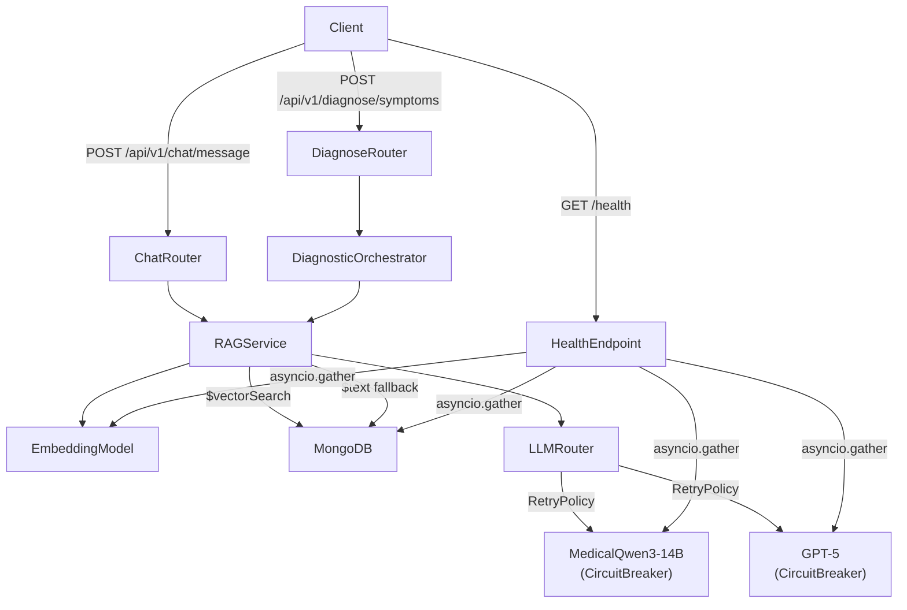

# Design Document — LLM Resilience

## Overview

This feature hardens the Diagno-Pilot backend against transient LLM and Vector Search failures. It introduces four cross-cutting improvements:

1. **Exponential backoff + retry** inside `_LLMClient` so transient errors and rate-limit responses are absorbed before the circuit breaker records a failure.
2. **Keyword fallback in RAGService** so clinicians receive answers even when MongoDB Atlas Vector Search is unavailable, with an explicit `degraded_warning` field.
3. **Extended `/health` endpoint** that concurrently probes the primary LLM, fallback LLM, and embedding service.
4. **Degraded-response flagging** that propagates `fallback_used` and `degraded_warning` through every layer up to the API response body.

The system is a medical application; every degraded path MUST surface a human-readable warning so clinicians can apply appropriate clinical judgment.

---

## Architecture



### Key design decisions

- **RetryPolicy is a standalone async utility** (`backend/core/retry.py`) injected into `_LLMClient`. This keeps retry logic decoupled from circuit-breaker logic and independently testable.
- **Separate `CircuitBreaker` instances** for primary and fallback LLMs. The fallback circuit breaker is new; the primary one already exists.
- **`degraded_warning` lives on `RAGResponse`**; `fallback_used` lives on `RAGResponse` as well (added alongside `llm_used`). Both propagate upward without transformation.
- **Health probes are fire-and-forget `asyncio.gather` tasks** with a 5 s per-probe timeout, keeping total `/health` latency under 6 s.

---

## Components and Interfaces

### `backend/core/retry.py` — new file

```python
class RetryPolicy:
    max_retries: int          # default 3, from LLM_RETRY_MAX
    base_delay: float         # default 1.0 s, from LLM_RETRY_BASE_DELAY
    max_delay: float          # default 30.0 s, from LLM_RETRY_MAX_DELAY
    retryable_status_codes: frozenset[int]   # {429, 503}
    non_retryable_status_codes: frozenset[int]  # {400, 401}

    async def execute(
        self,
        fn: Callable[..., Awaitable[T]],
        *args,
        deadline: float,      # monotonic time; abort if exceeded
        **kwargs,
    ) -> T:
        ...
```

`execute` raises `LLMUnavailableError` after exhausting retries or hitting the deadline. Each attempt is logged at DEBUG with `attempt_number`, `endpoint_url`, `status_code`/exception type, and `delay_seconds`. A successful retry is logged at INFO.

### `backend/services/llm_router.py` — modified

- `_LLMClient.generate` gains a `deadline: float` parameter and delegates to `RetryPolicy.execute`.
- `LLMRouter` constructs two `CircuitBreaker` instances: `_primary_cb` (existing) and `_fallback_cb` (new).
- `LLMRouter.generate` sets `deadline = time.monotonic() + settings.LLM_TIMEOUT` before the first call and passes it through to both `_LLMClient` calls.
- When the fallback exhausts retries, `LLMRouter` records the failure on `_fallback_cb` and raises `HTTPException(503, {"error": "llm_unavailable", "code": "LLM_UNAVAILABLE", "retryable": True})`.
- `last_used` is replaced by a richer return value: `LLMResult(answer: str, fallback_used: bool)`.

### `backend/services/rag_service.py` — modified

- `query()` wraps the `$vectorSearch` aggregation in a `try/except`.
- On exception: attempts `$text` keyword search on `content` field, limited to `top_k`.
- Sets `degraded_warning` on `RAGResponse` based on which fallback path was taken.
- If `EmbeddingModel.encode` raises, the exception propagates immediately (no fallback).
- `RAGResponse` now carries `fallback_used: bool = False` (set from `LLMRouter` result).

### `backend/models/document.py` — modified

```python
class RAGResponse(BaseModel):
    answer: str
    sources: list[DocumentSource]
    llm_used: str
    confidence: float | None = None
    degraded_warning: str | None = None   # new
    fallback_used: bool = False            # new
```

### `backend/main.py` — modified `/health`

```python
@app.get("/health")
async def health():
    db_task, llm_primary_task, llm_fallback_task, embed_task = await asyncio.gather(
        _probe_mongo(), _probe_llm_primary(), _probe_llm_fallback(), _probe_embedding(),
        return_exceptions=True,
    )
    ...
```

Each probe is a private async function with a 5 s `httpx` timeout. Returns `"ok"`, `"not_configured"`, or `"unreachable: <reason>"`.

### `backend/core/config.py` — modified `Settings`

Three new fields:
```python
LLM_RETRY_MAX: int = 3
LLM_RETRY_BASE_DELAY: float = 1.0
LLM_RETRY_MAX_DELAY: float = 30.0
```

### API response layer — modified routers

`/api/v1/chat/message` and `/api/v1/diagnose/symptoms` response bodies gain:
```json
{
  "fallback_warning": "Réponse générée par le modèle de secours (GPT-5) — vérification clinique recommandée",
  "degraded_warning": "Vector Search unavailable — response based on keyword retrieval only",
  "warnings_present": true
}
```

`fallback_warning` is only included when `fallback_used=True`. `warnings_present` is `True` when either warning field is present.

---

## Data Models

### `RAGResponse` (updated)

| Field | Type | Default | Description |
|---|---|---|---|
| `answer` | `str` | — | LLM-generated answer |
| `sources` | `list[DocumentSource]` | — | Retrieved document chunks |
| `llm_used` | `str` | — | `"qwen3"` or `"gpt5"` |
| `confidence` | `float \| None` | `None` | Optional confidence score |
| `degraded_warning` | `str \| None` | `None` | Set when vector search degraded |
| `fallback_used` | `bool` | `False` | True when GPT-5 was used |

### `RetryState` (internal, not persisted)

| Field | Type | Description |
|---|---|---|
| `attempt` | `int` | Current attempt number (0-indexed) |
| `deadline` | `float` | `monotonic()` deadline |
| `last_status_code` | `int \| None` | HTTP status of last failure |
| `last_exception` | `Exception \| None` | Last exception if no HTTP response |

### Health response (updated)

```json
{
  "status": "ok | degraded",
  "db": "ok | unreachable: <reason>",
  "redis": "ok | degraded",
  "llm_primary": "ok | not_configured | unreachable: <reason>",
  "llm_fallback": "ok | not_configured | unreachable: <reason>",
  "embedding": "ok | not_configured | unreachable: <reason>"
}
```

### Retry delay formula

```
delay = min(base_delay * 2^attempt, max_delay) + uniform(0, 1)
```

Where `attempt` is 0-indexed (first retry = attempt 0). The cumulative wall-clock time across all attempts is bounded by `LLM_TIMEOUT`.


---

## Correctness Properties

*A property is a characteristic or behavior that should hold true across all valid executions of a system — essentially, a formal statement about what the system should do. Properties serve as the bridge between human-readable specifications and machine-verifiable correctness guarantees.*

### Property 1: Retry count is bounded

*For any* LLM endpoint that always fails, the `RetryPolicy` SHALL attempt the call at most `max_retries + 1` times (1 initial + up to `max_retries` retries) before propagating the failure.

**Validates: Requirements 1.1**

---

### Property 2: Retry delay is within expected bounds

*For any* combination of `base_delay`, `max_delay`, and `attempt` number, the computed delay (before jitter) SHALL equal `min(base_delay * 2^attempt, max_delay)`, and the actual delay with jitter SHALL be in the range `[computed_delay, computed_delay + 1.0]`.

**Validates: Requirements 1.2, 1.3**

---

### Property 3: Retry classification by HTTP status code

*For any* HTTP response with status code in `{429, 503}`, the `RetryPolicy` SHALL retry the request. *For any* HTTP response with status code in `{400, 401}`, the `RetryPolicy` SHALL NOT retry and SHALL propagate the failure immediately (total attempts = 1).

**Validates: Requirements 1.4, 1.5**

---

### Property 4: Circuit breaker records failure on retry exhaustion

*For any* LLM client (primary or fallback) that exhausts all retries without success, the associated `CircuitBreaker`'s failure count SHALL increase by at least 1 after the exhaustion.

**Validates: Requirements 1.6, 1.13**

---

### Property 5: Deadline aborts remaining retries

*For any* `RetryPolicy` with a deadline set in the past (or a deadline that elapses during the first attempt), the policy SHALL abort without making additional retry attempts and SHALL propagate a timeout failure.

**Validates: Requirements 1.10**

---

### Property 6: Vector search failure triggers degraded_warning round-trip

*For any* `RAGService.query()` call where `$vectorSearch` raises an exception and the keyword fallback returns at least one result, the returned `RAGResponse.degraded_warning` SHALL be non-`None`, and the same non-`None` value SHALL appear in the API response body's `degraded_warning` field.

**Validates: Requirements 2.1, 2.2, 2.6**

---

### Property 7: Keyword fallback respects top_k

*For any* `RAGService.query()` call with a given `top_k` value where the keyword fallback is triggered, the `$text` query SHALL be issued with a limit equal to `top_k`.

**Validates: Requirements 2.8**

---

### Property 8: Health response structure and overall status derivation

*For any* combination of component probe results, the `/health` response SHALL contain all four component fields (`db`, `llm_primary`, `llm_fallback`, `embedding`), and the top-level `status` SHALL be `"ok"` if and only if all four fields are `"ok"`.

**Validates: Requirements 3.1, 3.2, 3.3, 3.5, 3.6**

---

### Property 9: Health endpoint always returns HTTP 200

*For any* combination of component probe results (including all failing), the `/health` endpoint SHALL return HTTP status code 200.

**Validates: Requirements 3.7**

---

### Property 10: fallback_used flag is set when fallback LLM is used

*For any* `LLMRouter.generate()` call where the primary LLM is unavailable and the fallback LLM succeeds, the returned result SHALL have `fallback_used=True`. *For any* call where the primary LLM succeeds, `fallback_used` SHALL be `False`.

**Validates: Requirements 4.1**

---

### Property 11: Warning fields propagate unchanged to API response

*For any* `RAGResponse` with `fallback_used=True` and/or a non-`None` `degraded_warning`, the API response body SHALL contain the canonical `fallback_warning` string when `fallback_used=True`, SHALL contain the `degraded_warning` value unchanged when non-`None`, and SHALL set `warnings_present=True` when either warning is present.

**Validates: Requirements 4.2, 4.3, 4.4, 4.5**

---

## Error Handling

### Retry exhaustion

When `RetryPolicy.execute` exhausts all attempts, it raises `LLMUnavailableError` with the last exception chained. `LLMRouter` catches this, records the failure on the appropriate `CircuitBreaker`, and either tries the fallback (primary exhaustion) or raises `HTTPException(503, {"error": "llm_unavailable", "code": "LLM_UNAVAILABLE", "retryable": True})` (fallback exhaustion).

### Non-retryable HTTP errors

Status codes 400 and 401 are propagated immediately as `LLMUnavailableError` without retry. 401 in particular indicates a misconfigured API key and should not be retried.

### Deadline exceeded

When `time.monotonic() >= deadline` before or during an attempt, `RetryPolicy` raises `LLMUnavailableError("LLM_TIMEOUT exceeded")`. This is treated the same as retry exhaustion by `LLMRouter`.

### Vector search failure

`RAGService` catches all exceptions from the `$vectorSearch` aggregation. The keyword fallback is attempted. If the keyword fallback also fails (exception or empty results), the service continues with no retrieved context and sets the appropriate `degraded_warning`. The embedding failure path is explicitly NOT caught — it propagates to the caller as-is.

### Health probe failures

Each probe in `/health` is wrapped in `asyncio.wait_for(..., timeout=5.0)`. `asyncio.TimeoutError` and any other exception are caught and converted to `"unreachable: <str(exc)>"`. The probe failure is logged at WARNING. The overall endpoint always returns HTTP 200.

### Circuit breaker open

When `CircuitBreaker.call_fn` raises `CircuitOpenError`, `LLMRouter` skips the primary and goes directly to the fallback (existing behavior, unchanged). The fallback now also has its own circuit breaker; if the fallback circuit is open, `LLMRouter` raises HTTP 503 immediately without attempting the fallback.

---

## Testing Strategy

### Dual testing approach

Both unit tests and property-based tests are required. Unit tests cover specific examples, integration points, and edge cases. Property-based tests verify universal correctness across randomized inputs.

### Property-based testing

**Library**: [Hypothesis](https://hypothesis.readthedocs.io/) (already present in the project — `.hypothesis/` directory exists).

**Configuration**: Each property test uses `@settings(max_examples=100)`. Tests are tagged with a comment referencing the design property.

Tag format: `# Feature: llm-resilience, Property {N}: {property_text}`

Each correctness property above MUST be implemented by a single Hypothesis test. Generators should produce:
- Random `base_delay`, `max_delay`, `attempt` values for delay tests
- Random HTTP status codes from the retryable/non-retryable sets
- Random `RAGResponse` instances with varying `fallback_used` and `degraded_warning` values
- Random combinations of health probe results (`"ok"`, `"not_configured"`, `"unreachable: ..."`)

### Unit tests

Unit tests focus on:
- The 503 structured error body when both LLMs are exhausted (Req 1.11)
- `degraded_warning` exact string values for each degradation path (Req 2.2, 2.3)
- `"not_configured"` health fields when URLs are absent (Req 3.8, 3.9)
- Concurrent probe execution (Req 3.10) — mock all probes with `asyncio.sleep` and assert total time ≈ max(delays)
- Embedding exception propagation without fallback (Req 2.7)

### Test file locations

| Test file | Covers |
|---|---|
| `backend/tests/test_retry_policy.py` | Properties 1–5 |
| `backend/tests/test_rag_service_degraded.py` | Properties 6–7 |
| `backend/tests/test_health_endpoint.py` | Properties 8–9 |
| `backend/tests/test_llm_router_resilience.py` | Properties 10–11, unit tests for 503 body |
