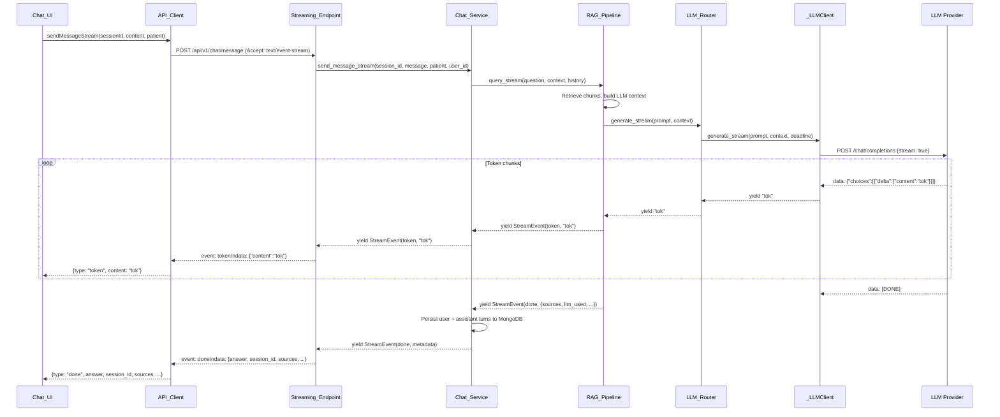
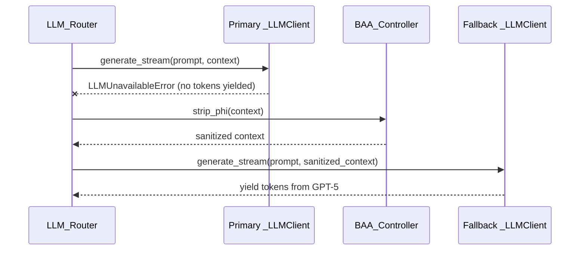

# Design Document: LLM Response Streaming

## Overview

This feature replaces the existing non-streaming `POST /api/v1/chat/message` endpoint with a Server-Sent Events (SSE) streaming endpoint at the same path. Tokens are delivered incrementally from the LLM through the full stack: `_LLMClient` → `LLMRouter` → `LlamaIndexPipeline` → `ChatService` → FastAPI endpoint → frontend `API_Client` → `Chat_UI`.

The existing SSE infrastructure (`sse-starlette`, `EventSourceResponse`) is already used by the MCP servers in `BaseMCPServer`. Both LLM providers (MedicalQwen3-Reasoning-4B via Model_Container and GPT-5 via OpenAI) support the OpenAI-compatible streaming protocol (`stream: true` in `/chat/completions`).

The non-streaming `generate` method on `LLMRouter` and `query` method on `LlamaIndexPipeline` are preserved for non-chat callers (diagnose pipeline). The non-streaming `send_message` on `ChatService`, the `ChatMessageResponse` model, and the `sendMessage` client method are all removed.

### Design Rationale

- **SSE over WebSocket**: SSE is simpler, works over standard HTTP, and aligns with the existing MCP server pattern. The chat protocol is unidirectional (server → client) during generation, making SSE the natural fit.
- **Same path replacement**: Keeping `POST /api/v1/chat/message` avoids frontend routing changes and API versioning complexity. The response `Content-Type` changes from `application/json` to `text/event-stream`.
- **No mid-stream fallback**: If the primary LLM fails after tokens have been yielded, the partial response is already visible to the user. Switching models mid-stream would produce incoherent output. Instead, an `error` event is emitted.

## Architecture



### Fallback Flow (pre-token failure)



## Components and Interfaces

### 1. `_LLMClient.generate_stream()` — New Method

```python
async def generate_stream(
    self, prompt: str, context: list[dict], *, deadline: float
) -> AsyncIterator[str]:
```

- Sends `POST /chat/completions` with `stream: true` and `Accept: text/event-stream`
- Uses `httpx.AsyncClient.stream()` context manager (not `.post()`) to obtain a streaming response, then parses SSE lines via `response.aiter_lines()`
- Yields non-empty `delta.content` strings
- Stops on `data: [DONE]`
- Raises `LLMUnavailableError` on connection failure or timeout
- Does NOT use `RetryPolicy` internally — retries are handled at the `LLMRouter` level via circuit breaker state (retrying a partial stream is not meaningful)
- The existing `generate()` method remains unchanged

### 2. `LLMRouter.generate_stream()` — New Method

```python
async def generate_stream(
    self, prompt: str, context: list[dict]
) -> AsyncIterator[StreamChunk]:
```

Where `StreamChunk` is:
```python
@dataclass
class StreamChunk:
    token: str | None = None       # Non-None for token chunks
    error: str | None = None       # Non-None for error events
    fallback_used: bool = False
    llm_used: str = ""
```

- Attempts primary model first: checks `_primary_cb` circuit breaker state before starting the stream (circuit breaker cannot wrap an async generator directly). If the circuit is open, skips to fallback immediately. If closed, calls `_primary.generate_stream()` and records success/failure on the circuit breaker manually after the iterator completes or raises.
- If primary fails (circuit open or `LLMUnavailableError`) **before any tokens yielded**: strips PHI via `BAA_Controller`, falls back to GPT-5
- If primary fails **after tokens yielded**: yields a `StreamChunk` with `error` set, does NOT fallback
- Records Prometheus metrics for both success and failure paths
- If both models fail: raises `HTTPException(503)` with the standard `LLM_UNAVAILABLE` body

### 3. `LlamaIndexPipeline.query_stream()` — New Method

```python
async def query_stream(
    self,
    question: str,
    context: PatientProfile | None = None,
    top_k: int = 5,
    region: str | None = None,
    source_filter: dict[str, Any] | None = None,
    session_history: list[dict[str, Any]] | None = None,
    system_prompt: str | None = None,
) -> AsyncIterator[StreamEvent]:
```

Where `StreamEvent` is:
```python
@dataclass
class StreamEvent:
    type: str                          # "token" | "done" | "error"
    content: str | None = None         # Token text (for type="token")
    sources: list[DocumentSource] | None = None
    llm_used: str | None = None
    fallback_used: bool = False
    confidence_score: float | None = None
    error: str | None = None
    retryable: bool = False
```

- Performs cache lookup first. If cached: yields the full answer as a single token event, then a done event with metadata
- Performs document retrieval synchronously (same as `query()`)
- Calls `LLMRouter.generate_stream()` and yields `StreamEvent(type="token")` for each chunk
- Accumulates the full answer text during streaming
- After streaming completes: caches the assembled `RAGResponse`, yields `StreamEvent(type="done")` with the full assembled answer text, sources, and metadata
- On error: yields `StreamEvent(type="error")`

### 4. `ChatService.send_message_stream()` — New Method

```python
async def send_message_stream(
    self,
    session_id: str | None,
    user_message: str,
    patient_context: PatientProfile | None = None,
    user_id: str | None = None,
) -> AsyncIterator[StreamEvent]:
```

- Creates session if `session_id` is None
- Loads and caps history at 20 messages
- Delegates to `RAG_Pipeline.query_stream()`
- Yields all `StreamEvent`s from the pipeline
- After the `done` event: persists user turn + assembled assistant turn to MongoDB
- On mid-stream error: persists user turn only, omits assistant turn

### 5. Streaming Endpoint — `POST /api/v1/chat/message`

```python
@router.post("/message")
@limiter.limit("60/minute")
async def stream_message(
    request: Request,
    body: ChatMessageRequest,
    current_user: dict = Depends(require_role([...])),
    chat_service: ChatService = Depends(get_chat_service),
) -> EventSourceResponse:
```

- Returns `EventSourceResponse` wrapping an async generator
- The generator calls `chat_service.send_message_stream()` and converts each `StreamEvent` to SSE format:
  - `StreamEvent(type="token")` → `event: token`, `data: {"content": "..."}`
  - `StreamEvent(type="done")` → `event: done`, `data: {"answer": ..., "session_id": ..., "sources": ..., ...}`
  - `StreamEvent(type="error")` → `event: error`, `data: {"error": ..., "retryable": ...}`
- Same auth (`require_role`) and rate limiting (`60/minute`) as the current endpoint
- `ChatMessageResponse` model is removed; `ChatMessageRequest` is preserved

### 6. `API_Client.sendMessageStream()` — New Method (TypeScript)

```typescript
async function* sendMessageStream(
  sessionId: string,
  content: string,
  patientContext?: PatientProfile,
  signal?: AbortSignal,
): AsyncGenerator<StreamEvent>
```

Where `StreamEvent` (TypeScript):
```typescript
type StreamEvent =
  | { type: "token"; content: string }
  | { type: "done"; answer: string; session_id: string; sources: DocumentSource[]; llm_used: string; fallback_warning: string | null; warnings_present: boolean }
  | { type: "error"; error: string; retryable: boolean };
```

- Sends `POST /api/v1/chat/message` with `credentials: 'include'` and CSRF header
- Reads the response body as a `ReadableStream`, parsing SSE lines manually (no external SSE library needed — the protocol is simple)
- Yields parsed `StreamEvent` objects
- Supports `AbortSignal` for cancellation
- The existing `sendMessage` method is removed

### 7. Chat_UI Changes

- `handleSend()` switches from `apiClient.chat.sendMessage()` to `apiClient.chat.sendMessageStream()`
- During streaming: renders a `MessageBubble` with incrementally appended content and a blinking cursor indicator (CSS animation)
- `ThinkingBubble` is shown only until the first token arrives, then replaced by the streaming `MessageBubble`
- On `done` event: removes cursor, attaches sources, finalizes message
- On `error` event: shows error banner with retry button if `retryable`
- Auto-scroll pauses when user scrolls up; resumes when user scrolls to bottom
- "New Session" and navigation abort the stream via `AbortController.abort()`
- Stores an `AbortController` ref that is created per-send and cleaned up on completion

## Data Models

### SSE Event Wire Format

```
event: token
data: {"content": "The"}

event: token
data: {"content": " recommended"}

event: done
data: {"answer": "The recommended treatment is...", "session_id": "abc-123", "sources": [...], "llm_used": "MedicalQwen3-Reasoning-4B", "fallback_warning": null, "warnings_present": false}
```

Error case:
```
event: error
data: {"error": "LLM service unavailable", "retryable": true}
```

### Backend Data Classes

```python
# backend/services/llm_router.py
@dataclass
class StreamChunk:
    """A single chunk from the LLM streaming response."""
    token: str | None = None
    error: str | None = None
    fallback_used: bool = False
    llm_used: str = ""

# backend/services/llamaindex_pipeline.py (or a shared models file)
@dataclass
class StreamEvent:
    """Event yielded by the RAG pipeline and ChatService streaming methods."""
    type: str                                    # "token" | "done" | "error"
    content: str | None = None
    answer: str | None = None                    # Full assembled text (for type="done")
    sources: list[DocumentSource] | None = None
    llm_used: str | None = None
    fallback_used: bool = False
    confidence_score: float | None = None
    error: str | None = None
    retryable: bool = False
```

### Frontend Types

```typescript
// packages/api-client/index.ts
export type StreamEvent =
  | { type: "token"; content: string }
  | {
      type: "done";
      session_id: string;
      sources: DocumentSource[];
      llm_used: string;
      fallback_warning: string | null;
      warnings_present: boolean;
    }
  | { type: "error"; error: string; retryable: boolean };
```

### MongoDB Persistence (Unchanged)

The `chat_sessions` collection schema is unchanged. Both user and assistant turns are persisted with the same structure as today. The assistant turn's `content` field contains the fully assembled response text (all tokens concatenated). Persistence happens after the stream completes (on `done`) or partially (user turn only, on mid-stream error).


## Correctness Properties

*A property is a characteristic or behavior that should hold true across all valid executions of a system — essentially, a formal statement about what the system should do. Properties serve as the bridge between human-readable specifications and machine-verifiable correctness guarantees.*

### Property 1: LLM Client Stream Parsing

*For any* sequence of SSE lines from an OpenAI-compatible `/chat/completions` streaming response — containing zero or more chunks with non-empty `delta.content`, zero or more chunks with empty `delta.content`, and a terminal `data: [DONE]` line — the `_LLMClient.generate_stream()` async iterator SHALL yield exactly the non-empty `delta.content` strings in order and then stop iteration.

**Validates: Requirements 1.1, 1.2, 1.3**

### Property 2: Pre-Token Fallback with PHI Stripping

*For any* prompt and context list, when the primary LLM fails (via `LLMUnavailableError` or `CircuitOpenError`) before any tokens have been yielded, the `LLMRouter.generate_stream()` SHALL invoke `BAA_Controller.strip_phi()` on the context and then yield token chunks from the fallback (GPT-5) LLM client's streaming response.

**Validates: Requirements 2.2, 2.4**

### Property 3: No Mid-Stream Fallback

*For any* positive number of tokens already yielded from the primary LLM during `LLMRouter.generate_stream()`, if the primary LLM fails after those tokens have been yielded, the router SHALL NOT invoke the fallback LLM and SHALL instead yield a `StreamChunk` with a non-None `error` field.

**Validates: Requirement 2.3**

### Property 4: Stream Event Ordering

*For any* streaming query through `LlamaIndexPipeline.query_stream()`, the yielded `StreamEvent` sequence SHALL consist of zero or more events with `type="token"` followed by exactly one event with `type="done"` (or exactly one event with `type="error"`), and no `token` events SHALL appear after the terminal event.

**Validates: Requirements 3.2**

### Property 5: Cache Hit Streaming

*For any* `RAGResponse` present in the cache for a given query, `LlamaIndexPipeline.query_stream()` SHALL yield exactly one `StreamEvent` with `type="token"` whose `content` equals the cached `RAGResponse.answer`, followed by exactly one `StreamEvent` with `type="done"` whose `sources`, `llm_used`, and `fallback_used` fields match the cached response — without invoking `LLMRouter.generate_stream()`.

**Validates: Requirements 3.3**

### Property 6: SSE Event Serialization

*For any* `StreamEvent` (token, done, or error) with arbitrary valid field values, the SSE serialization produced by the streaming endpoint SHALL have a valid `event:` line matching the event type and a `data:` line containing valid JSON that is parseable by `JSON.parse` without error, and the parsed JSON SHALL contain all required fields for that event type (`content` for token; `answer`, `session_id`, `sources`, `llm_used`, `fallback_warning`, `warnings_present` for done; `error`, `retryable` for error).

**Validates: Requirements 4.3, 4.4, 8.1, 8.2, 8.3, 8.4**

### Property 7: Frontend SSE Parse Round-Trip

*For any* SSE text stream containing token, done, and error events with valid JSON data fields, the `API_Client` SSE parser SHALL yield `StreamEvent` objects whose `type` field matches the SSE `event:` line and whose data fields match the parsed JSON — i.e., `serialize(event) |> parse` produces an equivalent `StreamEvent`.

**Validates: Requirements 6.2, 6.3**

## Error Handling

### LLM Client Layer (`_LLMClient.generate_stream`)

| Failure | Behavior |
|---|---|
| HTTP connection error / timeout | Raise `LLMUnavailableError` |
| Non-2xx HTTP status | Raise `LLMUnavailableError` |
| Malformed SSE chunk (no `delta.content`) | Skip chunk, continue iterating |
| `data: [DONE]` received | Stop iteration normally |

### LLM Router Layer (`LLMRouter.generate_stream`)

| Failure | Behavior |
|---|---|
| Primary fails before any tokens yielded | Strip PHI, fall back to GPT-5 |
| Primary fails after tokens yielded | Yield `StreamChunk(error=...)`, no fallback |
| Primary circuit breaker OPEN | Skip primary, fall back to GPT-5 |
| Both primary and fallback fail | Raise `HTTPException(503)` with `LLM_UNAVAILABLE` |
| BAA PHI stripping fails | Raise `HTTPException(503)` with `PHI_STRIP_FAILED` |

### RAG Pipeline Layer (`LlamaIndexPipeline.query_stream`)

| Failure | Behavior |
|---|---|
| Document retrieval fails | Yield `StreamEvent(type="error", retryable=True)` |
| LLM Router raises HTTPException | Yield `StreamEvent(type="error")` with message from exception |
| LLM Router yields error StreamChunk | Forward as `StreamEvent(type="error")` |
| Cache read fails | Log warning, proceed without cache (non-fatal) |
| Cache write fails | Log warning, response still delivered (non-fatal) |

### Chat Service Layer (`ChatService.send_message_stream`)

| Failure | Behavior |
|---|---|
| Session history load fails | Yield `StreamEvent(type="error", retryable=True)` |
| Mid-stream error from pipeline | Forward error event, persist user turn only |
| MongoDB persistence fails after stream | Log error; stream already delivered to client |

### Streaming Endpoint

| Failure | Behavior |
|---|---|
| Authentication failure | Return HTTP 401 (before SSE stream starts) |
| Rate limit exceeded | Return HTTP 429 (before SSE stream starts) |
| Request validation failure | Return HTTP 422 (before SSE stream starts) |
| Error during streaming | Emit `event: error` SSE event, close stream |

### Frontend (`API_Client` / `Chat_UI`)

| Failure | Behavior |
|---|---|
| Network error during fetch | Reject the async iterable; UI shows error with retry |
| `error` event received | Yield `{type: "error"}`, UI shows message + retry button if retryable |
| Stream aborted by user | `AbortSignal` triggers, iteration stops cleanly |
| Malformed SSE data (non-JSON) | Skip the event, log warning to console |

## Testing Strategy

### Property-Based Tests (Hypothesis — Python)

Property-based testing is appropriate for this feature because the core logic involves stream parsing, event serialization, and fallback decision-making — all pure or near-pure functions with clear input/output contracts and large input spaces.

**Library**: [Hypothesis](https://hypothesis.readthedocs.io/) (already in use — see `.hypothesis/` directory and `backend/requirements.txt`)

**Configuration**: Minimum 100 iterations per property test (`@settings(max_examples=100)`)

**Tag format**: `# Feature: llm-response-streaming, Property N: <property_text>`

| Property | Test Target | Strategy |
|---|---|---|
| Property 1: LLM Client Stream Parsing | `_LLMClient.generate_stream` | Generate random sequences of SSE lines (mix of valid tokens, empty deltas, [DONE]). Mock `httpx.AsyncClient` to return the sequence. Verify the async iterator yields exactly the non-empty tokens. |
| Property 2: Pre-Token Fallback with PHI Stripping | `LLMRouter.generate_stream` | Generate random prompts/contexts. Mock primary to raise `LLMUnavailableError`. Verify `BAA_Controller.strip_phi` is called and fallback client's `generate_stream` is invoked with sanitized context. |
| Property 3: No Mid-Stream Fallback | `LLMRouter.generate_stream` | Generate a random positive number of tokens (1–50). Mock primary to yield that many tokens then raise. Verify fallback is never called and an error chunk is yielded. |
| Property 4: Stream Event Ordering | `LlamaIndexPipeline.query_stream` | Generate random token sequences. Mock the LLM router. Collect all yielded events. Verify all `token` events precede the single terminal event. |
| Property 5: Cache Hit Streaming | `LlamaIndexPipeline.query_stream` | Generate random `RAGResponse` objects. Pre-populate the cache. Verify the stream yields one token event with the cached answer and one done event with matching metadata, and `generate_stream` is not called. |
| Property 6: SSE Event Serialization | SSE serializer function | Generate random `StreamEvent` instances (all three types). Serialize to SSE format. Parse the `data:` line as JSON. Verify all required fields are present and values match. |
| Property 7: Frontend SSE Parse Round-Trip | `parseSSEStream` (TypeScript) | Generate random SSE text streams. Parse with the client's SSE parser. Verify yielded `StreamEvent` objects match the original event data. (Run via Vitest with `fast-check`.) |

### Frontend Property-Based Tests (fast-check — TypeScript)

**Library**: [fast-check](https://fast-check.dev/) (for Vitest)

Property 7 is tested on the frontend side using `fast-check` to generate arbitrary SSE text payloads and verify the parser produces correct `StreamEvent` objects.

### Unit Tests (Example-Based)

| Area | Tests |
|---|---|
| `_LLMClient.generate_stream` | Connection error raises `LLMUnavailableError`; timeout raises `LLMUnavailableError` |
| `LLMRouter.generate_stream` | Happy path yields primary tokens; both-fail raises 503; metrics are recorded |
| `LlamaIndexPipeline.query_stream` | Retrieval + streaming integration; cache write after completion |
| `ChatService.send_message_stream` | New session creation; history loading; mid-stream error persists user turn only |
| Streaming endpoint | Auth enforcement (401); rate limiting (429); request validation (422); full SSE stream integration |
| `API_Client.sendMessageStream` | AbortSignal cancellation; error event handling |
| `Chat_UI` | Token-by-token rendering; streaming indicator; done finalizes message; scroll behavior; retry on error; abort on navigation |

### Integration Tests

| Scenario | Approach |
|---|---|
| Full stack streaming | Start FastAPI test server, send a chat message, consume the SSE stream, verify token events arrive followed by done event |
| MongoDB persistence | After streaming completes, query MongoDB and verify both turns are persisted |
| Fallback integration | Mock primary LLM to fail, verify GPT-5 fallback produces a valid stream |

### Smoke Tests

| Check | What |
|---|---|
| Backward compatibility | `LLMRouter.generate()` and `LlamaIndexPipeline.query()` still work for diagnose pipeline |
| Endpoint registration | `POST /api/v1/chat/message` returns `text/event-stream` |
| Legacy removal | `ChatMessageResponse`, `sendMessage`, `ChatService.send_message` no longer exist |
