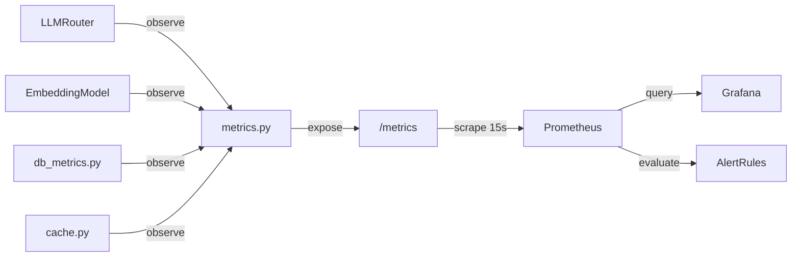
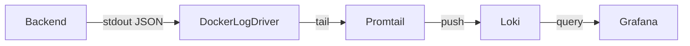
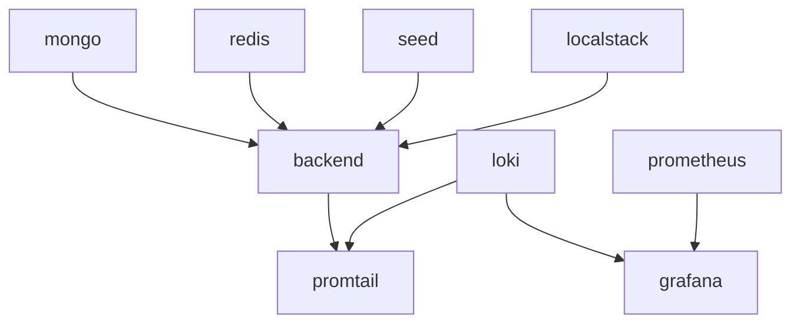

# Design Document: Observability

## Overview

This document describes the technical design for extending the Diagno-Pilot observability stack across three areas: application-level Prometheus metrics, local log aggregation with Loki/Grafana, and a production deployment guide.

---

## Architecture

### Metrics Flow



### Log Pipeline



### Docker Compose Dependency Graph



---

## Component Design

### 1. `backend/core/metrics.py` — Complete Rewrite

All custom Prometheus metrics are defined here as module-level singletons. No other module may instantiate `Counter`, `Histogram`, or `Gauge` for application metrics.

```python
"""Custom Prometheus metrics for Diagno-Pilot.

Metrics registry:
  diagno_pilot_llm_duration_seconds     Histogram  model, status
  diagno_pilot_llm_requests_total       Counter    model, status
  diagno_pilot_circuit_breaker_open_total Counter  service
  diagno_pilot_embedding_duration_seconds Histogram status
  diagno_pilot_embedding_requests_total Counter    status
  diagno_pilot_db_query_duration_seconds Histogram collection, operation
  diagno_pilot_db_errors_total          Counter    collection, operation
  diagno_pilot_cache_hits_total         Counter    cache
  diagno_pilot_cache_misses_total       Counter    cache
  diagno_pilot_cache_degraded           Gauge      (none)
"""
from prometheus_client import Counter, Gauge, Histogram

# --- LLM ---
llm_duration_seconds = Histogram(
    "diagno_pilot_llm_duration_seconds",
    "LLM request duration in seconds",
    ["model", "status"],
    buckets=[0.5, 1.0, 2.0, 5.0, 10.0, 30.0, 60.0],
)

llm_requests_total = Counter(
    "diagno_pilot_llm_requests_total",
    "Total LLM requests by model and status",
    ["model", "status"],
)

circuit_breaker_open_total = Counter(
    "diagno_pilot_circuit_breaker_open_total",
    "Number of times the circuit breaker has opened",
    ["service"],
)

# --- Embedding ---
embedding_duration_seconds = Histogram(
    "diagno_pilot_embedding_duration_seconds",
    "Embedding API call duration in seconds",
    ["status"],
    buckets=[0.1, 0.25, 0.5, 1.0, 2.0, 5.0],
)

embedding_requests_total = Counter(
    "diagno_pilot_embedding_requests_total",
    "Total embedding API calls by status",
    ["status"],
)

# --- MongoDB ---
db_query_duration_seconds = Histogram(
    "diagno_pilot_db_query_duration_seconds",
    "MongoDB query duration in seconds",
    ["collection", "operation"],
    buckets=[0.005, 0.01, 0.025, 0.05, 0.1, 0.25, 0.5, 1.0],
)

db_errors_total = Counter(
    "diagno_pilot_db_errors_total",
    "Total MongoDB operation errors",
    ["collection", "operation"],
)

# --- Cache ---
cache_hits_total = Counter(
    "diagno_pilot_cache_hits_total",
    "Cache hits by cache name",
    ["cache"],
)

cache_misses_total = Counter(
    "diagno_pilot_cache_misses_total",
    "Cache misses by cache name",
    ["cache"],
)

cache_degraded = Gauge(
    "diagno_pilot_cache_degraded",
    "1 when cache is in degraded mode (Redis unreachable), 0 otherwise",
)
```

---

### 2. `backend/core/db_metrics.py` — DB Instrumentation Utility

```python
"""Shared async context manager for MongoDB operation instrumentation."""
from __future__ import annotations

import time
from contextlib import asynccontextmanager
from typing import AsyncGenerator

from backend.core.metrics import db_errors_total, db_query_duration_seconds


@asynccontextmanager
async def timed_db_op(collection: str, operation: str) -> AsyncGenerator[None, None]:
    """Record duration and errors for a MongoDB operation.

    Usage:
        async with timed_db_op("patients", "find_one"):
            result = await db.patients.find_one({"_id": id})
    """
    t0 = time.perf_counter()
    try:
        yield
    except Exception:
        db_errors_total.labels(collection=collection, operation=operation).inc()
        raise
    finally:
        db_query_duration_seconds.labels(
            collection=collection, operation=operation
        ).observe(time.perf_counter() - t0)
```

---

### 3. `backend/services/llm_router.py` — Changes

- Add `status` label to `llm_duration_seconds.observe()` calls on both primary and fallback paths.
- Use `PRIMARY_MODEL` / `FALLBACK_MODEL` constants as the `model` label value (currently `"qwen3"` and `"gpt5"` — keep as-is since they are the stable short identifiers used throughout the codebase).
- Increment `circuit_breaker_open_total.labels(service="qwen3")` inside the `except CircuitOpenError` block for the primary LLM.

Key diff:
```python
# Before
llm_duration_seconds.labels(model="qwen3").observe(time.perf_counter() - t0)

# After
llm_duration_seconds.labels(model="qwen3", status="success").observe(time.perf_counter() - t0)

# On CircuitOpenError for primary:
circuit_breaker_open_total.labels(service="qwen3").inc()
```

---

### 4. `backend/services/embedding_service.py` — Changes

- Import `embedding_duration_seconds`, `embedding_requests_total` from `backend.core.metrics`.
- Import `cache_hits_total`, `cache_misses_total` from `backend.core.metrics` (not `backend.core.cache`).
- Wrap `_call_api()` with timing and record on success/error.

```python
t0 = time.perf_counter()
try:
    vector = await self._call_api(text)
    embedding_duration_seconds.labels(status="success").observe(time.perf_counter() - t0)
    embedding_requests_total.labels(status="success").inc()
except Exception:
    embedding_duration_seconds.labels(status="error").observe(time.perf_counter() - t0)
    embedding_requests_total.labels(status="error").inc()
    raise
```

---

### 5. `backend/core/cache.py` — Changes

Remove the three local metric definitions (`cache_hits_total`, `cache_misses_total`, `cache_degraded`) and import them from `backend.core.metrics` instead. Update all `.labels(cache=...)` call sites to use the prefixed names.

---

### 6. Docker Compose Additions

Add the following services to `docker-compose.yml`:

```yaml
  loki:
    image: grafana/loki:2.9.4
    command: -config.file=/etc/loki/loki-config.yaml
    volumes:
      - ./docker/loki/loki-config.yaml:/etc/loki/loki-config.yaml:ro
      - loki_data:/loki
    healthcheck:
      test: ["CMD-SHELL", "wget -q --spider http://localhost:3100/ready || exit 1"]
      interval: 10s
      timeout: 5s
      retries: 5

  promtail:
    image: grafana/promtail:2.9.4
    command: -config.file=/etc/promtail/promtail-config.yaml
    volumes:
      - ./docker/promtail/promtail-config.yaml:/etc/promtail/promtail-config.yaml:ro
      - /var/lib/docker/containers:/var/lib/docker/containers:ro
      - promtail_positions:/tmp/positions
    depends_on:
      loki:
        condition: service_healthy

  grafana:
    image: grafana/grafana:10.4.2
    ports:
      - "3001:3000"
    environment:
      - GF_AUTH_ANONYMOUS_ENABLED=true
      - GF_AUTH_ANONYMOUS_ORG_ROLE=Admin
    volumes:
      - ./docker/grafana/provisioning:/etc/grafana/provisioning:ro
      - ./docker/grafana/dashboards:/var/lib/grafana/dashboards:ro
      - grafana_data:/var/lib/grafana
    depends_on:
      loki:
        condition: service_healthy

  prometheus:
    image: prom/prometheus:v2.51.2
    ports:
      - "9090:9090"
    command:
      - --config.file=/etc/prometheus/prometheus.yml
      - --storage.tsdb.retention.time=7d
    volumes:
      - ./docker/prometheus:/etc/prometheus:ro
      - prometheus_data:/prometheus
    depends_on:
      - backend
```

Add volumes: `loki_data`, `promtail_positions`, `grafana_data`, `prometheus_data`.

---

### 7. `docker/loki/loki-config.yaml`

```yaml
auth_enabled: false

server:
  http_listen_port: 3100

ingester:
  lifecycler:
    ring:
      kvstore:
        store: inmemory
      replication_factor: 1
  chunk_idle_period: 5m
  max_chunk_age: 1h

schema_config:
  configs:
    - from: 2024-01-01
      store: boltdb-shipper
      object_store: filesystem
      schema: v11
      index:
        prefix: index_
        period: 24h

storage_config:
  boltdb_shipper:
    active_index_directory: /loki/index
    cache_location: /loki/cache
  filesystem:
    directory: /loki/chunks

limits_config:
  retention_period: 72h
  max_line_size: 65536

compactor:
  working_directory: /loki/compactor
  retention_enabled: true
```

---

### 8. `docker/promtail/promtail-config.yaml`

```yaml
server:
  http_listen_port: 9080

positions:
  filename: /tmp/positions/positions.yaml

clients:
  - url: http://loki:3100/loki/api/v1/push
    backoff_config:
      max_period: 5m
    queue_config:
      capacity: 10000
      max_shards: 10
    # ~10 MB buffer
    batchsize: 1048576
    batchwait: 1s

scrape_configs:
  - job_name: docker
    docker_sd_configs:
      - host: unix:///var/run/docker.sock
        refresh_interval: 5s
    relabel_configs:
      - source_labels: [__meta_docker_container_name]
        target_label: container
    pipeline_stages:
      - json:
          expressions:
            level: level
            method: method
            status_code: status_code
            request_id: request_id
            path: path
            duration_ms: duration_ms
            message: message
      # Low-cardinality fields → Loki labels
      - labels:
          level:
          method:
          status_code:
      # High-cardinality fields → structured metadata (not labels)
      - structured_metadata:
          request_id:
          path:
          duration_ms:
          message:
```

---

### 9. `docker/prometheus/prometheus.yml`

```yaml
global:
  scrape_interval: 15s
  evaluation_interval: 15s

rule_files:
  - alerts.yml

scrape_configs:
  - job_name: diagno-pilot-backend
    static_configs:
      - targets: ["backend:8000"]
    metrics_path: /metrics
```

---

### 10. `docker/prometheus/alerts.yml`

```yaml
groups:
  - name: diagno-pilot
    rules:
      - alert: LLMHighErrorRate
        expr: |
          (
            sum(rate(diagno_pilot_llm_requests_total{status="error"}[5m]))
            /
            sum(rate(diagno_pilot_llm_requests_total[5m]))
          ) > 0.05
        for: 0m
        labels:
          severity: warning
        annotations:
          summary: "LLM error rate exceeds 5%"
          description: "LLM error ratio is {{ $value | humanizePercentage }} over the last 5 minutes."

      - alert: CircuitBreakerOpen
        expr: increase(diagno_pilot_circuit_breaker_open_total[1m]) > 0
        for: 1m
        labels:
          severity: critical
        annotations:
          summary: "Circuit breaker has been open for > 60 seconds"
          description: "Service {{ $labels.service }} circuit breaker opened and has not recovered."
```

---

### 11. `docker/grafana/provisioning/datasources/datasources.yaml`

```yaml
apiVersion: 1
datasources:
  - name: Loki
    type: loki
    access: proxy
    url: http://loki:3100
    isDefault: true

  - name: Prometheus
    type: prometheus
    access: proxy
    url: http://prometheus:9090
```

---

### 12. `docker/grafana/provisioning/dashboards/dashboards.yaml`

```yaml
apiVersion: 1
providers:
  - name: default
    folder: Diagno-Pilot
    type: file
    options:
      path: /var/lib/grafana/dashboards
```

---

### 13. `docker/grafana/dashboards/diagno-pilot.json` — Panel Queries

| Panel | Type | Query |
|---|---|---|
| LLM Duration p50/p95/p99 | Time series | `histogram_quantile(0.50, sum(rate(diagno_pilot_llm_duration_seconds_bucket[5m])) by (le, model))` (repeat for 0.95, 0.99) |
| Cache Hit Ratio | Time series | `sum(rate(diagno_pilot_cache_hits_total[5m])) by (cache) / (sum(rate(diagno_pilot_cache_hits_total[5m])) by (cache) + sum(rate(diagno_pilot_cache_misses_total[5m])) by (cache))` |
| DB Query Duration by Collection | Time series | `histogram_quantile(0.95, sum(rate(diagno_pilot_db_query_duration_seconds_bucket[5m])) by (le, collection))` |
| Log Volume | Bar chart | Loki: `sum(count_over_time({container="backend"}[1m])) by (level)` |

---

## Property-Based Testing

Five correctness properties to validate with Hypothesis:

| # | Property | Metric(s) |
|---|---|---|
| 1 | Importing `backend.core.metrics` multiple times never raises `ValueError` (singleton guarantee) | all |
| 2 | For any N completed LLM calls, `diagno_pilot_llm_requests_total` sum equals N | `llm_requests_total` |
| 3 | For any N `encode()` calls, `diagno_pilot_embedding_requests_total` success + error == N | `embedding_requests_total` |
| 4 | For any N DB operations, `diagno_pilot_db_query_duration_seconds` observation count == N | `db_query_duration_seconds` |
| 5 | For any N cache `get()` calls, `cache_hits_total + cache_misses_total == N` | `cache_hits_total`, `cache_misses_total` |

Each property test uses `hypothesis` (already present in the repo) with `@given` strategies generating arbitrary sequences of success/error outcomes.
