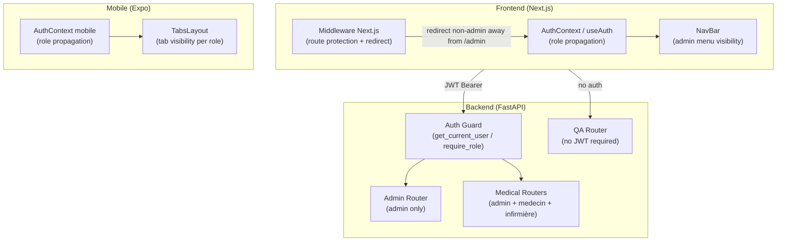

# Design Document — Contrôle d'accès basé sur les rôles (RBAC)

## Overview

Ce document décrit la conception technique du système RBAC pour Diagno-Pilot. L'objectif est d'introduire quatre rôles formels (`admin`, `medecin`, `infirmière`, `guest`) avec une application cohérente sur les trois couches : backend FastAPI, frontend Next.js et application mobile React Native/Expo.

Le rôle `guest` est le seul rôle anonyme : il donne accès à l'assistant QA sans authentification. Tous les autres accès non authentifiés redirigent vers la page de connexion (pas de 401/403 côté client). Le menu d'administration est invisible pour les rôles non-admin, et cette règle est appliquée à la fois côté client et dans le middleware Next.js.

---

## Architecture

Le RBAC traverse trois couches indépendantes qui se renforcent mutuellement :



**Principes de conception :**
- La protection backend est la source de vérité — le frontend ne fait que refléter les droits.
- Le middleware Next.js protège les routes serveur avant que React ne s'hydrate.
- Le rôle `guest` est traité comme l'absence d'authentification côté backend (pas de JWT requis pour `/api/v1/qa`).
- La rétrocompatibilité avec le rôle `pharmacien` est assurée en le traitant comme `guest`.

---

## Components and Interfaces

### Backend

#### `UserRole` enum (backend/models/common.py)

Remplacement de l'enum existant pour inclure les quatre rôles :

```python
class UserRole(str, Enum):
    ADMIN     = "admin"
    MEDECIN   = "medecin"
    INFIRMIERE = "infirmière"
    GUEST     = "guest"
```

Le rôle `pharmacien` est retiré de l'enum mais géré en rétrocompatibilité dans `get_current_user`.

#### `get_current_user` (backend/core/auth.py)

Modification pour :
1. Accepter un token optionnel (pour les routes publiques comme `/api/v1/qa`).
2. Mapper le rôle `pharmacien` vers `guest` si présent dans un token existant.

```python
async def get_current_user_optional(
    token: str | None = Depends(oauth2_scheme_optional)
) -> dict | None:
    """Retourne l'utilisateur ou None si pas de token (pour les routes publiques)."""
    ...

async def get_current_user(token: str = Depends(oauth2_scheme)) -> dict:
    """Comme avant, mais mappe pharmacien → guest pour rétrocompatibilité."""
    ...
```

#### `require_role` (backend/core/auth.py)

Inchangé dans son interface. Les appels existants avec `["admin"]` continuent de fonctionner.

#### Nouveau router QA (backend/routers/qa.py)

```python
router = APIRouter(prefix="/qa", tags=["qa"])

@router.post("/")
async def qa_query(body: QARequest):
    """Endpoint public — pas de JWT requis. Accessible aux guests."""
    ...
```

#### Nouveau router admin/users (backend/routers/admin.py)

Ajout des endpoints de gestion des utilisateurs :

```python
@router.get("/users", dependencies=[Depends(require_role(["admin"]))])
async def list_users(): ...

@router.post("/users", dependencies=[Depends(require_role(["admin"]))])
async def create_user(data: UserCreate): ...

@router.put("/users/{id}", dependencies=[Depends(require_role(["admin"]))])
async def update_user(id: str, data: UserUpdate): ...
```

#### Nouveau router admin/stats (backend/routers/admin.py)

```python
@router.get("/stats", dependencies=[Depends(require_role(["admin"]))])
async def get_stats(): ...
```

### Frontend Web (Next.js)

#### `UserRole` type (packages/types/index.ts)

```typescript
export type UserRole = 'admin' | 'medecin' | 'infirmière' | 'guest';
```

#### `AuthContext` / `useAuth` (apps/web/src/contexts/AuthContext.tsx)

Aucun changement d'interface. Le type `UserRole` est mis à jour dans `@diagno-pilot/types`. Le hook `useAuth` retourne déjà `user.role` typé `UserRole`.

#### Middleware Next.js (apps/web/src/middleware.ts)

Le middleware est étendu pour :
1. Lire le token JWT depuis le cookie httpOnly.
2. Décoder le rôle sans vérification de signature (lecture seule, la vérification reste côté backend).
3. Rediriger `/[locale]/admin` vers `/[locale]` si le rôle n'est pas `admin`.
4. Laisser passer `/qa` et `/[locale]/qa` sans authentification.
5. Rediriger toute route protégée sans token vers `/[locale]/login`.

```typescript
// Pseudo-code du middleware étendu
export async function middleware(request: NextRequest) {
  const { pathname } = request.nextUrl;

  // Routes publiques — pas de vérification
  if (isPublicPath(pathname)) return intlMiddleware(request);

  const token = request.cookies.get('access_token')?.value;
  const role = token ? decodeRoleFromJwt(token) : null;

  // Protection de la route admin
  if (pathname.includes('/admin') && role !== 'admin') {
    return NextResponse.redirect(new URL(`/${locale}`, request.url));
  }

  // Redirection vers login si non authentifié
  if (!token && !isQaPath(pathname)) {
    return NextResponse.redirect(new URL(`/${locale}/login`, request.url));
  }

  return intlMiddleware(request);
}
```

#### `NavBar` (apps/web/src/components/NavBar.tsx)

Déjà implémenté pour masquer le lien admin si `user?.role !== 'admin'`. Aucun changement nécessaire sauf la mise à jour du type `UserRole`.

### Mobile (React Native / Expo)

#### `AuthContext` mobile (apps/mobile/src/contexts/AuthContext.tsx)

Aucun changement d'interface. Le type `UserRole` est mis à jour.

#### `TabsLayout` (apps/mobile/app/(tabs)/_layout.tsx)

Le layout est rendu conditionnel selon le rôle :

```typescript
const MEDICAL_ROLES: UserRole[] = ['medecin', 'infirmière', 'admin'];

export default function TabsLayout() {
  const { user } = useAuth();
  const role = user?.role ?? 'guest';

  return (
    <Tabs ...>
      {/* Onglets médicaux — visibles pour medecin, infirmière, admin */}
      {MEDICAL_ROLES.includes(role) && (
        <>
          <Tabs.Screen name="diagnose" ... />
          <Tabs.Screen name="chat" ... />
          <Tabs.Screen name="patients" ... />
        </>
      )}
      {/* QA — visible pour tous */}
      <Tabs.Screen name="qa" ... />
      {/* Profil — visible pour les utilisateurs authentifiés */}
      {role !== 'guest' && <Tabs.Screen name="profile" ... />}
    </Tabs>
  );
}
```

---

## Data Models

### User (MongoDB)

```typescript
interface UserDocument {
  _id: ObjectId;
  email: string;
  password_hash: string;
  role: 'admin' | 'medecin' | 'infirmière' | 'guest';  // étendu
  full_name: string;
  locale: 'fr' | 'en';
  created_at: Date;
  last_login?: Date;
  is_active: boolean;  // nouveau champ pour désactivation
}
```

### JWT Payload

```typescript
interface JwtPayload {
  sub: string;       // user_id (MongoDB ObjectId string)
  role: UserRole;    // rôle au moment de l'émission du token
  exp: number;       // timestamp d'expiration
}
```

### Matrice des permissions

| Endpoint / Ressource | admin | medecin | infirmière | guest (anonyme) |
|---|---|---|---|---|
| `GET /api/v1/auth/me` | ✅ | ✅ | ✅ | ❌ → login |
| `POST /api/v1/chat/message` | ✅ | ✅ | ✅ | ❌ → login |
| `GET /api/v1/patients` | ✅ | ✅ | ✅ | ❌ → login |
| `POST /api/v1/diagnose/symptoms` | ✅ | ✅ | ✅ | ❌ → login |
| `POST /api/v1/qa` | ✅ | ✅ | ✅ | ✅ (sans JWT) |
| `GET /api/v1/admin/*` | ✅ | ❌ 403 | ❌ 403 | ❌ → login |
| `GET /[locale]/admin` | ✅ | ❌ → home | ❌ → home | ❌ → login |
| `GET /qa` | ✅ | ✅ | ✅ | ✅ (sans login) |

### Rétrocompatibilité `pharmacien`

Les tokens JWT existants avec `role: "pharmacien"` sont mappés vers `guest` dans `get_current_user` :

```python
LEGACY_ROLE_MAP = {"pharmacien": "guest"}

role = user_doc.get("role")
effective_role = LEGACY_ROLE_MAP.get(role, role)
```

---


## Correctness Properties

*A property is a characteristic or behavior that should hold true across all valid executions of a system — essentially, a formal statement about what the system should do. Properties serve as the bridge between human-readable specifications and machine-verifiable correctness guarantees.*

### Property 1 : Validation des rôles valides

*For any* string value, it is accepted as a valid `UserRole` if and only if it belongs to the set `{'admin', 'medecin', 'infirmière', 'guest'}`. Any other string must be rejected.

**Validates: Requirements 1.1, 1.2**

---

### Property 2 : Round-trip rôle via /auth/me

*For any* utilisateur créé avec un rôle valide, l'appel à `/api/v1/auth/me` après authentification doit retourner exactement le même rôle que celui stocké en base de données.

**Validates: Requirements 1.4, 7.1**

---

### Property 3 : Admin autorisé sur tous les endpoints d'administration

*For any* requête envoyée par un utilisateur avec le rôle `admin` à n'importe quel endpoint sous `/api/v1/admin/*`, la réponse ne doit pas être 401 ni 403.

**Validates: Requirements 2.1**

---

### Property 4 : Non-admin rejeté sur les endpoints d'administration

*For any* utilisateur avec un rôle différent de `admin` (`medecin`, `infirmière`, `guest`), toute requête à un endpoint sous `/api/v1/admin/*` doit retourner HTTP 403.

**Validates: Requirements 2.2, 4.2, 5.3**

---

### Property 5 : Rôles médicaux autorisés sur les ressources médicales

*For any* utilisateur avec le rôle `admin`, `medecin` ou `infirmière`, toute requête aux endpoints `/api/v1/patients`, `/api/v1/diagnose` ou `/api/v1/chat` doit être autorisée (pas de 401 ni 403).

**Validates: Requirements 2.3, 6.1**

---

### Property 6 : Requêtes non authentifiées redirigées vers login

*For any* endpoint protégé autre que `/api/v1/qa`, une requête sans token JWT valide doit recevoir une réponse de redirection vers la page de connexion (HTTP 302/307 ou réponse indiquant la redirection).

**Validates: Requirements 2.5, 9.4**

---

### Property 7 : Visibilité du menu admin corrélée au rôle

*For any* utilisateur authentifié, le lien de navigation vers `/admin` est présent dans le rendu du `NavBar` si et seulement si le rôle de l'utilisateur est `admin`.

**Validates: Requirements 3.1, 3.2**

---

### Property 8 : Middleware redirige les non-admins hors de /admin

*For any* requête vers une URL contenant `/admin` avec un token dont le rôle n'est pas `admin` (ou sans token), le middleware Next.js doit émettre une redirection vers la page d'accueil ou de connexion.

**Validates: Requirements 3.3**

---

### Property 9 : Audit log contient les métadonnées requises

*For any* accès admin aux statistiques ou modification de rôle utilisateur, l'entrée créée dans le journal d'audit doit contenir l'identifiant de l'utilisateur, un horodatage et l'adresse IP.

**Validates: Requirements 4.3, 5.4**

---

### Property 10 : Rétrocompatibilité des tokens JWT existants

*For any* token JWT contenant le rôle `medecin` ou `admin`, le système doit l'accepter et autoriser les mêmes ressources qu'avant l'introduction du RBAC étendu.

**Validates: Requirements 6.3**

---

### Property 11 : useAuth retourne un UserRole valide

*For any* état d'authentification, la valeur `user.role` retournée par le hook `useAuth` doit appartenir à l'union `'admin' | 'medecin' | 'infirmière' | 'guest'` (ou être `null` si non authentifié).

**Validates: Requirements 7.2**

---

### Property 12 : Onglets mobiles corrects pour les rôles médicaux

*For any* utilisateur mobile avec le rôle `medecin` ou `infirmière`, le `TabsLayout` doit afficher exactement les onglets Diagnostic, Chat, Patients et Profil.

**Validates: Requirements 8.1, 8.2**

---

### Property 13 : Onglet QA uniquement pour les guests mobiles

*For any* utilisateur mobile avec le rôle `guest`, le `TabsLayout` doit afficher uniquement l'accès à l'assistant QA, sans les onglets médicaux.

**Validates: Requirements 8.3**

---

### Property 14 : Redirection mobile vers Profil pour écrans non autorisés

*For any* rôle mobile et tout écran non autorisé par ce rôle, la tentative de navigation doit rediriger vers l'écran Profil.

**Validates: Requirements 8.5**

---

## Error Handling

### Backend

| Situation | Comportement |
|---|---|
| Token JWT absent sur route protégée | HTTP 401 `Could not validate credentials` |
| Token JWT avec rôle invalide | HTTP 401 (rejeté par `get_current_user`) |
| Rôle insuffisant pour la ressource | HTTP 403 `Insufficient permissions` |
| Rôle invalide lors de la création/modification d'un utilisateur | HTTP 422 avec message descriptif |
| Token `pharmacien` (legacy) | Mappé vers `guest`, traité normalement |

### Frontend Web

| Situation | Comportement |
|---|---|
| Accès à `/[locale]/admin` sans rôle admin | Redirection middleware vers `/[locale]` |
| Session expirée (401 sur une requête) | `fetchWithRefresh` tente un refresh silencieux, puis redirige vers login |
| Utilisateur non authentifié sur route protégée | Middleware redirige vers `/[locale]/login` |
| Accès à `/qa` sans authentification | Autorisé, pas de redirection |

### Mobile

| Situation | Comportement |
|---|---|
| Navigation vers un écran non autorisé | Redirection vers l'écran Profil |
| Token expiré au démarrage | SecureStore vidé, utilisateur renvoyé vers l'écran de login |
| Rôle `guest` tentant d'accéder aux onglets médicaux | Onglets non rendus, navigation impossible |

---

## Testing Strategy

### Approche duale

Les tests sont organisés en deux catégories complémentaires :

- **Tests unitaires** : vérifient des exemples concrets, des cas limites et des conditions d'erreur.
- **Tests de propriété** : vérifient des propriétés universelles sur un grand nombre d'entrées générées aléatoirement.

### Tests backend (pytest + Hypothesis)

**Bibliothèque PBT** : `hypothesis` (déjà utilisée dans le projet).

**Tests de propriété** (fichier `backend/tests/test_rbac_property.py`) :

Chaque test de propriété doit être annoté avec le tag suivant :
`# Feature: role-based-access-control, Property {N}: {property_text}`

Chaque propriété doit être configurée avec `@h_settings(max_examples=100)` minimum.

| Propriété | Test |
|---|---|
| Property 1 | `@given(role=st.text())` — vérifier que seuls les 4 rôles valides sont acceptés |
| Property 2 | `@given(role=st.sampled_from(VALID_ROLES))` — round-trip login → /auth/me |
| Property 3 | `@given(role=st.just("admin"), endpoint=st.sampled_from(ADMIN_ENDPOINTS))` |
| Property 4 | `@given(role=st.sampled_from(NON_ADMIN_ROLES), endpoint=st.sampled_from(ADMIN_ENDPOINTS))` |
| Property 5 | `@given(role=st.sampled_from(MEDICAL_ROLES), endpoint=st.sampled_from(MEDICAL_ENDPOINTS))` |
| Property 9 | `@given(role=st.just("admin"))` — vérifier les champs de l'entrée d'audit |
| Property 10 | `@given(role=st.sampled_from(["medecin", "admin"]))` — tokens legacy acceptés |

**Tests unitaires** (fichier `backend/tests/test_rbac.py`) :

- Exemple 1.3 : création d'un utilisateur sans rôle → rôle `guest` par défaut
- Exemple 2.4 : requête à `/api/v1/qa` sans JWT → HTTP 200
- Exemple 2.6 (edge case) : token JWT avec rôle invalide → HTTP 401
- Exemple 5.5 (edge case) : attribution d'un rôle invalide → HTTP 422
- Exemple 6.4 (edge case) : token avec rôle `pharmacien` → traité comme `guest`
- Exemple 7.3 : modification de rôle par admin → session invalidée
- Exemple 7.4 : type `UserRole` contient exactement les 4 valeurs attendues
- Exemple 9.1 : accès à `/qa` sans authentification → pas de redirection
- Exemple 9.3 : `/api/v1/qa` sans Authorization header → HTTP 200

### Tests frontend web (Vitest + React Testing Library)

**Bibliothèque PBT** : `fast-check` (à ajouter comme dépendance de dev dans `apps/web`).

**Tests de propriété** (fichier `apps/web/src/components/__tests__/NavBar.rbac.test.tsx`) :

| Propriété | Test |
|---|---|
| Property 7 | `fc.property(fc.constantFrom(...NON_ADMIN_ROLES), role => renderNavBar(role) ne contient pas le lien admin)` |

**Tests de propriété middleware** (fichier `apps/web/src/middleware.test.ts`) :

| Propriété | Test |
|---|---|
| Property 8 | `fc.property(fc.constantFrom(...NON_ADMIN_ROLES), role => middleware redirige hors de /admin)` |
| Property 6 | `fc.property(fc.constantFrom(...PROTECTED_PATHS), path => sans token → redirect login)` |

**Tests unitaires** :

- `NavBar` affiche le lien admin uniquement pour `role === 'admin'`
- `NavBar` masque le lien admin pour `medecin`, `infirmière`, `guest`
- Middleware laisse passer `/qa` sans token
- `useAuth` retourne `null` quand non authentifié

### Tests mobile (Jest + React Testing Library)

**Bibliothèque PBT** : `fast-check` (à ajouter comme dépendance de dev dans `apps/mobile`).

**Tests de propriété** (fichier `apps/mobile/app/(tabs)/__tests__/_layout.rbac.test.tsx`) :

| Propriété | Test |
|---|---|
| Property 12 | `fc.property(fc.constantFrom('medecin', 'infirmière'), role => les 4 onglets médicaux sont présents)` |
| Property 13 | `fc.property(fc.just('guest'), role => seul l'onglet QA est présent)` |
| Property 14 | `fc.property(fc.tuple(fc.constantFrom(...ROLES), fc.constantFrom(...SCREENS)), ([role, screen]) => navigation non autorisée → redirect Profil)` |

**Tests unitaires** :

- Admin voit tous les onglets
- Guest ne voit pas les onglets médicaux
- Navigation vers un écran non autorisé redirige vers Profil

### Configuration des tests de propriété

```
Minimum d'itérations par test de propriété : 100
Format du tag : # Feature: role-based-access-control, Property {N}: {property_text}
Chaque propriété du design doit être couverte par exactement un test de propriété
```
