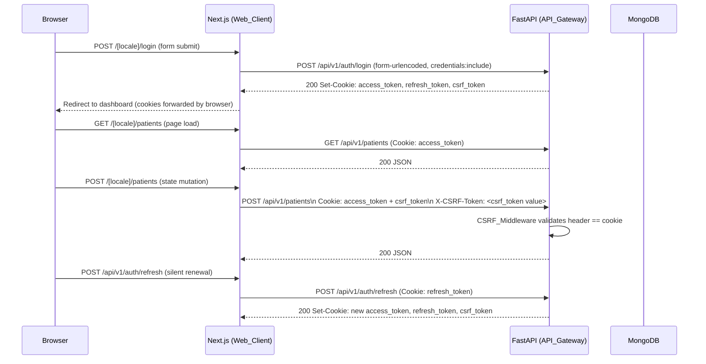
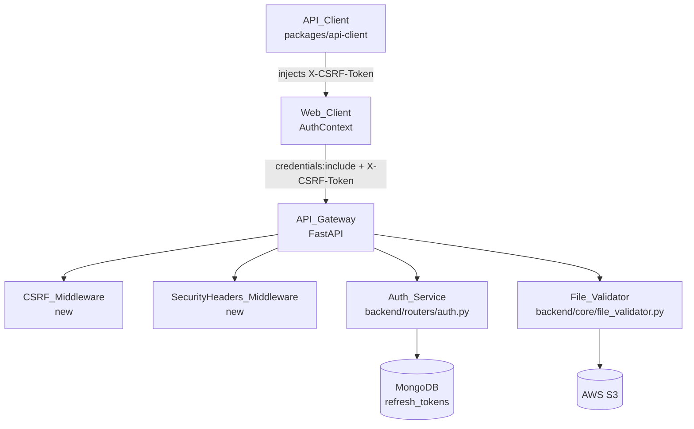

# Design Document — Security Hardening

## Overview

This feature hardens the Diagno-Pilot web application across four security domains:

1. **JWT cookie migration** — move access and refresh tokens from the current hybrid approach (in-memory + Next.js BFF cookie) to a fully backend-issued `httpOnly` cookie pair, eliminating the `/api/auth/set-cookie` BFF indirection and the residual `access_token` exposure in JSON response bodies.
2. **Strict file upload validation** — extend `FileValidator` with 8 192-byte magic-byte probing, polyglot detection, extension/MIME canonical map enforcement, CSV content sanitisation, and empty-file rejection.
3. **CSRF protection** — add a double-submit-cookie middleware to FastAPI and a matching header-injection layer in the API client, covering all state-mutating endpoints under `/api/v1/`.
4. **Security response headers** — add a FastAPI middleware that injects `X-Content-Type-Options`, `X-Frame-Options`, and conditional `Strict-Transport-Security`; add a `Content-Security-Policy` header in `next.config.ts`.

### Current State

| Area | Current behaviour | Gap |
|---|---|---|
| JWT storage | Backend returns tokens in JSON body; frontend stores access token in `memoryTokenRef` and persists it via `/api/auth/set-cookie` BFF route into a Next.js-managed httpOnly cookie | Tokens still travel in JSON body; BFF cookie is managed by Next.js, not the FastAPI backend; no CSRF protection |
| File validation | `FileValidator` reads 2 048 bytes, checks MIME against allowlist, checks declared vs detected MIME, checks path traversal | No extension/MIME canonical map, no polyglot detection, no CSV content check, no empty-file rejection, probe window too small |
| CSRF | None | All state-mutating endpoints unprotected once cookies carry auth |
| Security headers | None | Missing `X-Content-Type-Options`, `X-Frame-Options`, `HSTS`, `CSP` |

---

## Architecture



### Component Interaction Map



---

## Components and Interfaces

### Auth_Service (`backend/routers/auth.py`)

**Changes required:**

- `POST /auth/login` — after successful authentication, set three `Set-Cookie` headers instead of returning tokens in the JSON body:
  - `access_token` — `HttpOnly; Secure; SameSite=Strict; Max-Age={JWT_EXPIRE_MINUTES*60}`
  - `refresh_token` — `HttpOnly; Secure; SameSite=Strict; Max-Age={JWT_REFRESH_EXPIRE_DAYS*86400}`
  - `csrf_token` — **not** `HttpOnly`; `Secure; SameSite=Strict; Max-Age={JWT_REFRESH_EXPIRE_DAYS*86400}`
  - JSON response body: `{"token_type": "bearer", "expires_in": <seconds>}` (no token values)
- `POST /auth/refresh` — read `refresh_token` from cookie (not request body); rotate all three cookies atomically; return same slim JSON body.
- `POST /auth/logout` — clear all three cookies with `Max-Age=0`.
- `GET /auth/me` — unchanged (still validates via `get_current_user`).
- `Secure` flag omitted when `settings.ENV != "production"`.

**Helper — `_set_auth_cookies(response, access_token, refresh_token, csrf_token)`**: centralises cookie construction to avoid duplication across login/refresh.

**Helper — `_clear_auth_cookies(response)`**: sets all three cookies to `Max-Age=0`.

**Helper — `_generate_csrf_token() -> str`**: `secrets.token_hex(32)` (256 bits).

### `get_current_user` (`backend/core/auth.py`)

Updated to read the JWT from the `access_token` cookie when no `Authorization: Bearer` header is present:

```python
async def get_current_user(request: Request, token: str | None = Depends(oauth2_scheme_optional)) -> dict:
    raw = token or request.cookies.get("access_token")
    # decode raw JWT, fetch user …
```

The `OAuth2PasswordBearer` scheme is kept for backward compatibility with the mobile client and direct API consumers.

### CSRF_Middleware (`backend/core/csrf.py` — new file)

A FastAPI dependency (not a Starlette middleware) so it can be applied selectively:

```python
async def verify_csrf(request: Request) -> None:
    if request.method not in {"POST", "PUT", "PATCH", "DELETE"}:
        return
    # Exempt login and refresh
    if request.url.path in {"/api/v1/auth/login", "/api/v1/auth/refresh"}:
        return
    cookie_val = request.cookies.get("csrf_token", "")
    header_val = request.headers.get("X-CSRF-Token", "")
    if not hmac.compare_digest(cookie_val, header_val):
        raise HTTPException(status_code=403, detail="csrf_token_invalid")
```

Applied globally via `app.router.dependencies` in `main.py` so every route under `/api/v1/` inherits it without per-router annotation.

### SecurityHeaders_Middleware (`backend/core/security_headers.py` — new file)

A Starlette `BaseHTTPMiddleware` that mutates every response:

```python
class SecurityHeadersMiddleware(BaseHTTPMiddleware):
    async def dispatch(self, request, call_next):
        response = await call_next(request)
        response.headers["X-Content-Type-Options"] = "nosniff"
        response.headers["X-Frame-Options"] = "DENY"
        if settings.ENV == "production":
            response.headers["Strict-Transport-Security"] = (
                "max-age=31536000; includeSubDomains"
            )
        return response
```

Registered in `main.py` before the CORS middleware.

### File_Validator (`backend/core/file_validator.py`)

**Changes required:**

- Increase `_MIME_PROBE_BYTES` from 2 048 → **8 192**.
- Add `EXTENSION_MIME_MAP` canonical map:
  ```python
  EXTENSION_MIME_MAP = {
      ".pdf":  "application/pdf",
      ".jpg":  "image/jpeg",
      ".jpeg": "image/jpeg",
      ".png":  "image/png",
      ".csv":  "text/csv",
      ".xlsx": "application/vnd.openxmlformats-officedocument.spreadsheetml.sheet",
  }
  ```
- Add `validate_extension(filename, detected_mime)` — extracts suffix, looks up canonical map, rejects with HTTP 415 if absent or mismatched.
- Add `validate_polyglot(content)` — runs magic detection against each MIME type's known byte signatures; raises HTTP 415 if more than one signature matches.
- Add `validate_csv_content(content)` — decodes as UTF-8, checks for null bytes and non-printable characters; raises HTTP 415 on failure.
- Add `validate_not_empty(content)` — raises HTTP 400 if `len(content) == 0`.
- Update `validate()` orchestrator to call all new validators in order, logging rejections with detected type, declared type, filename, and client IP.

### Web_Client Auth Flow (`apps/web/src/contexts/AuthContext.tsx`)

**Changes required:**

- Remove the `/api/auth/set-cookie` BFF route calls entirely — the backend now owns cookie lifecycle.
- Remove `memoryTokenRef` — auth state is determined solely by `GET /auth/me`.
- `login()` — call `POST /api/v1/auth/login` with `credentials: 'include'`; on success call `GET /auth/me` to populate `user` state.
- `logout()` — call `POST /api/v1/auth/logout` with `credentials: 'include'`; clear local `user` state.
- `tryRefresh()` — call `POST /api/v1/auth/refresh` with `credentials: 'include'`; on success re-call `GET /auth/me`.
- `fetchWithRefresh()` — no longer injects `Authorization` header (cookies are automatic); still intercepts 401 and retries after refresh.
- Remove `getToken()` from context value (no longer needed).
- `isLoading` stays true until the initial `GET /auth/me` resolves.

**Next.js API route `/api/auth/set-cookie`** — delete this file; it is no longer needed.

### API Client (`packages/api-client/index.ts`)

**Changes required:**

- Remove `getToken` parameter from `createApiClient` — the factory no longer needs a token provider.
- Remove `Authorization: Bearer` header injection from all internal `headers()` calls.
- Add CSRF header injection: read `csrf_token` cookie value from `document.cookie` and attach it as `X-CSRF-Token` on all `POST`, `PUT`, `PATCH`, `DELETE` requests.
- `auth.login()` — already sends `credentials: 'include'`; no body change needed (backend now sets cookies).
- `LoginResponse` type — remove `access_token` and `refresh_token` fields (backend no longer returns them).

**CSRF cookie reader helper:**

```typescript
function getCsrfToken(): string {
  if (typeof document === 'undefined') return '';
  const match = document.cookie.match(/(?:^|;\s*)csrf_token=([^;]*)/);
  return match ? decodeURIComponent(match[1]) : '';
}
```

### Content-Security-Policy (`apps/web/next.config.ts`)

Add `headers()` export to `nextConfig`:

```typescript
async headers() {
  return [
    {
      source: '/(.*)',
      headers: [
        {
          key: 'Content-Security-Policy',
          value: "default-src 'self'; script-src 'self'; style-src 'self' 'unsafe-inline'; img-src 'self' data: https://images.unsplash.com; connect-src 'self'; font-src 'self'; frame-ancestors 'none';",
        },
      ],
    },
  ];
},
```

`'unsafe-inline'` is limited to `style-src` only (Tailwind CSS requires it); scripts are restricted to `'self'`.

---

## Data Models

### Cookie Schema

| Cookie name | HttpOnly | Secure | SameSite | Max-Age | Value |
|---|---|---|---|---|---|
| `access_token` | ✓ | prod only | Strict | `JWT_EXPIRE_MINUTES * 60` | Signed JWT |
| `refresh_token` | ✓ | prod only | Strict | `JWT_REFRESH_EXPIRE_DAYS * 86400` | Opaque UUID |
| `csrf_token` | ✗ | prod only | Strict | `JWT_REFRESH_EXPIRE_DAYS * 86400` | `secrets.token_hex(32)` |

### `TokenResponse` (updated Pydantic model)

```python
class TokenResponse(BaseModel):
    token_type: str = "bearer"
    expires_in: int  # seconds — access token TTL only
```

`access_token` and `refresh_token` fields are removed; they are now delivered exclusively via `Set-Cookie`.

### `RefreshRequest` (removed)

The `POST /auth/refresh` endpoint no longer accepts a request body — the refresh token is read from the `refresh_token` cookie.

### Extension/MIME Canonical Map

```python
EXTENSION_MIME_MAP: dict[str, str] = {
    ".pdf":  "application/pdf",
    ".jpg":  "image/jpeg",
    ".jpeg": "image/jpeg",
    ".png":  "image/png",
    ".csv":  "text/csv",
    ".xlsx": "application/vnd.openxmlformats-officedocument.spreadsheetml.sheet",
}
```

### CSRF Validation Flow

```
Request arrives at FastAPI
  │
  ├─ method ∈ {GET, HEAD, OPTIONS} → skip
  ├─ path ∈ {/auth/login, /auth/refresh} → skip
  │
  └─ extract cookie_val = cookies["csrf_token"]
     extract header_val = headers["X-CSRF-Token"]
     hmac.compare_digest(cookie_val, header_val)
       ├─ True  → continue
       └─ False → HTTP 403 csrf_token_invalid
```

---

## Correctness Properties


*A property is a characteristic or behavior that should hold true across all valid executions of a system — essentially, a formal statement about what the system should do. Properties serve as the bridge between human-readable specifications and machine-verifiable correctness guarantees.*

### Property 1: Login sets all auth cookies with correct attributes

*For any* valid user credentials, a successful `POST /api/v1/auth/login` response must set all three cookies — `access_token` (HttpOnly), `refresh_token` (HttpOnly), and `csrf_token` (not HttpOnly) — each with `SameSite=Strict` and the correct `Max-Age` values.

**Validates: Requirements 1.1, 1.2, 6.1**

### Property 2: Tokens absent from login response body

*For any* successful login response, the JSON body must not contain the keys `access_token` or `refresh_token`.

**Validates: Requirements 1.3**

### Property 3: Cookie-based auth grants access to protected endpoints

*For any* valid `access_token` cookie value, a request to a protected endpoint that carries the cookie but no `Authorization: Bearer` header must receive a non-401 response.

**Validates: Requirements 1.4**

### Property 4: Logout clears all auth cookies

*For any* authenticated session, a `POST /api/v1/auth/logout` response must set `access_token`, `refresh_token`, and `csrf_token` cookies with `Max-Age=0`.

**Validates: Requirements 1.5, 6.6**

### Property 5: Refresh rotates all three cookies atomically

*For any* valid `refresh_token` cookie, a `POST /api/v1/auth/refresh` response must set new `access_token`, `refresh_token`, and `csrf_token` cookies in a single response, and the old refresh token must be revoked (a second call with the same token must return 401).

**Validates: Requirements 1.6, 2.1, 7.1**

### Property 6: Invalid refresh token returns 401 and clears cookies

*For any* absent, revoked, or expired `refresh_token` cookie value, `POST /api/v1/auth/refresh` must return HTTP 401 with `detail: "refresh_token_invalid"` and set all auth cookies to `Max-Age=0`.

**Validates: Requirements 2.2**

### Property 7: File validator rejects disallowed MIME types

*For any* file whose magic bytes indicate a MIME type not in `Allowed_MIME_Types`, the `FileValidator` must reject it with HTTP 415, and the rejection log must include the detected type, declared type, filename, and client IP.

**Validates: Requirements 4.1, 4.2**

### Property 8: File validator rejects extension/MIME mismatches

*For any* uploaded file where the filename extension is absent from the canonical map, or where the extension's canonical MIME type does not match the magic-byte-detected MIME type, the `FileValidator` must reject it with HTTP 415 and include both the declared extension and the detected MIME type in the error detail.

**Validates: Requirements 4.3, 5.1, 5.2, 5.3**

### Property 9: File validator rejects polyglot files

*For any* file whose byte content simultaneously satisfies the magic-byte signatures of two or more distinct MIME types in `Allowed_MIME_Types`, the `FileValidator` must reject it with HTTP 415.

**Validates: Requirements 4.4**

### Property 10: File validator rejects CSV files with null bytes or non-printable characters

*For any* file with a `.csv` extension, if the content contains null bytes or non-printable characters, the `FileValidator` must reject it with HTTP 415.

**Validates: Requirements 4.5**

### Property 11: CSRF middleware enforces token on all state-mutating endpoints

*For any* `POST`, `PUT`, `PATCH`, or `DELETE` request to any endpoint under `/api/v1/` (except `/api/v1/auth/login` and `/api/v1/auth/refresh`), if the `X-CSRF-Token` header is absent or does not match the `csrf_token` cookie value, the response must be HTTP 403 with `detail: "csrf_token_invalid"`. Conversely, a matching header/cookie pair must not be rejected.

**Validates: Requirements 6.3, 6.4, 6.5**

### Property 12: CSRF token has sufficient entropy

*For any* CSRF token generated by `_generate_csrf_token()`, the resulting string must be at least 64 hexadecimal characters long (representing ≥ 256 bits of entropy).

**Validates: Requirements 7.3**

### Property 13: Security headers present on all API responses

*For any* request to any endpoint under the FastAPI application, the response must contain `X-Content-Type-Options: nosniff` and `X-Frame-Options: DENY`. When `settings.ENV == "production"`, the response must additionally contain `Strict-Transport-Security: max-age=31536000; includeSubDomains`.

**Validates: Requirements 8.1, 8.2, 8.4**

---

## Error Handling

### Auth_Service

| Scenario | HTTP status | Response body |
|---|---|---|
| Login with wrong credentials | 401 | `{"detail": "Incorrect email or password"}` |
| Refresh with absent/revoked/expired cookie | 401 | `{"detail": "refresh_token_invalid"}` + clear all cookies |
| Protected endpoint with no cookie and no Bearer token | 401 | `{"detail": "Could not validate credentials"}` |
| Protected endpoint with expired access token | 401 | `{"detail": "Could not validate credentials"}` |

### CSRF_Middleware

| Scenario | HTTP status | Response body |
|---|---|---|
| Missing `X-CSRF-Token` header on state-mutating request | 403 | `{"detail": "csrf_token_invalid"}` |
| `X-CSRF-Token` header does not match `csrf_token` cookie | 403 | `{"detail": "csrf_token_invalid"}` |
| `csrf_token` cookie absent (session not established) | 403 | `{"detail": "csrf_token_invalid"}` |

### File_Validator

| Scenario | HTTP status | Response body |
|---|---|---|
| Empty file (0 bytes) | 400 | `{"detail": "File is empty."}` |
| File exceeds 20 MB | 413 | `{"detail": "File size … exceeds the 20 MB limit."}` |
| Disallowed MIME type detected | 415 | `{"detail": "MIME type '…' is not allowed. …"}` |
| Extension not in canonical map | 415 | `{"detail": "File extension '…' is not allowed."}` |
| Extension/MIME mismatch | 415 | `{"detail": "Extension '…' does not match detected MIME type '…'."}` |
| Polyglot file detected | 415 | `{"detail": "Polyglot file detected: matches signatures for …"}` |
| CSV with null bytes / non-printable chars | 415 | `{"detail": "CSV file contains invalid characters."}` |

### Web_Client

- On 401 from any protected endpoint: attempt one silent refresh; on second 401, redirect to `/{locale}/login` and clear local auth state.
- On 403 from CSRF validation failure: surface a generic error to the user (this should not occur in normal operation; it indicates a bug or attack).
- On network error during login: surface the error message from the API response or a generic fallback.

---

## Testing Strategy

### Dual Testing Approach

Both unit tests and property-based tests are required. Unit tests cover specific examples, integration points, and edge cases. Property tests verify universal correctness across randomised inputs.

### Property-Based Testing

**Library**: Python — [Hypothesis](https://hypothesis.readthedocs.io/) (already present in the project via `.hypothesis/` directory). TypeScript — [fast-check](https://fast-check.dev/).

**Minimum iterations**: 100 per property test (Hypothesis default; configure with `@settings(max_examples=100)`).

**Tag format**: Each property test must include a comment:
`# Feature: security-hardening, Property <N>: <property_text>`

**Property test mapping:**

| Property | Test location | Test description |
|---|---|---|
| P1 — Login cookie attributes | `backend/tests/test_auth_cookies.py` | Generate random valid users; assert Set-Cookie headers on login |
| P2 — Tokens absent from body | `backend/tests/test_auth_cookies.py` | Assert login response body lacks `access_token`/`refresh_token` |
| P3 — Cookie auth on protected endpoints | `backend/tests/test_auth_cookies.py` | Generate valid tokens; assert protected endpoints accept cookie auth |
| P4 — Logout clears cookies | `backend/tests/test_auth_cookies.py` | Assert logout response sets Max-Age=0 on all three cookies |
| P5 — Refresh rotates all cookies | `backend/tests/test_auth_cookies.py` | Assert refresh sets new cookies; assert old token is revoked |
| P6 — Invalid refresh returns 401 | `backend/tests/test_auth_cookies.py` | Generate invalid/revoked tokens; assert 401 + cookie clearing |
| P7 — Disallowed MIME rejected | `backend/tests/test_file_validator.py` | Generate files with disallowed magic bytes; assert HTTP 415 |
| P8 — Extension/MIME mismatch rejected | `backend/tests/test_file_validator.py` | Generate mismatched (extension, content) pairs; assert HTTP 415 |
| P9 — Polyglot rejected | `backend/tests/test_file_validator.py` | Construct synthetic polyglot byte sequences; assert HTTP 415 |
| P10 — CSV null bytes rejected | `backend/tests/test_file_validator.py` | Generate CSV content with null bytes; assert HTTP 415 |
| P11 — CSRF enforcement | `backend/tests/test_csrf.py` | Generate random endpoint paths and token pairs; assert 403 on mismatch |
| P12 — CSRF token entropy | `backend/tests/test_csrf.py` | Generate N tokens; assert all have length ≥ 64 |
| P13 — Security headers | `backend/tests/test_security_headers.py` | Assert headers present on responses from all registered routes |

### Unit Tests

Unit tests should cover:

- **Auth_Service**: login with invalid credentials (401), refresh with missing cookie (401), logout response shape, `/auth/me` with valid cookie.
- **File_Validator**: empty file (400), file exceeding 20 MB (413), path traversal in filename (400), each allowed MIME type accepted with correct extension.
- **CSRF_Middleware**: exempt paths (`/auth/login`, `/auth/refresh`) pass without CSRF header, GET requests pass without CSRF header.
- **SecurityHeaders_Middleware**: HSTS absent in development, present in production.
- **API Client**: `getCsrfToken()` helper correctly parses cookie string edge cases (empty, multiple cookies, URL-encoded values).
- **AuthContext**: 401 → refresh → retry flow, double-401 → redirect flow.

### Frontend Testing

- **API Client unit tests** (`packages/api-client/__tests__/`): verify `X-CSRF-Token` header is injected on mutating methods and absent on GET.
- **AuthContext tests** (`apps/web/src/contexts/__tests__/`): mock `fetch` to verify the 401 → refresh → retry flow and the double-401 → redirect flow.
- **Next.js headers**: verify CSP header is present in `next.config.ts` via a snapshot test or integration test against the dev server response.
