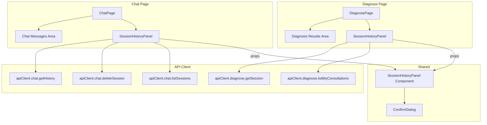

# Design Document: Session History Panels

## Overview

This feature adds collapsible side panels to the Chat and Diagnose pages that display previously saved sessions. The panels allow practitioners to list, load, and delete (or hide) past conversations and diagnostic consultations directly from the main interface.

The design introduces a single reusable `SessionHistoryPanel` component that adapts to both the chat and diagnose contexts via props. The panel integrates with existing backend endpoints (`GET /api/v1/chat/sessions`, `DELETE /api/v1/chat/sessions/{session_id}`, `GET /api/v1/consultations/me`) and requires two new API client methods (`chat.listSessions`, `chat.deleteSession`).

Key design decisions:
- **Shared component**: One `SessionHistoryPanel` component serves both pages, parameterized by data-fetching callbacks and display formatters. This avoids duplication and ensures consistent UX.
- **Optimistic updates**: Deletions and hides remove entries from the list immediately, without re-fetching. Errors roll back the optimistic removal.
- **Infinite scroll pagination**: The panel loads 20 items initially and fetches more as the user scrolls to the bottom, matching the backend's `skip`/`limit` (chat) and `page`/`page_size` (consultations) pagination.
- **Responsive collapse**: The panel auto-collapses below 768px (`md:` breakpoint) and renders as an overlay on narrow viewports to avoid breaking the existing layout.

## Data Migration

### MongoDB Index: `chat_sessions.(user_id, updated_at)`

The `list_sessions` query in `ChatService` filters by `user_id` and sorts by `updated_at` descending. Without a compound index, this performs a collection scan per user. The `consultations` collection already has the equivalent `(user_id, created_at)` index from a prior migration (`migrate_consultations_add_mcp_fields.py`).

**Required**: Create a compound index `{ user_id: 1, updated_at: -1 }` on the `chat_sessions` collection. This should be:
- Added to `backend/main.py` startup (alongside the existing TTL index on `chat_sessions.updated_at`)
- Added as a standalone migration script `backend/scripts/migrate_chat_sessions_add_user_index.py` following the existing pattern (idempotent, standalone-runnable)

No data backfill is needed — all existing `chat_sessions` documents already have `user_id` and `updated_at` fields (set on every `update_one` upsert in `send_message_stream`).

## Architecture



The host pages (`ChatPage`, `DiagnosePage`) own the session state and pass callbacks to `SessionHistoryPanel`. The panel handles its own UI state (collapse, pagination, loading indicators) but delegates data mutations (load session, delete session) to the parent via callback props.

### Layout Structure

Both pages adopt a horizontal flex layout:

```
┌──────────────────────────────────────────────────┐
│ Header                                           │
├────────────┬─────────────────────────────────────┤
│ Session    │                                     │
│ History    │  Main Content Area                  │
│ Panel      │  (Chat messages / Diagnosis form)   │
│ (w-72)     │                                     │
│            │                                     │
│ [Toggle]   │                                     │
├────────────┴─────────────────────────────────────┤
│ Input Area (chat only)                           │
└──────────────────────────────────────────────────┘
```

When collapsed, the panel shrinks to a narrow strip (~48px) with only the toggle button visible. On viewports < 768px, the panel renders as a fixed overlay (similar to the NavBar mobile drawer) with a backdrop, so it doesn't push the main content.

## Components and Interfaces

### 1. `SessionHistoryPanel` (new component)

**File**: `apps/web/src/components/SessionHistoryPanel.tsx`

```typescript
interface SessionEntry {
  id: string;
  preview: string;       // First message (chat) or primary diagnosis (diagnose)
  date: string;          // ISO date string — formatted for display
}

interface SessionHistoryPanelProps {
  entries: SessionEntry[];
  activeId: string | null;
  loading: boolean;
  error: string | null;
  hasMore: boolean;
  loadingMore: boolean;
  onLoadMore: () => void;
  onSelect: (id: string) => void;
  onDelete: (id: string) => void;
  selectingId: string | null;       // ID currently being loaded (shows spinner)
  deleteMode: 'confirm' | 'instant'; // 'confirm' for chat, 'instant' for diagnose hide
  panelTitle: string;
  emptyMessage: string;
  deleteLabel: string;              // "Delete" for chat, "Hide" for diagnose
  announceMessage: string | null;   // Message for aria-live region
  operationError: string | null;    // Transient error from load/delete operations (shown as inline toast). The parent host page owns this state and MUST clear it (set to null) at the start of the next onSelect or onDelete call, ensuring stale errors don't persist across operations.
}
```

**Responsibilities**:
- Renders the collapsible panel with toggle button
- Displays session entries as a `role="listbox"` with `role="option"` items
- Handles keyboard navigation (arrow keys, Enter, Delete)
- Manages collapse/expand state (defaults expanded, auto-collapses < 768px)
- Triggers infinite scroll via `IntersectionObserver` on a sentinel element
- Shows confirmation dialog (when `deleteMode === 'confirm'`) before calling `onDelete`
- Announces actions via `aria-live="polite"` region

### 2. `ConfirmDialog` (new component)

**File**: `apps/web/src/components/ConfirmDialog.tsx`

```typescript
interface ConfirmDialogProps {
  open: boolean;
  title: string;
  message: string;
  confirmLabel: string;
  cancelLabel: string;
  onConfirm: () => void;
  onCancel: () => void;
}
```

A lightweight modal dialog with focus trapping. Uses `aria-modal="true"` and `role="alertdialog"` (not `role="dialog"`) because delete is a destructive action requiring user acknowledgment — per WAI-ARIA, `alertdialog` is the correct role for confirmation prompts that interrupt the user's workflow. Returns focus to the triggering element on cancel.

### 3. API Client Additions

**File**: `packages/api-client/index.ts`

```typescript
// Added to the `chat` namespace:
listSessions(skip?: number, limit?: number, signal?: AbortSignal): Promise<{
  sessions: Array<{
    sessionId: string;
    createdAt: string | null;
    updatedAt: string | null;
    preview: string | null;
  }>;
}>;

deleteSession(sessionId: string, signal?: AbortSignal): Promise<void>;
```

`listSessions` calls `GET /api/v1/chat/sessions?skip={skip}&limit={limit}`, passes `ChatSessionListResponseSchema` to `parseResponse` for snake_case → camelCase normalization, and returns the normalized `ChatSessionListResponse` shape. `deleteSession` calls `DELETE /api/v1/chat/sessions/{session_id}` with the CSRF token header and returns the JSON body (HTTP 200).

### 4. i18n Keys

**Namespace**: `sessionHistory` (new namespace in both `en.json` and `fr.json`)

```json
{
  "sessionHistory": {
    "title": "Session History",
    "chatTitle": "Chat History",
    "diagnoseTitle": "Diagnosis History",
    "empty": "No sessions yet.",
    "emptyDiagnose": "No consultations yet.",
    "loading": "Loading sessions...",
    "loadingMore": "Loading more...",
    "errorFetch": "Error loading sessions.",
    "errorLoad": "Error loading session.",
    "errorDelete": "Error deleting session.",
    "errorHide": "Error hiding consultation.",
    "delete": "Delete",
    "hide": "Hide",
    "confirmDeleteTitle": "Delete session?",
    "confirmDeleteMessage": "This action cannot be undone.",
    "cancel": "Cancel",
    "confirm": "Delete",
    "collapse": "Collapse session history",
    "expand": "Expand session history",
    "sessionLoaded": "Session loaded.",
    "sessionDeleted": "Session deleted.",
    "sessionHidden": "Consultation hidden."
  }
}
```

**French** (`fr.json`):

```json
{
  "sessionHistory": {
    "title": "Historique des sessions",
    "chatTitle": "Historique des conversations",
    "diagnoseTitle": "Historique des diagnostics",
    "empty": "Aucune session pour le moment.",
    "emptyDiagnose": "Aucune consultation pour le moment.",
    "loading": "Chargement des sessions...",
    "loadingMore": "Chargement en cours...",
    "errorFetch": "Erreur lors du chargement des sessions.",
    "errorLoad": "Erreur lors du chargement de la session.",
    "errorDelete": "Erreur lors de la suppression de la session.",
    "errorHide": "Erreur lors du masquage de la consultation.",
    "delete": "Supprimer",
    "hide": "Masquer",
    "confirmDeleteTitle": "Supprimer la session ?",
    "confirmDeleteMessage": "Cette action est irréversible.",
    "cancel": "Annuler",
    "confirm": "Supprimer",
    "collapse": "Réduire l'historique",
    "expand": "Afficher l'historique",
    "sessionLoaded": "Session chargée.",
    "sessionDeleted": "Session supprimée.",
    "sessionHidden": "Consultation masquée."
  }
}
```

### 5. Host Page Integration

**ChatPage** (`apps/web/src/app/[locale]/chat/page.tsx`):
- Adds state: `sessions`, `sessionsLoading`, `sessionsError`, `sessionsHasMore`, `sessionsPage`, `selectingId`, `operationError`, `announceMessage`
- Fetches sessions on mount via `apiClient.chat.listSessions(0, 20)`
- On `done` SSE event: upserts session at top of list (moves existing or prepends new)
- On delete: optimistically removes entry from `sessions` list (saving a snapshot), calls `apiClient.chat.deleteSession(id)`. On error, restores the snapshot and sets `operationError`.
- On select: calls `apiClient.chat.getHistory(id)`, replaces messages, updates `sessionId` + localStorage
- Wraps existing layout in a horizontal flex container with the panel on the left

**DiagnosePage** (`apps/web/src/app/[locale]/diagnose/page.tsx`):
- Adds state: `consultations`, `consultationsLoading`, `consultationsError`, `consultationsHasMore`, `consultationsPage`, `hiddenIds`
- Fetches consultations on mount via `apiClient.diagnose.listMyConsultations(1, 20)`
- On new diagnosis response: prepends to list
- On hide: adds ID to `hiddenIds` Set, filters from rendered list (no backend call)
- On select: calls `apiClient.diagnose.getSession(id)`, displays results
- Wraps existing layout in a horizontal flex container with the panel on the left

## Data Models

### SessionEntry (frontend display model)

```typescript
interface SessionEntry {
  id: string;
  preview: string;
  date: string;  // ISO 8601
}
```

This is a normalized shape used by `SessionHistoryPanel`. Each host page maps its API response to this shape:

- **Chat**: `{ id: summary.sessionId, preview: summary.preview ?? '', date: summary.updatedAt ?? summary.createdAt ?? '' }`
- **Diagnose**: `{ id: consultation.id, preview: consultation.diagnoses[0]?.condition ?? '', date: consultation.createdAt }`

### Backend Models (existing, no changes)

**ChatSessionSummary** (from `GET /api/v1/chat/sessions`):
```python
class ChatSessionSummary(BaseModel):
    session_id: str
    created_at: str | None
    updated_at: str | None
    preview: str | None
```

**Consultation** (from `GET /api/v1/consultations/me`):
Already defined in `@diagno-pilot/types` with `id`, `diagnoses`, `createdAt`, etc.

### API Client Response Types (new)

```typescript
interface ChatSessionListResponse {
  sessions: ChatSessionSummary[];
}

interface ChatSessionSummary {
  sessionId: string;
  createdAt: string | null;
  updatedAt: string | null;
  preview: string | null;
}
```

Note: The API returns `session_id`, `created_at`, `updated_at` in snake_case. The `normalizeKeys` utility in the API client only runs when a Zod schema is passed to `parseResponse`. The `listSessions` method MUST pass a `ChatSessionListResponseSchema` Zod schema to `parseResponse` to ensure snake_case keys are converted to camelCase (matching the pattern used by `diagnose.listMyConsultations`). The `deleteSession` method returns HTTP 200 with `{"detail": "Session deleted"}` — no Zod schema is needed since the response body is not used by the frontend.


## Correctness Properties

*A property is a characteristic or behavior that should hold true across all valid executions of a system — essentially, a formal statement about what the system should do. Properties serve as the bridge between human-readable specifications and machine-verifiable correctness guarantees.*

### Property 1: Entry display contains preview and formatted date

*For any* array of `SessionEntry` objects with non-empty `preview` and valid `date` strings, rendering the `SessionHistoryPanel` SHALL produce a list where each rendered entry contains the entry's `preview` text and a formatted representation of its `date`.

**Validates: Requirements 1.2, 4.2**

### Property 2: Panel preserves input entry order

*For any* array of `SessionEntry` objects passed as `entries` to `SessionHistoryPanel`, the rendered list SHALL display entries in the same order as the input array. The panel does not sort — ordering responsibility belongs to the host page (which receives pre-sorted data from the API).

**Validates: Requirements 1.3, 4.3** (indirectly — the API returns sorted data, and the panel preserves that order)

### Property 3: Exactly one entry is marked active (or none when activeId is null)

*For any* non-empty array of `SessionEntry` objects and any `activeId` that matches one of the entries, the rendered `SessionHistoryPanel` SHALL have `role="listbox"` on the list container, `role="option"` on each entry, and exactly one entry with `aria-selected="true"` whose `id` matches `activeId`. All other entries SHALL have `aria-selected="false"`. When `activeId` is `null` (no session loaded), zero entries SHALL have `aria-selected="true"` and all entries SHALL have `aria-selected="false"`.

**Validates: Requirements 2.5, 5.3, 12.2**

### Property 4: Removing an entry preserves all other entries in order

*For any* array of `SessionEntry` objects and any entry ID to remove, after removal the resulting list SHALL not contain the removed ID, SHALL contain all other entries, and SHALL preserve their relative order.

**Validates: Requirements 3.4, 6.2, 9.5**

### Property 5: Upsert places session at top of list

*For any* array of `SessionEntry` objects and any session to upsert (either an existing ID with updated date or a new ID), after upserting the resulting list SHALL have the upserted session at index 0. If the session already existed, the list length SHALL remain the same and the old entry SHALL be removed from its previous position. If the session is new, the list length SHALL increase by 1.

**Validates: Requirements 9.2**

### Property 6: Prepend places new entry at index 0

*For any* array of `SessionEntry` objects and any new `SessionEntry`, after prepending the resulting list SHALL have the new entry at index 0 and the list length SHALL be the original length plus 1. All previous entries SHALL maintain their relative order.

**Validates: Requirements 9.3**

### Property 7: Toggle collapse is a round-trip and aria-expanded reflects state

*For any* initial collapse state (expanded or collapsed), clicking the toggle button SHALL invert the collapse state and update `aria-expanded` to match. Clicking the toggle button a second time SHALL restore the original state. At all times, the `aria-expanded` attribute on the toggle button SHALL equal the string representation of whether the panel is expanded.

**Validates: Requirements 7.3, 12.1**

### Property 8: Arrow key navigation moves focus correctly

*For any* list of `SessionEntry` objects with `n > 1` entries and any currently focused entry at index `i`, pressing `ArrowDown` SHALL move focus to `min(i + 1, n - 1)` and pressing `ArrowUp` SHALL move focus to `max(i - 1, 0)`. The focused entry SHALL receive `tabindex="0"` and all others SHALL have `tabindex="-1"`.

**Validates: Requirements 12.3**

### Property 9: Focus moves to correct entry after deletion

*For any* list of `SessionEntry` objects with `n > 1` entries and any deleted entry at index `i`, after deletion keyboard focus SHALL move to the entry at index `min(i, n - 2)` — i.e., the next entry, or the previous entry if the last item was removed.

**Validates: Requirements 12.4**

## Error Handling

### API Errors

| Scenario | Behavior |
|---|---|
| `chat.listSessions` fails | Panel shows localized error message (`sessionHistory.errorFetch`). Retry on next mount or manual refresh. |
| `chat.getHistory` fails on session load | Panel shows error via `operationError` prop. Active session and messages remain unchanged. `selectingId` is cleared. |
| `chat.deleteSession` fails | Optimistic removal is rolled back — the host page re-inserts the entry into `entries` at its original position, which the panel observes via props. Error shown via `operationError` prop (`sessionHistory.errorDelete`). |
| `diagnose.listMyConsultations` fails | Panel shows localized error message. Same pattern as chat. |
| `diagnose.getSession` fails on load | Error shown via `operationError` prop. Current results remain unchanged. |
| Network timeout | All API calls accept an `AbortSignal`. The panel uses a 10-second timeout for list fetches. Load/delete operations use the component's unmount abort. |
| 401 Unauthorized | Handled by existing auth redirect logic in the host pages (redirect to login). |

### Edge Cases

- **Empty preview**: If a chat session has no messages (preview is null), display a fallback string like "—" or the session ID truncated.
- **Concurrent operations**: If the user clicks delete while a load is in progress, the delete proceeds independently. The `selectingId` state prevents double-loading.
- **Rapid pagination**: The `IntersectionObserver` callback checks `loadingMore` before triggering a fetch, preventing duplicate page requests.
- **`hasMore` detection**: The chat endpoint returns a flat `sessions` array with no `total` count — the panel sets `hasMore = false` when the returned page has fewer items than `limit` (i.e., `sessions.length < limit`). The consultations endpoint returns `PaginatedResponse` with a `total` field — the panel computes `hasMore` from `loadedCount < total`.
- **SSE upsert during pagination**: If a `done` event arrives while a page fetch is in flight, the upsert is applied to the current list. The page fetch result is merged, deduplicating by session ID.

## Documentation Updates

### README.md — Endpoint listing

The README's API endpoint listing is missing the chat session management endpoints. Add after the `GET /api/v1/chat/history/{session_id}` line:

```
GET    /api/v1/chat/sessions
DELETE /api/v1/chat/sessions/{session_id}
```

### docs/api-reference.md — Response example fix

The `GET /api/v1/chat/sessions` response example currently shows the raw MongoDB projection shape (with a `messages` array). Update it to show the actual `ChatSessionListResponse` shape returned by the router:

```json
{
  "sessions": [
    {
      "session_id": "uuid-string",
      "created_at": "2026-04-07T10:30:00Z",
      "updated_at": "2026-04-07T11:00:00Z",
      "preview": "Quels sont les symptômes du paludisme ?"
    }
  ]
}
```

## Testing Strategy

### Property-Based Tests (fast-check)

The feature is suitable for property-based testing because the core list manipulation logic (display, ordering, removal, upsert, prepend) and keyboard navigation are pure functions or have clear input/output behavior with a large input space.

- **Library**: `fast-check` (already available in the project or to be added)
- **Minimum iterations**: 100 per property test
- **Tag format**: `Feature: session-history-panels, Property {N}: {title}`

Each of the 9 correctness properties above will be implemented as a single property-based test. The generators will produce:
- Random arrays of `SessionEntry` objects (varying lengths 0–50, random IDs, preview strings, ISO date strings)
- Random active IDs (selected from the generated array)
- Random deletion/upsert targets
- Random collapse states and focus indices

### Unit Tests (example-based)

Unit tests cover specific interactions and edge cases not suited for PBT:
- Loading/error/empty state rendering (Req 1.4, 1.5, 1.6, 4.4, 4.5, 4.6)
- Click-to-load triggers correct API call (Req 2.1, 5.1)
- Session load updates localStorage (Req 2.4)
- Delete confirmation dialog flow (Req 3.2, 3.3)
- Deleting active session clears chat and starts new session (Req 3.5)
- Hide button present on diagnose entries (Req 6.1)
- Hidden consultation reappears on remount (Req 6.4)
- Panel defaults to expanded (Req 7.4)
- Auto-collapse on narrow viewport (Req 7.5)
- Overlay rendering on narrow viewport (Req 7.6)
- Initial fetch with limit=20 (Req 8.1)
- Infinite scroll triggers next page (Req 8.2)
- Stops fetching when all loaded (Req 8.3)
- aria-live announcements on load/delete (Req 12.5)
- Focus trapping in confirm dialog (Req 12.6)
- i18n key coverage for en and fr (Req 10.1, 10.2, 10.3)

### Integration Tests

- ChatPage with panel: verify chat input, streaming, and patient context still work (Req 11.1)
- DiagnosePage with panel: verify symptom input, diagnosis submission still work (Req 11.2)
- Both pages functional with panel collapsed (Req 11.3)
