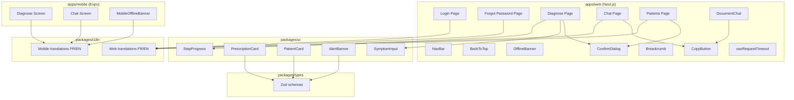

# Design Document: UX Improvements

## Overview

This design covers a broad set of UX improvements for the Diagno-Pilot healthcare application across both web (Next.js) and mobile (React Native Expo) platforms. The improvements span nine requirement areas: login usability, diagnosis workflow, chat enhancements, patient management, shared UI component quality, navigation/layout, accessibility, error handling/resilience, and mobile i18n gaps.

The guiding principle is to improve the day-to-day experience for healthcare professionals in West Africa (Togo, Benin) who rely on Diagno-Pilot in clinical settings — often on unreliable networks and with varying accessibility needs. Changes are incremental and additive; no existing backend APIs are modified.

## Architecture

The existing monorepo architecture is preserved. Changes are distributed across the following packages:



Key architectural decisions:

1. **Shared components remain platform-agnostic via props**: PrescriptionCard, PatientCard, and AlertBanner accept label text as props rather than importing i18n directly, since web uses `next-intl` and mobile uses a custom `I18nContext`. This is the existing pattern and we extend it.

2. **New shared component — StepProgress**: A pure presentational component in `packages/ui` that renders a step progress bar. It accepts the current step index and step labels as props, making it reusable across web and mobile.

3. **Client-side filtering functions are pure**: Patient search and session search are implemented as pure filter functions, making them testable independently of React rendering.

4. **Network resilience layer**: An `OfflineBanner` component and request timeout wrapper are added at the app shell level, using `navigator.onLine` + periodic health checks on web and `@react-native-community/netinfo` on mobile.

5. **No backend changes**: All improvements are frontend-only. Error messages are constructed client-side from HTTP status codes and error types.

## Components and Interfaces

### New Components

#### `packages/ui/src/StepProgress.tsx`
```typescript
export interface StepProgressProps {
  steps: string[];          // Step labels
  currentIndex: number;     // 0-based index of the current step
}
// Returns: completed (checkmark) | current (highlighted) | upcoming (dimmed)
export function getStepState(stepIndex: number, currentIndex: number): 'completed' | 'current' | 'upcoming';
```

#### `apps/web/src/components/BackToTop.tsx`
```typescript
// Floating button that appears after scrolling > 1 viewport height
// Smooth-scrolls to top on click
export default function BackToTop(): JSX.Element;
```

#### `apps/web/src/components/OfflineBanner.tsx`
```typescript
// Persistent banner when device is offline
// Uses navigator.onLine + periodic health-check fetch
export default function OfflineBanner(): JSX.Element | null;
```

#### `apps/mobile/src/components/MobileOfflineBanner.tsx`
```typescript
// Persistent banner when device is offline
// Uses @react-native-community/netinfo
export function MobileOfflineBanner(): JSX.Element | null;
```

#### `apps/web/src/components/Breadcrumb.tsx`
```typescript
export interface BreadcrumbItem { label: string; href?: string; }
export default function Breadcrumb({ items }: { items: BreadcrumbItem[] }): JSX.Element;
```

#### `apps/web/src/components/CopyButton.tsx`
```typescript
// Copies text to clipboard, shows "Copied!" feedback
export default function CopyButton({ text }: { text: string }): JSX.Element;
```

#### `apps/web/src/app/[locale]/forgot-password/page.tsx`
```typescript
// Static placeholder page for password reset
// Displays logo, localized heading, contact-admin message, and back-to-login link
export default function ForgotPasswordPage(): JSX.Element;
```

#### `apps/web/src/hooks/useRequestTimeout.ts`
```typescript
export interface UseRequestTimeoutOptions {
  warningMs?: number;   // Default: 15000 — show "taking longer" message
  abortMs?: number;     // Default: 30000 — auto-cancel via AbortController
  onWarning?: () => void;
  onAbort?: () => void;
}
// Returns { startTimer, clearTimer, isWarning, isAborted }
export function useRequestTimeout(options?: UseRequestTimeoutOptions): {
  startTimer: (controller: AbortController) => void;
  clearTimer: () => void;
  isWarning: boolean;
  isAborted: boolean;
};
```

### Modified Components

#### `apps/web/src/app/[locale]/login/page.tsx`
- Add password visibility toggle (eye icon button)
- Add "Forgot password" link below form pointing to `/{locale}/forgot-password`
- Replace `'…'` loading text with localized `t('auth.signingIn')`
- Add inline validation for empty email, empty password, invalid email format (using `react-hook-form` + Zod)

#### `packages/ui/src/SymptomInput.tsx`
- Replace all inline `style` objects with design token values from `tokens.ts`
- Add visible `<label>` elements with `htmlFor`/`id` pairs for each input field

#### `packages/ui/src/PrescriptionCard.tsx`
- Add `labels` prop: `{ dose, frequency, duration, route, cappedToAdultDose }`
- Fall back to current English strings when labels prop is not provided (backward compatible)

#### `packages/ui/src/PatientCard.tsx`
- Add `labels` prop: `{ weight, dateOfBirth, allergies, comorbidities, medications, unknownPatient, none, known, active }`
- Fall back to current English strings when labels prop is not provided

#### `packages/ui/src/AlertBanner.tsx`
- Change the critical icon to a distinct stop/octagon SVG (currently uses the same triangle as warning)

#### `apps/web/src/components/Toast.tsx`
- Add a dismiss (×) button
- Clicking dismiss hides the toast and calls `onClose`

#### `apps/web/src/components/ConfirmDialog.tsx`
- Accept `title`, `message`, `confirmLabel`, `cancelLabel` as i18n-ready props (already does, but callers must pass localized strings)

#### `apps/web/src/components/SessionHistoryPanel.tsx`
- Add a search input field at the top of the panel
- Export a pure `filterEntriesByPreview(entries, query)` function for testability
- Pass localized strings for the delete ConfirmDialog

#### `apps/web/src/components/LanguageSwitcher.tsx`
- Increase button size to minimum 44×44 CSS pixels
- Increase font size to minimum 14px

#### `apps/web/src/app/[locale]/chat/page.tsx`
- Add empty state (EmptyState component) when no messages
- Add two-phase loading: "connecting" → "thinking" based on first SSE token
- Add CopyButton on assistant message hover

#### `apps/web/src/components/DocumentChat.tsx`
- Add CopyButton on assistant message hover (same as chat page)

#### `apps/mobile/app/(tabs)/chat.tsx`
- Add character count indicator (`{input.length}/1000`)
- Replace all hardcoded French strings with i18n keys

#### `apps/mobile/app/(tabs)/diagnose.tsx`
- Replace all hardcoded French strings with i18n keys
- Add text labels ("High", "Medium", "Low") alongside probability color badges

#### `apps/web/src/app/[locale]/diagnose/page.tsx`
- Add StepProgress component showing symptom input → results → prescription
- Add ConfirmDialog on "New Diagnosis" when results are displayed

#### `apps/web/src/app/[locale]/patients/page.tsx`
- Replace hardcoded French strings with i18n keys
- Add search input for client-side patient name filtering
- Add spinner overlay with disabled inputs on CreatePatientModal submission
- Add unsaved changes ConfirmDialog on modal close

### Pure Utility Functions

#### `filterPatientsByName(patients: PatientProfile[], query: string): PatientProfile[]`
Location: `apps/web/src/app/[locale]/patients/page.tsx` (or extracted to a utils file)
```typescript
// Case-insensitive substring match on patient.fullName.
// Returns all patients when query is empty or whitespace-only.
// Patients with null/undefined fullName are excluded when query is non-empty.
// Result preserves original order and is always a subset of the input.
export function filterPatientsByName(
  patients: PatientProfile[],
  query: string
): PatientProfile[];
```

#### `filterEntriesByPreview(entries: SessionEntry[], query: string): SessionEntry[]`
Location: `apps/web/src/components/SessionHistoryPanel.tsx`
```typescript
// Case-insensitive substring match on entry.preview.
// Returns all entries when query is empty or whitespace-only.
// Result preserves original order and is always a subset of the input.
export function filterEntriesByPreview(
  entries: SessionEntry[],
  query: string
): SessionEntry[];
```

#### `getStepState(stepIndex: number, currentIndex: number): 'completed' | 'current' | 'upcoming'`
Location: `packages/ui/src/StepProgress.tsx`

#### `formatCharCount(current: number, max: number): string`
Location: `apps/mobile/app/(tabs)/chat.tsx` or utility
```typescript
// Returns "{current}/{max}"
export function formatCharCount(current: number, max: number): string;
```

#### `buildErrorMessage(errorType: string): { descriptionKey: string; actionKey: string }`
Location: `apps/web/src/utils/errorMessages.ts`
```typescript
// Maps error types to i18n translation keys for description + recovery action.
// Returns keys (not pre-localized strings) to stay consistent with the i18n pattern.
// Consumers call t(descriptionKey) and t(actionKey) to get localized text.
export function buildErrorMessage(
  errorType: string
): { descriptionKey: string; actionKey: string };
```

## Data Models

No new data models are introduced. All changes operate on existing types from `packages/types`:

- `PatientProfile` — used for patient search filtering
- `SessionEntry` (from `SessionHistoryPanel`) — used for session search filtering
- `SafetyAlert` — used for distinct alert icons
- `Prescription` — used for localized label props
- `ChatMessage` — used for copy functionality
- `Symptom` — used for accessible label rendering

### i18n Key Additions

New translation keys are added to both web (`packages/i18n`) and mobile i18n files:

**Web (next-intl) — new keys:**
- `auth.signingIn`, `auth.forgotPassword`, `auth.forgotPasswordTitle`, `auth.forgotPasswordMessage`, `auth.backToLogin`
- `auth.emailRequired`, `auth.passwordRequired`, `auth.emailInvalid`
- `chat.emptyStateTitle`, `chat.emptyStatePrompt`, `chat.connecting`, `chat.copied`
- `patients.search`, `patients.unsavedChanges`, `patients.unsavedChangesMessage`
- `patients.createNurse` (replacing hardcoded "Créer une infirmière")
- `patients.emptyDescription` (replacing hardcoded French empty state)
- `diagnose.stepSymptoms`, `diagnose.stepResults`, `diagnose.stepPrescription`
- `diagnose.confirmNewDiagnosis`, `diagnose.confirmNewDiagnosisMessage`
- `sessionHistory.search`, `sessionHistory.deleteTitle`, `sessionHistory.deleteMessage`
- `errors.networkDescription`, `errors.networkAction`, `errors.offline`, `errors.timeout`, `errors.timeoutAction`, `errors.autoCancel`

**Mobile (I18nContext) — new keys:**
- All strings currently hardcoded in `diagnose.tsx` and `chat.tsx` (see Requirement 9)
- `diagnose.stepSymptoms`, `diagnose.stepDiagnosis`, `diagnose.stepPrescription`
- `diagnose.probabilityHigh`, `diagnose.probabilityMedium`, `diagnose.probabilityLow`
- `chat.charCount`, `chat.emptyStatePrompt`

## Correctness Properties

*A property is a characteristic or behavior that should hold true across all valid executions of a system — essentially, a formal statement about what the system should do. Properties serve as the bridge between human-readable specifications and machine-verifiable correctness guarantees.*

### Property 1: Step progress state mapping

*For any* number of steps N ≥ 1 and any current step index C (0 ≤ C < N), `getStepState(i, C)` should return `'completed'` when i < C, `'current'` when i === C, and `'upcoming'` when i > C.

**Validates: Requirements 2.1**

### Property 2: Character count formatting

*For any* non-negative integer `current` and positive integer `max`, `formatCharCount(current, max)` should return the string `"{current}/{max}"` where both numbers are rendered as their decimal representation.

**Validates: Requirements 3.2**

### Property 3: Patient search filter correctness

*For any* list of patients and any search query string, `filterPatientsByName(patients, query)` should:
- Return the full input list when query is empty or whitespace-only
- Return only patients whose `fullName` contains the query as a case-insensitive substring when query is non-empty
- Exclude patients with null/undefined `fullName` when query is non-empty
- Return a result that is always a subset of the original list, preserving order
- Return an empty array when the input list is empty, regardless of query

**Validates: Requirements 4.3**

### Property 4: PrescriptionCard renders provided labels

*For any* valid Prescription object and any set of non-empty label strings passed as the `labels` prop, the rendered PrescriptionCard output should contain each provided label string.

**Validates: Requirements 5.2**

### Property 5: PatientCard renders provided labels

*For any* valid PatientProfile object and any set of non-empty label strings passed as the `labels` prop, the rendered PatientCard output should contain each provided label string that corresponds to a field present on the patient (e.g., the weight label appears only when `weightKg` is defined).

**Validates: Requirements 5.3**

### Property 6: Session entry search filter correctness

*For any* list of session entries and any search query string, `filterEntriesByPreview(entries, query)` should:
- Return the full input list when query is empty or whitespace-only
- Return only entries whose `preview` contains the query as a case-insensitive substring when query is non-empty
- Return a result that is always a subset of the original list, preserving order
- Return an empty array when the input list is empty, regardless of query

**Validates: Requirements 6.2**

### Property 7: Error message completeness

*For any* known error type string, `buildErrorMessage(errorType)` should return an object where both `descriptionKey` and `actionKey` are non-empty strings that correspond to valid i18n translation keys.

**Validates: Requirements 8.1**

## Error Handling

### Network Errors
- Non-streaming network request failures on Patients_Page, Diagnose_Page, and Documents_Page display a localized error message with a description and suggested recovery action (Req 8.1)
- Error messages are constructed by `buildErrorMessage()` which maps error types to i18n translation keys; consumers call `t(key)` to get localized text
- Streaming chat requests retain their existing error handling patterns (retry buttons, stream interruption messages)

### Offline Detection (Req 8.2, 8.3)
- **Web**: `OfflineBanner` listens to `window.addEventListener('online'/'offline')` and runs a periodic lightweight `fetch('/api/health')` every 30 seconds as a secondary check. Banner appears when both `navigator.onLine === false` OR the health check fails 3 consecutive times
- **Mobile**: `MobileOfflineBanner` (new component at `apps/mobile/src/components/MobileOfflineBanner.tsx`) uses `@react-native-community/netinfo`'s `addEventListener` to detect connectivity changes. Banner appears when `isConnected === false`
- Banner auto-hides when connectivity is restored (Req 8.3)

### Request Timeouts (Req 8.4, 8.5)
- The `useRequestTimeout` hook (at `apps/web/src/hooks/useRequestTimeout.ts`) wraps non-streaming fetch calls with two thresholds:
  - At 15 seconds: shows a "taking longer than expected" message with retry/cancel options
  - At 30 seconds: auto-cancels via `AbortController.abort()` and shows error with retry
- Applied to non-streaming API calls in `api-client` consumers (diagnose, patients, documents). Streaming chat calls are excluded as they have their own timeout/interruption handling

### Form Validation (Req 1.6, 1.7, 1.8)
- Login form uses `react-hook-form` with Zod schema validation (already used on patients page)
- Validation runs on submit, before any network request
- Inline error messages appear below the respective field

### Unsaved Changes (Req 4.4)
- `CreatePatientModal` tracks form dirty state via `react-hook-form`'s `formState.isDirty`
- On close attempt (× button, backdrop click, Escape), if `isDirty === true`, shows ConfirmDialog
- On confirm: closes modal, discards changes
- On cancel: keeps modal open

## Testing Strategy

### Property-Based Tests (fast-check, minimum 100 iterations each)

The following properties are tested using `fast-check` in the existing Vitest setup (`apps/web`):

| Property | Test File | What It Tests |
|----------|-----------|---------------|
| Property 1: Step state mapping | `packages/ui/src/__tests__/StepProgress.pbt.test.ts` | `getStepState()` pure function |
| Property 2: Char count format | `apps/mobile/src/__tests__/formatCharCount.pbt.test.ts` | `formatCharCount()` pure function |
| Property 3: Patient search filter | `apps/web/src/__tests__/filterPatients.pbt.test.ts` | `filterPatientsByName()` pure function |
| Property 4: PrescriptionCard labels | `packages/ui/src/__tests__/PrescriptionCard.pbt.test.tsx` | Label rendering via props |
| Property 5: PatientCard labels | `packages/ui/src/__tests__/PatientCard.pbt.test.tsx` | Label rendering via props |
| Property 6: Session search filter | `apps/web/src/__tests__/filterSessions.pbt.test.ts` | `filterEntriesByPreview()` pure function |
| Property 7: Error message completeness | `apps/web/src/__tests__/errorMessages.pbt.test.ts` | `buildErrorMessage()` pure function |

Each property test must:
- Run minimum 100 iterations
- Include a tag comment: `// Feature: ux-improvements, Property {N}: {title}`

### Unit Tests (example-based, Vitest + Testing Library)

- Login page: password toggle, forgot password link, loading label, inline validation (Req 1.1–1.7)
- Diagnose page: ConfirmDialog on new diagnosis, step progress rendering (Req 2.2–2.5)
- Chat page: empty state, connecting/thinking indicators, copy button (Req 3.1, 3.3–3.5)
- Toast: dismiss button functionality (Req 5.4–5.5)
- AlertBanner: distinct icons for critical vs warning (Req 5.6)
- LanguageSwitcher: minimum touch target size (Req 7.2)
- ConfirmDialog: i18n strings (Req 7.4–7.5)
- Breadcrumb: rendering on patient detail page (Req 6.1)
- BackToTop: visibility and scroll behavior (Req 6.3–6.4)
- OfflineBanner: show/hide based on connectivity (Req 8.2–8.3)
- Timeout feedback: 15s and 30s thresholds (Req 8.4–8.5)

### Integration Tests

- Mobile i18n: render diagnose and chat screens in English locale, assert no hardcoded French strings (Req 9.1–9.2)
- Offline detection: mock `navigator.onLine` and health-check endpoint (Req 8.2–8.3)
