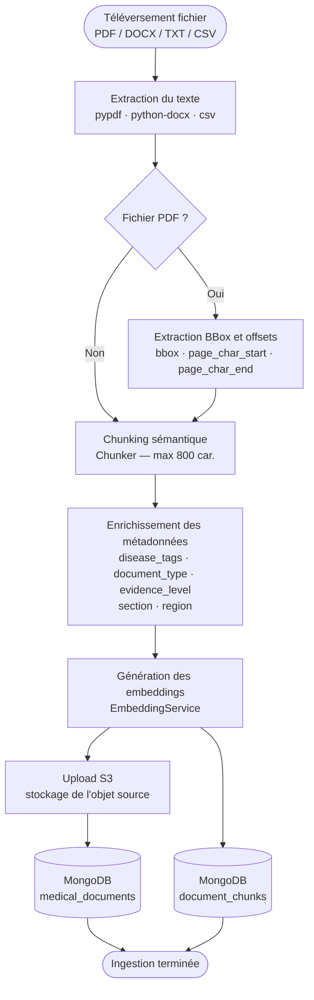
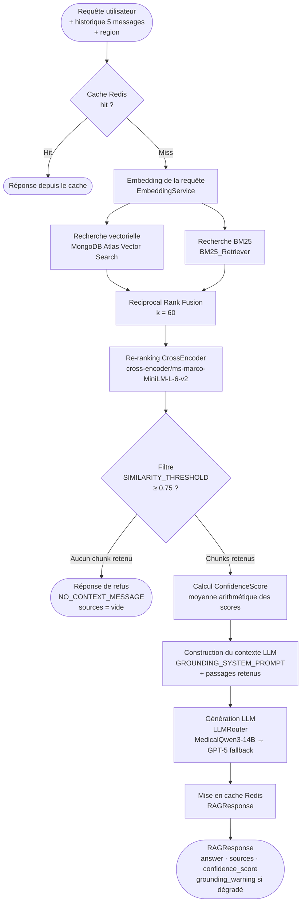
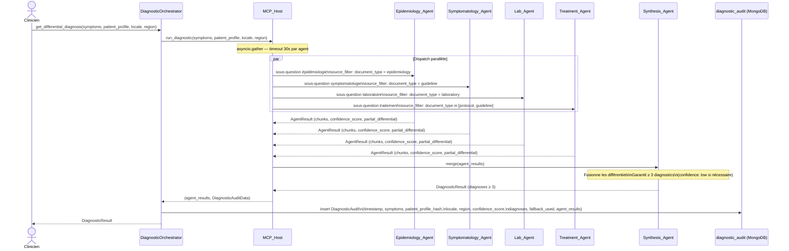
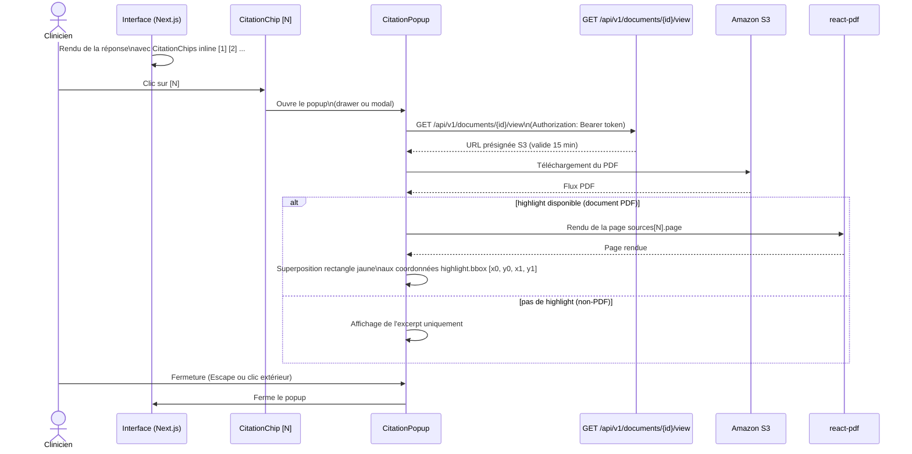

# Architecture — Diagno-Pilot Improvements

Ce document décrit l'architecture technique complète des six axes d'amélioration de Diagno-Pilot : ancrage strict dans les documents, système multi-agents via MCP, pipeline RAG amélioré, sécurité et audit, popup de citation PDF, et intégrité des données.

**Stack** : FastAPI (Python 3.12) + MongoDB (Motor async) + Next.js 15 App Router (TypeScript) + React Native Expo + Tailwind CSS

---

## Table des matières

1. [Pipeline d'ingestion de documents](#1-pipeline-dingestion-de-documents)
2. [Pipeline de requête RAG](#2-pipeline-de-requête-rag)
3. [Flux diagnostique multi-agents](#3-flux-diagnostique-multi-agents)
4. [Flux du popup de citation PDF](#4-flux-du-popup-de-citation-pdf)
5. [Schéma des collections MongoDB](#5-schéma-des-collections-mongodb)
6. [Nouveaux endpoints API](#6-nouveaux-endpoints-api)

---

## 1. Pipeline d'ingestion de documents

Ce diagramme décrit le flux complet depuis le téléversement d'un fichier jusqu'au stockage des chunks dans MongoDB.



### Détails des étapes

| Étape | Composant | Description |
|-------|-----------|-------------|
| Extraction du texte | `DocumentService._extract_text_*` | pypdf pour PDF, python-docx pour DOCX, lecture directe pour TXT/CSV |
| Extraction BBox | `DocumentService._extract_text_pdf()` | Coordonnées `[x0, y0, x1, y1]` et offsets de caractères par chunk, PDF uniquement |
| Chunking sémantique | `Chunker.chunk()` | Détection d'en-têtes (`^(\d+\.|\#{1,3}|\*{1,2})`), étapes numérotées, lignes de tableau ; max 800 caractères |
| Enrichissement métadonnées | `DocumentService._index_chunks()` | `disease_tags` via liste de mots-clés ; `document_type` et `evidence_level` depuis le champ `source` |
| Embeddings | `EmbeddingService` | Vecteurs denses pour la recherche sémantique |
| Upload S3 | `DocumentService` | Stockage de l'objet source pour les URLs présignées |
| Stockage MongoDB | Motor async | `medical_documents` (métadonnées doc) + `document_chunks` (chunks + embeddings) |

---

## 2. Pipeline de requête RAG

Ce diagramme décrit le flux de traitement d'une requête utilisateur, depuis la vérification du cache jusqu'à la réponse finale.



### Constantes clés

| Constante | Valeur |
|-----------|--------|
| `SIMILARITY_THRESHOLD` | `0.75` |
| `NO_CONTEXT_MESSAGE` | `"Information non disponible dans la base de connaissances."` |
| Modèle CrossEncoder | `cross-encoder/ms-marco-MiniLM-L-6-v2` |
| Historique de session | 5 derniers messages (user + assistant) |
| RRF k | `60` |

---

## 3. Flux diagnostique multi-agents

Ce diagramme décrit l'orchestration des agents spécialistes via MCP pour produire un diagnostic différentiel.



### Notes sur le transport MCP

- Chaque agent spécialiste est un processus Python autonome (`backend/agents/{name}_agent.py`) communiquant via **MCP stdio transport**.
- `MCP_Host` utilise `asyncio.gather` avec un timeout de **30 secondes** par agent.
- En cas de timeout, l'agent est traité comme retournant zéro chunks ; l'omission est enregistrée dans le `DiagnosticAudit`.
- Le `patient_profile_hash` est calculé en SHA-256 sur les champs `age`, `weight`, `sex`, `comorbidities` uniquement (sans PII).

---

## 4. Flux du popup de citation PDF

Ce diagramme décrit l'interaction frontend depuis l'affichage de la réponse jusqu'au surlignage du passage dans le PDF source.



---

## 5. Schéma des collections MongoDB

### `document_chunks`

Stocke les passages indexés avec leurs embeddings et métadonnées enrichies.

| Champ | Type | Description |
|-------|------|-------------|
| `_id` | ObjectId | Identifiant unique du chunk |
| `document_id` | ObjectId | Référence vers `medical_documents._id` |
| `content` | string | Texte du passage |
| `embedding` | float[] | Vecteur dense pour la recherche sémantique |
| `metadata.source` | string | Organisation source (ex. PNLP, CHU Lomé, MSF) |
| `metadata.title` | string | Titre du document parent |
| `metadata.page` | int \| null | Numéro de page dans le document source |
| `metadata.section` | string \| null | En-tête de section ou légende de tableau |
| `metadata.region` | string | Zone géographique : `TG`, `BJ`, ou `ALL` |
| `metadata.disease_tags` | string[] | Maladies détectées (ex. `["paludisme", "dengue"]`) |
| `metadata.document_type` | string | `protocol` \| `guideline` \| `laboratory` \| `epidemiology` \| `other` |
| `metadata.evidence_level` | string | Niveau de preuve, miroir du `document_type` |
| `metadata.bbox` | float[][] \| null | Coordonnées `[x0, y0, x1, y1]` — PDF uniquement |
| `metadata.page_char_start` | int \| null | Offset de début du chunk dans la page — PDF uniquement |
| `metadata.page_char_end` | int \| null | Offset de fin du chunk dans la page — PDF uniquement |

---

### `medical_documents`

Stocke les métadonnées des documents ingérés.

| Champ | Type | Description |
|-------|------|-------------|
| `_id` | ObjectId | Identifiant unique du document |
| `filename` | string | Nom du fichier original |
| `source` | string | Organisation source (ex. `"PNLP"`, `"CHU Lomé"`) |
| `title` | string | Titre du document |
| `s3_key` | string | Clé S3 de l'objet stocké |
| `chunk_count` | int | Nombre de chunks produits lors de la dernière ingestion |
| `uploaded_at` | ISODate | Horodatage du téléversement |
| `uploaded_by` | ObjectId | Référence vers l'utilisateur ayant téléversé le document |

---

### `chat_sessions`

Stocke les sessions de conversation des cliniciens.

| Champ | Type | Description |
|-------|------|-------------|
| `_id` | ObjectId | Identifiant unique de la session |
| `user_id` | ObjectId | Référence vers l'utilisateur |
| `messages` | object[] | Liste des messages de la session |
| `messages[].role` | string | `user` \| `assistant` |
| `messages[].content` | string | Contenu du message |
| `messages[].sources` | DocumentSource[] \| null | Sources citées (messages assistant uniquement) |
| `messages[].timestamp` | ISODate | Horodatage du message |
| `created_at` | ISODate | Horodatage de création de la session |
| `updated_at` | ISODate | Horodatage de la dernière mise à jour |

---

### `diagnostic_audit`

Enregistre chaque requête diagnostique pour l'audit clinique. Index TTL de **2555 jours** (7 ans) sur le champ `timestamp`.

| Champ | Type | Description |
|-------|------|-------------|
| `_id` | ObjectId | Identifiant unique de l'enregistrement |
| `timestamp` | ISODate | Horodatage de la requête — **index TTL : 2555 jours** |
| `symptoms` | object[] | Liste des symptômes soumis |
| `patient_profile_hash` | string | SHA-256 sur `age`, `weight`, `sex`, `comorbidities` uniquement (sans PII) |
| `locale` | string | Locale résolue par `LocaleMiddleware` (ex. `fr-TG`) |
| `region` | string \| null | Région géographique (`TG`, `BJ`, ou null) |
| `confidence_score` | float | Score de confiance global [0.0, 1.0] |
| `diagnoses` | object[] | Liste des diagnostics différentiels produits |
| `fallback_used` | boolean | Indique si le LLM de secours a été utilisé |
| `degraded_warning` | string \| null | Message d'avertissement si mode dégradé actif |
| `agent_results` | AgentAuditResult[] | Résultats détaillés par agent spécialiste |
| `agent_results[].agent_name` | string | Nom de l'agent (ex. `Epidemiology_Agent`) |
| `agent_results[].sub_question` | string | Sous-question soumise à l'agent |
| `agent_results[].chunk_ids` | string[] | IDs des chunks récupérés par l'agent |
| `agent_results[].confidence_score` | float | Score de confiance de l'agent [0.0, 1.0] |
| `agent_results[].partial_differential` | object[] | Diagnostics partiels produits par l'agent |

> **Accès** : lecture réservée au rôle `admin`. Les rôles `medecin` et `infirmière` n'ont pas accès aux enregistrements d'audit.

---

### `retrieval_feedback`

Stocke les évaluations des sources récupérées soumises par les cliniciens.

| Champ | Type | Description |
|-------|------|-------------|
| `_id` | ObjectId | Identifiant unique du feedback |
| `session_id` | string | Identifiant de la session de chat |
| `user_id` | ObjectId | Référence vers l'utilisateur ayant soumis le feedback |
| `document_id` | string | Identifiant du document évalué |
| `chunk_id` | string | Identifiant du chunk évalué |
| `rating` | int | Évaluation : `1` (pertinent) ou `-1` (non pertinent) |
| `timestamp` | ISODate | Horodatage de la soumission |

---

## 6. Nouveaux endpoints API

### `GET /api/v1/documents/{id}/view`

Retourne une URL présignée S3 pour consulter le document source dans le popup de citation.

| Attribut | Valeur |
|----------|--------|
| Méthode | `GET` |
| Chemin | `/api/v1/documents/{id}/view` |
| Rôles requis | `admin`, `medecin`, `infirmière` |
| Corps de la requête | — |

**Réponse 200 OK**
```json
{
  "url": "https://s3.amazonaws.com/bucket/key?X-Amz-Signature=...&X-Amz-Expires=900",
  "expires_in": 900
}
```

**Réponse 404 Not Found** — document inexistant
```json
{
  "detail": "Document not found"
}
```

> L'URL présignée est valide **15 minutes** (900 secondes).

---

### `POST /api/v1/feedback/retrieval`

Enregistre l'évaluation d'une source récupérée par un clinicien.

| Attribut | Valeur |
|----------|--------|
| Méthode | `POST` |
| Chemin | `/api/v1/feedback/retrieval` |
| Rôles requis | `admin`, `medecin`, `infirmière` |

**Corps de la requête**
```json
{
  "session_id": "string",
  "document_id": "string",
  "chunk_id": "string",
  "rating": 1
}
```

> `rating` accepte uniquement les valeurs `1` (pertinent) ou `-1` (non pertinent).

**Réponse 201 Created**
```json
{
  "status": "created",
  "feedback_id": "ObjectId"
}
```

---

### `POST /api/v1/admin/migrate-chunks`

Déclenche la ré-enrichissement en arrière-plan de tous les chunks `document_chunks` ne possédant pas encore les champs `metadata.disease_tags`, `metadata.document_type`, ou `metadata.evidence_level`.

| Attribut | Valeur |
|----------|--------|
| Méthode | `POST` |
| Chemin | `/api/v1/admin/migrate-chunks` |
| Rôles requis | `admin` |
| Corps de la requête | — |

**Réponse 202 Accepted**
```json
{
  "status": "background_task_started",
  "unmigrated_chunks": 1234
}
```

> Le traitement s'effectue par **lots de 100 chunks**. La tâche s'exécute en arrière-plan ; la réponse est retournée immédiatement avec le nombre de chunks à migrer.

---

### `POST /api/v1/admin/reindex-document/{id}`

Réingère un document depuis son objet S3 en utilisant le nouveau `Chunker` sémantique et l'extraction BBox pypdf. Supprime les chunks existants et insère les nouveaux.

| Attribut | Valeur |
|----------|--------|
| Méthode | `POST` |
| Chemin | `/api/v1/admin/reindex-document/{id}` |
| Rôles requis | `admin` |
| Corps de la requête | — |

**Réponse 200 OK**
```json
{
  "document_id": "ObjectId",
  "new_chunk_count": 42
}
```

**Réponse 404 Not Found** — document inexistant
```json
{
  "detail": "Document not found"
}
```

> Pour les documents **PDF** : extraction BBox et offsets de caractères incluse.
> Pour les documents **non-PDF** (DOCX, TXT, CSV) : chunking sémantique et enrichissement des métadonnées uniquement, sans extraction BBox.

---

*Document généré dans le cadre des améliorations Diagno-Pilot — Exigences 7.1 à 7.7*
