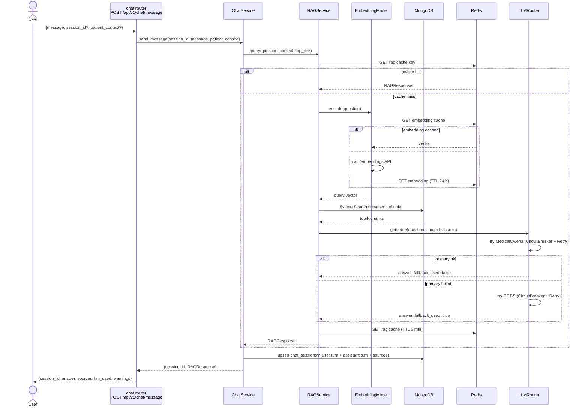
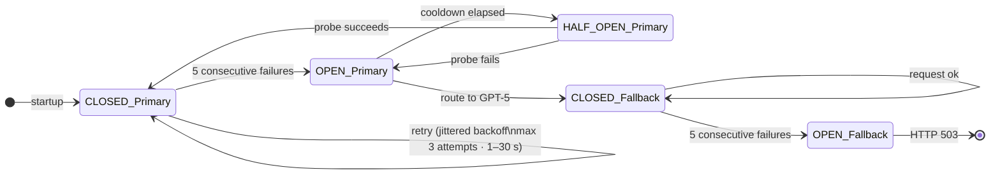
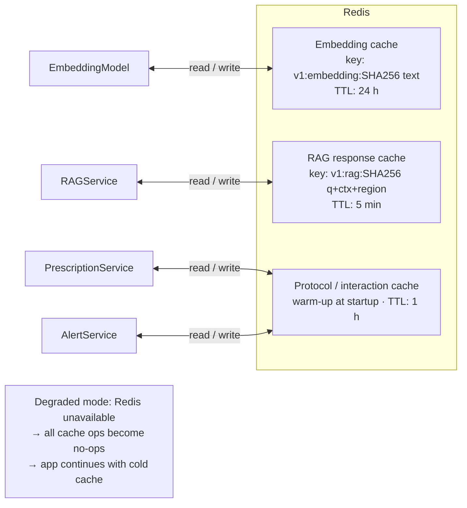

# RAG & Chat Workflow — Diagno-Pilot

## Document Ingestion Pipeline

```mermaid
flowchart TD
    A([Admin / Médecin]) -->|POST /api/v1/documents/upload| B[documents router]
    B --> C{Format check\nPDF · DOCX · TXT · CSV}
    C -->|unsupported| ERR1([HTTP 422])
    C -->|supported| D[DocumentService.ingest]

    D --> E[Extract text\npypdf · python-docx · utf-8 · csv]
    E --> F[Upload raw file\nto S3  documents/ prefix]
    F --> G[Persist metadata\nmongodb: medical_documents]
    G --> H[chunk_text\n500 chars · 50 overlap]
    H --> I[EmbeddingModel.encode per chunk\nOpenAI-compatible /embeddings]

    I --> J{Redis cache\nSHA256 text · TTL 24 h}
    J -->|hit| K[Return cached vector]
    J -->|miss| L[Call embedding API\ntext-embedding-ada-002]
    L --> M[Cache vector in Redis]
    M --> K

    K --> N[Store chunk + vector\nmongodb: document_chunks\nembedding_index vectorSearch]
    N --> O[Update chunk_count\non medical_documents]
    O --> P([MedicalDocument returned])
```

---

## RAG Query Pipeline

```mermaid
flowchart TD
    Q([User query + optional PatientProfile]) --> R[RAGService.query]

    R --> S{Redis RAG cache\nSHA256 question+context+region · TTL 5 min}
    S -->|hit| T([Return cached RAGResponse])
    S -->|miss| U[EmbeddingModel.encode question]

    U --> V[MongoDB $vectorSearch\ncollection: document_chunks\nindex: embedding_index\ntop_k = 5 · cosine similarity\noptional region pre-filter]

    V -->|success| W[Retrieved chunks\ncontent · metadata · score]
    V -->|failure| X[Keyword fallback\n$text search on content\ndegraded_warning set]
    X --> W

    W --> Y[Build LLM context\nsystem messages + retrieved passages\n+ patient context if present]
    Y --> Z[LLMRouter.generate]

    Z --> AA{Primary LLM\nMedicalQwen3-Reasoning-14B\nCircuitBreaker · RetryPolicy}
    AA -->|success| AB[LLM answer\nfallback_used = false]
    AA -->|circuit open / retries exhausted| AC{Fallback LLM\nGPT-5\nCircuitBreaker · RetryPolicy}
    AC -->|success| AD[LLM answer\nfallback_used = true]
    AC -->|failure| AE([HTTP 503 LLM_UNAVAILABLE])

    AB --> AF[Cache RAGResponse in Redis\nTTL 5 min]
    AD --> AF
    AF --> AG([RAGResponse\nanswer · sources · llm_used · warnings])
```

---

## Chat Session Flow

```mermaid
sequenceDiagram
    actor User
    participant ChatRouter as chat router<br/>POST /api/v1/chat/message
    participant ChatService
    participant RAGService
    participant EmbeddingModel
    participant MongoDB
    participant Redis
    participant LLMRouter

    User->>ChatRouter: {message, session_id?, patient_context?}
    ChatRouter->>ChatService: send_message(session_id, message, patient_context)

    ChatService->>RAGService: query(question, context, top_k=5)

    RAGService->>Redis: GET rag cache key
    alt cache hit
        Redis-->>RAGService: RAGResponse
    else cache miss
        RAGService->>EmbeddingModel: encode(question)
        EmbeddingModel->>Redis: GET embedding cache
        alt embedding cached
            Redis-->>EmbeddingModel: vector
        else
            EmbeddingModel->>EmbeddingModel: call /embeddings API
            EmbeddingModel->>Redis: SET embedding (TTL 24 h)
        end
        EmbeddingModel-->>RAGService: query vector

        RAGService->>MongoDB: $vectorSearch document_chunks
        MongoDB-->>RAGService: top-k chunks

        RAGService->>LLMRouter: generate(question, context+chunks)
        LLMRouter->>LLMRouter: try MedicalQwen3 (CircuitBreaker + Retry)
        alt primary ok
            LLMRouter-->>RAGService: answer, fallback_used=false
        else primary failed
            LLMRouter->>LLMRouter: try GPT-5 (CircuitBreaker + Retry)
            LLMRouter-->>RAGService: answer, fallback_used=true
        end

        RAGService->>Redis: SET rag cache (TTL 5 min)
        RAGService-->>ChatService: RAGResponse
    end

    ChatService->>MongoDB: upsert chat_sessions\n(user turn + assistant turn + sources)
    ChatService-->>ChatRouter: (session_id, RAGResponse)
    ChatRouter-->>User: {session_id, answer, sources, llm_used, warnings}
```

---

## LLM Router — Resilience Detail

```mermaid
stateDiagram-v2
    direction LR

    [*] --> CLOSED_Primary : startup

    CLOSED_Primary --> CLOSED_Primary : request ok
    CLOSED_Primary --> CLOSED_Primary : retry (jittered backoff\nmax 3 attempts · 1–30 s)
    CLOSED_Primary --> OPEN_Primary : 5 consecutive failures

    OPEN_Primary --> HALF_OPEN_Primary : cooldown elapsed
    HALF_OPEN_Primary --> CLOSED_Primary : probe succeeds
    HALF_OPEN_Primary --> OPEN_Primary : probe fails

    OPEN_Primary --> CLOSED_Fallback : route to GPT-5

    CLOSED_Fallback --> CLOSED_Fallback : request ok
    CLOSED_Fallback --> OPEN_Fallback : 5 consecutive failures
    OPEN_Fallback --> [*] : HTTP 503
```

---

## Caching Layers

```mermaid
flowchart LR
    subgraph Redis
        EC["Embedding cache\nkey: v1:embedding:SHA256 text\nTTL: 24 h"]
        RC["RAG response cache\nkey: v1:rag:SHA256 q+ctx+region\nTTL: 5 min"]
        PC["Protocol / interaction cache\nwarm-up at startup · TTL: 1 h"]
    end

    EmbeddingModel <-->|read / write| EC
    RAGService <-->|read / write| RC
    PrescriptionService <-->|read / write| PC
    AlertService <-->|read / write| PC

    note["Degraded mode: Redis unavailable\n→ all cache ops become no-ops\n→ app continues with cold cache"]
```
