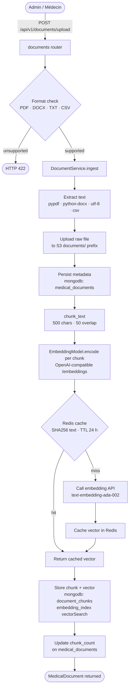
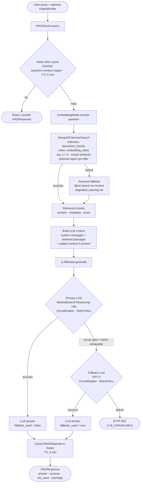
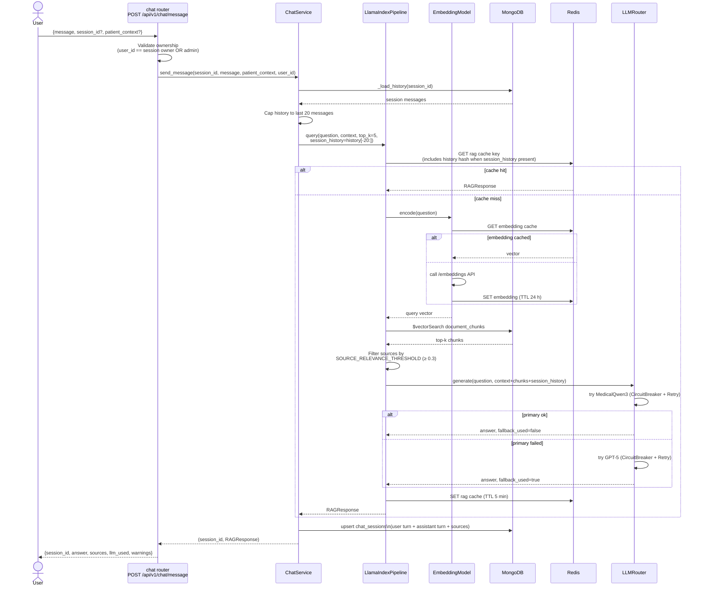
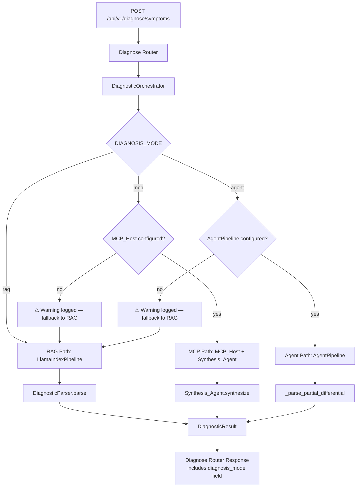
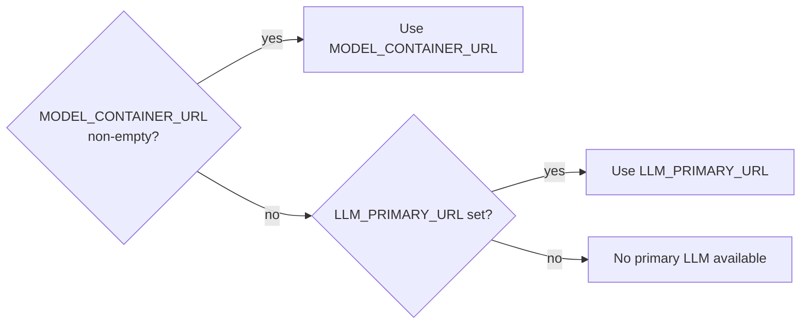
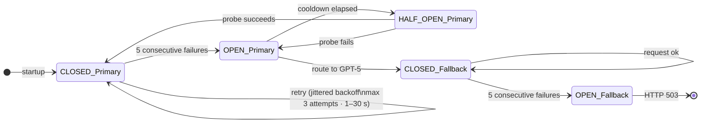
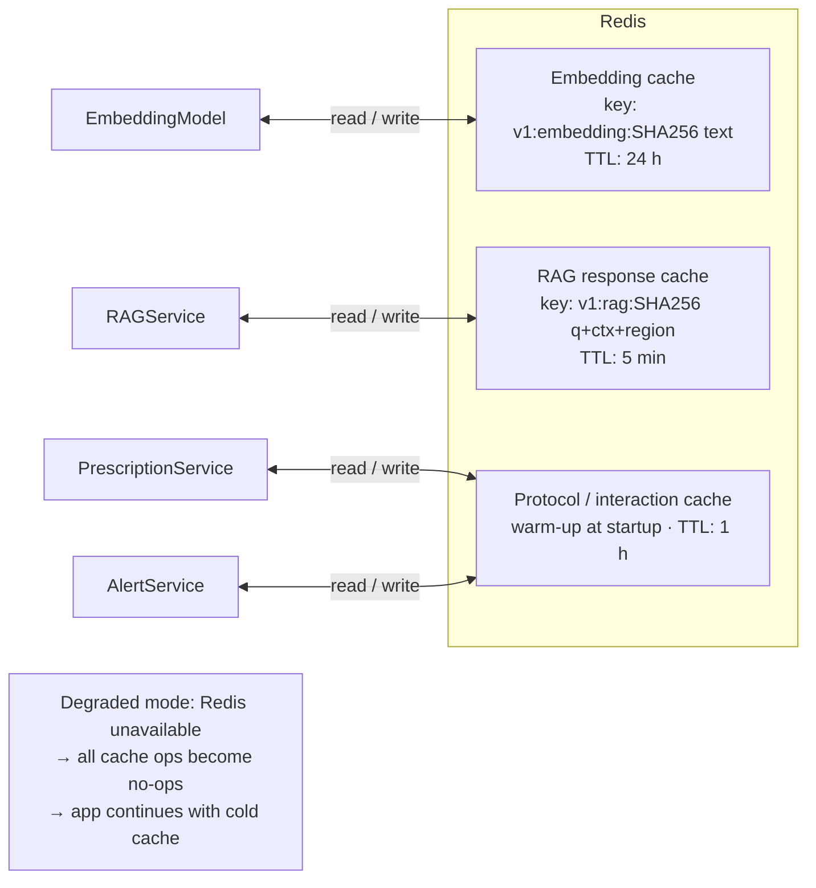

# RAG & Chat Workflow — Diagno-Pilot

## Document Ingestion Pipeline

---

## RAG Query Pipeline

---

## Chat Session Flow

---

## Session Ownership & Access Control

All chat endpoints enforce session ownership to protect PHI:

- `GET /api/v1/chat/history/{session_id}` — verifies `user_id` matches the session owner before returning data. Returns HTTP 404 if the session does not belong to the requester.
- `DELETE /api/v1/chat/sessions/{session_id}` — same ownership check before deletion.
- Users with the `admin` role bypass ownership checks and can access any session.

The `ChatService.get_history()` method accepts an optional `user_id` parameter that is included in the MongoDB query filter alongside `session_id`.

---

## Session Listing

`GET /api/v1/chat/sessions` returns the authenticated user's chat sessions, sorted by `updated_at` descending.

- Supports `skip` and `limit` query parameters (default limit: 20, cap: 100).
- Each session includes `session_id`, `created_at`, `updated_at`, and a preview of the first user message.
- Returns an empty list with HTTP 200 when the user has no sessions.

---

## Chat History Pagination

`GET /api/v1/chat/history/{session_id}` supports paginated message retrieval:

- `skip` (default 0) and `limit` (default 50, cap 200) query parameters.
- Response includes a `total_messages` field with the total count of messages in the session.
- Uses MongoDB `$slice` to return only the requested message window.

---

## Diagnosis Mode Routing

The `DIAGNOSIS_MODE` environment variable selects which diagnosis path the `DiagnosticOrchestrator` uses. When the selected dependency (MCP_Host or AgentPipeline) is not configured, the system falls back to the RAG path with a logged warning.

Valid values for `DIAGNOSIS_MODE`: `rag` (default), `mcp`, `agent`.

---

## LLM URL Priority

The `LLMRouter` selects the primary LLM endpoint using the following priority:

1. `MODEL_CONTAINER_URL` — used when set to a non-empty value (e.g. `http://model:8080/v1` for a local Docker model container)
2. `LLM_PRIMARY_URL` — used when `MODEL_CONTAINER_URL` is empty (default)

`MODEL_CONTAINER_URL` defaults to an empty string (`""`). Existing Docker Compose deployments that rely on a local model container must explicitly set `MODEL_CONTAINER_URL` in their `.env` file.

---

## LLM Router — Resilience Detail

---

## Caching Layers

